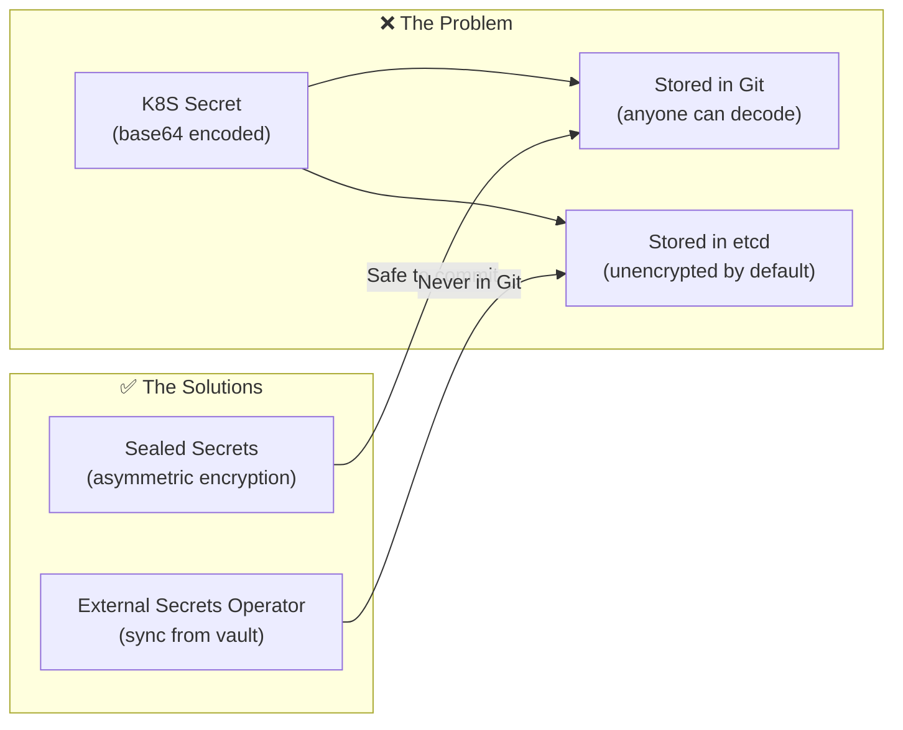
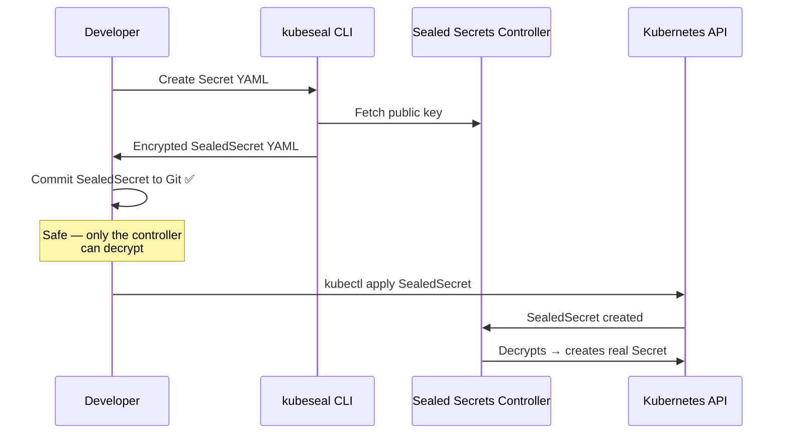
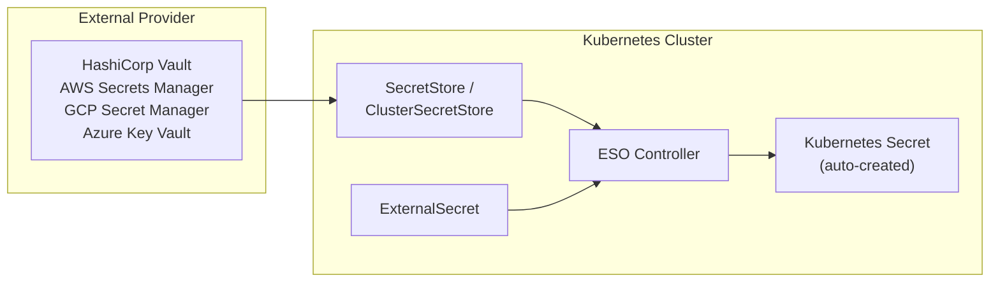

---

# Data Store: Secrets, ConfigMaps & Secret Management

---

## Overview

In this lab we will learn how to manage application configuration in Kubernetes using **Secrets** and **ConfigMaps**, and then go beyond the basics with **Sealed Secrets** and the **External Secrets Operator (ESO)** for production-grade secret management.

| Resource       | Purpose                                                      |
| -------------- | ------------------------------------------------------------ |
| **Secret**     | Stores sensitive data (passwords, tokens, certificates, API keys) encoded in Base64 |
| **ConfigMap**  | Stores non-sensitive configuration data (feature flags, connection strings, config files) |
| **SealedSecret** | Encrypted Secret safe to store in Git (Bitnami Sealed Secrets) |
| **ExternalSecret** | Syncs secrets from external providers (Vault, AWS, GCP, Azure) into Kubernetes |

---

## Official Documentation & References

| Resource                          | Link                                                                                       |
|-----------------------------------|--------------------------------------------------------------------------------------------|
| Kubernetes Secrets                | [kubernetes.io/docs](https://kubernetes.io/docs/concepts/configuration/secret/)            |
| Kubernetes ConfigMaps             | [kubernetes.io/docs](https://kubernetes.io/docs/concepts/configuration/configmap/)         |
| Sealed Secrets GitHub             | [github.com/bitnami-labs/sealed-secrets](https://github.com/bitnami-labs/sealed-secrets)   |
| External Secrets Operator         | [external-secrets.io](https://external-secrets.io/)                                        |
| Kubernetes Secrets Best Practices | [kubernetes.io/docs](https://kubernetes.io/docs/concepts/security/secrets-good-practices/) |
| Encrypting Secrets at Rest        | [kubernetes.io/docs](https://kubernetes.io/docs/tasks/administer-cluster/encrypt-data/)    |

---

## What will we learn?

### Part 1 — Secrets & ConfigMaps Basics

- How to create Secrets and ConfigMaps (imperative & declarative)
- How to inject configuration into pods via **environment variables**
- How to mount configuration as **files/volumes**
- How to update and rotate Secrets/ConfigMaps
- Key differences between Secrets and ConfigMaps
- Best practices for managing configuration in Kubernetes

### Part 2 — Advanced Secrets Management

- Why base64-encoded Secrets are **not encryption** (the problem)
- How **Sealed Secrets** (Bitnami) encrypts secrets for safe Git storage
- How the **External Secrets Operator** syncs secrets from external providers
- How to install and use `kubeseal` CLI
- How to create SealedSecrets that can be committed to Git
- How to configure ExternalSecret resources with a SecretStore
- Best practices for secret management in production

## Prerequisites

- A running Kubernetes cluster (`kubectl cluster-info` should work)
- `kubectl` configured against the cluster
- Helm installed (`helm version`) — needed for Part 2
- Docker installed (optional — only needed if you want to build the demo image yourself)

---

## 01. Create namespace

```sh
# If the namespace already exists and contains data from previous steps, let's clean it
kubectl delete namespace codewizard --ignore-not-found

# Create the desired namespace [codewizard]
kubectl create namespace codewizard
```

!!! warning "Note"

    - **You can skip section 02 if you don't wish to build and push your own Docker container.**
    - **A pre-built image `nirgeier/k8s-secrets-sample` is available on Docker Hub.**

---

## 02. Build the demo Docker container (Optional)

##### 1. Write the server code

- For this demo we use a tiny Node.js HTTP server that reads configuration from environment variables and returns them in the response.
- Source file: [resources/server.js](resources/server.js)

```js
//
// server.js
//
const
  // Get those values in runtime.
  // The variables will be passed from the Dockerfile and later on from K8S ConfigMap/Secret
  language = process.env.LANGUAGE,
  token    = process.env.TOKEN;

require("http")
  .createServer((request, response) => {
    response.write(`Language: ${language}\n`);
    response.write(`Token   : ${token}\n`);
    response.end(`\n`);
  })
  // Set the default port to 5000
  .listen(process.env.PORT || 5000);
```

---

##### 2. Write the Dockerfile

- If you wish, you can skip this and use the existing image: `nirgeier/k8s-secrets-sample`
- Source file: [resources/Dockerfile](resources/Dockerfile)

```Dockerfile
# Base Image
FROM        node

# Exposed port - same port is defined in server.js
EXPOSE      5000

# The "configuration" which we pass in runtime
# The server will "read" those variables at run time and will print them out
ENV         LANGUAGE    Hebrew
ENV         TOKEN       Hard-To-Guess

# Copy the server to the container
COPY        server.js .

# Start the server
ENTRYPOINT  node server.js
```

---

##### 3. Build the Docker container

```sh
# Replace `nirgeier` with your own Docker Hub username
docker build -t nirgeier/k8s-secrets-sample ./resources/
```

---

##### 4. Test the container locally

```sh
# Run the container
docker run -d -p 5000:5000 --name server nirgeier/k8s-secrets-sample

# Get the response — values should come from the Dockerfile ENVs
curl 127.0.0.1:5000

# Expected response:
# Language: Hebrew
# Token   : Hard-To-Guess
```

- Stop and remove the container when done:

```sh
docker rm -f server
```

- (Optional) Push the container to your Docker Hub account:

```sh
docker push nirgeier/k8s-secrets-sample
```

---

## 03. Deploy with hardcoded environment variables

In this step we will deploy the container with environment variables defined **directly in the YAML** — no Secrets or ConfigMaps yet.

##### 1. Review the deployment & service file

- Source file: [resources/variables-from-yaml.yaml](resources/variables-from-yaml.yaml)

```yaml
apiVersion: apps/v1
kind: Deployment
metadata:
  name: codewizard-secrets
  namespace: codewizard
spec:
  replicas: 1
  selector:
    matchLabels:
      name: codewizard-secrets
  template:
    metadata:
      labels:
        name: codewizard-secrets
    spec:
      containers:
        - name: secrets
          image: nirgeier/k8s-secrets-sample
          imagePullPolicy: Always
          ports:
            - containerPort: 5000
          env:
            - name: LANGUAGE
              value: Hebrew
            - name: TOKEN
              value: Hard-To-Guess2
          resources:
            limits:
              cpu: "500m"
              memory: "256Mi"
---
apiVersion: v1
kind: Service
metadata:
  name: codewizard-secrets
  namespace: codewizard
spec:
  selector:
    name: codewizard-secrets
  ports:
    - protocol: TCP
      port: 5000
      targetPort: 5000
```

---

##### 2. Deploy to cluster

```sh
kubectl apply -f resources/variables-from-yaml.yaml
```

---

##### 3. Test the app

```sh
# Get the pod name
kubectl get pods -n codewizard

# Test the response directly from the pod (no need for a separate container)
kubectl exec -it -n codewizard \
  $(kubectl get pod -n codewizard -l name=codewizard-secrets -o jsonpath='{.items[0].metadata.name}') \
  -- sh -c "curl -s localhost:5000"

# Expected response:
# Language: Hebrew
# Token   : Hard-To-Guess2
```

!!! info "Why not use the Service?"
    The Service makes the app accessible to other pods in the cluster. For quick testing, we can `exec` into the pod directly.

    In a real environment you would use the service DNS name: `codewizard-secrets.codewizard.svc.cluster.local:5000`

---

## 04. Using Secrets & ConfigMaps (Imperative)

Now let's externalize the configuration into proper Kubernetes resources.

##### 1. Create a Secret and a ConfigMap

```sh
# Create the secret (imperative)
#   Key   = TOKEN
#   Value = Hard-To-Guess3
kubectl create secret generic token \
  -n codewizard \
  --from-literal=TOKEN=Hard-To-Guess3

# Create the config map (imperative)
#   Key   = LANGUAGE
#   Value = English
kubectl create configmap language \
  -n codewizard \
  --from-literal=LANGUAGE=English
```

---

##### 2. Verify the resources were created

```sh
# List secrets and config maps
kubectl get secrets,cm -n codewizard

# View the secret details (note: data is Base64-encoded)
kubectl describe secret token -n codewizard

# View the config map details (note: data is plain text)
kubectl describe cm language -n codewizard
```

---

##### 3. Decode a Secret value

Secrets are stored as Base64-encoded strings. To view the actual value:

```sh
# Get the raw Base64 value
kubectl get secret token -n codewizard -o jsonpath='{.data.TOKEN}'

# Decode it
kubectl get secret token -n codewizard -o jsonpath='{.data.TOKEN}' | base64 -d
# Output: Hard-To-Guess3
```

!!! warning "Important"
    Base64 is **encoding**, not **encryption**. Anyone with access to the Secret resource can decode it.
    For real security, consider using:

    - [Sealed Secrets](https://github.com/bitnami-labs/sealed-secrets)
    - [External Secrets Operator](https://external-secrets.io/)
    - [HashiCorp Vault](https://www.vaultproject.io/)
    - Enabling [encryption at rest](https://kubernetes.io/docs/tasks/administer-cluster/encrypt-data/) for etcd

---

## 05. Inject Secrets & ConfigMaps as environment variables

##### 1. Update the deployment to reference Secret & ConfigMap

- Source file: [resources/variables-from-secrets.yaml](resources/variables-from-secrets.yaml)
- The key change is in the `env` section — instead of hardcoded values, we reference the ConfigMap and Secret:

```yaml
  env:
    - name: LANGUAGE
      valueFrom:
        configMapKeyRef:    # Read from the ConfigMap
          name: language    # The ConfigMap name
          key:  LANGUAGE    # The key inside the ConfigMap
    - name: TOKEN
      valueFrom:
        secretKeyRef:       # Read from the Secret
          name: token       # The Secret name
          key:  TOKEN       # The key inside the Secret
```

---

##### 2. Apply the updated deployment

```sh
kubectl apply -f resources/variables-from-secrets.yaml
```

---

##### 3. Test the changes

```sh
# Wait for the new pod to be ready
kubectl rollout status deployment/codewizard-secrets -n codewizard

# Test the response
kubectl exec -it -n codewizard \
  $(kubectl get pod -n codewizard -l name=codewizard-secrets -o jsonpath='{.items[0].metadata.name}') \
  -- sh -c "curl -s localhost:5000"

# Expected response:
# Language: English
# Token   : Hard-To-Guess3
```

The values now come from the ConfigMap and Secret instead of being hardcoded!

---

## 06. Create Secrets & ConfigMaps declaratively (YAML)

Instead of imperative `kubectl create` commands, you can define Secrets and ConfigMaps in YAML files.

##### 1. Secret YAML

- Source file: [resources/secret.yaml](resources/secret.yaml)

```yaml
apiVersion: v1
kind: Secret
metadata:
  name: token
data:
  # Base64-encoded value of "Hard-To-Guess3"
  # echo -n "Hard-To-Guess3" | base64
  TOKEN: SGFyZC1Uby1HdWVzczM=
type: Opaque
```

##### 2. Using `stringData` (plain text — recommended for readability)

You can also use `stringData` to avoid manual Base64 encoding. Kubernetes will encode it for you:

```yaml
apiVersion: v1
kind: Secret
metadata:
  name: token
stringData:
  TOKEN: Hard-To-Guess3
type: Opaque
```

##### 3. ConfigMap YAML

```yaml
apiVersion: v1
kind: ConfigMap
metadata:
  name: language
data:
  LANGUAGE: English
```

##### 4. Apply declarative resources

```sh
# Apply the secret (delete existing one first to avoid conflicts)
kubectl delete secret token -n codewizard --ignore-not-found
kubectl apply -n codewizard -f resources/secret.yaml

# Verify
kubectl get secret token -n codewizard -o jsonpath='{.data.TOKEN}' | base64 -d
# Output: Hard-To-Guess3
```

---

## 07. Mount Secrets & ConfigMaps as volumes

Besides environment variables, you can mount Secrets and ConfigMaps as **files** inside the container.
This is useful for configuration files, certificates, or any data that should appear as files.

##### 1. Create a ConfigMap with a configuration file

```sh
# Create a ConfigMap from a literal that will be mounted as a file
kubectl create configmap app-config \
  -n codewizard \
  --from-literal=app.properties="server.port=5000
server.language=English
feature.debug=true"
```

##### 2. Mount the ConfigMap as a volume

Add this to your deployment spec (the full file is shown for clarity):

```yaml
apiVersion: apps/v1
kind: Deployment
metadata:
  name: codewizard-secrets
  namespace: codewizard
spec:
  replicas: 1
  selector:
    matchLabels:
      name: codewizard-secrets
  template:
    metadata:
      labels:
        name: codewizard-secrets
    spec:
      containers:
        - name: secrets
          image: nirgeier/k8s-secrets-sample
          imagePullPolicy: Always
          ports:
            - containerPort: 5000
          env:
            - name: LANGUAGE
              valueFrom:
                configMapKeyRef:
                  name: language
                  key:  LANGUAGE
            - name: TOKEN
              valueFrom:
                secretKeyRef:
                  name: token
                  key:  TOKEN
          # Mount the ConfigMap as a file
          volumeMounts:
            - name: config-volume
              mountPath: /etc/config
              readOnly: true
            - name: secret-volume
              mountPath: /etc/secrets
              readOnly: true
          resources:
            limits:
              cpu: "500m"
              memory: "256Mi"
      volumes:
        - name: config-volume
          configMap:
            name: app-config
        - name: secret-volume
          secret:
            secretName: token
```

##### 3. Verify the mounted files

```sh
# Exec into the pod and check the mounted files
POD=$(kubectl get pod -n codewizard -l name=codewizard-secrets -o jsonpath='{.items[0].metadata.name}')

# View secret and config files
kubectl exec -it -n codewizard "$POD" -- sh -c  \
  "echo '--- ConfigMap file ---';               \
   cat /etc/config/app.properties;              \
   echo;                                        \
   echo '--- Secret file ---';                  \
   cat /etc/secrets/TOKEN"
```

!!! info "Volume Mounts vs Environment Variables"
    | Feature | Environment Variables | Volume Mounts |
    |---|---|---|
    | Update method | Pod restart required | Auto-updated (with delay) |
    | Best for | Simple key-value pairs | Config files, certificates |
    | File format | N/A | Each key becomes a file |

---

## 08. Updating Secrets & ConfigMaps

!!! warning "Important"
    Pods **do not** automatically restart when Secrets or ConfigMaps change.

    - **Environment variables**: Require a pod restart to pick up new values
    - **Volume mounts**: Are eventually updated automatically (kubelet sync period, typically ~60s)

##### 1. Update an existing Secret

```sh
# Use dry-run + replace to update an existing secret
kubectl create secret generic token \
  -n codewizard \
  --from-literal=TOKEN=NewToken123 \
  -o yaml --dry-run=client | kubectl replace -f -
```

##### 2. Restart the pods to pick up the changes

```sh
# Rolling restart — zero downtime
kubectl rollout restart deployment/codewizard-secrets -n codewizard

# Wait for rollout to complete
kubectl rollout status deployment/codewizard-secrets -n codewizard
```

##### 3. Verify the new values

```sh
kubectl exec -it -n codewizard \
  $(kubectl get pod -n codewizard -l name=codewizard-secrets -o jsonpath='{.items[0].metadata.name}') \
  -- sh -c "curl -s localhost:5000"

# Expected response:
# Language: English
# Token   : NewToken123
```

---

## 09. Immutable Secrets & ConfigMaps

Starting from Kubernetes v1.21, you can mark Secrets and ConfigMaps as **immutable**.
This prevents accidental (or malicious) modifications and improves cluster performance.

```yaml
apiVersion: v1
kind: ConfigMap
metadata:
  name: stable-config
data:
  VERSION: "1.0"
immutable: true     # <-- Cannot be changed once created
```

```sh
# Once applied, attempting to modify this ConfigMap will fail:
# error: configmaps "stable-config" is immutable
```

!!! info "When to use immutable resources"
    - Application configuration that should never change after deployment
    - Certificates or credentials tied to a specific release
    - Improves performance: kubelet skips watching for updates on immutable resources

---

## 10. Cleanup

```sh
# Delete all resources created in this lab
kubectl delete namespace codewizard --ignore-not-found
```

---

## Summary

| Concept                  | Description                                                           |
|--------------------------|-----------------------------------------------------------------------|
| **Secret**               | Stores sensitive data as Base64-encoded key-value pairs               |
| **ConfigMap**            | Stores non-sensitive configuration as plain key-value pairs           |
| **Imperative creation**  | `kubectl create secret/configmap` — quick for testing                 |
| **Declarative creation** | YAML files with `data:` / `stringData:` — version-controlled          |
| **Env injection**        | `valueFrom.secretKeyRef` / `valueFrom.configMapKeyRef`                |
| **Volume mount**         | Mount as files inside the pod — auto-updates for volume mounts        |
| **Immutable**            | `immutable: true` — prevents changes, improves performance            |
| **Updating**             | Use `dry-run=client` + `replace`, then `rollout restart` for env vars |

### Key Takeaways

1. **Never** hardcode sensitive values in Deployment YAML files
2. **Secrets are not encrypted** by default — they are only Base64-encoded
3. **ConfigMaps** are for non-sensitive data; **Secrets** are for sensitive data
4. **Volume-mounted** ConfigMaps/Secrets auto-update; **env vars** require pod restart
5. Use **immutable** resources when values should never change after deployment
6. In production, consider using external secret management tools (Vault, Sealed Secrets, etc.)

---
---

# Part 2: Advanced Secrets Management — Sealed Secrets & External Secrets Operator

---

## The Problem: Why Basic Secrets Are Not Enough



```sh
# Proof: base64 is NOT encryption
echo "my-super-secret-password" | base64
# bXktc3VwZXItc2VjcmV0LXBhc3N3b3JkCg==

echo "bXktc3VwZXItc2VjcmV0LXBhc3N3b3JkCg==" | base64 -d
# my-super-secret-password
```

!!! warning "Base64 ≠ Encryption"

    Kubernetes Secrets are only **base64-encoded**, not encrypted. Anyone with `kubectl get secret -o yaml` access can read them. This is the #1 misunderstanding in Kubernetes security.

---

## Sealed Secrets

### How Sealed Secrets Work



---

### 08. Install Sealed Secrets Controller

```sh
# Add the Sealed Secrets Helm repo
helm repo add sealed-secrets https://bitnami-labs.github.io/sealed-secrets
helm repo update

# Install the controller in kube-system
helm install sealed-secrets sealed-secrets/sealed-secrets \
  --namespace kube-system \
  --set fullnameOverride=sealed-secrets-controller

# Wait for it to be ready
kubectl wait --for=condition=Ready pod -l app.kubernetes.io/name=sealed-secrets \
  -n kube-system --timeout=120s
```

---

### 09. Install kubeseal CLI

=== "macOS"

    ```sh
    brew install kubeseal
    ```

=== "Linux"

    ```sh
    KUBESEAL_VERSION=$(curl -s https://api.github.com/repos/bitnami-labs/sealed-secrets/releases/latest | grep tag_name | cut -d '"' -f4 | cut -c2-)
    curl -OL "https://github.com/bitnami-labs/sealed-secrets/releases/download/v${KUBESEAL_VERSION}/kubeseal-${KUBESEAL_VERSION}-linux-amd64.tar.gz"
    tar -xvzf kubeseal-${KUBESEAL_VERSION}-linux-amd64.tar.gz kubeseal
    sudo install -m 755 kubeseal /usr/local/bin/kubeseal
    rm kubeseal kubeseal-${KUBESEAL_VERSION}-linux-amd64.tar.gz
    ```

```sh
# Verify installation
kubeseal --version
```

---

### 10. Create a SealedSecret

```sh
# Create the namespace
kubectl create namespace secrets-lab --dry-run=client -o yaml | kubectl apply -f -

# Step 1: Create a regular Secret (don't apply it!)
kubectl create secret generic db-credentials \
  --namespace secrets-lab \
  --from-literal=username=admin \
  --from-literal=password=S3cur3P@ssw0rd \
  --dry-run=client -o yaml > /tmp/db-secret.yaml

# Step 2: Seal it with kubeseal
kubeseal --format yaml < /tmp/db-secret.yaml > resources/sealed-db-credentials.yaml

# Step 3: Clean up the plaintext secret
rm /tmp/db-secret.yaml

# Step 4: View the sealed secret (safe to commit to Git!)
cat resources/sealed-db-credentials.yaml
```

!!! tip "GitOps-Safe"

    The resulting `SealedSecret` YAML contains **encrypted** data that can only be decrypted by the Sealed Secrets controller running in your cluster. It is safe to commit to Git.

---

### 11. Apply the SealedSecret

```sh
# Apply the SealedSecret
kubectl apply -f resources/sealed-db-credentials.yaml

# The controller automatically creates a real Secret
kubectl get secret db-credentials -n secrets-lab
# NAME              TYPE     DATA   AGE
# db-credentials    Opaque   2      5s

# Verify the decrypted values
kubectl get secret db-credentials -n secrets-lab -o jsonpath='{.data.username}' | base64 -d
# admin

kubectl get secret db-credentials -n secrets-lab -o jsonpath='{.data.password}' | base64 -d
# S3cur3P@ssw0rd
```

---

### 12. Use the SealedSecret in a Pod

- Source file: [resources/pod-with-sealed-secret.yaml](resources/pod-with-sealed-secret.yaml)

```yaml
# resources/pod-with-sealed-secret.yaml
apiVersion: v1
kind: Pod
metadata:
  name: secret-consumer
  namespace: secrets-lab
spec:
  containers:
    - name: app
      image: busybox:latest
      command: ["sh", "-c", "echo Username=$DB_USER Password=$DB_PASS && sleep 3600"]
      env:
        - name: DB_USER
          valueFrom:
            secretKeyRef:
              name: db-credentials
              key: username
        - name: DB_PASS
          valueFrom:
            secretKeyRef:
              name: db-credentials
              key: password
```

```sh
kubectl apply -f resources/pod-with-sealed-secret.yaml
kubectl wait --for=condition=Ready pod/secret-consumer -n secrets-lab --timeout=60s

# Check the logs to see the injected values
kubectl logs secret-consumer -n secrets-lab
# Username=admin Password=S3cur3P@ssw0rd
```

---

## External Secrets Operator (ESO)

The External Secrets Operator syncs secrets from external providers (AWS Secrets Manager, HashiCorp Vault, GCP Secret Manager, Azure Key Vault, etc.) into Kubernetes Secrets.

### How ESO Works



| CRD                    | Purpose                                                         |
| ---------------------- | --------------------------------------------------------------- |
| `SecretStore`          | Defines connection to an external provider (namespace-scoped)   |
| `ClusterSecretStore`   | Same as SecretStore but cluster-scoped                          |
| `ExternalSecret`       | Declares which secrets to fetch and how to map them             |

---

### 13. Install External Secrets Operator

```sh
helm repo add external-secrets https://charts.external-secrets.io
helm repo update

helm install external-secrets external-secrets/external-secrets \
  --namespace external-secrets \
  --create-namespace \
  --set installCRDs=true

# Wait for it
kubectl wait --for=condition=Ready pod -l app.kubernetes.io/name=external-secrets \
  -n external-secrets --timeout=120s
```

---

### 14. Use ESO with a Kubernetes Secret Store (for learning)

For this lab, we'll use the **Kubernetes provider** — ESO reads from a Secret in one namespace and syncs it to another. In production, you'd replace this with Vault, AWS, etc.

```sh
# Create a "source" secret in a secured namespace (simulating an external provider)
kubectl create namespace secret-store
kubectl create secret generic app-secrets \
  --namespace secret-store \
  --from-literal=api-key=my-api-key-12345 \
  --from-literal=api-secret=super-secret-value
```

Create a SecretStore pointing to the Kubernetes provider:

- Source file: [resources/secret-store.yaml](resources/secret-store.yaml)

```yaml
# resources/secret-store.yaml
apiVersion: external-secrets.io/v1beta1
kind: SecretStore
metadata:
  name: k8s-secret-store
  namespace: secrets-lab
spec:
  provider:
    kubernetes:
      remoteNamespace: secret-store
      server:
        caProvider:
          type: ConfigMap
          name: kube-root-ca.crt
          key: ca.crt
      auth:
        serviceAccount:
          name: eso-reader
```

```sh
# Create the ServiceAccount for ESO
kubectl create serviceaccount eso-reader -n secrets-lab

# Grant it permission to read secrets in the source namespace
kubectl create role secret-reader \
  --namespace secret-store \
  --verb=get,list,watch \
  --resource=secrets

kubectl create rolebinding eso-secret-reader \
  --namespace secret-store \
  --role=secret-reader \
  --serviceaccount=secrets-lab:eso-reader

kubectl apply -f resources/secret-store.yaml
```

---

### 15. Create an ExternalSecret

- Source file: [resources/external-secret.yaml](resources/external-secret.yaml)

```yaml
# resources/external-secret.yaml
apiVersion: external-secrets.io/v1beta1
kind: ExternalSecret
metadata:
  name: app-credentials
  namespace: secrets-lab
spec:
  refreshInterval: 1h            # How often to sync
  secretStoreRef:
    name: k8s-secret-store
    kind: SecretStore
  target:
    name: app-credentials        # Name of the K8S Secret to create
    creationPolicy: Owner
  data:
    - secretKey: API_KEY          # Key in the target Secret
      remoteRef:
        key: app-secrets          # Name of the source Secret
        property: api-key         # Key in the source Secret
    - secretKey: API_SECRET
      remoteRef:
        key: app-secrets
        property: api-secret
```

```sh
kubectl apply -f resources/external-secret.yaml

# Check the ExternalSecret status
kubectl get externalsecret -n secrets-lab
# NAME              STORE              REFRESH INTERVAL   STATUS
# app-credentials   k8s-secret-store   1h                 SecretSynced

# The Secret was automatically created!
kubectl get secret app-credentials -n secrets-lab
kubectl get secret app-credentials -n secrets-lab -o jsonpath='{.data.API_KEY}' | base64 -d
# my-api-key-12345
```

---

## 16. Cleanup (Part 2)

```sh
# Uninstall Sealed Secrets
helm uninstall sealed-secrets -n kube-system

# Uninstall External Secrets
helm uninstall external-secrets -n external-secrets

# Delete namespaces
kubectl delete namespace secrets-lab secret-store external-secrets --ignore-not-found
```

---

## Part 2 Summary

| Approach                  | Best For                                    | Git-Safe? | External Provider? |
| ------------------------- | ------------------------------------------- | --------- | ------------------ |
| **Plain K8S Secrets**     | Development/testing only                    | ❌ No     | No                 |
| **Sealed Secrets**        | GitOps — encrypt secrets for Git storage    | ✅ Yes    | No                 |
| **External Secrets (ESO)**| Production — centralized secret management  | ✅ Yes    | Yes (Vault, AWS…)  |

| Concept                     | Key Takeaway                                          |
| --------------------------- | ----------------------------------------------------- |
| **base64 ≠ encryption**     | K8S Secrets are encoded, not encrypted                |
| **Sealed Secrets**          | Encrypt + commit to Git; controller decrypts in-cluster |
| **kubeseal CLI**            | Encrypts secrets using the controller's public key    |
| **External Secrets Operator** | Syncs secrets from external vaults into K8S         |
| **SecretStore**             | Defines connection to external provider               |
| **ExternalSecret**          | Declares what to fetch and where to put it            |
| **refreshInterval**         | ESO periodically re-syncs — secrets stay up-to-date   |

---

# Exercises

The following exercises will test your understanding of Kubernetes secret management tools.
Try to solve each exercise on your own before revealing the solution.

---

#### 01. Seal a Secret and Verify It Cannot Be Decoded Without the Controller

Create a regular Secret, seal it with `kubeseal`, and then inspect the SealedSecret output. Verify the encrypted data cannot be decoded with `base64 --decode`.

#### Scenario:

◦ You want to store credentials in Git but need to prove the encryption is real.
◦ You need to show that the SealedSecret is not just base64 — it's truly encrypted.

**Hint:** Create a Secret with `--dry-run=client -o yaml`, pipe to `kubeseal --format yaml`, then try to base64-decode the `encryptedData` values.

<details>
<summary>Solution</summary>

```bash
## Ensure the Sealed Secrets controller is installed
## (see step 08 in this lab)

## Create a regular Secret (don't apply it)
kubectl create secret generic test-sealed \
  --namespace secrets-lab \
  --from-literal=api-key=my-secret-api-key-123 \
  --dry-run=client -o yaml > /tmp/test-secret.yaml

## View the regular Secret — base64 encoded but easily decoded
cat /tmp/test-secret.yaml
kubectl create secret generic test-sealed \
  --from-literal=api-key=my-secret-api-key-123 \
  --dry-run=client -o jsonpath='{.data.api-key}' | base64 -d
echo  ## Output: my-secret-api-key-123

## Seal it
kubeseal --format yaml < /tmp/test-secret.yaml > /tmp/sealed-test.yaml

## View the SealedSecret — encrypted data
cat /tmp/sealed-test.yaml

## Try to base64-decode the encryptedData (will produce binary garbage, not readable)
grep "api-key:" /tmp/sealed-test.yaml | awk '{print $2}' | base64 -d 2>&1 || echo "Cannot decode — it's encrypted, not just encoded!"

## Clean up
rm /tmp/test-secret.yaml /tmp/sealed-test.yaml
```

</details>

---

#### 02. Rotate a Sealed Secret

Update a SealedSecret by creating a new version with an updated password, apply it, and verify the controller updates the real Secret.

#### Scenario:

◦ A database password has been rotated and you need to update the SealedSecret in Git.
◦ When the new SealedSecret is applied, the controller should update the real Secret automatically.

**Hint:** Create a new Secret with the updated value, seal it again, and `kubectl apply` the new SealedSecret.

<details>
<summary>Solution</summary>

```bash
## Create the original SealedSecret
kubectl create secret generic rotate-demo \
  --namespace secrets-lab \
  --from-literal=password=old-password-v1 \
  --dry-run=client -o yaml | kubeseal --format yaml | kubectl apply -f -

## Verify the original Secret was created
kubectl get secret rotate-demo -n secrets-lab -o jsonpath='{.data.password}' | base64 -d
echo  ## Output: old-password-v1

## Create a NEW SealedSecret with the rotated password
kubectl create secret generic rotate-demo \
  --namespace secrets-lab \
  --from-literal=password=new-password-v2 \
  --dry-run=client -o yaml | kubeseal --format yaml | kubectl apply -f -

## Verify the Secret was updated
sleep 5
kubectl get secret rotate-demo -n secrets-lab -o jsonpath='{.data.password}' | base64 -d
echo  ## Output: new-password-v2

## Clean up
kubectl delete sealedsecret rotate-demo -n secrets-lab 2>/dev/null || true
kubectl delete secret rotate-demo -n secrets-lab
```

</details>

---

#### 03. Create a ClusterSecretStore and Use It Across Namespaces

Set up a `ClusterSecretStore` (using the Kubernetes provider) and create ExternalSecrets in two different namespaces that reference the same store.

#### Scenario:

◦ Multiple teams need to access the same external secrets provider.
◦ Instead of creating a SecretStore in each namespace, you want a single cluster-wide store.

**Hint:** Use `kind: ClusterSecretStore` and reference it with `kind: ClusterSecretStore` in the ExternalSecret's `secretStoreRef`.

<details>
<summary>Solution</summary>

```bash
## Create source namespace with a shared Secret
kubectl create namespace shared-secrets
kubectl create secret generic shared-creds \
  --namespace shared-secrets \
  --from-literal=db-password=shared-db-pass-123

## Create a service account for ESO
kubectl create serviceaccount eso-cluster-reader -n external-secrets

## Grant permissions to read from the source namespace
kubectl create role secret-reader \
  --namespace shared-secrets \
  --verb=get,list,watch \
  --resource=secrets
kubectl create rolebinding eso-cluster-reader-binding \
  --namespace shared-secrets \
  --role=secret-reader \
  --serviceaccount=external-secrets:eso-cluster-reader

## Create the ClusterSecretStore
cat <<'EOF' | kubectl apply -f -
apiVersion: external-secrets.io/v1beta1
kind: ClusterSecretStore
metadata:
  name: global-k8s-store
spec:
  provider:
    kubernetes:
      remoteNamespace: shared-secrets
      server:
        caProvider:
          type: ConfigMap
          name: kube-root-ca.crt
          namespace: external-secrets
          key: ca.crt
      auth:
        serviceAccount:
          name: eso-cluster-reader
          namespace: external-secrets
EOF

## Create ExternalSecrets in two namespaces
kubectl create namespace team-alpha
kubectl create namespace team-beta

for ns in team-alpha team-beta; do
cat <<EOF | kubectl apply -f -
apiVersion: external-secrets.io/v1beta1
kind: ExternalSecret
metadata:
  name: db-creds
  namespace: $ns
spec:
  refreshInterval: 1h
  secretStoreRef:
    name: global-k8s-store
    kind: ClusterSecretStore
  target:
    name: db-credentials
    creationPolicy: Owner
  data:
    - secretKey: DB_PASSWORD
      remoteRef:
        key: shared-creds
        property: db-password
EOF
done

## Verify Secrets in both namespaces
kubectl get secret db-credentials -n team-alpha
kubectl get secret db-credentials -n team-beta

## Clean up
kubectl delete namespace team-alpha team-beta shared-secrets
```

</details>

---

#### 04. Back Up and Restore Sealed Secrets Controller Keys

Export the Sealed Secrets controller's encryption keys (for backup/disaster recovery) and verify you understand the key management lifecycle.

#### Scenario:

◦ You need to back up the Sealed Secrets controller's private key for disaster recovery.
◦ If the controller is reinstalled without the backup, existing SealedSecrets cannot be decrypted.

**Hint:** The controller's keys are stored as Secrets in the `kube-system` namespace with a label `sealedsecrets.bitnami.com/sealed-secrets-key`.

<details>
<summary>Solution</summary>

```bash
## List the controller's encryption keys
kubectl get secret -n kube-system -l sealedsecrets.bitnami.com/sealed-secrets-key

## Back up the key(s) to a file (KEEP THIS SECURE!)
kubectl get secret -n kube-system \
  -l sealedsecrets.bitnami.com/sealed-secrets-key \
  -o yaml > /tmp/sealed-secrets-backup.yaml

## The backup contains the private key — treat it with extreme care
echo "Backup saved. This file contains the private key and must be stored securely."
echo "Without this key, existing SealedSecrets cannot be decrypted after controller reinstall."

## To restore after reinstalling the controller:
## kubectl apply -f /tmp/sealed-secrets-backup.yaml
## kubectl rollout restart deployment/sealed-secrets-controller -n kube-system

## Clean up the backup (in real scenarios, store it in a secure vault)
rm /tmp/sealed-secrets-backup.yaml
```

</details>

---

## Troubleshooting

- **kubeseal cannot connect to the controller:**

Verify the Sealed Secrets controller is running and accessible:

```bash
## Check the controller pod
kubectl get pods -n kube-system -l app.kubernetes.io/name=sealed-secrets

## Check the controller service
kubectl get service -n kube-system -l app.kubernetes.io/name=sealed-secrets

## Try fetching the public key manually
kubeseal --fetch-cert
```

<br>

- **SealedSecret is not creating a Secret:**

Check the SealedSecret status and controller logs:

```bash
## Check the SealedSecret status
kubectl get sealedsecret -n secrets-lab
kubectl describe sealedsecret <name> -n secrets-lab

## Check controller logs for errors
kubectl logs -n kube-system -l app.kubernetes.io/name=sealed-secrets --tail=50
```

<br>

- **ExternalSecret status shows error:**

Verify the SecretStore connection and permissions:

```bash
## Check the ExternalSecret status
kubectl describe externalsecret <name> -n secrets-lab

## Check the SecretStore status
kubectl describe secretstore k8s-secret-store -n secrets-lab

## Verify the ServiceAccount has correct RBAC
kubectl auth can-i get secrets -n secret-store \
  --as system:serviceaccount:secrets-lab:eso-reader
```

