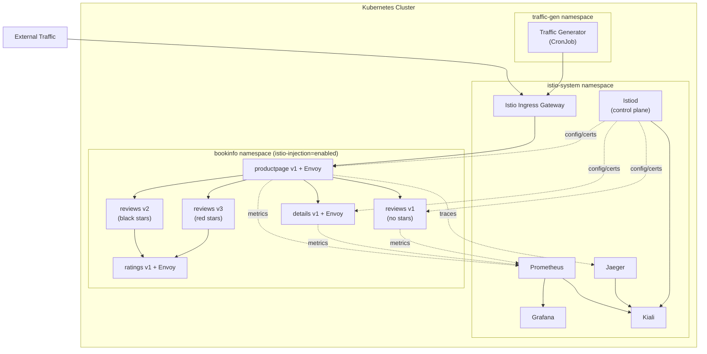
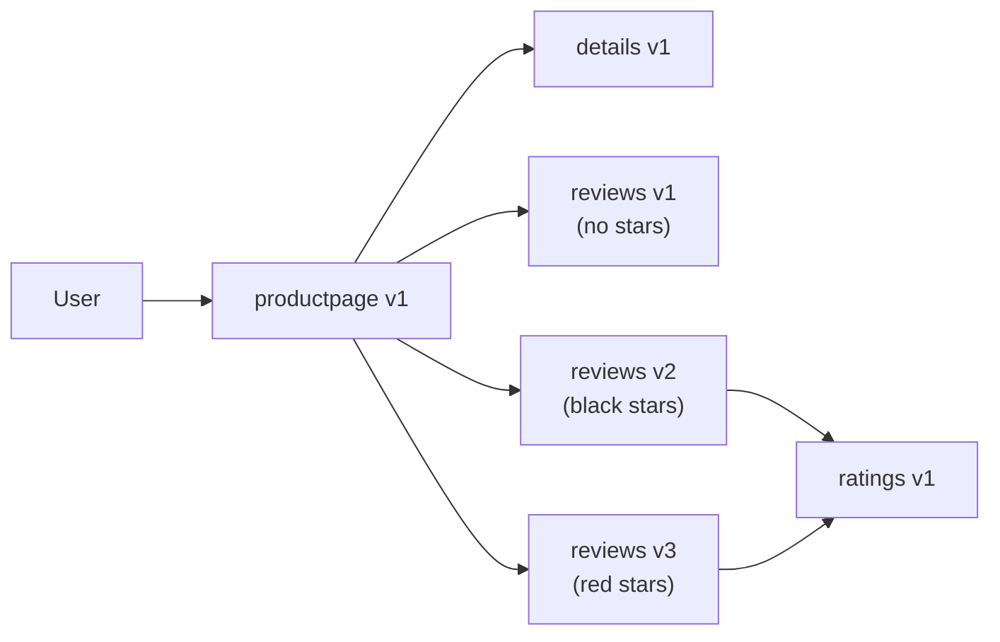
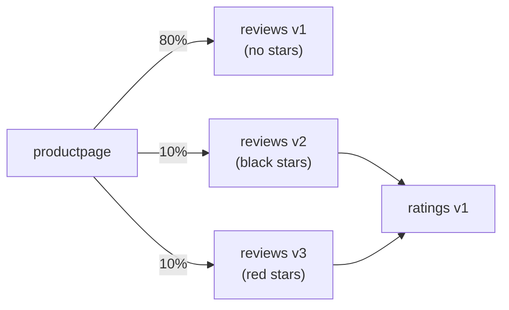
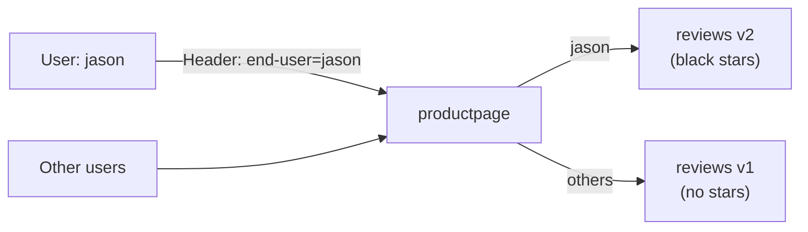
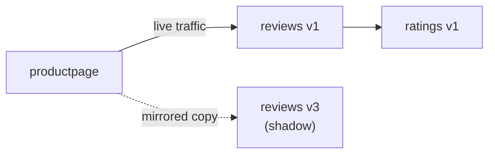

---

# Istio Service Mesh & Kiali

- `Istio` is an open-source service mesh that provides a uniform way to manage microservices communication.
- This lab demonstrates a complete **Istio service mesh** deployment on Kubernetes with **Kiali** for observability.
- Everything is installed via Helm charts for reproducibility and production-readiness.

---

## What will we learn?

- Install and configure Istio service mesh using Helm
- Deploy Kiali, Prometheus, Grafana, and Jaeger as observability addons
- Deploy a microservices demo application with sidecar injection
- Generate live traffic and observe it in Kiali's topology graph
- Configure traffic management: routing, canary deployments, fault injection
- Enable and verify mutual TLS (mTLS) between services
- Use circuit breakers, timeouts, and rate limiting
- Perform traffic shifting and A/B testing
- Observe distributed traces in Jaeger
- Monitor service metrics in Grafana dashboards

---

### What is Istio?

- `Istio` extends Kubernetes to establish a programmable, application-aware network using the Envoy service proxy.
- Istio provides a **control plane** (Istiod) and a **data plane** (Envoy sidecars injected into every pod).
- It requires **zero application code changes** - all features are handled transparently by the mesh.

### Core Components

| Component        | Role                                                                      | Default Port |
| ---------------- | ------------------------------------------------------------------------- | ------------ |
| **Istiod**       | Control plane - manages configuration, certificates, service discovery    | N/A          |
| **Envoy**        | Sidecar proxy injected into each pod - intercepts all pod network traffic | N/A          |
| **Kiali**        | Service mesh observability console - topology, health, config validation  | `20001`      |
| **Prometheus**   | Metrics collection and storage for Istio telemetry                        | `9090`       |
| **Grafana**      | Dashboards for mesh, service, and workload metrics                        | `3000`       |
| **Jaeger**       | Distributed tracing backend and UI                                        | `16686`      |

### Istio Key CRDs

| CRD                   | Purpose                                                                           |
| --------------------- | --------------------------------------------------------------------------------- |
| `VirtualService`      | Define routing rules: traffic shifting, fault injection, timeouts                 |
| `DestinationRule`     | Define policies after routing: load balancing, circuit breaker, mTLS             |
| `Gateway`             | Configure load balancer at mesh edge for HTTP/TCP traffic                         |
| `PeerAuthentication`  | Configure mTLS mode: `STRICT`, `PERMISSIVE`, `DISABLE`                           |
| `AuthorizationPolicy` | Access control policies for workloads                                             |
| `ServiceEntry`        | Add external services (outside the mesh) to Istio's service registry             |

---

## Architecture



---

## Directory Structure

```
10-Istio/
├── README.md                          # This file
├── demo.sh                            # Main deployment script (deploy/cleanup)
├── monitor.sh                         # Interactive monitoring & status checks
│
├── scripts/
│   ├── common.sh                      # Shared functions & colors
│   ├── 01-install-istio.sh            # Install Istio via Helm
│   ├── 02-install-addons.sh           # Install Kiali, Prometheus, Grafana, Jaeger
│   ├── 03-deploy-bookinfo.sh          # Deploy Bookinfo sample application
│   ├── 04-traffic-generator.sh        # Deploy live traffic generator
│   └── 05-verify.sh                   # Verify all components
│
├── manifests/
│   ├── namespace.yaml                 # bookinfo namespace with injection label
│   ├── bookinfo.yaml                  # Bookinfo application manifests
│   ├── bookinfo-gateway.yaml          # Istio Gateway + VirtualService for ingress
│   ├── destination-rules.yaml         # DestinationRules for all service versions
│   ├── traffic-generator.yaml         # CronJob for continuous traffic generation
│   └── addons/                        # Observability addon manifests
│       ├── prometheus.yaml
│       ├── grafana.yaml
│       ├── jaeger.yaml
│       └── kiali.yaml
│
└── istio-features/
    ├── 01-traffic-shifting.yaml       # Canary: route % of traffic to v2/v3
    ├── 02-fault-injection.yaml        # Inject delays and HTTP errors
    ├── 03-circuit-breaker.yaml        # Circuit breaker with connection limits
    ├── 04-request-routing.yaml        # Route by header (user identity)
    ├── 05-timeout-retry.yaml          # Configure timeouts and retries
    ├── 06-mirror-traffic.yaml         # Traffic mirroring / shadow traffic
    ├── 07-mtls-strict.yaml            # Enforce strict mTLS
    └── apply-feature.sh               # Apply/reset feature demos
```

---

## Prerequisites

- Kubernetes cluster (v1.24+) with at least 8 GB RAM available
- `kubectl` configured to access your cluster
- `Helm 3.x` installed
- Nginx Ingress Controller (required for Ingress-based access to dashboards and Bookinfo)
- (Optional) `istioctl` for debugging

```bash
# Install kubectl (macOS)
brew install kubectl

# Install Helm
brew install helm

# Install istioctl (optional)
brew install istioctl

# Verify installations
kubectl version --client
helm version
```

---

# Lab

## Part 01 - Deploy Istio Service Mesh

### 01. Deploy Everything

```bash
# Make scripts executable
chmod +x demo.sh monitor.sh scripts/*.sh istio-features/apply-feature.sh

# Deploy Istio + addons + Bookinfo + traffic generator
./demo.sh deploy
```

The script will:

- Check prerequisites: `kubectl`, `helm`, cluster connectivity
- Install Istio CRDs and control plane via Helm
- Install Kiali, Prometheus, Grafana, and Jaeger
- Create the `bookinfo` namespace with sidecar injection enabled
- Deploy the Bookinfo sample application (4 microservices, multiple versions)
- Configure the Istio Ingress Gateway and DestinationRules
- Start continuous traffic generation via CronJob
- Wait for all pods to be in `Running` state and print access URLs

### 02. Access the UIs

After deployment, open the dashboards using port-forwarding:

```bash
# Kiali - Service Mesh Observability Console
kubectl port-forward svc/kiali -n istio-system 20001:20001 &
open http://localhost:20001

# Grafana - Metrics Dashboards
kubectl port-forward svc/grafana -n istio-system 3000:3000 &
open http://localhost:3000

# Jaeger - Distributed Tracing UI
kubectl port-forward svc/tracing -n istio-system 16686:80 &
open http://localhost:16686

# Prometheus - Metrics Queries
kubectl port-forward svc/prometheus -n istio-system 9090:9090 &
open http://localhost:9090

# Bookinfo Application
kubectl port-forward svc/istio-ingressgateway -n istio-system 8080:80 &
open http://localhost:8080/productpage
```

### 03. Explore Kiali

1. Open Kiali at `http://localhost:20001`
2. Navigate to **Graph** and select the `bookinfo` namespace
3. Observe live traffic flowing between services as coloured edges
4. Click on any service to inspect metrics, traces, and health status
5. Check **Workloads** to confirm Envoy sidecar injection on all pods

---

## Part 02 - Bookinfo Application

The Bookinfo application consists of four microservices demonstrating multiple service versions:

| Service         | Versions   | Description                                                 |
| --------------- | ---------- | ----------------------------------------------------------- |
| **productpage** | v1         | Main frontend - calls details and reviews                   |
| **details**     | v1         | Book details information                                    |
| **reviews**     | v1, v2, v3 | Book reviews (v1: no stars, v2: black stars, v3: red stars) |
| **ratings**     | v1         | Star ratings (called by reviews v2 and v3 only)             |

### Application Flow



!!! note
    Each pod in the `bookinfo` namespace has an **Envoy sidecar** proxy automatically injected.
    All network traffic passes through the sidecar, enabling telemetry, traffic management, and mTLS with zero application changes.

### Istio Configuration

The lab uses custom Istio settings optimized for demonstrations:

```yaml
meshConfig:
  accessLogFile: /dev/stdout    # Enable access logging
  enableTracing: true           # Enable distributed tracing
  defaultConfig:
    tracing:
      sampling: 100.0           # 100% trace sampling (demo only)
    holdApplicationUntilProxyStarts: true
```

---

## Part 03 - Traffic Management

### 01. Traffic Shifting / Canary Deployment

Route a configurable percentage of traffic to different service versions:

```bash
./istio-features/apply-feature.sh 01-traffic-shifting
```



!!! tip
    **Observe in Kiali**: The Graph view shows weighted edges indicating the traffic split between versions.

### 02. Request Routing (Header-Based)

Route specific users to specific service versions based on HTTP headers:

```bash
./istio-features/apply-feature.sh 04-request-routing
```



```bash
# Test it: log in as "jason" on the productpage
open http://localhost:8080/productpage
```

### 03. Fault Injection

Inject failures to test service resilience:

```bash
./istio-features/apply-feature.sh 02-fault-injection
```

- Injects a **7-second delay** for user `jason` on the `ratings` service
- Injects **HTTP 500 errors** for 10% of all requests to `ratings`

!!! warning
    **Observe in Kiali**: Error rates appear as red percentages on the graph edges.

### 04. Circuit Breaker

Limit connections to prevent cascading failures across services:

```bash
./istio-features/apply-feature.sh 03-circuit-breaker
```

- Max **1 concurrent connection** to `reviews`
- Max **1 pending request** in the queue
- Circuit trips after **1 consecutive 5xx error**

### 05. Timeouts and Retries

Configure request timeouts and automatic retries at the mesh level:

```bash
./istio-features/apply-feature.sh 05-timeout-retry
```

- **3-second timeout** on requests to the `reviews` service
- **2 automatic retries** on failure (5xx errors, connect failures)

### 06. Traffic Mirroring

Shadow production traffic to a test version without affecting real users:

```bash
./istio-features/apply-feature.sh 06-mirror-traffic
```



### 07. Mutual TLS (mTLS)

Enforce encrypted service-to-service communication across the namespace:

```bash
./istio-features/apply-feature.sh 07-mtls-strict
```

- Enables **STRICT** mTLS mode for the `bookinfo` namespace
- All inter-service traffic must be encrypted via Istio-managed certificates
- Non-mesh (plain TCP) traffic is rejected

!!! tip
    **Verify in Kiali**: The Security view shows lock icons on all edges of the graph.

### Reset to Default

```bash
# Reset all feature demos back to default routing
./istio-features/apply-feature.sh reset
```

---

## Part 04 - Observability

### Prometheus Queries

Useful PromQL queries for Istio service mesh metrics:

```promql
# Request rate by destination service
rate(istio_requests_total{reporter="destination"}[5m])

# P99 latency per service
histogram_quantile(0.99,
  sum(rate(istio_request_duration_milliseconds_bucket{reporter="destination"}[5m]))
  by (le, destination_service)
)

# Error rate per destination service
sum(rate(istio_requests_total{reporter="destination", response_code=~"5.*"}[5m])) by (destination_service)
/
sum(rate(istio_requests_total{reporter="destination"}[5m])) by (destination_service)

# TCP bytes sent
sum(rate(istio_tcp_sent_bytes_total[5m])) by (destination_service)
```

### Grafana Dashboards

Pre-configured Istio dashboards available out of the box:

| Dashboard                         | Description                                       |
| --------------------------------- | ------------------------------------------------- |
| **Istio Mesh Dashboard**          | Overall mesh health and performance overview      |
| **Istio Service Dashboard**       | Per-service request rates, latencies, error rates |
| **Istio Workload Dashboard**      | Per-workload (pod) metrics                        |
| **Istio Control Plane Dashboard** | Istiod resource usage and performance             |

### Jaeger Distributed Tracing

1. Open Jaeger at `http://localhost:16686`
2. Select service `productpage.bookinfo` from the dropdown
3. Click **Find Traces** to list recent requests
4. Examine a trace to see the full end-to-end path across all microservices
5. Compare latencies to identify bottlenecks between service versions

### Monitor Script

```bash
# Interactive mode
./monitor.sh

# Quick summary
./monitor.sh summary

# Test connectivity to all components
./monitor.sh test

# Full detailed report
./monitor.sh full
```

---

## Part 05 - Troubleshooting

### Pods Not Starting

```bash
# Check events for clues
kubectl get events -n bookinfo --sort-by='.lastTimestamp'
kubectl get events -n istio-system --sort-by='.lastTimestamp'

# Describe a specific pod
kubectl describe pod <pod-name> -n bookinfo
```

### Sidecar Not Injected

```bash
# Verify the namespace injection label
kubectl get namespace bookinfo --show-labels
# Expected: istio-injection=enabled

# If the label is missing, add it:
kubectl label namespace bookinfo istio-injection=enabled --overwrite

# Restart deployments to trigger sidecar injection
kubectl rollout restart deployment -n bookinfo
```

### No Traffic Visible in Kiali

```bash
# Verify the traffic generator CronJob is running
kubectl get cronjob -n traffic-gen
kubectl get jobs -n traffic-gen --sort-by=.metadata.creationTimestamp | tail -5

# Confirm productpage is reachable from within the cluster
kubectl exec -n bookinfo deploy/productpage-v1 -- \
  curl -s http://localhost:9080/productpage | head -20

# Verify Prometheus is collecting Istio metrics
kubectl exec -n istio-system deploy/prometheus -- \
  wget -qO- 'http://localhost:9090/api/v1/query?query=istio_requests_total' | head -50
```

!!! note
    Wait 1–2 minutes after deploying the traffic generator for metrics to propagate into Prometheus and Kiali.

### Istio Configuration Issues

```bash
# Analyze Istio configuration for problems
istioctl analyze -n bookinfo

# Check proxy sync status for all pods
istioctl proxy-status

# Inspect proxy routing config for a specific pod
istioctl proxy-config routes deploy/productpage-v1 -n bookinfo
```

### Kiali Not Showing Data

```bash
# Confirm Prometheus is running
kubectl get pods -n istio-system -l app=prometheus

# Check Kiali logs for errors
kubectl logs -n istio-system -l app=kiali --tail=50
```

---

## Part 06 - Cleanup

### Full Cleanup

```bash
./demo.sh cleanup
```

This will remove:

- `traffic-gen` namespace and all traffic generator resources
- `bookinfo` namespace and all application resources
- Kiali, Prometheus, Grafana, and Jaeger Helm releases
- Istio control plane Helm release
- All Istio CRDs
- All remaining namespaces created by this lab

### Partial Cleanup

```bash
# Remove only the Bookinfo app (keep Istio + addons running)
kubectl delete namespace bookinfo
kubectl delete namespace traffic-gen

# Remove only Istio feature demos (restore default routing)
./istio-features/apply-feature.sh reset

# Remove only observability addons (keep Istio + app running)
kubectl delete -f manifests/addons/ -n istio-system
```

---

## Resources

- [Istio Documentation](https://istio.io/latest/docs/)
- [Kiali Documentation](https://kiali.io/docs/)
- [Bookinfo Sample Application](https://istio.io/latest/docs/examples/bookinfo/)
- [Istio Traffic Management](https://istio.io/latest/docs/concepts/traffic-management/)
- [Istio Security](https://istio.io/latest/docs/concepts/security/)
- [Envoy Proxy Documentation](https://www.envoyproxy.io/docs/)
- [Helm Charts for Istio](https://istio.io/latest/docs/setup/install/helm/)
