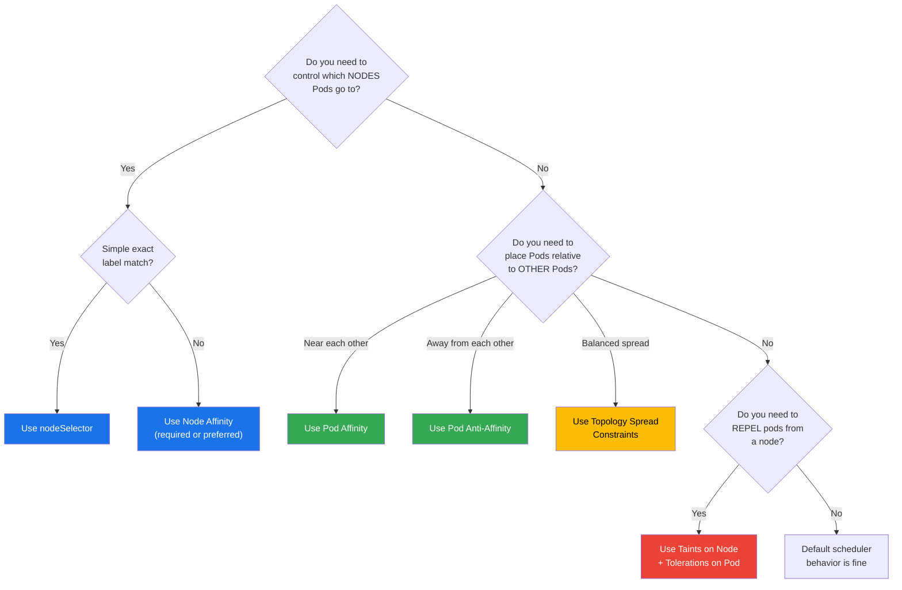

---

# Node Affinity, Pod Affinity, Anti-Affinity, Taints & Tolerations

- Kubernetes provides a rich set of mechanisms to control **where Pods are scheduled** in your cluster.
- In this lab we will deep-dive into every scheduling constraint available: `nodeSelector`, `Node Affinity`, `Pod Affinity`, `Pod Anti-Affinity`, `Taints`, `Tolerations`, and `Topology Spread Constraints`.
- We will build real-world examples - from GPU node pools to zone-aware deployments and multi-tenant cluster isolation.
- By the end of this lab you will have mastered fine-grained Pod placement and be able to design sophisticated scheduling strategies for production clusters.

---

## What will we learn?

- Why Pod scheduling constraints exist and when to use each mechanism
- `nodeSelector` - simple, label-based node filtering
- `Node Affinity` - expressive node selection with operators, required vs. preferred rules
- `Pod Affinity` - co-locate Pods with other Pods (same node, same zone)
- `Pod Anti-Affinity` - spread Pods away from each other
- `Taints` - repel Pods from Nodes
- `Tolerations` - allow Pods onto tainted Nodes
- `Topology Spread Constraints` - balance Pods evenly across topology domains
- Real-world patterns: GPU pools, zone spreading, multi-tenant isolation, database co-location
- How to combine all mechanisms for complex production requirements
- Scheduling internals and the decision pipeline

---

## Official Documentation & References

| Resource | Link |
|---|---|
| Assign Pods to Nodes | [kubernetes.io/docs](https://kubernetes.io/docs/concepts/scheduling-eviction/assign-pod-node/) |
| Node Affinity | [kubernetes.io/docs/affinity](https://kubernetes.io/docs/concepts/scheduling-eviction/assign-pod-node/#affinity-and-anti-affinity) |
| Taints and Tolerations | [kubernetes.io/docs/taints](https://kubernetes.io/docs/concepts/scheduling-eviction/taint-and-toleration/) |
| Topology Spread Constraints | [kubernetes.io/docs/topology](https://kubernetes.io/docs/concepts/scheduling-eviction/topology-spread-constraints/) |
| kube-scheduler | [kubernetes.io/docs/kube-scheduler](https://kubernetes.io/docs/concepts/scheduling-eviction/kube-scheduler/) |
| Pod Priority & Preemption | [kubernetes.io/docs/priority](https://kubernetes.io/docs/concepts/scheduling-eviction/pod-priority-preemption/) |
| Well-Known Node Labels | [kubernetes.io/docs/reference/labels](https://kubernetes.io/docs/reference/labels-annotations-taints/) |

---

## Introduction

### The Kubernetes Scheduling Pipeline

When you create a Pod, the `kube-scheduler` selects which Node it runs on. The scheduler runs through several phases:


### Scheduling Mechanism Overview

| Mechanism | Direction | Hardness | Scope |
|---|---|---|---|
| `nodeName` | Pod → Node | Hard | Single node |
| `nodeSelector` | Pod → Node | Hard | Label match |
| **Node Affinity** (required) | Pod → Node | Hard | Operators, multi-label |
| **Node Affinity** (preferred) | Pod → Node | Soft | With weights |
| **Pod Affinity** (required) | Pod → Pod | Hard | Topology domain |
| **Pod Affinity** (preferred) | Pod → Pod | Soft | With weights |
| **Pod Anti-Affinity** (required) | Pod ↔ Pod | Hard | Topology domain |
| **Pod Anti-Affinity** (preferred) | Pod ↔ Pod | Soft | With weights |
| **Taint** `NoSchedule` | Node repels Pod | Hard | New pods excluded |
| **Taint** `NoExecute` | Node repels Pod | Hard | Existing pods evicted |
| **Taint** `PreferNoSchedule` | Node repels Pod | Soft | Avoid if possible |
| **Topology Spread** | Pod distribution | Hard/Soft | Arbitrary topology |

---

## Terminology

| Term | Description |
|---|---|
| **Node** | A physical or virtual machine in the Kubernetes cluster |
| **Node Label** | A key-value pair attached to a Node used for selection |
| **Taint** | A key-value-effect triple on a Node that repels Pods |
| **Toleration** | A key-value-effect triple on a Pod that permits scheduling on a tainted Node |
| **Affinity** | A set of rules the scheduler uses to prefer or require specific placement |
| **Anti-Affinity** | Rules to keep Pods away from specific locations or other Pods |
| **topologyKey** | A node label key that defines the topology domain (e.g., `kubernetes.io/hostname`, `topology.kubernetes.io/zone`) |
| **Required (hard)** | `requiredDuringSchedulingIgnoredDuringExecution` - the Pod won't schedule if the rule can't be satisfied |
| **Preferred (soft)** | `preferredDuringSchedulingIgnoredDuringExecution` - the scheduler tries to honor but will schedule anyway |
| **IgnoredDuringExecution** | Already-running Pods are NOT evicted if rules change after scheduling |
| **weight** | Integer 1–100 given to a preferred rule; used in scoring |
| **Topology Spread Constraint** | Rule that limits how unevenly Pods can be distributed across topology domains |
| **maxSkew** | Maximum difference in Pod count between the most and least loaded topology domain |
| **whenUnsatisfiable** | What to do when spread can't be satisfied: `DoNotSchedule` (hard) or `ScheduleAnyway` (soft) |

---

## Common `kubectl` Commands

??? example "`kubectl label` - Add, update, remove labels on nodes"

    **Syntax:** `kubectl label nodes <node-name> <key>=<value>`

    **Description:** Labels are key-value pairs attached to Nodes (and any Kubernetes object). They are the foundation of all affinity rules and nodeSelector.

    ```bash
    # List all nodes
    kubectl get nodes

    # Show all labels on nodes
    kubectl get nodes --show-labels

    # Label a node
    kubectl label nodes node-1 environment=production

    # Label with multiple keys at once
    kubectl label nodes node-1 environment=production tier=frontend

    # Overwrite an existing label (requires --overwrite)
    kubectl label nodes node-1 environment=staging --overwrite

    # Remove a label (append a minus sign)
    kubectl label nodes node-1 environment-

    # Label all nodes matching a selector
    kubectl label nodes -l kubernetes.io/role=worker disk-type=ssd

    # Show node labels formatted as a table
    kubectl get nodes -o custom-columns=NAME:.metadata.name,LABELS:.metadata.labels
    ```

??? example "`kubectl taint` - Add and remove taints on nodes"

    **Syntax:** `kubectl taint nodes <node-name> <key>=<value>:<effect>`

    **Description:** Taints prevent Pods from being scheduled on a Node unless they have a matching toleration.

    ```bash
    # Add a taint with NoSchedule effect
    kubectl taint nodes node-1 dedicated=gpu:NoSchedule

    # Add a taint with NoExecute effect (evicts running pods)
    kubectl taint nodes node-1 maintenance=true:NoExecute

    # Add a taint with PreferNoSchedule effect (soft)
    kubectl taint nodes node-1 spot-instance=true:PreferNoSchedule

    # Remove a taint (append a minus sign after the effect)
    kubectl taint nodes node-1 dedicated=gpu:NoSchedule-

    # Remove all taints with a given key regardless of value/effect
    kubectl taint nodes node-1 dedicated-

    # Show all taints on all nodes
    kubectl describe nodes | grep -A3 "Taints:"

    # Taint ALL nodes in the cluster
    kubectl taint nodes --all dedicated=shared:PreferNoSchedule
    ```

??? example "`kubectl describe node` - Inspect node labels, taints, and allocatable resources"

    ```bash
    # Full node description
    kubectl describe node node-1

    # Show just labels
    kubectl get node node-1 -o jsonpath='{.metadata.labels}' | jq

    # Show just taints
    kubectl get node node-1 -o jsonpath='{.spec.taints}'

    # Show topology labels (zone / region)
    kubectl get nodes -o custom-columns=\
    NAME:.metadata.name,\
    REGION:.metadata.labels."topology\.kubernetes\.io/region",\
    ZONE:.metadata.labels."topology\.kubernetes\.io/zone"

    # Check which node a pod landed on
    kubectl get pods -o wide

    # Watch pod scheduling events
    kubectl get events --sort-by='.lastTimestamp' | grep FailedScheduling
    ```

??? example "`kubectl get` - Filter pods and nodes by label"

    ```bash
    # List pods on a specific node
    kubectl get pods --field-selector spec.nodeName=node-1

    # List pods with nodeSelector labels
    kubectl get pods -o jsonpath='{range .items[*]}{.metadata.name}{"\t"}{.spec.nodeSelector}{"\n"}{end}'

    # List all nodes with a specific label
    kubectl get nodes -l environment=production

    # List nodes with topology zone labels
    kubectl get nodes -l topology.kubernetes.io/zone=us-east-1a
    ```

---

## Part 01 - `nodeSelector` (Simple Node Selection)

- `nodeSelector` is the simplest way to constrain a Pod to specific Nodes.
- It is a map of label key-value pairs - the Pod will only be scheduled on Nodes that have **all** the specified labels.
- It is less expressive than Node Affinity but easier to read for simple cases.

### Step 01.01 - Label a Node

```bash
# Label a node for SSD storage
kubectl label nodes node-1 disk-type=ssd

# Label another node for HDD storage
kubectl label nodes node-2 disk-type=hdd

# Verify
kubectl get nodes --show-labels | grep disk-type
```

### Step 01.02 - Schedule a Pod with nodeSelector

```yaml
# pod-nodeselector.yaml
apiVersion: v1
kind: Pod
metadata:
  name: ssd-pod
spec:
  nodeSelector:
    disk-type: ssd          # Must match this exact label
  containers:
  - name: app
    image: nginx:1.25
```

```bash
kubectl apply -f pod-nodeselector.yaml
kubectl get pod ssd-pod -o wide     # Verify it landed on a ssd node
```

### Step 01.03 - `nodeSelector` vs `Node Affinity`

| Feature | `nodeSelector` | `Node Affinity` |
|---|---|---|
| Operators | `=` only | In, NotIn, Exists, DoesNotExist, Gt, Lt |
| Logic | AND (all labels must match) | AND within a term, OR between terms |
| Soft preferences | No | Yes (`preferred`) |
| Multiple label conditions | Yes (all must match) | Yes (with full OR/AND logic) |

- **Prefer `Node Affinity`** for all new workloads. Use `nodeSelector` only for simple backward-compatible cases.

---

## Part 02 - Node Affinity

- `Node Affinity` is the next-generation `nodeSelector`.
- It lets you express complex label requirements using operators and supports both **hard** and **soft** rules.
- All Node Affinity rules live under `spec.affinity.nodeAffinity`.

### Node Affinity Rule Types

| Rule | Description |
|---|---|
| `requiredDuringSchedulingIgnoredDuringExecution` | **Hard** - Pod won't schedule if rule can't be met |
| `preferredDuringSchedulingIgnoredDuringExecution` | **Soft** - scheduler tries to honor, but schedules anyway |

!!! note "IgnoredDuringExecution"
    Both rule types have `IgnoredDuringExecution`. This means if a Node's labels change **after** a Pod is scheduled, the Pod is **not evicted**. A future type `requiredDuringSchedulingRequiredDuringExecution` is planned but not yet stable.

### Node Affinity Operators

| Operator | Description | Example |
|---|---|---|
| `In` | Label value is in the set | `environment In [production, staging]` |
| `NotIn` | Label value is NOT in the set | `environment NotIn [development]` |
| `Exists` | Label key exists (any value) | `gpu Exists` |
| `DoesNotExist` | Label key does not exist | `spot-node DoesNotExist` |
| `Gt` | Label value numerically > specified | `storage-gb Gt 100` |
| `Lt` | Label value numerically < specified | `storage-gb Lt 1000` |

### Step 02.01 - Required Node Affinity (Hard Rule)

```bash
# Setup - label nodes
kubectl label nodes node-1 environment=production zone=us-east
kubectl label nodes node-2 environment=development zone=us-west
```

```yaml
# pod-required-affinity.yaml
apiVersion: v1
kind: Pod
metadata:
  name: prod-pod
spec:
  affinity:
    nodeAffinity:
      requiredDuringSchedulingIgnoredDuringExecution:
        nodeSelectorTerms:
        - matchExpressions:
          - key: environment
            operator: In
            values:
            - production
            - staging                  # Pod can go to production OR staging nodes
  containers:
  - name: app
    image: nginx:1.25
```

```bash
kubectl apply -f pod-required-affinity.yaml
kubectl get pod prod-pod -o wide
kubectl describe pod prod-pod | grep -E "Node:|Affinity"
```

!!! warning "Pod stays Pending if no matching Nodes exist"
    If no Node has `environment=production` or `environment=staging`, the Pod will remain in `Pending` state with event `FailedScheduling: 0/N nodes are available: N node(s) didn't match Pod's node affinity/selector`.

### Step 02.02 - Preferred Node Affinity (Soft Rule with Weight)

```yaml
# pod-preferred-affinity.yaml
apiVersion: v1
kind: Pod
metadata:
  name: preferred-pod
spec:
  affinity:
    nodeAffinity:
      preferredDuringSchedulingIgnoredDuringExecution:
      - weight: 80                    # Strong preference (out of 100)
        preference:
          matchExpressions:
          - key: environment
            operator: In
            values:
            - production
      - weight: 20                    # Weak preference
        preference:
          matchExpressions:
          - key: zone
            operator: In
            values:
            - us-east
  containers:
  - name: app
    image: nginx:1.25
```

- The scheduler adds the `weight` values as bonus score for each Node that matches that preference.
- A Pod CAN be scheduled on a Node that matches neither preference - the rules are purely advisory.

### Step 02.03 - Combining Required and Preferred Rules

```yaml
# pod-combined-affinity.yaml
apiVersion: v1
kind: Pod
metadata:
  name: combined-affinity-pod
spec:
  affinity:
    nodeAffinity:
      # HARD: MUST be production or staging
      requiredDuringSchedulingIgnoredDuringExecution:
        nodeSelectorTerms:
        - matchExpressions:
          - key: environment
            operator: In
            values:
            - production
            - staging
      # SOFT: prefer us-east zone within those nodes
      preferredDuringSchedulingIgnoredDuringExecution:
      - weight: 100
        preference:
          matchExpressions:
          - key: zone
            operator: In
            values:
            - us-east
  containers:
  - name: app
    image: nginx:1.25
```

### Step 02.04 - Understanding OR and AND Logic

!!! tip "nodeSelectorTerms - OR logic; matchExpressions - AND logic"

    - Multiple entries in `nodeSelectorTerms` are combined with **OR** - the Pod can match ANY of them.
    - Multiple entries in a single `matchExpressions` list are combined with **AND** - ALL must be satisfied.

```yaml
# OR logic example: pod can go to either SSD nodes OR GPU nodes
spec:
  affinity:
    nodeAffinity:
      requiredDuringSchedulingIgnoredDuringExecution:
        nodeSelectorTerms:
        - matchExpressions:           # First term (SSD)
          - key: disk-type
            operator: In
            values: [ssd]
        - matchExpressions:           # Second term (GPU) - OR with first
          - key: hardware
            operator: In
            values: [gpu]
```

```yaml
# AND logic example: pod must be on SSD AND production nodes
spec:
  affinity:
    nodeAffinity:
      requiredDuringSchedulingIgnoredDuringExecution:
        nodeSelectorTerms:
        - matchExpressions:           # Both conditions in the same term = AND
          - key: disk-type
            operator: In
            values: [ssd]
          - key: environment
            operator: In
            values: [production]
```

### Step 02.05 - `NotIn` Operator (Exclude Nodes)

```yaml
# Avoid scheduling on spot/preemptible instances for critical workloads
apiVersion: v1
kind: Pod
metadata:
  name: critical-pod
spec:
  affinity:
    nodeAffinity:
      requiredDuringSchedulingIgnoredDuringExecution:
        nodeSelectorTerms:
        - matchExpressions:
          - key: node-lifecycle
            operator: NotIn
            values:
            - spot
            - preemptible
  containers:
  - name: app
    image: nginx:1.25
```

### Step 02.06 - `Exists` and `DoesNotExist` Operators

```yaml
# Must run on a node that has ANY value for the 'gpu' label
apiVersion: v1
kind: Pod
metadata:
  name: any-gpu-pod
spec:
  affinity:
    nodeAffinity:
      requiredDuringSchedulingIgnoredDuringExecution:
        nodeSelectorTerms:
        - matchExpressions:
          - key: gpu
            operator: Exists         # Any value for 'gpu' label is acceptable
  containers:
  - name: app
    image: nvidia/cuda:12.0-base
```

```yaml
# Must run on a node that has NO 'special-hardware' label at all
apiVersion: v1
kind: Pod
metadata:
  name: standard-pod
spec:
  affinity:
    nodeAffinity:
      requiredDuringSchedulingIgnoredDuringExecution:
        nodeSelectorTerms:
        - matchExpressions:
          - key: special-hardware
            operator: DoesNotExist
  containers:
  - name: app
    image: nginx:1.25
```

### Step 02.07 - `Gt` and `Lt` Operators (Numeric Comparison)

```bash
# Label nodes with numeric values
kubectl label nodes node-1 memory-gb=16
kubectl label nodes node-2 memory-gb=64
kubectl label nodes node-3 memory-gb=128
```

```yaml
# Schedule only on nodes with memory-gb > 32
apiVersion: v1
kind: Pod
metadata:
  name: high-memory-pod
spec:
  affinity:
    nodeAffinity:
      requiredDuringSchedulingIgnoredDuringExecution:
        nodeSelectorTerms:
        - matchExpressions:
          - key: memory-gb
            operator: Gt
            values:
            - "32"                   # Value must be a string, comparison is numeric
  containers:
  - name: app
    image: nginx:1.25
```

```yaml
# Schedule on nodes with memory-gb between 32 and 256 (exclusive)
apiVersion: v1
kind: Pod
metadata:
  name: medium-memory-pod
spec:
  affinity:
    nodeAffinity:
      requiredDuringSchedulingIgnoredDuringExecution:
        nodeSelectorTerms:
        - matchExpressions:
          - key: memory-gb
            operator: Gt
            values: ["32"]
          - key: memory-gb
            operator: Lt
            values: ["256"]
  containers:
  - name: app
    image: nginx:1.25
```

### Step 02.08 - Node Affinity in a Deployment

```yaml
# deployment-node-affinity.yaml
apiVersion: apps/v1
kind: Deployment
metadata:
  name: web-app
spec:
  replicas: 3
  selector:
    matchLabels:
      app: web-app
  template:
    metadata:
      labels:
        app: web-app
    spec:
      affinity:
        nodeAffinity:
          requiredDuringSchedulingIgnoredDuringExecution:
            nodeSelectorTerms:
            - matchExpressions:
              - key: environment
                operator: In
                values: [production]
          preferredDuringSchedulingIgnoredDuringExecution:
          - weight: 50
            preference:
              matchExpressions:
              - key: zone
                operator: In
                values: [us-east-1a]
          - weight: 50
            preference:
              matchExpressions:
              - key: zone
                operator: In
                values: [us-east-1b]
      containers:
      - name: web
        image: nginx:1.25
        ports:
        - containerPort: 80
```

---

## Part 03 - Pod Affinity (Co-locate Pods)

- `Pod Affinity` allows you to influence the scheduler to place Pods **near** other Pods.
- This is useful when Pods benefit from being on the same Node or in the same topology domain (e.g., same availability zone) to reduce network latency.
- Pod Affinity rules live under `spec.affinity.podAffinity`.

### How topologyKey Works


!!! tip "Common `topologyKey` values"
    - `kubernetes.io/hostname` - same physical/virtual Node
    - `topology.kubernetes.io/zone` - same availability zone
    - `topology.kubernetes.io/region` - same cloud region
    - Any custom label key on your Nodes

### Step 03.01 - Required Pod Affinity (Co-locate on Same Node)

```yaml
# two-pods-same-node.yaml
# First: deploy the "anchor" pod that others want to co-locate with
apiVersion: v1
kind: Pod
metadata:
  name: cache-pod
  labels:
    app: cache
    tier: caching
spec:
  containers:
  - name: redis
    image: redis:7
    ports:
    - containerPort: 6379
---
# Second: deploy the app that MUST be on the same Node as a cache pod
apiVersion: v1
kind: Pod
metadata:
  name: app-pod
spec:
  affinity:
    podAffinity:
      requiredDuringSchedulingIgnoredDuringExecution:
      - labelSelector:
          matchExpressions:
          - key: app
            operator: In
            values:
            - cache
        topologyKey: kubernetes.io/hostname    # Same node as a cache pod
  containers:
  - name: app
    image: nginx:1.25
```

```bash
kubectl apply -f two-pods-same-node.yaml
kubectl get pods -o wide     # Both should be on the same node
```

### Step 03.02 - Required Pod Affinity (Co-locate in Same Zone)

```yaml
# frontend-with-zone-affinity.yaml
apiVersion: v1
kind: Pod
metadata:
  name: frontend-pod
spec:
  affinity:
    podAffinity:
      requiredDuringSchedulingIgnoredDuringExecution:
      - labelSelector:
          matchLabels:
            app: backend          # Must be in same zone as a backend pod
        topologyKey: topology.kubernetes.io/zone
  containers:
  - name: frontend
    image: nginx:1.25
```

### Step 03.03 - Preferred Pod Affinity

```yaml
# pod-preferred-pod-affinity.yaml
apiVersion: v1
kind: Pod
metadata:
  name: app-prefer-near-cache
spec:
  affinity:
    podAffinity:
      preferredDuringSchedulingIgnoredDuringExecution:
      - weight: 100
        podAffinityTerm:
          labelSelector:
            matchExpressions:
            - key: app
              operator: In
              values:
              - cache
          topologyKey: kubernetes.io/hostname   # Prefer same node, but not required
  containers:
  - name: app
    image: nginx:1.25
```

### Step 03.04 - Pod Affinity in a Deployment (Sidecar Co-location Pattern)

```yaml
# sidecar-affinity-deployment.yaml
# This deployment ensures each app pod is on the same node as a log-agent pod
apiVersion: apps/v1
kind: Deployment
metadata:
  name: app-with-sidecar-affinity
spec:
  replicas: 3
  selector:
    matchLabels:
      app: my-app
  template:
    metadata:
      labels:
        app: my-app
    spec:
      affinity:
        podAffinity:
          preferredDuringSchedulingIgnoredDuringExecution:
          - weight: 100
            podAffinityTerm:
              labelSelector:
                matchLabels:
                  app: log-agent
              topologyKey: kubernetes.io/hostname
      containers:
      - name: app
        image: nginx:1.25
```

### Step 03.05 - Scoping Pod Affinity to Specific Namespaces

```yaml
# Pod affinity targeting pods in a specific namespace
apiVersion: v1
kind: Pod
metadata:
  name: cross-namespace-affinity-pod
spec:
  affinity:
    podAffinity:
      requiredDuringSchedulingIgnoredDuringExecution:
      - labelSelector:
          matchLabels:
            app: database
        topologyKey: kubernetes.io/hostname
        namespaces:             # Look for matching pods in these namespaces
        - data-plane
        - production
        # If 'namespaces' is omitted, only the Pod's own namespace is searched
        # If 'namespaces' is empty [], all namespaces are searched
  containers:
  - name: app
    image: nginx:1.25
```

---

## Part 04 - Pod Anti-Affinity (Spread Pods Apart)

- `Pod Anti-Affinity` is the opposite of `Pod Affinity` - it ensures Pods are placed **away** from other Pods.
- Its primary use is **high availability**: spreading replicas across Nodes, zones, or regions so a single failure doesn't take down your entire service.
- Anti-Affinity rules live under `spec.affinity.podAntiAffinity`.

### Step 04.01 - Required Anti-Affinity (One Pod per Node)

```yaml
# deployment-one-per-node.yaml
# This deployment ensures no two replicas end up on the same node
apiVersion: apps/v1
kind: Deployment
metadata:
  name: ha-nginx
spec:
  replicas: 3
  selector:
    matchLabels:
      app: ha-nginx
  template:
    metadata:
      labels:
        app: ha-nginx
    spec:
      affinity:
        podAntiAffinity:
          requiredDuringSchedulingIgnoredDuringExecution:
          - labelSelector:
              matchExpressions:
              - key: app
                operator: In
                values:
                - ha-nginx             # Avoid nodes that already have this app
            topologyKey: kubernetes.io/hostname
      containers:
      - name: nginx
        image: nginx:1.25
        ports:
        - containerPort: 80
```

```bash
kubectl apply -f deployment-one-per-node.yaml
kubectl get pods -o wide     # Each pod should land on a different node
```

!!! warning "Required Anti-Affinity can leave Pods Pending"
    If you have `replicas: 5` but only 3 Nodes, 2 Pods will stay Pending because no Node is available that doesn't already have a matching Pod. Use `preferredDuringScheduling` if this is a concern.

### Step 04.02 - Preferred Anti-Affinity (Prefer Different Nodes)

```yaml
# deployment-prefer-spread.yaml
apiVersion: apps/v1
kind: Deployment
metadata:
  name: web-spread
spec:
  replicas: 5
  selector:
    matchLabels:
      app: web-spread
  template:
    metadata:
      labels:
        app: web-spread
    spec:
      affinity:
        podAntiAffinity:
          preferredDuringSchedulingIgnoredDuringExecution:
          - weight: 100
            podAffinityTerm:
              labelSelector:
                matchLabels:
                  app: web-spread
              topologyKey: kubernetes.io/hostname
      containers:
      - name: web
        image: nginx:1.25
```

### Step 04.03 - Zone-Level Anti-Affinity (HA Across Zones)

```bash
# First, verify your nodes have zone labels
kubectl get nodes -o custom-columns=\
NAME:.metadata.name,\
ZONE:.metadata.labels."topology\.kubernetes\.io/zone"
```

```yaml
# deployment-zone-ha.yaml
# Ensures each replica lands in a different availability zone
apiVersion: apps/v1
kind: Deployment
metadata:
  name: zone-ha-app
spec:
  replicas: 3
  selector:
    matchLabels:
      app: zone-ha-app
  template:
    metadata:
      labels:
        app: zone-ha-app
    spec:
      affinity:
        podAntiAffinity:
          requiredDuringSchedulingIgnoredDuringExecution:
          - labelSelector:
              matchLabels:
                app: zone-ha-app
            topologyKey: topology.kubernetes.io/zone   # One per zone
      containers:
      - name: app
        image: nginx:1.25
```

### Step 04.04 - Combining Pod Affinity and Anti-Affinity

```yaml
# This pod:
# - MUST be in the same zone as at least one 'backend' pod (affinity)
# - MUST NOT be on the same node as another 'frontend' pod (anti-affinity)
apiVersion: apps/v1
kind: Deployment
metadata:
  name: frontend
spec:
  replicas: 3
  selector:
    matchLabels:
      app: frontend
  template:
    metadata:
      labels:
        app: frontend
    spec:
      affinity:
        podAffinity:
          requiredDuringSchedulingIgnoredDuringExecution:
          - labelSelector:
              matchLabels:
                app: backend
            topologyKey: topology.kubernetes.io/zone
        podAntiAffinity:
          requiredDuringSchedulingIgnoredDuringExecution:
          - labelSelector:
              matchLabels:
                app: frontend
            topologyKey: kubernetes.io/hostname
      containers:
      - name: frontend
        image: nginx:1.25
```

---

## Part 05 - Taints and Tolerations

- `Taints` are applied to **Nodes** and repel Pods.
- `Tolerations` are applied to **Pods** and allow them to be scheduled onto tainted Nodes.
- Together they implement a **whitelist model**: a tainted Node only accepts Pods that explicitly opt-in via tolerations.
- This is the opposite of Node Affinity (which is a **pull** mechanism from the Pod side).


### Taint Effects

| Effect | New Pods | Existing Pods |
|---|---|---|
| `NoSchedule` | Blocked (hard) | Not affected |
| `PreferNoSchedule` | Avoided (soft) | Not affected |
| `NoExecute` | Blocked (hard) | **Evicted** if no matching toleration |

### Step 05.01 - Apply and Remove Taints

```bash
# Add NoSchedule taint
kubectl taint nodes node-1 dedicated=gpu:NoSchedule

# Add NoExecute taint (evicts non-tolerating existing pods immediately)
kubectl taint nodes node-2 maintenance=true:NoExecute

# Add PreferNoSchedule taint (soft - pods go elsewhere if possible)
kubectl taint nodes node-3 spot-instance=true:PreferNoSchedule

# View taints on all nodes
kubectl describe nodes | grep -A2 "Taints:"

# Remove a specific taint
kubectl taint nodes node-1 dedicated=gpu:NoSchedule-

# Remove all taints with a key (any value or effect)
kubectl taint nodes node-1 dedicated-
```

### Step 05.02 - Pod Without Toleration

```yaml
# pod-no-toleration.yaml
# This pod cannot be scheduled on node-1 which has dedicated=gpu:NoSchedule
apiVersion: v1
kind: Pod
metadata:
  name: regular-pod
spec:
  containers:
  - name: app
    image: nginx:1.25
```

```bash
kubectl apply -f pod-no-toleration.yaml
# If ALL nodes are tainted, the pod stays Pending
kubectl describe pod regular-pod | grep -A5 "Events:"
# Output: 0/N nodes are available: N node(s) had untolerated taint {dedicated: gpu}
```

### Step 05.03 - Pod With `Equal` Toleration

```yaml
# pod-equal-toleration.yaml
apiVersion: v1
kind: Pod
metadata:
  name: gpu-app
spec:
  tolerations:
  - key: "dedicated"
    operator: "Equal"         # Must match both key AND value
    value: "gpu"
    effect: "NoSchedule"
  containers:
  - name: app
    image: nginx:1.25
```

### Step 05.04 - Pod With `Exists` Toleration

```yaml
# pod-exists-toleration.yaml
# Tolerates ANY taint with key 'dedicated', regardless of value
apiVersion: v1
kind: Pod
metadata:
  name: flexible-pod
spec:
  tolerations:
  - key: "dedicated"
    operator: "Exists"        # Matches any value for this key
    effect: "NoSchedule"
  containers:
  - name: app
    image: nginx:1.25
```

### Step 05.05 - Tolerate All Taints (Wildcard)

```yaml
# This pod tolerates ALL taints on ALL nodes
# WARNING: Only use for cluster-system pods (DaemonSets, CNI, etc.)
apiVersion: v1
kind: Pod
metadata:
  name: omnipotent-pod
spec:
  tolerations:
  - operator: "Exists"        # No key, no effect = match anything
  containers:
  - name: app
    image: nginx:1.25
```

!!! warning "Tolerate-All is dangerous"
    Toleration `operator: Exists` with no `key` matches ALL taints. This is used by DaemonSets that must run everywhere (kube-proxy, CNI plugins, log agents). Never use it in application workloads.

### Step 05.06 - `NoExecute` Effect and `tolerationSeconds`

```yaml
# pod-maintenance-toleration.yaml
# This pod has 10 minutes to finish before being evicted during maintenance
apiVersion: v1
kind: Pod
metadata:
  name: long-running-job
spec:
  tolerations:
  - key: "maintenance"
    operator: "Equal"
    value: "true"
    effect: "NoExecute"
    tolerationSeconds: 600    # Stay up to 10 minutes after the taint is applied
  containers:
  - name: job
    image: busybox
    command: ["sleep", "infinity"]
```

```bash
# Simulate Node maintenance - taint the node
kubectl taint nodes node-1 maintenance=true:NoExecute

# The pod will continue running for up to 600 seconds, then be evicted
kubectl get pods -o wide --watch
```

### Step 05.07 - Multiple Tolerations on a Single Pod

```yaml
# pod-multi-toleration.yaml
# This pod can run on nodes with multiple specific taints
apiVersion: v1
kind: Pod
metadata:
  name: multi-tolerant-pod
spec:
  tolerations:
  - key: "dedicated"
    operator: "Equal"
    value: "gpu"
    effect: "NoSchedule"
  - key: "nvidia.com/gpu"
    operator: "Exists"
    effect: "NoSchedule"
  - key: "maintenance"
    operator: "Equal"
    value: "true"
    effect: "NoExecute"
    tolerationSeconds: 60
  containers:
  - name: gpu-app
    image: nginx:1.25
```

### Step 05.08 - Tolerating Multiple Effects for the Same Key

```yaml
# Tolerate both NoSchedule and NoExecute for the same key
apiVersion: v1
kind: Pod
metadata:
  name: dual-effect-pod
spec:
  tolerations:
  - key: "node-role"
    operator: "Equal"
    value: "edge"
    effect: "NoSchedule"
  - key: "node-role"
    operator: "Equal"
    value: "edge"
    effect: "NoExecute"
  # Shortcut: omit 'effect' to match ALL effects for this key/value pair
  # - key: "node-role"
  #   operator: "Equal"
  #   value: "edge"
  containers:
  - name: app
    image: nginx:1.25
```

### Step 05.09 - Built-in Kubernetes Taints

Kubernetes automatically adds these taints to Nodes in various states:

| Taint | Effect | Added when |
|---|---|---|
| `node.kubernetes.io/not-ready` | `NoExecute` | Node `Ready` condition is False |
| `node.kubernetes.io/unreachable` | `NoExecute` | Node `Ready` condition is Unknown |
| `node.kubernetes.io/memory-pressure` | `NoSchedule` | Node has memory pressure |
| `node.kubernetes.io/disk-pressure` | `NoSchedule` | Node has disk pressure |
| `node.kubernetes.io/pid-pressure` | `NoSchedule` | Node has PID pressure |
| `node.kubernetes.io/unschedulable` | `NoSchedule` | Node is cordoned |
| `node.kubernetes.io/network-unavailable` | `NoSchedule` | Node network not configured |
| `node.cloudprovider.kubernetes.io/uninitialized` | `NoSchedule` | Cloud provider not finished initializing |

```yaml
# Application pods should tolerate node.kubernetes.io/not-ready briefly
# to avoid unnecessary rescheduling during transient node issues
apiVersion: apps/v1
kind: Deployment
metadata:
  name: resilient-app
spec:
  replicas: 3
  selector:
    matchLabels:
      app: resilient-app
  template:
    metadata:
      labels:
        app: resilient-app
    spec:
      tolerations:
      # Kubernetes default tolerations - pods wait 5 minutes before rescheduling
      - key: "node.kubernetes.io/not-ready"
        operator: "Exists"
        effect: "NoExecute"
        tolerationSeconds: 300
      - key: "node.kubernetes.io/unreachable"
        operator: "Exists"
        effect: "NoExecute"
        tolerationSeconds: 300
      containers:
      - name: app
        image: nginx:1.25
```

### Step 05.10 - Taint-based Node Isolation for Control Plane

```bash
# Control-plane nodes are automatically tainted:
kubectl describe node <control-plane> | grep Taints
# Taints: node-role.kubernetes.io/control-plane:NoSchedule

# Allow a pod to run on control-plane nodes (e.g., for monitoring)
```

```yaml
apiVersion: v1
kind: Pod
metadata:
  name: control-plane-monitor
spec:
  tolerations:
  - key: "node-role.kubernetes.io/control-plane"
    operator: "Exists"
    effect: "NoSchedule"
  nodeSelector:
    node-role.kubernetes.io/control-plane: ""
  containers:
  - name: monitor
    image: busybox
    command: ["sleep", "infinity"]
```

---

## Part 06 - Combining Node Affinity, Taints, and Tolerations

- Using `Node Affinity` alone means Pods from other teams can also go to those nodes.
- Using `Taints` alone ensures no uninvited Pods land there, but your own Pods still won't be *attracted* to the nodes.
- **The pattern is: Taint the node (repel others) + Use Affinity (attract your pods).**


### Step 06.01 - Dedicated Node Pool (Taint + Node Affinity)

```bash
# Setup dedicated GPU nodes
kubectl label nodes gpu-node-1 hardware=gpu accelerator=nvidia
kubectl label nodes gpu-node-2 hardware=gpu accelerator=nvidia

# Taint them to repel non-GPU workloads
kubectl taint nodes gpu-node-1 dedicated=gpu:NoSchedule
kubectl taint nodes gpu-node-2 dedicated=gpu:NoSchedule
```

```yaml
# gpu-workload.yaml
apiVersion: v1
kind: Pod
metadata:
  name: ml-training-job
spec:
  tolerations:
  - key: "dedicated"
    operator: "Equal"
    value: "gpu"
    effect: "NoSchedule"
  affinity:
    nodeAffinity:
      requiredDuringSchedulingIgnoredDuringExecution:
        nodeSelectorTerms:
        - matchExpressions:
          - key: hardware
            operator: In
            values: [gpu]
          - key: accelerator
            operator: In
            values: [nvidia]
  containers:
  - name: train
    image: nvidia/cuda:12.0-base
    resources:
      limits:
        nvidia.com/gpu: "1"
```

### Step 06.02 - Multi-Tenant Cluster Team Isolation

```bash
# Allocate nodes to team-alpha
kubectl label nodes node-1 node-2 team=alpha
kubectl taint nodes node-1 node-2 team=alpha:NoSchedule

# Allocate nodes to team-beta
kubectl label nodes node-3 node-4 team=beta
kubectl taint nodes node-3 node-4 team=beta:NoSchedule
```

```yaml
# team-alpha deployment - only lands on alpha nodes
apiVersion: apps/v1
kind: Deployment
metadata:
  name: alpha-service
  namespace: team-alpha
spec:
  replicas: 2
  selector:
    matchLabels:
      app: alpha-service
  template:
    metadata:
      labels:
        app: alpha-service
    spec:
      tolerations:
      - key: "team"
        operator: "Equal"
        value: "alpha"
        effect: "NoSchedule"
      affinity:
        nodeAffinity:
          requiredDuringSchedulingIgnoredDuringExecution:
            nodeSelectorTerms:
            - matchExpressions:
              - key: team
                operator: In
                values: [alpha]
      containers:
      - name: service
        image: nginx:1.25
```

### Step 06.03 - Spot Instance Nodes with Graceful Fallback

```bash
# Label and taint spot instances
kubectl label nodes spot-1 spot-2 node-lifecycle=spot
kubectl taint nodes spot-1 spot-2 spot-instance=true:PreferNoSchedule
```

```yaml
# batch-job.yaml - prefer spot, but fall back to on-demand
apiVersion: batch/v1
kind: Job
metadata:
  name: batch-data-processor
spec:
  template:
    spec:
      tolerations:
      - key: "spot-instance"
        operator: "Equal"
        value: "true"
        effect: "PreferNoSchedule"
      affinity:
        nodeAffinity:
          preferredDuringSchedulingIgnoredDuringExecution:
          - weight: 100
            preference:
              matchExpressions:
              - key: node-lifecycle
                operator: In
                values: [spot]
      restartPolicy: OnFailure
      containers:
      - name: processor
        image: busybox
        command: ["sh", "-c", "echo processing && sleep 60"]
```

```yaml
# critical-service.yaml - explicitly AVOID spot instances
apiVersion: apps/v1
kind: Deployment
metadata:
  name: critical-api
spec:
  replicas: 3
  selector:
    matchLabels:
      app: critical-api
  template:
    metadata:
      labels:
        app: critical-api
    spec:
      affinity:
        nodeAffinity:
          requiredDuringSchedulingIgnoredDuringExecution:
            nodeSelectorTerms:
            - matchExpressions:
              - key: node-lifecycle
                operator: NotIn
                values: [spot, preemptible]
      containers:
      - name: api
        image: nginx:1.25
```

---

## Part 07 - Topology Spread Constraints

- `Topology Spread Constraints` give you explicit control over how Pods are **distributed** across topology domains.
- Unlike Anti-Affinity (which blocks placement), Topology Spread Constraints let you specify the **maximum imbalance** allowed.
- They are more predictable and flexible than Anti-Affinity for distribution scenarios.

### Key Fields

| Field | Description |
|---|---|
| `maxSkew` | Maximum difference in Pod count between the most and least loaded domains. `maxSkew: 1` means no domain can have more than 1 extra Pod |
| `topologyKey` | The node label that defines the topology domains (e.g., zone, hostname) |
| `whenUnsatisfiable` | `DoNotSchedule` (hard) or `ScheduleAnyway` (soft - best effort) |
| `labelSelector` | Which Pods to count when computing skew |
| `minDomains` | Minimum number of topology domains that must be available (requires at least this many domains to exist) |
| `nodeAffinityPolicy` | Whether to honor `nodeAffinity`/`nodeSelector` when counting pods: `Honor` (default) or `Ignore` |
| `nodeTaintsPolicy` | Whether to honor taints when counting: `Honor` or `Ignore` (default) |

### Step 07.01 - Basic Zone Spreading

```bash
# Verify zone labels on nodes
kubectl get nodes -L topology.kubernetes.io/zone
```

```yaml
# deployment-zone-spread.yaml
# Spread pods evenly across zones, allowing max 1 extra pod in any zone
apiVersion: apps/v1
kind: Deployment
metadata:
  name: zone-spread-app
spec:
  replicas: 6
  selector:
    matchLabels:
      app: zone-spread-app
  template:
    metadata:
      labels:
        app: zone-spread-app
    spec:
      topologySpreadConstraints:
      - maxSkew: 1
        topologyKey: topology.kubernetes.io/zone
        whenUnsatisfiable: DoNotSchedule        # Hard constraint
        labelSelector:
          matchLabels:
            app: zone-spread-app
      containers:
      - name: app
        image: nginx:1.25
```

### Step 07.02 - Node-Level Spreading

```yaml
# deployment-node-spread.yaml
# Spread pods evenly across nodes (max 1 extra pod per node)
apiVersion: apps/v1
kind: Deployment
metadata:
  name: node-spread-app
spec:
  replicas: 9
  selector:
    matchLabels:
      app: node-spread-app
  template:
    metadata:
      labels:
        app: node-spread-app
    spec:
      topologySpreadConstraints:
      - maxSkew: 1
        topologyKey: kubernetes.io/hostname     # Each node is a domain
        whenUnsatisfiable: ScheduleAnyway       # Soft - still schedules if can't spread
        labelSelector:
          matchLabels:
            app: node-spread-app
      containers:
      - name: app
        image: nginx:1.25
```

### Step 07.03 - Multi-Level Constraints (Zone AND Node)

```yaml
# deployment-multi-spread.yaml
# Spread evenly across zones first, then evenly across nodes within zones
apiVersion: apps/v1
kind: Deployment
metadata:
  name: multi-level-spread
spec:
  replicas: 12
  selector:
    matchLabels:
      app: multi-level-spread
  template:
    metadata:
      labels:
        app: multi-level-spread
    spec:
      topologySpreadConstraints:
      - maxSkew: 1
        topologyKey: topology.kubernetes.io/zone      # Zone-level spread
        whenUnsatisfiable: DoNotSchedule
        labelSelector:
          matchLabels:
            app: multi-level-spread
      - maxSkew: 1
        topologyKey: kubernetes.io/hostname           # Node-level spread
        whenUnsatisfiable: ScheduleAnyway             # Best effort for nodes
        labelSelector:
          matchLabels:
            app: multi-level-spread
      containers:
      - name: app
        image: nginx:1.25
```

### Step 07.04 - `minDomains` (Ensure Minimum Domain Count)

```yaml
# deployment-min-domains.yaml
# Only schedule if at least 3 zones are available
apiVersion: apps/v1
kind: Deployment
metadata:
  name: min-domain-app
spec:
  replicas: 6
  selector:
    matchLabels:
      app: min-domain-app
  template:
    metadata:
      labels:
        app: min-domain-app
    spec:
      topologySpreadConstraints:
      - maxSkew: 1
        topologyKey: topology.kubernetes.io/zone
        whenUnsatisfiable: DoNotSchedule
        minDomains: 3                           # Must have at least 3 zones available
        labelSelector:
          matchLabels:
            app: min-domain-app
      containers:
      - name: app
        image: nginx:1.25
```

### Step 07.05 - Topology Spread Constraints vs Anti-Affinity

| Aspect | Anti-Affinity (required) | Topology Spread Constraint |
|---|---|---|
| Semantics | One pod per domain (binary) | Balance up to maxSkew |
| Flexibility | Rigid - pod Pending if >1 per domain | Flexible - maxSkew allows limited stacking |
| Multiple replicas per domain | Not possible (required) | Yes, balanced by maxSkew |
| Partial failure handling | Pod stays pending | `ScheduleAnyway` for soft behavior |
| Multiple topology levels | Requires chaining | Native multi-constraint support |

---

## Part 08 - Real-World Scenarios

### Scenario 08.01 - Database + Stateful Service Co-Location

```yaml
# Deploy a Redis cache that MUST be co-located with application pods
# Application pods get ~1ms latency to Redis when on the same node
apiVersion: apps/v1
kind: DaemonSet
metadata:
  name: redis-local
spec:
  selector:
    matchLabels:
      app: redis-local
  template:
    metadata:
      labels:
        app: redis-local
        tier: cache
    spec:
      tolerations:
      - operator: "Exists"         # Run on all nodes including tainted ones
      containers:
      - name: redis
        image: redis:7-alpine
        ports:
        - containerPort: 6379
---
apiVersion: apps/v1
kind: Deployment
metadata:
  name: web-app
spec:
  replicas: 6
  selector:
    matchLabels:
      app: web-app
  template:
    metadata:
      labels:
        app: web-app
    spec:
      affinity:
        podAffinity:
          requiredDuringSchedulingIgnoredDuringExecution:
          - labelSelector:
              matchLabels:
                app: redis-local     # MUST be on same node as Redis
            topologyKey: kubernetes.io/hostname
        podAntiAffinity:
          preferredDuringSchedulingIgnoredDuringExecution:
          - weight: 100
            podAffinityTerm:
              labelSelector:
                matchLabels:
                  app: web-app       # Prefer different nodes for web app replicas
              topologyKey: kubernetes.io/hostname
      containers:
      - name: web
        image: nginx:1.25
```

### Scenario 08.02 - High-Availability Web Service (3 Zones)

```yaml
# ha-web-service.yaml
# Web: must spread across 3 zones, one replica per zone minimum
apiVersion: apps/v1
kind: Deployment
metadata:
  name: ha-web
spec:
  replicas: 6
  selector:
    matchLabels:
      app: ha-web
  template:
    metadata:
      labels:
        app: ha-web
        tier: web
    spec:
      topologySpreadConstraints:
      - maxSkew: 1
        topologyKey: topology.kubernetes.io/zone
        whenUnsatisfiable: DoNotSchedule
        labelSelector:
          matchLabels:
            app: ha-web
      affinity:
        nodeAffinity:
          requiredDuringSchedulingIgnoredDuringExecution:
            nodeSelectorTerms:
            - matchExpressions:
              - key: node-type
                operator: In
                values: [web, general]
        podAntiAffinity:
          preferredDuringSchedulingIgnoredDuringExecution:
          - weight: 100
            podAffinityTerm:
              labelSelector:
                matchLabels:
                  tier: web
              topologyKey: kubernetes.io/hostname
      containers:
      - name: web
        image: nginx:1.25
```

### Scenario 08.03 - Node Maintenance (Drain Workflow)

```bash
# 1. Cordon the node (adds node.kubernetes.io/unschedulable taint)
kubectl cordon node-1

# 2. Drain the node (evicts all pods gracefully)
kubectl drain node-1 --ignore-daemonsets --delete-emptydir-data --grace-period=60

# 3. Perform maintenance...

# 4. Uncordon the node to allow scheduling again
kubectl uncordon node-1

# Check scheduling status
kubectl get nodes
# STATUS: Ready (not SchedulingDisabled) = uncordoned
```

### Scenario 08.04 - Burstable Workloads on Spot Instances

```yaml
# production-baseline.yaml - always on on-demand nodes
apiVersion: apps/v1
kind: Deployment
metadata:
  name: api-baseline
spec:
  replicas: 2
  selector:
    matchLabels:
      app: api
      tier: baseline
  template:
    metadata:
      labels:
        app: api
        tier: baseline
    spec:
      affinity:
        nodeAffinity:
          requiredDuringSchedulingIgnoredDuringExecution:
            nodeSelectorTerms:
            - matchExpressions:
              - key: node-lifecycle
                operator: In
                values: [on-demand]
      containers:
      - name: api
        image: nginx:1.25
---
# burst-capacity.yaml - scale-out pods go to cheaper spot instances
apiVersion: apps/v1
kind: Deployment
metadata:
  name: api-burst
spec:
  replicas: 0             # HPA will scale this up during bursts
  selector:
    matchLabels:
      app: api
      tier: burst
  template:
    metadata:
      labels:
        app: api
        tier: burst
    spec:
      tolerations:
      - key: "spot-instance"
        operator: "Exists"
        effect: "NoSchedule"
      affinity:
        nodeAffinity:
          preferredDuringSchedulingIgnoredDuringExecution:
          - weight: 100
            preference:
              matchExpressions:
              - key: node-lifecycle
                operator: In
                values: [spot]
      containers:
      - name: api
        image: nginx:1.25
```

### Scenario 08.05 - Dedicated Nodes for Monitoring Stack

```bash
# Create a dedicated monitoring node pool
kubectl label nodes monitoring-1 monitoring-2 role=monitoring
kubectl taint nodes monitoring-1 monitoring-2 role=monitoring:NoSchedule
```

```yaml
# prometheus-deployment.yaml
apiVersion: apps/v1
kind: Deployment
metadata:
  name: prometheus
  namespace: monitoring
spec:
  replicas: 2
  selector:
    matchLabels:
      app: prometheus
  template:
    metadata:
      labels:
        app: prometheus
    spec:
      tolerations:
      - key: "role"
        operator: "Equal"
        value: "monitoring"
        effect: "NoSchedule"
      affinity:
        nodeAffinity:
          requiredDuringSchedulingIgnoredDuringExecution:
            nodeSelectorTerms:
            - matchExpressions:
              - key: role
                operator: In
                values: [monitoring]
        podAntiAffinity:
          requiredDuringSchedulingIgnoredDuringExecution:
          - labelSelector:
              matchLabels:
                app: prometheus
            topologyKey: kubernetes.io/hostname
      containers:
      - name: prometheus
        image: prom/prometheus:latest
        ports:
        - containerPort: 9090
```

---

## Part 09 - DaemonSets and System Pods

- `DaemonSets` run one Pod per Node.
- System DaemonSets (CNI, kube-proxy, log agents) need to run even on tainted Nodes.
- They use the wildcard toleration or specific tolerations for known system taints.

### Step 09.01 - DaemonSet on All Nodes Including Tainted

```yaml
# node-log-agent.yaml
# Log agent that runs on ALL nodes, including control-plane and tainted nodes
apiVersion: apps/v1
kind: DaemonSet
metadata:
  name: log-agent
  namespace: kube-system
spec:
  selector:
    matchLabels:
      app: log-agent
  template:
    metadata:
      labels:
        app: log-agent
    spec:
      tolerations:
      # Standard system node taints
      - key: node-role.kubernetes.io/control-plane
        operator: Exists
        effect: NoSchedule
      - key: node-role.kubernetes.io/master
        operator: Exists
        effect: NoSchedule
      # Node lifecycle taints
      - key: node.kubernetes.io/not-ready
        operator: Exists
        effect: NoExecute
      - key: node.kubernetes.io/unreachable
        operator: Exists
        effect: NoExecute
      - key: node.kubernetes.io/disk-pressure
        operator: Exists
        effect: NoSchedule
      - key: node.kubernetes.io/memory-pressure
        operator: Exists
        effect: NoSchedule
      # Custom workload taints - agents still need to run on GPU/special nodes
      - key: dedicated
        operator: Exists
        effect: NoSchedule
      containers:
      - name: log-agent
        image: fluent/fluent-bit:latest
```

### Step 09.02 - DaemonSet on a Subset of Nodes (Node Affinity)

```yaml
# gpu-node-daemonset.yaml
# Driver installer that runs only on GPU nodes
apiVersion: apps/v1
kind: DaemonSet
metadata:
  name: nvidia-driver-installer
  namespace: gpu-system
spec:
  selector:
    matchLabels:
      app: nvidia-driver-installer
  template:
    metadata:
      labels:
        app: nvidia-driver-installer
    spec:
      tolerations:
      - key: "dedicated"
        operator: "Equal"
        value: "gpu"
        effect: "NoSchedule"
      affinity:
        nodeAffinity:
          requiredDuringSchedulingIgnoredDuringExecution:
            nodeSelectorTerms:
            - matchExpressions:
              - key: hardware
                operator: In
                values: [gpu]
      containers:
      - name: installer
        image: nvidia/gpu-operator:latest
```

---

## Part 10 - Observability and Debugging Scheduling Issues

### Step 10.01 - Check Why a Pod is Pending

```bash
# Describe the pod for scheduling events
kubectl describe pod <pod-name>
# Look for the "Events" section - FailedScheduling explains why

# Common messages:
# "0/3 nodes are available: 3 node(s) didn't match Pod's node affinity/selector"
# "0/3 nodes are available: 3 node(s) had untolerated taint {dedicated: gpu}"
# "0/3 nodes are available: 3 node(s) didn't match pod anti-affinity rules"
# "0/3 nodes are available: 1 Insufficient cpu, 2 Insufficient memory"
```

```bash
# Get all scheduler events
kubectl get events -n <namespace> --field-selector reason=FailedScheduling

# Sort by time
kubectl get events --sort-by='.lastTimestamp' | grep Failed

# Watch scheduling events in real time
kubectl get events -w | grep -E "FailedScheduling|Scheduled"
```

### Step 10.02 - Verify Node Labels Match Affinity Rules

```bash
# Check if a node has the required label
kubectl get node node-1 -o jsonpath='{.metadata.labels}' | jq

# Check with a specific label key
kubectl get nodes -l environment=production

# Show which nodes match a specific label selector
kubectl get nodes --selector='environment in (production,staging)'
```

### Step 10.03 - Verify Taints on Nodes

```bash
# Show taints on all nodes in a table
kubectl get nodes -o custom-columns=\
NAME:.metadata.name,\
TAINTS:.spec.taints

# Check if a pod's tolerations match node taints
kubectl get pod <pod-name> -o jsonpath='{.spec.tolerations}' | jq
kubectl get node <node-name> -o jsonpath='{.spec.taints}' | jq
```

### Step 10.04 - Simulate Scheduling (Dry Run)

```bash
# Try applying a pod definition to see if it would schedule
kubectl apply -f pod.yaml --dry-run=server

# Use kubectl describe to see what nodes are eligible after a failed schedule
kubectl describe pod <pending-pod> | grep -A 20 "Events:"
```

---

## Part 11 - Complete Scenario: Production-Grade Multi-Tier Application

This scenario combines everything to deploy a 3-tier application (frontend, backend, database) with:
- Zone-spread frontend pods
- Backend co-located in the same zones as frontend
- Database on dedicated storage nodes
- Monitoring agents on every node
- Spot instance Nodes for batch jobs

```bash
# ===== Setup: Label and taint cluster nodes =====

# Zone assignment (cloud providers set these automatically)
kubectl label nodes node-1 node-2 topology.kubernetes.io/zone=us-east-1a
kubectl label nodes node-3 node-4 topology.kubernetes.io/zone=us-east-1b
kubectl label nodes node-5 node-6 topology.kubernetes.io/zone=us-east-1c

# Node types
kubectl label nodes node-1 node-3 node-5 node-type=web
kubectl label nodes node-2 node-4 node-6 node-type=storage disk-type=ssd

# Storage nodes are dedicated
kubectl taint nodes node-2 node-4 node-6 dedicated=storage:NoSchedule
```

```yaml
# frontend-deployment.yaml - spread across zones, one per node
apiVersion: apps/v1
kind: Deployment
metadata:
  name: frontend
spec:
  replicas: 3
  selector:
    matchLabels:
      app: frontend
      tier: web
  template:
    metadata:
      labels:
        app: frontend
        tier: web
    spec:
      topologySpreadConstraints:
      - maxSkew: 1
        topologyKey: topology.kubernetes.io/zone
        whenUnsatisfiable: DoNotSchedule
        labelSelector:
          matchLabels:
            app: frontend
      affinity:
        nodeAffinity:
          requiredDuringSchedulingIgnoredDuringExecution:
            nodeSelectorTerms:
            - matchExpressions:
              - key: node-type
                operator: In
                values: [web]
        podAntiAffinity:
          requiredDuringSchedulingIgnoredDuringExecution:
          - labelSelector:
              matchLabels:
                app: frontend
            topologyKey: kubernetes.io/hostname
      containers:
      - name: frontend
        image: nginx:1.25
        ports:
        - containerPort: 80
```

```yaml
# backend-deployment.yaml - co-located in same zones as frontend
apiVersion: apps/v1
kind: Deployment
metadata:
  name: backend
spec:
  replicas: 3
  selector:
    matchLabels:
      app: backend
      tier: api
  template:
    metadata:
      labels:
        app: backend
        tier: api
    spec:
      affinity:
        nodeAffinity:
          requiredDuringSchedulingIgnoredDuringExecution:
            nodeSelectorTerms:
            - matchExpressions:
              - key: node-type
                operator: In
                values: [web]
        podAffinity:
          requiredDuringSchedulingIgnoredDuringExecution:
          - labelSelector:
              matchLabels:
                tier: web              # Be in same zone as frontend
            topologyKey: topology.kubernetes.io/zone
        podAntiAffinity:
          preferredDuringSchedulingIgnoredDuringExecution:
          - weight: 100
            podAffinityTerm:
              labelSelector:
                matchLabels:
                  app: backend
              topologyKey: kubernetes.io/hostname
      containers:
      - name: backend
        image: nginx:1.25
        ports:
        - containerPort: 8080
```

```yaml
# database-statefulset.yaml - dedicated storage nodes
apiVersion: apps/v1
kind: StatefulSet
metadata:
  name: database
spec:
  serviceName: database
  replicas: 3
  selector:
    matchLabels:
      app: database
      tier: data
  template:
    metadata:
      labels:
        app: database
        tier: data
    spec:
      tolerations:
      - key: "dedicated"
        operator: "Equal"
        value: "storage"
        effect: "NoSchedule"
      affinity:
        nodeAffinity:
          requiredDuringSchedulingIgnoredDuringExecution:
            nodeSelectorTerms:
            - matchExpressions:
              - key: node-type
                operator: In
                values: [storage]
              - key: disk-type
                operator: In
                values: [ssd]
        podAntiAffinity:
          requiredDuringSchedulingIgnoredDuringExecution:
          - labelSelector:
              matchLabels:
                app: database
            topologyKey: topology.kubernetes.io/zone   # One DB replica per zone
      containers:
      - name: db
        image: postgres:16
        env:
        - name: POSTGRES_PASSWORD
          value: "changeme"
```

---

## Exercises

<details>
<summary><b>Exercise 1:</b> Schedule a Pod only on nodes with ≥ 16 CPU cores labeled as <code>cpu-cores</code></summary>

**Solution:**

```bash
# Label nodes with cpu-cores count
kubectl label nodes node-1 cpu-cores=8
kubectl label nodes node-2 cpu-cores=32
kubectl label nodes node-3 cpu-cores=64
```

```yaml
apiVersion: v1
kind: Pod
metadata:
  name: compute-intensive
spec:
  affinity:
    nodeAffinity:
      requiredDuringSchedulingIgnoredDuringExecution:
        nodeSelectorTerms:
        - matchExpressions:
          - key: cpu-cores
            operator: Gt
            values: ["16"]
  containers:
  - name: app
    image: nginx:1.25
```
</details>

<details>
<summary><b>Exercise 2:</b> Deploy 4 replicas of an app with HARD anti-affinity across nodes, then observe Pending pods</summary>

**Solution:**

```yaml
# First, deploy with 4 replicas - if fewer than 4 nodes, some will Pending
apiVersion: apps/v1
kind: Deployment
metadata:
  name: anti-affinity-test
spec:
  replicas: 4
  selector:
    matchLabels:
      app: anti-affinity-test
  template:
    metadata:
      labels:
        app: anti-affinity-test
    spec:
      affinity:
        podAntiAffinity:
          requiredDuringSchedulingIgnoredDuringExecution:
          - labelSelector:
              matchLabels:
                app: anti-affinity-test
            topologyKey: kubernetes.io/hostname
      containers:
      - name: app
        image: nginx:1.25
```

```bash
kubectl apply -f anti-affinity-test.yaml
kubectl get pods -o wide     # Check distribution
# If only 3 nodes: 3 pods Running, 1 Pending
kubectl describe pod <pending-pod> | grep -A5 Events
```

Now change `requiredDuringScheduling` to `preferredDuringScheduling` and observe the difference.
</details>

<details>
<summary><b>Exercise 3:</b> Taint a node with <code>NoExecute</code> and observe pod eviction, then add a toleration with <code>tolerationSeconds: 120</code></summary>

**Solution:**

```bash
# Deploy some pods on all nodes
kubectl run test-evict --image=nginx --replicas=3

# Find which node one of the pods is on
kubectl get pods -o wide

# Taint that node with NoExecute - all pods without toleration will be evicted
kubectl taint nodes <node-name> eviction-test=true:NoExecute

# Watch the pods being evicted and rescheduled
kubectl get pods -o wide --watch
```

To delay eviction, deploy a pod with `tolerationSeconds`:

```yaml
apiVersion: v1
kind: Pod
metadata:
  name: delayed-eviction
spec:
  tolerations:
  - key: "eviction-test"
    operator: "Equal"
    value: "true"
    effect: "NoExecute"
    tolerationSeconds: 120      # Survives on the tainted node for 2 minutes
  containers:
  - name: app
    image: nginx:1.25
```

```bash
kubectl apply -f delayed-eviction.yaml
kubectl get pods --watch     # delayed-eviction stays ~120s, then evicted
```
</details>

<details>
<summary><b>Exercise 4:</b> Deploy 9 pods spread evenly across 3 zones with maxSkew=1, then scale to 12 pods</summary>

**Solution:**

```yaml
apiVersion: apps/v1
kind: Deployment
metadata:
  name: spread-exercise
spec:
  replicas: 9
  selector:
    matchLabels:
      app: spread-exercise
  template:
    metadata:
      labels:
        app: spread-exercise
    spec:
      topologySpreadConstraints:
      - maxSkew: 1
        topologyKey: topology.kubernetes.io/zone
        whenUnsatisfiable: DoNotSchedule
        labelSelector:
          matchLabels:
            app: spread-exercise
      containers:
      - name: app
        image: nginx:1.25
```

```bash
kubectl apply -f spread-exercise.yaml
kubectl get pods -o wide     # Should see 3 pods per zone

# Scale to 12
kubectl scale deployment spread-exercise --replicas=12
kubectl get pods -o wide     # Should see 4 pods per zone
```
</details>

<details>
<summary><b>Exercise 5:</b> Create a "data locality pattern" - Redis DaemonSet + application pods that MUST be on the same node as Redis</summary>

**Solution:**

```yaml
# Step 1: DaemonSet ensures Redis runs on every node
apiVersion: apps/v1
kind: DaemonSet
metadata:
  name: redis-local
spec:
  selector:
    matchLabels:
      type: redis-local
  template:
    metadata:
      labels:
        type: redis-local
    spec:
      containers:
      - name: redis
        image: redis:7-alpine
        ports:
        - containerPort: 6379
---
# Step 2: App pods MUST be co-located with Redis (same node)
apiVersion: apps/v1
kind: Deployment
metadata:
  name: latency-sensitive-app
spec:
  replicas: 4
  selector:
    matchLabels:
      app: latency-sensitive-app
  template:
    metadata:
      labels:
        app: latency-sensitive-app
    spec:
      affinity:
        podAffinity:
          requiredDuringSchedulingIgnoredDuringExecution:
          - labelSelector:
              matchLabels:
                type: redis-local      # Must be on same node as Redis DaemonSet pod
            topologyKey: kubernetes.io/hostname
      containers:
      - name: app
        image: nginx:1.25
        env:
        - name: REDIS_HOST
          value: "localhost"           # Redis is on the same node
```
</details>

---

## Cleanup

```bash
# Remove all test pods
kubectl delete pod --all -n default

# Remove test deployments
kubectl delete deployment ha-nginx web-spread zone-ha-app --ignore-not-found
kubectl delete deployment gpu-app multi-level-spread spread-exercise --ignore-not-found
kubectl delete deployment frontend backend ha-web critical-api api-baseline --ignore-not-found
kubectl delete statefulset database --ignore-not-found
kubectl delete daemonset redis-local log-agent --ignore-not-found

# Remove labels from nodes (replace node-1, node-2 with your actual node names)
kubectl label nodes --all environment- zone- disk-type- hardware- --overwrite 2>/dev/null || true
kubectl label nodes --all accelerator- team- node-lifecycle- role- --overwrite 2>/dev/null || true
kubectl label nodes --all node-type- memory-gb- cpu-cores- --overwrite 2>/dev/null || true

# Remove taints from nodes
kubectl taint nodes --all dedicated- 2>/dev/null || true
kubectl taint nodes --all maintenance- 2>/dev/null || true
kubectl taint nodes --all spot-instance- 2>/dev/null || true
kubectl taint nodes --all team- role- eviction-test- 2>/dev/null || true

# Verify nodes are clean
kubectl describe nodes | grep -A3 "Taints:"
kubectl get nodes --show-labels
```

---

## Summary

In this lab you learned:

| Topic | Covered |
|---|---|
| `nodeSelector` | Simple exact-match node label filtering |
| **Node Affinity** | Rich operators (`In`, `NotIn`, `Exists`, `DoesNotExist`, `Gt`, `Lt`), required + preferred, weight-based scoring, AND/OR logic |
| **Pod Affinity** | Co-locate Pods on same node or same topology domain, namespace scoping |
| **Pod Anti-Affinity** | Spread Pods across nodes and zones, hard + soft variants |
| **Taints** | Node-side repulsion with `NoSchedule`, `PreferNoSchedule`, `NoExecute` effects |
| **Tolerations** | Pod-side opt-in with `Equal`/`Exists` operators, `tolerationSeconds` |
| **Built-in Taints** | System lifecycle taints (not-ready, unreachable, disk-pressure, etc.) |
| **Topology Spread** | Balance Pod counts across topology domains with `maxSkew`, `minDomains` |
| **Patterns** | GPU pools, zone-HA, spot bursting, multi-tenant isolation, data locality |
| **Debugging** | FailedScheduling events, label/taint inspection, dry-run |

### Decision Guide



---

## Troubleshooting

- **Pod stuck in Pending:**

Check the pod events for scheduling failures — the event message tells you exactly which constraint was violated:

```bash
kubectl describe pod <pod-name> | grep -A10 "Events:"
# Common messages:
# "0/N nodes are available: N node(s) didn't match Pod's node affinity/selector"
# "0/N nodes are available: N node(s) had untolerated taint {key: value}"
# "0/N nodes are available: N node(s) didn't match pod anti-affinity rules"
```

<br>

- **Anti-affinity blocking new pods:**

If you have more replicas than nodes and use `requiredDuringScheduling` anti-affinity, excess pods stay Pending. Switch to `preferredDuringScheduling`:

```bash
kubectl get pods -o wide
kubectl get events --sort-by='.lastTimestamp' | grep FailedScheduling
```

<br>

- **Taint applied but pods still running on the node:**

`NoSchedule` only blocks **new** pods. Use `NoExecute` to evict existing pods:

```bash
kubectl describe nodes | grep -A3 "Taints:"
# Change NoSchedule to NoExecute if you want to evict running pods
kubectl taint nodes <node> key=value:NoExecute
```

<br>

- **Labels not matching affinity rules:**

Verify that node labels actually exist and match your affinity selectors:

```bash
kubectl get nodes --show-labels | grep <expected-label>
kubectl get node <node-name> -o jsonpath='{.metadata.labels}' | jq
```

<br>

- **Topology spread constraints not balancing evenly:**

Ensure your nodes have the correct topology labels (`topology.kubernetes.io/zone`, `kubernetes.io/hostname`):

```bash
kubectl get nodes -L topology.kubernetes.io/zone
kubectl get pods -o wide -l <label-selector>
```

---

## Next Steps

- Explore [Pod Priority and Preemption](https://kubernetes.io/docs/concepts/scheduling-eviction/pod-priority-preemption/) for workload prioritization.
- Learn about [Descheduler](https://github.com/kubernetes-sigs/descheduler) for rebalancing pods after scheduling decisions.
- Try combining scheduling constraints with [PodDisruptionBudgets (Lab 17)](../17-PodDisruptionBudgets-PDB/README.md) for production-grade high availability.
- Explore [Custom Schedulers (Lab 19)](../19-CustomScheduler/README.md) for when built-in scheduling constraints aren't enough.
- Practice scheduling tasks in the [Kubernetes Scheduling Tasks](../Tasks/Kubernetes-Scheduling-Tasks/README.md) section.

---

## Additional Resources

- [Kubernetes Node Affinity Documentation](https://kubernetes.io/docs/concepts/scheduling-eviction/assign-pod-node/#affinity-and-anti-affinity)
- [Taints and Tolerations Documentation](https://kubernetes.io/docs/concepts/scheduling-eviction/taint-and-toleration/)
- [Topology Spread Constraints](https://kubernetes.io/docs/concepts/scheduling-eviction/topology-spread-constraints/)
- [Well-Known Node Labels, Annotations, and Taints](https://kubernetes.io/docs/reference/labels-annotations-taints/)
- [kube-scheduler Configuration](https://kubernetes.io/docs/reference/scheduling/config/)
- [Pod Priority and Preemption](https://kubernetes.io/docs/concepts/scheduling-eviction/pod-priority-preemption/)
