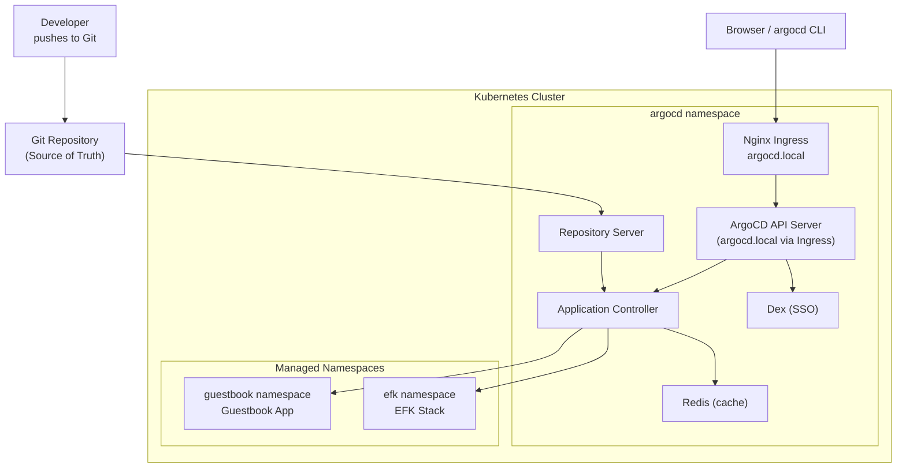
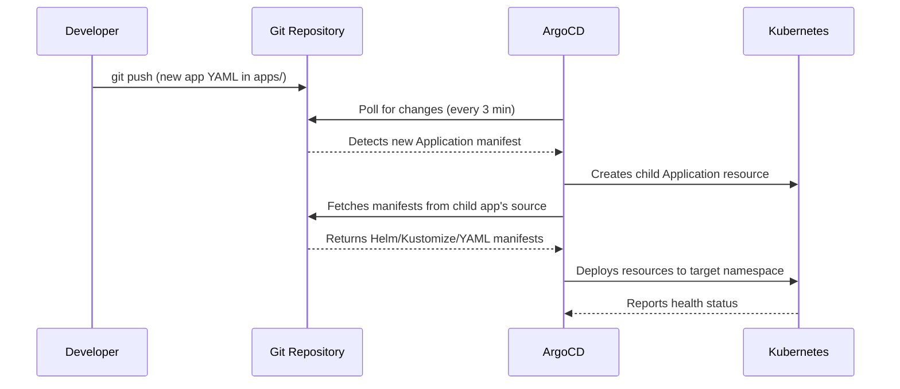
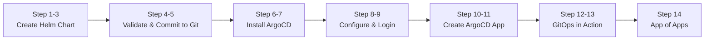

---

# ArgoCD

- `ArgoCD` is a declarative, GitOps continuous delivery tool for Kubernetes.
- It follows the **GitOps** pattern where a Git repository is the single source of truth for the desired application state.
- `ArgoCD` automates the deployment and reconciliation of applications against one or more Kubernetes clusters.

---

## What will we learn?

- What `ArgoCD` is and why it is useful for GitOps
- How to install and configure `ArgoCD` on Kubernetes using Helm
- `ArgoCD` core concepts: Applications, Projects, Sync, and Health
- How to expose ArgoCD via a Nginx Ingress
- How to deploy applications from Git repositories
- Application health and sync status monitoring
- Rollback and sync strategies
- The **App of Apps** pattern to manage multiple applications declaratively
- How to deploy the EFK stack (Lab 29) via ArgoCD

---

## Official Documentation & References

| Resource                           | Link                                                                                                                                    |
| ---------------------------------- | --------------------------------------------------------------------------------------------------------------------------------------- |
| ArgoCD Official Documentation      | [argo-cd.readthedocs.io](https://argo-cd.readthedocs.io/)                                                                               |
| ArgoCD CLI Reference               | [argo-cd.readthedocs.io/cli](https://argo-cd.readthedocs.io/en/stable/user-guide/commands/argocd/)                                      |
| ArgoCD Helm Chart (Argo Helm Repo) | [artifacthub.io](https://artifacthub.io/packages/helm/argo/argo-cd)                                                                    |
| App of Apps Pattern                | [argo-cd.readthedocs.io/bootstrapping](https://argo-cd.readthedocs.io/en/stable/operator-manual/cluster-bootstrapping/)                 |
| Sync Waves & Phases                | [argo-cd.readthedocs.io/sync-waves](https://argo-cd.readthedocs.io/en/stable/user-guide/sync-waves/)                                    |
| ApplicationSet Controller          | [argo-cd.readthedocs.io/applicationset](https://argo-cd.readthedocs.io/en/stable/user-guide/application-set/)                           |
| GitOps Principles                  | [gitops.tech](https://www.gitops.tech/)                                                                                                 |
| ArgoCD GitHub Repository           | [github.com/argoproj/argo-cd](https://github.com/argoproj/argo-cd)                                                                     |

---

### What is ArgoCD?

- `ArgoCD` is a **pull-based** GitOps operator: it watches Git and continuously reconciles the cluster state to match what is defined in Git.
- It consists of a **control plane** (running in the cluster) and optionally a **CLI** for interacting with it.
- Unlike push-based CI/CD (Jenkins, GitHub Actions), no pipeline ever needs direct `kubectl` access to the cluster.

### Terminology

| Term             | Description                                                                                     |
| ---------------- | ----------------------------------------------------------------------------------------------- |
| **Application**  | An ArgoCD resource linking a Git path to a target Kubernetes cluster+namespace                  |
| **Project**      | A logical grouping of applications; controls permitted repos/clusters/namespaces                |
| **Sync**         | The process of applying Git state to the live cluster                                           |
| **Sync Status**  | `Synced` - live matches Git; `OutOfSync` - live differs from Git                               |
| **Health Status**| `Healthy`, `Progressing`, `Degraded`, `Suspended`, or `Missing`                                |
| **App of Apps**  | A pattern where one ArgoCD Application manages a directory of child Application manifests       |

### ArgoCD Components

| Component                  | Description                                                             |
|----------------------------|-------------------------------------------------------------------------|
| **API Server**             | Exposes REST/gRPC API consumed by Web UI, CLI, and CI/CD systems        |
| **Repository Server**      | Local cache of Git repositories; renders Helm, Kustomize, plain YAML    |
| **Application Controller** | Monitors live cluster state and compares against desired state from Git |
| **Dex**                    | Identity service for integrating with external SSO providers            |
| **Redis**                  | Caching layer; short-lived state between components                     |

### Common ArgoCD CLI Commands

Below are the most common `argocd` CLI commands. Each command includes syntax, description, and detailed usage examples.


??? example "`argocd login` - Authenticate to ArgoCD server"

      **Syntax:** `argocd login <server>`

      **Description:** Authenticates to an ArgoCD server and creates a local session used for subsequent CLI commands.

      - Supports insecure mode (no TLS verification) for local/dev environments
      - Can use username/password or SSO token
      - Session is stored in `~/.config/argocd/config`

          ```bash
          # Login via Ingress
          argocd login argocd.local --insecure

          # Login via port-forward
          argocd login localhost:8080 --insecure

          # Login with explicit credentials
          argocd login argocd.local \
              --username admin \
              --password <password> \
              --insecure

          # Login to a remote secured server
          argocd login argocd.example.com --grpc-web

          # Change the admin password after login
          argocd account update-password

          # Show current login/user info
          argocd account get-user-info
          ```

??? example "`argocd app create` - Create a new application"

      **Syntax:** `argocd app create <name>`

      **Description:** Creates a new ArgoCD Application resource that links a Git repository path to a target Kubernetes cluster and namespace.

      - Links a Git source to a Kubernetes destination
      - Supports Helm charts, Kustomize, and plain YAML
      - Can enable automated sync policies at creation time

          ```bash
          # Create from a plain YAML path in Git
          argocd app create guestbook \
            --repo https://github.com/argoproj/argocd-example-apps.git \
            --path guestbook \
            --dest-server https://kubernetes.default.svc \
            --dest-namespace guestbook

          # Create with automated sync, self-heal and auto-prune
          argocd app create guestbook \
            --repo https://github.com/argoproj/argocd-example-apps.git \
            --path guestbook \
            --dest-server https://kubernetes.default.svc \
            --dest-namespace guestbook \
            --sync-policy automated \
            --auto-prune \
            --self-heal

          # Create from a Helm chart in a Git repo
          argocd app create my-helm-app \
            --repo https://github.com/my-org/my-charts.git \
            --path charts/my-app \
            --dest-server https://kubernetes.default.svc \
            --dest-namespace my-app \
            --helm-set replicaCount=2

          # Create from an OCI/Helm chart registry
          argocd app create nginx-helm \
            --repo https://charts.bitnami.com/bitnami \
            --helm-chart nginx \
            --revision 15.1.0 \
            --dest-server https://kubernetes.default.svc \
            --dest-namespace default

          # Create and auto-create the namespace
          argocd app create my-app \
            --repo https://github.com/my-org/my-repo.git \
            --path manifests \
            --dest-server https://kubernetes.default.svc \
            --dest-namespace production \
            --sync-option CreateNamespace=true
          ```

??? example "`argocd app list` - List all applications"

      **Syntax:** `argocd app list`

      **Description:** Lists all ArgoCD applications and their current sync and health status.

      - Shows application name, cluster, namespace, sync status, and health
      - Supports filtering by project, sync status, and health status
      - Useful for a quick overview of all managed applications

          ```bash
          # List all applications
          argocd app list

          # List applications in a specific project
          argocd app list -p my-project

          # Filter by sync status
          argocd app list --sync-status OutOfSync

          # Filter by health status
          argocd app list --health-status Degraded

          # Output as JSON
          argocd app list -o json

          # Output as YAML
          argocd app list -o yaml

          # Show only app names
          argocd app list -o name

          # Wide output with extra columns
          argocd app list -o wide
          ```

??? example "`argocd app get` - Get details of an application"

      **Syntax:** `argocd app get <name>`

      **Description:** Shows detailed information about a specific ArgoCD application including sync status, health, and the managed resource tree.

      - Displays sync and health status
      - Shows all Kubernetes resources managed by the application
      - Use `--refresh` to force-fetch the latest state from Git

          ```bash
          # Get application details
          argocd app get guestbook

          # Force refresh from Git before displaying
          argocd app get guestbook --refresh

          # Show resource tree
          argocd app get guestbook --output tree

          # Output as JSON
          argocd app get guestbook -o json

          # Output as YAML
          argocd app get guestbook -o yaml

          # Watch live status updates
          watch argocd app get guestbook
          ```

??? example "`argocd app sync` - Sync (deploy) an application"

      **Syntax:** `argocd app sync <name>`

      **Description:** Triggers a sync operation that applies the desired Git state to the live cluster.

      - Applies the desired state from Git to the cluster
      - Supports dry-run mode to preview changes without applying them
      - Can force sync to replace resources or selectively sync specific resources

          ```bash
          # Sync an application
          argocd app sync guestbook

          # Sync and wait for completion
          argocd app sync guestbook --timeout 120

          # Dry-run - preview changes without applying
          argocd app sync guestbook --dry-run

          # Force sync (replace resources even if spec is unchanged)
          argocd app sync guestbook --force

          # Sync a specific resource only
          argocd app sync guestbook \
            --resource apps:Deployment:guestbook-ui

          # Sync with prune (delete resources removed from Git)
          argocd app sync guestbook --prune

          # Sync multiple applications at once
          argocd app sync guestbook efk-stack app-of-apps
          ```

??? example "`argocd app diff` - Show diff between Git and live state"

      **Syntax:** `argocd app diff <name>`

      **Description:** Shows the difference between the desired state in Git and the live state in the cluster. Useful for diagnosing configuration drift.

      - Outputs a unified diff of desired vs live state
      - Helps diagnose `OutOfSync` applications before syncing
      - Can compare against a specific Git revision

          ```bash
          # Show diff for an application
          argocd app diff guestbook

          # Show diff and compare against a specific revision
          argocd app diff guestbook --revision HEAD~1

          # Show diff for a specific resource type
          argocd app diff guestbook \
            --resource apps:Deployment:guestbook-ui

          # Use in CI - exit non-zero if drift detected
          argocd app diff guestbook; echo "Exit code: $?"
          ```

??? example "`argocd app set` - Update application settings"

      **Syntax:** `argocd app set <name> [flags]`

      **Description:** Updates the configuration of an existing ArgoCD application without deleting and recreating it.

      - Modify source repository, path, revision, destination, or sync policy
      - Enable or disable auto-sync, self-heal, and auto-prune
      - Override Helm values or add/remove sync options

          ```bash
          # Enable automated sync
          argocd app set guestbook --sync-policy automated

          # Enable self-heal and auto-prune
          argocd app set guestbook --self-heal --auto-prune

          # Disable automated sync (switch to manual)
          argocd app set guestbook --sync-policy none

          # Change the target revision (branch, tag, or commit SHA)
          argocd app set guestbook --revision v1.2.0

          # Override a Helm value
          argocd app set my-helm-app --helm-set replicaCount=3

          # Add a sync option
          argocd app set guestbook --sync-option CreateNamespace=true

          # Change the target namespace
          argocd app set guestbook --dest-namespace new-namespace
          ```

??? example "`argocd app history` - Show deployment history"

      **Syntax:** `argocd app history <name>`

      **Description:** Prints the deployment history for an application, listing every revision that has been deployed to the cluster.

      - Shows revision ID, timestamp, Git commit SHA, and deploy status
      - Use revision IDs from history to target a specific rollback
      - History is maintained by ArgoCD in its internal state store

          ```bash
          # Show full deployment history
          argocd app history guestbook

          # Output as JSON for scripting
          argocd app history guestbook -o json

          # Pretty-print with jq
          argocd app history guestbook -o json | \
            jq '.[] | {id: .id, date: .deployedAt, revision: .revision}'
          ```

??? example "`argocd app rollback` - Rollback to a previous revision"

      **Syntax:** `argocd app rollback <name> <revision-id>`

      **Description:** Rolls back an application to a previously deployed revision. The revision ID is obtained from `argocd app history`.

      - Reverts the live cluster to a previously deployed state
      - Disables automated sync on the app to prevent re-syncing forward
      - The rollback operation is recorded as a new entry in history

          ```bash
          # Check history to find the target revision ID
          argocd app history guestbook

          # Rollback to a specific revision
          argocd app rollback guestbook 3

          # Rollback and wait for completion
          argocd app rollback guestbook 3 --timeout 120

          # Re-enable auto-sync after rollback
          argocd app set guestbook --sync-policy automated

          # Verify the rollback succeeded
          argocd app get guestbook
          kubectl get all -n guestbook
          ```

??? example "`argocd app delete` - Delete an application"

      **Syntax:** `argocd app delete <name>`

      **Description:** Deletes an ArgoCD application. By default performs a cascade delete, removing all managed Kubernetes resources along with the Application resource.

      - Cascade delete removes all Kubernetes resources managed by the app
      - Non-cascade delete removes only the ArgoCD Application resource itself
      - Use `--yes` to skip the confirmation prompt in scripts

          ```bash
          # Delete an application (cascade - removes all K8s resources)
          argocd app delete guestbook

          # Delete without removing Kubernetes resources (non-cascade)
          argocd app delete guestbook --cascade=false

          # Skip confirmation prompt (useful in scripts)
          argocd app delete guestbook --yes

          # Delete multiple applications
          argocd app delete guestbook efk-stack --yes
          ```

??? example "`argocd repo` - Manage repositories"

      **Syntax:** `argocd repo add <url>` / `argocd repo list`

      **Description:** Manages Git and Helm chart repositories connected to ArgoCD. ArgoCD must have access to a repository before it can deploy from it.

      - Add public or private repositories
      - Supports HTTPS tokens, SSH keys, and TLS certificates for authentication
      - List and remove existing repository connections

          ```bash
          # List all connected repositories
          argocd repo list

          # Add a public HTTPS repository
          argocd repo add https://github.com/argoproj/argocd-example-apps.git

          # Add a private repository with an HTTPS token
          argocd repo add https://github.com/my-org/private-repo.git \
            --username git \
            --password <token>

          # Add a repository using an SSH key
          argocd repo add git@github.com:my-org/private-repo.git \
            --ssh-private-key-path ~/.ssh/id_rsa

          # Add a Helm chart repository
          argocd repo add https://charts.bitnami.com/bitnami \
            --type helm \
            --name bitnami

          # Remove a repository
          argocd repo rm https://github.com/my-org/private-repo.git
          ```

??? example "`argocd context` - Manage server contexts"

      **Syntax:** `argocd context [context-name]`

      **Description:** Manages multiple ArgoCD server connections (contexts), similar to `kubectl config use-context`. Useful when managing applications across multiple clusters or environments.

      - Switch between multiple ArgoCD server connections
      - Contexts are stored in `~/.config/argocd/config`
      - Each context holds a server address and authentication token

          ```bash
          # List all saved contexts
          argocd context

          # Switch to a different context
          argocd context my-prod-server

          # Show the currently active context
          argocd context --current

          # Delete a context
          argocd context --delete my-old-server
          ```

---

## Architecture



---

## App of Apps Pattern


---

## Directory Structure

```
18-ArgoCD/
├── README.md                 # This file
├── demo.sh                   # Full automated demo script
├── ArgoCD.sh                 # Legacy install script (manual)
├── install-argocd.sh         # Install ArgoCD via kustomize (legacy)
├── install.sh                # Print admin password
├── run-demo.sh               # Run guestbook demo (legacy)
│
├── manifests/
│   └── argocd-ingress.yaml   # Nginx Ingress for ArgoCD UI
│
├── apps/                     # App of Apps - all YAML files here are managed
│   ├── app-of-apps.yaml      # Root application - points to this apps/ folder
│   ├── guestbook.yaml        # Guestbook demo application
│   └── efk-stack.yaml        # EFK stack App of Apps (points to Lab 29)
│
├── guestbook-app.yaml        # Standalone guestbook application manifest
├── kustomization.yaml        # Kustomize patch for argocd-server --insecure
└── patch-replace.yaml        # Kustomize strategic merge patch
```

---

## Prerequisites

- Kubernetes cluster (v1.24+)
- `kubectl` configured to access your cluster
- `Helm 3.x` installed
- Nginx Ingress Controller installed on the cluster
- (Optional) `argocd` CLI

```bash
# Install kubectl (macOS)
brew install kubectl

# Install Helm
brew install helm

# Install argocd CLI (optional)
brew install argocd

# Install Nginx Ingress Controller (if not present)
helm repo add ingress-nginx https://kubernetes.github.io/ingress-nginx
helm upgrade --install ingress-nginx ingress-nginx/ingress-nginx \
    --namespace ingress-nginx --create-namespace
```

---

# Lab

## Part 01 - Full Automated Demo

The `demo.sh` script handles the complete lifecycle in one command: ArgoCD installation via Helm, Ingress setup, Guestbook deployment, and App of Apps deployment.

### 01. Run the Demo

```bash
chmod +x demo.sh
./demo.sh deploy
```

The script will:

- Install ArgoCD via Helm (`argo/argo-cd` chart) with `--insecure` mode
- Apply the Nginx Ingress pointing `argocd.local` to the ArgoCD server
- Print admin credentials
- Deploy the Guestbook demo application and wait for it to sync
- Deploy the App of Apps, which triggers the EFK stack deployment from Lab 29

### 02. Other Commands

```bash
# Show current status of all applications
./demo.sh status

# Print admin username and password
./demo.sh credentials

# Remove all ArgoCD resources and managed apps
./demo.sh cleanup
```

---

## Part 02 - Manual ArgoCD Installation

### 01. Install ArgoCD via Helm

```bash
# Add Argo Helm repository
helm repo add argo https://argoproj.github.io/argo-helm
helm repo update argo

# Install ArgoCD (insecure mode - TLS handled by Ingress)
helm upgrade --install argocd argo/argo-cd \
    --namespace argocd \
    --create-namespace \
    --set server.insecure=true \
    --wait
```

### 02. Verify Installation

```bash
kubectl get pods -n argocd
```

Expected output (all pods Running):

```
NAME                                                READY   STATUS
argocd-application-controller-0                    1/1     Running
argocd-dex-server-xxxx                             1/1     Running
argocd-redis-xxxx                                  1/1     Running
argocd-repo-server-xxxx                            1/1     Running
argocd-server-xxxx                                 1/1     Running
```

### 03. Get Admin Password

```bash
kubectl -n argocd get secret argocd-initial-admin-secret \
    -o jsonpath="{.data.password}" | base64 -d; echo
```

!!! note
    Save this password — you'll need it to log in to the ArgoCD UI and CLI.

---

## Part 03 - Expose ArgoCD via Ingress

An Nginx Ingress allows you to access the ArgoCD UI at `http://argocd.local` instead of requiring port-forwarding.

!!! warning "Prerequisite"
    Nginx Ingress Controller must be installed in the cluster.

### 01. Apply the Ingress

```bash
kubectl apply -f manifests/argocd-ingress.yaml
```

The Ingress forwards HTTP traffic to the ArgoCD server which runs in `--insecure` mode (no TLS at the pod level):

```yaml
# manifests/argocd-ingress.yaml (summary)
metadata:
  annotations:
    nginx.ingress.kubernetes.io/backend-protocol: "HTTP"
spec:
  ingressClassName: nginx
  rules:
    - host: argocd.local
      http:
        paths:
          - path: /
            pathType: Prefix
            backend:
              service:
                name: argocd-server
                port:
                  number: 80
```

### 02. Add to /etc/hosts

```bash
# Get the node IP
INGRESS_IP=$(kubectl get nodes \
    -o jsonpath='{.items[0].status.addresses[?(@.type=="InternalIP")].address}')

# Add entry
echo "${INGRESS_IP}  argocd.local" | sudo tee -a /etc/hosts

# Open the UI
open http://argocd.local
```

### 03. Port-Forward Fallback

If Ingress is not available:

```bash
kubectl port-forward svc/argocd-server -n argocd 8080:80 &
open http://localhost:8080
```

---

## Part 04 - ArgoCD CLI

### 01. Install the CLI

```bash
# macOS
brew install argocd

# Linux
curl -sSL -o argocd-linux-amd64 \
    https://github.com/argoproj/argo-cd/releases/latest/download/argocd-linux-amd64
sudo install -m 555 argocd-linux-amd64 /usr/local/bin/argocd
```

### 02. Login

```bash
# Via Ingress
argocd login argocd.local --insecure

# Via port-forward
argocd login localhost:8080 --insecure

# Change admin password (recommended)
argocd account update-password
```

---

## Part 05 - Deploying the Guestbook Application

### 01. Create via Manifest

```bash
kubectl apply -f apps/guestbook.yaml
```

### 02. Create via CLI

```bash
argocd app create guestbook \
  --repo https://github.com/argoproj/argocd-example-apps.git \
  --path guestbook \
  --dest-server https://kubernetes.default.svc \
  --dest-namespace guestbook \
  --sync-policy automated \
  --auto-prune \
  --self-heal
```

### 03. Monitor Sync

```bash
# Via CLI
argocd app get guestbook

# Via kubectl
kubectl get application guestbook -n argocd -w
```

### 04. Access the Guestbook

```bash
kubectl port-forward svc/guestbook-ui -n guestbook 8081:80 &
open http://localhost:8081
```

---

## Part 06 - App of Apps Pattern

The **App of Apps** pattern uses a single root ArgoCD Application as a controller that watches a Git directory for Application manifests. Adding an app is as simple as committing a new YAML file.

### GitOps Flow



### 01. Deploy the App of Apps

```bash
kubectl apply -f apps/app-of-apps.yaml
```

ArgoCD will:

1. Detect the `apps/` directory in the repo
2. Create a child Application for each `.yaml` file found there
3. Each child Application then deploys its own resources

### 02. Verify All Applications

```bash
argocd app list
```

Expected output:

```
NAME               CLUSTER     NAMESPACE  STATUS  HEALTH   SYNCPOLICY
app-of-apps        in-cluster  argocd     Synced  Healthy  Auto-Prune
efk-stack          in-cluster  argocd     Synced  Healthy  Auto-Prune
efk-elasticsearch  in-cluster  efk        Synced  Healthy  Auto-Prune
efk-filebeat       in-cluster  efk        Synced  Healthy  Auto-Prune
efk-kibana         in-cluster  efk        Synced  Healthy  Auto-Prune
efk-log-generator  in-cluster  efk        Synced  Healthy  Auto-Prune
efk-log-processor  in-cluster  efk        Synced  Healthy  Auto-Prune
guestbook          in-cluster  guestbook  Synced  Healthy  Auto-Prune
```

### 03. Add a New Application

To add a new application, commit a new manifest to `apps/`:

```bash
cat > apps/my-new-app.yaml << 'EOF'
apiVersion: argoproj.io/v1alpha1
kind: Application
metadata:
  name: my-new-app
  namespace: argocd
  finalizers:
    - resources-finalizer.argocd.argoproj.io
spec:
  project: default
  source:
    repoURL: https://github.com/my-org/my-repo.git
    targetRevision: HEAD
    path: manifests
  destination:
    server: https://kubernetes.default.svc
    namespace: my-app
  syncPolicy:
    automated:
      prune: true
      selfHeal: true
    syncOptions:
      - CreateNamespace=true
EOF

git add apps/my-new-app.yaml
git commit -m "feat: add my-new-app to App of Apps"
git push
# ArgoCD automatically detects and deploys the new application
```

---

## Part 07 - Auto-Sync and Self-Healing

### Enable Auto-Sync

```bash
argocd app set guestbook \
  --sync-policy automated \
  --self-heal \
  --auto-prune
```

### Test Self-Healing

```bash
# Manually break the desired state
kubectl scale deployment guestbook-ui --replicas=5 -n guestbook

# ArgoCD detects the drift and restores the desired replica count from Git
watch argocd app get guestbook
```

---

## Part 08 - Rollback

```bash
# View deployment history
argocd app history guestbook

# Rollback to a specific revision
argocd app rollback guestbook <revision-id>

# Verify the rollback
argocd app get guestbook
kubectl get all -n guestbook
```

---

## Part 09 - Sync Waves (Deployment Ordering)

Sync waves control the order in which resources are applied during a sync. Resources in wave `N` are applied only after all resources in wave `N-1` are healthy. The EFK App of Apps uses waves to ensure Elasticsearch is ready before Filebeat and Kibana start.

```yaml
# wave 0: Elasticsearch (must be ready first)
metadata:
  annotations:
    argocd.argoproj.io/sync-wave: "0"

# wave 1: Filebeat and Kibana (require Elasticsearch)
metadata:
  annotations:
    argocd.argoproj.io/sync-wave: "1"

# wave 2: Log Generator and Processor (require everything else)
metadata:
  annotations:
    argocd.argoproj.io/sync-wave: "2"
```

---

## Part 10 - Working with Helm Charts

```bash
# Deploy a Helm chart from a registry
argocd app create nginx-helm \
  --repo https://charts.bitnami.com/bitnami \
  --helm-chart nginx \
  --revision 15.1.0 \
  --dest-server https://kubernetes.default.svc \
  --dest-namespace default \
  --helm-set service.type=NodePort \
  --helm-set replicaCount=3

argocd app sync nginx-helm
```

---

## Part 11 - Troubleshooting

### ArgoCD Server Not Accessible

```bash
# Check ArgoCD pods
kubectl get pods -n argocd -l app.kubernetes.io/name=argocd-server

# Check Ingress
kubectl get ingress -n argocd
kubectl describe ingress argocd-server-ingress -n argocd
```

### Application Stuck in Progressing

```bash
argocd app get <app-name>
kubectl describe application <app-name> -n argocd
kubectl logs -n argocd -l app.kubernetes.io/name=argocd-application-controller --tail=50
```

### Out of Sync / Repository Error

```bash
# Show the diff
argocd app diff <app-name>

# Force refresh from Git
argocd app get <app-name> --refresh

# Force sync
argocd app sync <app-name> --force
```

### App of Apps Not Creating Child Apps

```bash
# Check root app is synced
argocd app get app-of-apps

# Check ArgoCD can reach the repo
argocd repo list

# Check the apps/ directory exists in the configured path
argocd app manifests app-of-apps
```

---

## Cleanup

```bash
# Full cleanup via demo.sh
./demo.sh cleanup

# Or manually
kubectl delete applications --all -n argocd
helm uninstall argocd --namespace argocd
kubectl delete namespace argocd guestbook efk
```

---

## Part 12 - End-to-End: From Helm Chart to GitOps with ArgoCD

This part walks through the **complete lifecycle** in baby steps - starting from zero, building a Helm chart from scratch, installing ArgoCD, and then managing the chart purely through GitOps.
By the end you will have a working ArgoCD setup where every `git push` automatically deploys your Helm chart.



---

### Step 01 - Install Prerequisites

Install the required tools before starting.

=== "macOS"

    ```bash
    brew install helm kubectl argocd
    ```

=== "Linux"

    ```bash
    # Helm
    curl https://raw.githubusercontent.com/helm/helm/main/scripts/get-helm-3 | bash

    # ArgoCD CLI
    curl -sSL -o argocd-linux-amd64 \
        https://github.com/argoproj/argo-cd/releases/latest/download/argocd-linux-amd64
    sudo install -m 555 argocd-linux-amd64 /usr/local/bin/argocd
    rm argocd-linux-amd64
    ```

#### Verify tools are ready

```bash
kubectl version --client --short
helm version --short
argocd version --client --short
```

Expected output (versions may differ):

```
Client Version: v1.28.x
Helm: v3.x.x
argocd: v2.x.x
```

---

### Step 02 - Create a Helm Chart from Scratch

We will build the `my-webserver` chart — a simple nginx-based web server.

#### 02.01 Scaffold the chart

```bash
# Create a fresh chart skeleton
helm create my-webserver

# Inspect the generated structure
find my-webserver -type f | sort
```

You will see:

```
my-webserver/
├── Chart.yaml           # Chart metadata (name, version, appVersion)
├── values.yaml          # Default configuration values
├── charts/              # Subchart dependencies (empty for now)
└── templates/
    ├── _helpers.tpl     # Reusable named templates
    ├── deployment.yaml  # Deployment resource template
    ├── hpa.yaml         # HorizontalPodAutoscaler (optional)
    ├── ingress.yaml     # Ingress resource (optional)
    ├── NOTES.txt        # Post-install message shown to user
    ├── service.yaml     # Service resource template
    ├── serviceaccount.yaml
    └── tests/
        └── test-connection.yaml
```

#### 02.02 Clean up the scaffold (keep only what we need)

```bash
# Remove files we will not use in this demo
rm my-webserver/templates/hpa.yaml
rm my-webserver/templates/serviceaccount.yaml
rm my-webserver/templates/ingress.yaml
```

#### 02.03 Rewrite `Chart.yaml`

Replace the contents of `my-webserver/Chart.yaml` with:

```yaml
apiVersion: v2
name: my-webserver
description: A simple nginx web server - Helm + ArgoCD demo
type: application
version: 1.0.0
appVersion: "1.25.3"
```

!!! note "version vs appVersion"
    - `version` is the **chart** version — bump it every time you release a new chart.
    - `appVersion` is the version of the **application** (nginx image tag) shipped inside the chart.

#### 02.04 Rewrite `values.yaml`

Replace the contents of `my-webserver/values.yaml` with a minimal, well-documented set of values:

```yaml
# Number of nginx pods to run
replicaCount: 1

image:
  repository: nginx
  tag: "1.25.3"
  pullPolicy: IfNotPresent

# The HTML content served by nginx
greeting: "Hello from my Helm chart + ArgoCD!"

service:
  type: ClusterIP
  port: 80

# Resource limits/requests
resources:
  requests:
    cpu: "50m"
    memory: "64Mi"
  limits:
    cpu: "200m"
    memory: "128Mi"
```

#### 02.05 Rewrite the Deployment template

Replace the contents of `my-webserver/templates/deployment.yaml`:

```yaml
apiVersion: apps/v1
kind: Deployment
metadata:
  name: {{ include "my-webserver.fullname" . }}
  namespace: {{ .Release.Namespace }}
  labels:
    {{- include "my-webserver.labels" . | nindent 4 }}
spec:
  replicas: {{ .Values.replicaCount }}
  selector:
    matchLabels:
      {{- include "my-webserver.selectorLabels" . | nindent 6 }}
  template:
    metadata:
      labels:
        {{- include "my-webserver.selectorLabels" . | nindent 8 }}
    spec:
      containers:
        - name: nginx
          image: "{{ .Values.image.repository }}:{{ .Values.image.tag }}"
          imagePullPolicy: {{ .Values.image.pullPolicy }}
          ports:
            - containerPort: 80
          # Inject a simple HTML index from the ConfigMap
          volumeMounts:
            - name: html
              mountPath: /usr/share/nginx/html
          resources:
            {{- toYaml .Values.resources | nindent 12 }}
      volumes:
        - name: html
          configMap:
            name: {{ include "my-webserver.fullname" . }}-html
```

#### 02.06 Add a ConfigMap template

Create `my-webserver/templates/configmap.yaml`:

```yaml
apiVersion: v1
kind: ConfigMap
metadata:
  name: {{ include "my-webserver.fullname" . }}-html
  namespace: {{ .Release.Namespace }}
  labels:
    {{- include "my-webserver.labels" . | nindent 4 }}
data:
  index.html: |
    <!DOCTYPE html>
    <html>
    <head><title>{{ .Values.greeting }}</title></head>
    <body>
      <h1>{{ .Values.greeting }}</h1>
      <p>Release: <strong>{{ .Release.Name }}</strong> &nbsp;|&nbsp;
         Revision: <strong>{{ .Release.Revision }}</strong> &nbsp;|&nbsp;
         Namespace: <strong>{{ .Release.Namespace }}</strong></p>
    </body>
    </html>
```

#### 02.07 Update NOTES.txt

Replace `my-webserver/templates/NOTES.txt`:

```
🎉 {{ .Chart.Name }} v{{ .Chart.Version }} installed as release "{{ .Release.Name }}"

Quick access:
  kubectl port-forward svc/{{ include "my-webserver.fullname" . }} 8080:80 -n {{ .Release.Namespace }}
  Open http://localhost:8080 in your browser

To check pod status:
  kubectl get pods -n {{ .Release.Namespace }} -l app.kubernetes.io/instance={{ .Release.Name }}
```

---

### Step 03 - Validate the Chart

Always validate a chart before committing or installing it.

#### 03.01 Lint

```bash
helm lint my-webserver
```

Expected: `1 chart(s) linted, 0 chart(s) failed`

#### 03.02 Render templates locally (dry-run without a cluster)

```bash
# Render to stdout and inspect what will be applied
helm template my-release my-webserver --namespace my-ns

# Render to a file for closer inspection
helm template my-release my-webserver \
    --namespace my-ns \
    --output-dir /tmp/rendered-my-webserver

ls /tmp/rendered-my-webserver/my-webserver/templates/
```

#### 03.03 Test override values locally

```bash
# Preview with 3 replicas and a custom greeting
helm template my-release my-webserver \
    --set replicaCount=3 \
    --set greeting="GitOps is awesome!"
```

Look for `replicas: 3` and your custom greeting in the output.

---

### Step 04 - Install the Chart Locally (Optional Smoke Test)

Before hooking things up to ArgoCD, confirm the chart deploys correctly.

```bash
# Install into a dedicated namespace
helm upgrade --install my-webserver my-webserver \
    --namespace my-webserver \
    --create-namespace \
    --wait

# Verify pods are running
kubectl get all -n my-webserver

# Quick curl test via port-forward
kubectl port-forward svc/my-webserver 8080:80 -n my-webserver &
sleep 2
curl -s http://localhost:8080 | grep 'Hello'

# Stop the port-forward
kill %1
```

If the page shows your greeting, the chart is working. Uninstall before handing over to ArgoCD:

```bash
helm uninstall my-webserver --namespace my-webserver
kubectl delete namespace my-webserver
```

---

### Step 05 - Commit the Chart to Git

ArgoCD is a **pull-based** GitOps tool — it watches a Git repository and deploys whatever is there.
Your chart must live in a Git repository that ArgoCD can reach.

#### 05.01 Recommended directory layout inside the repo

```
my-repo/
├── charts/
│   └── my-webserver/       ← the Helm chart we just created
│       ├── Chart.yaml
│       ├── values.yaml
│       └── templates/
└── argocd/
    └── my-webserver-app.yaml  ← ArgoCD Application manifest (added in Step 10)
```

#### 05.02 Commit and push

```bash
# From the root of your Git repository
mkdir -p charts
cp -r my-webserver charts/

git add charts/my-webserver/
git commit -m "feat: add my-webserver Helm chart v1.0.0"
git push
```

!!! tip "Using this KubernetesLabs repo"
    If you are working inside the `KubernetesLabs` repository, place your chart under `Labs/18-ArgoCD/charts/my-webserver/` so it is already reachable via `https://github.com/nirgeier/KubernetesLabs`.

---

### Step 06 - Install ArgoCD via Helm

Now we install ArgoCD itself into the cluster.

#### 06.01 Add the Argo Helm repository

```bash
helm repo add argo https://argoproj.github.io/argo-helm
helm repo update argo

# Confirm the chart is available
helm search repo argo/argo-cd
```

#### 06.02 Install ArgoCD

```bash
helm upgrade --install argocd argo/argo-cd \
    --namespace argocd \
    --create-namespace \
    --set server.insecure=true \
    --wait
```

!!! info "`--set server.insecure=true`"
    This disables TLS at the ArgoCD server pod so that a plain HTTP Ingress works without certificate configuration. In production you should terminate TLS at the Ingress instead.

#### 06.03 Verify all pods are Running

```bash
kubectl get pods -n argocd
```

Expected (all `1/1 Running`):

```
NAME                                                READY   STATUS
argocd-application-controller-0                    1/1     Running
argocd-applicationset-controller-xxxx              1/1     Running
argocd-dex-server-xxxx                             1/1     Running
argocd-notifications-controller-xxxx               1/1     Running
argocd-redis-xxxx                                  1/1     Running
argocd-repo-server-xxxx                            1/1     Running
argocd-server-xxxx                                 1/1     Running
```

---

### Step 07 - Expose the ArgoCD UI

Choose **one** of the methods below depending on your environment.

#### Option A — Port-Forward (simplest, no Ingress needed)

```bash
kubectl port-forward svc/argocd-server -n argocd 8080:80 &
echo "ArgoCD UI → http://localhost:8080"
```

#### Option B — Nginx Ingress (persistent URL)

!!! warning "Requires Nginx Ingress Controller"
    Install it first if not present:
    ```bash
    helm repo add ingress-nginx https://kubernetes.github.io/ingress-nginx
    helm upgrade --install ingress-nginx ingress-nginx/ingress-nginx \
        --namespace ingress-nginx --create-namespace
    ```

Apply the Ingress manifest already in this lab:

```bash
kubectl apply -f manifests/argocd-ingress.yaml
```

Add the cluster IP to `/etc/hosts`:

```bash
INGRESS_IP=$(kubectl get nodes \
    -o jsonpath='{.items[0].status.addresses[?(@.type=="InternalIP")].address}')

echo "${INGRESS_IP}  argocd.local" | sudo tee -a /etc/hosts

echo "ArgoCD UI → http://argocd.local"
```

---

### Step 08 - Retrieve the Admin Password

ArgoCD generates a random admin password on first install. Retrieve it with:

```bash
# Decode and print on a single line
kubectl -n argocd get secret argocd-initial-admin-secret \
    -o jsonpath="{.data.password}" | base64 -d; echo
```

!!! warning "Save this password"
    Store it somewhere safe before proceeding. You will use it to log in to the Web UI and the CLI.

---

### Step 09 - Log in to ArgoCD

#### 09.01 Web UI

Open the URL from Step 07 in your browser.
Username: `admin`
Password: *(the password from Step 08)*

#### 09.02 ArgoCD CLI

```bash
# Via port-forward (Option A)
argocd login localhost:8080 \
    --username admin \
    --password "$(kubectl -n argocd get secret argocd-initial-admin-secret \
        -o jsonpath='{.data.password}' | base64 -d)" \
    --insecure

# Via Ingress (Option B)
argocd login argocd.local \
    --username admin \
    --password "$(kubectl -n argocd get secret argocd-initial-admin-secret \
        -o jsonpath='{.data.password}' | base64 -d)" \
    --insecure
```

#### 09.03 (Recommended) Change the admin password

```bash
argocd account update-password
```

#### 09.04 Verify login

```bash
argocd account get-user-info
# Should show: Logged In: true
```

---

### Step 10 - Create an ArgoCD Application for the Helm Chart

There are three equivalent ways to create an ArgoCD Application.
We will cover all three so you understand what each does.

#### Method A — ArgoCD CLI

```bash
argocd app create my-webserver \
    --repo https://github.com/nirgeier/KubernetesLabs.git \
    --path Labs/18-ArgoCD/charts/my-webserver \
    --dest-server https://kubernetes.default.svc \
    --dest-namespace my-webserver \
    --helm-set replicaCount=2 \
    --sync-policy automated \
    --auto-prune \
    --self-heal \
    --sync-option CreateNamespace=true
```

| Flag | What it does |
|------|--------------|
| `--repo` | Git repository URL |
| `--path` | Path inside the repo where the chart lives |
| `--dest-namespace` | The Kubernetes namespace to deploy into |
| `--helm-set` | Override a chart value (same as `--set` in `helm install`) |
| `--sync-policy automated` | ArgoCD will automatically apply every Git change |
| `--auto-prune` | Delete resources removed from Git |
| `--self-heal` | Restore any manual cluster changes back to Git state |
| `--sync-option CreateNamespace=true` | Create the namespace if it does not exist |

#### Method B — Kubernetes Manifest

!!! tip "Prefer this method"
    Manifests are version-controlled, repeatable, and fit perfectly into the App of Apps pattern.

Create `argocd/my-webserver-app.yaml` in your repo with:

```yaml
apiVersion: argoproj.io/v1alpha1
kind: Application
metadata:
  name: my-webserver
  namespace: argocd
  # Ensures child resources are deleted when this Application is deleted
  finalizers:
    - resources-finalizer.argocd.argoproj.io
spec:
  project: default
  source:
    repoURL: https://github.com/nirgeier/KubernetesLabs.git
    targetRevision: HEAD          # Track the default branch
    path: Labs/18-ArgoCD/charts/my-webserver
    helm:
      # Override chart values directly in the Application manifest
      values: |
        replicaCount: 2
        greeting: "Deployed by ArgoCD!"
  destination:
    server: https://kubernetes.default.svc
    namespace: my-webserver
  syncPolicy:
    automated:
      prune: true       # Remove resources deleted from Git
      selfHeal: true    # Revert manual cluster changes
    syncOptions:
      - CreateNamespace=true
```

Apply it:

```bash
kubectl apply -f argocd/my-webserver-app.yaml
```

#### Method C — ArgoCD Web UI

1. Click **"+ NEW APP"** in the top-left of the UI.
2. Fill in:
   - **Application Name**: `my-webserver`
   - **Project**: `default`
   - **Sync Policy**: `Automatic`  ☑ Prune Resources  ☑ Self Heal
3. **Source**:
   - **Repository URL**: `https://github.com/nirgeier/KubernetesLabs.git`
   - **Revision**: `HEAD`
   - **Path**: `Labs/18-ArgoCD/charts/my-webserver`
4. **Destination**:
   - **Cluster URL**: `https://kubernetes.default.svc`
   - **Namespace**: `my-webserver`
5. **Helm** section expands automatically since ArgoCD detects the chart.
   Add an override: `replicaCount` = `2`
6. Click **CREATE**.

---

### Step 11 - Watch the Sync and Verify the Deployment

#### 11.01 Monitor sync via CLI

```bash
# Watch until status shows Synced + Healthy
watch argocd app get my-webserver
```

Expected output:

```
Name:               argocd/my-webserver
Project:            default
Sync Status:        Synced
Health Status:      Healthy

GROUP  KIND        NAMESPACE     NAME                    STATUS   HEALTH
       Namespace   my-webserver  my-webserver            Synced   Healthy
       ConfigMap   my-webserver  my-webserver-html       Synced   Healthy
apps   Deployment  my-webserver  my-webserver            Synced   Healthy
       Service     my-webserver  my-webserver            Synced   Healthy
```

#### 11.02 Verify Kubernetes resources

```bash
kubectl get all -n my-webserver
```

Expected:

```
NAME                               READY   STATUS    RESTARTS
pod/my-webserver-xxxx              1/1     Running   0
pod/my-webserver-xxxx              1/1     Running   0

NAME                   TYPE        CLUSTER-IP   PORT(S)
service/my-webserver   ClusterIP   10.x.x.x     80/TCP

NAME                           READY   UP-TO-DATE   AVAILABLE
deployment.apps/my-webserver   2/2     2            2
```

#### 11.03 Test the application

```bash
kubectl port-forward svc/my-webserver 8080:80 -n my-webserver &
sleep 2
curl -s http://localhost:8080 | grep 'Deployed by ArgoCD'

# Stop port-forward
kill %1
```

---

### Step 12 - GitOps in Action: Make a Change via Git

This is the key GitOps moment — **you never run `kubectl` or `helm upgrade`**.
Instead, you push a change to Git and ArgoCD applies it automatically.

#### 12.01 Update the chart values in Git

Open `charts/my-webserver/values.yaml` (in your repo) and change:

```yaml
# Before
replicaCount: 1
greeting: "Hello from my Helm chart + ArgoCD!"

# After
replicaCount: 3
greeting: "Updated via GitOps - no kubectl needed!"
```

Commit and push:

```bash
git add charts/my-webserver/values.yaml
git commit -m "feat: scale to 3 replicas and update greeting"
git push
```

#### 12.02 Watch ArgoCD detect and apply the change

```bash
# ArgoCD polls Git every 3 minutes by default.
# You can trigger an immediate refresh:
argocd app get my-webserver --refresh

# Then watch the sync happen:
watch argocd app get my-webserver
```

Within seconds of the refresh ArgoCD will:
1. Detect the diff between Git (3 replicas) and the cluster (2 replicas)
2. Apply the updated Deployment
3. Report `Synced` + `Healthy` once the 3rd pod is running

#### 12.03 Verify the change

```bash
# Should show 3/3 ready
kubectl get deployment my-webserver -n my-webserver

# Test the new greeting
kubectl port-forward svc/my-webserver 8080:80 -n my-webserver &
sleep 2
curl -s http://localhost:8080 | grep 'GitOps'
kill %1
```

#### 12.04 Test Self-Healing

ArgoCD's self-heal feature will **restore** any manual change that diverges from Git state.

```bash
# Manually scale to 1 replica (simulating an accidental change)
kubectl scale deployment my-webserver --replicas=1 -n my-webserver

# ArgoCD immediately detects the drift
argocd app get my-webserver --refresh

# Within ~15-30 seconds ArgoCD restores 3 replicas
watch kubectl get pods -n my-webserver
```

You should see the replicas jump back from 1 → 3 automatically.

---

### Step 13 - Bump the Chart Version and Upgrade

When you change the chart templates themselves (not just values), bump the chart version.

#### 13.01 Add a new label to all resources

Open `my-webserver/templates/_helpers.tpl` and add a `environment` label to the `my-webserver.labels` template:

```yaml
{{/*
Common labels
*/}}
{{- define "my-webserver.labels" -}}
helm.sh/chart: {{ include "my-webserver.chart" . }}
{{ include "my-webserver.selectorLabels" . }}
app.kubernetes.io/version: {{ .Chart.AppVersion | quote }}
app.kubernetes.io/managed-by: {{ .Release.Service }}
environment: {{ .Values.environment | default "dev" }}
{{- end }}
```

#### 13.02 Add `environment` to `values.yaml`

```yaml
environment: "production"
```

#### 13.03 Bump the chart version in `Chart.yaml`

```yaml
version: 1.1.0
```

#### 13.04 Commit, push, and let ArgoCD upgrade

```bash
git add charts/my-webserver/
git commit -m "feat: add environment label, bump chart to v1.1.0"
git push
```

ArgoCD detects the new chart version and runs a rolling upgrade.

#### 13.05 Check the Helm history ArgoCD tracks

```bash
# ArgoCD tracks revisions in its own history
argocd app history my-webserver
```

---

### Step 14 - Rollback via ArgoCD

If a deployment breaks production you can roll back to any previous revision in seconds.

```bash
# 1. See what revisions are available
argocd app history my-webserver

# Output example:
# ID  DATE        REVISION  INITIATOR
# 1   2026-02-01  abc1234   automated
# 2   2026-02-10  def5678   automated
# 3   2026-02-22  fed9876   automated

# 2. Roll back to revision 2
argocd app rollback my-webserver 2

# 3. Verify the rollback
argocd app get my-webserver
kubectl get deployment my-webserver -n my-webserver -o wide
```

!!! warning "Rollback and Auto-Sync"
    Rollback **disables** automated sync to prevent ArgoCD from immediately re-applying the newer Git state.
    Re-enable it when you are ready:
    ```bash
    argocd app set my-webserver --sync-policy automated --self-heal
    ```

---

### Step 15 - App of Apps: Managing Multiple Helm Charts Declaratively

Once you have more than one application, use the **App of Apps** pattern so every child application is itself version-controlled and managed by ArgoCD.

#### 15.01 Create a second chart (optional)

```bash
# Clone or duplicate my-webserver as my-api
cp -r charts/my-webserver charts/my-api
sed -i '' 's/my-webserver/my-api/g' charts/my-api/Chart.yaml
sed -i '' 's/my-webserver/my-api/g' charts/my-api/values.yaml
```

#### 15.02 Create Application manifests for each service

Create `argocd/apps/my-webserver-app.yaml`:

```yaml
apiVersion: argoproj.io/v1alpha1
kind: Application
metadata:
  name: my-webserver
  namespace: argocd
  annotations:
    # Deploy only after a wave-0 infrastructure app is healthy (if needed)
    argocd.argoproj.io/sync-wave: "1"
  finalizers:
    - resources-finalizer.argocd.argoproj.io
spec:
  project: default
  source:
    repoURL: https://github.com/nirgeier/KubernetesLabs.git
    targetRevision: HEAD
    path: Labs/18-ArgoCD/charts/my-webserver
    helm:
      values: |
        replicaCount: 2
        greeting: "Front-end service"
        environment: "production"
  destination:
    server: https://kubernetes.default.svc
    namespace: my-webserver
  syncPolicy:
    automated:
      prune: true
      selfHeal: true
    syncOptions:
      - CreateNamespace=true
```

Create `argocd/apps/my-api-app.yaml`:

```yaml
apiVersion: argoproj.io/v1alpha1
kind: Application
metadata:
  name: my-api
  namespace: argocd
  annotations:
    argocd.argoproj.io/sync-wave: "1"
  finalizers:
    - resources-finalizer.argocd.argoproj.io
spec:
  project: default
  source:
    repoURL: https://github.com/nirgeier/KubernetesLabs.git
    targetRevision: HEAD
    path: Labs/18-ArgoCD/charts/my-api
    helm:
      values: |
        replicaCount: 1
        greeting: "API service"
        environment: "production"
  destination:
    server: https://kubernetes.default.svc
    namespace: my-api
  syncPolicy:
    automated:
      prune: true
      selfHeal: true
    syncOptions:
      - CreateNamespace=true
```

#### 15.03 Create the root App of Apps manifest

Create `argocd/app-of-apps.yaml`:

```yaml
apiVersion: argoproj.io/v1alpha1
kind: Application
metadata:
  name: app-of-apps
  namespace: argocd
  finalizers:
    - resources-finalizer.argocd.argoproj.io
spec:
  project: default
  source:
    repoURL: https://github.com/nirgeier/KubernetesLabs.git
    targetRevision: HEAD
    # ArgoCD will read EVERY .yaml file in this directory
    # and create an Application resource for each one
    path: Labs/18-ArgoCD/argocd/apps
  destination:
    server: https://kubernetes.default.svc
    namespace: argocd          # child Application CRs live in argocd ns
  syncPolicy:
    automated:
      prune: true
      selfHeal: true
    syncOptions:
      - CreateNamespace=true
```

#### 15.04 Commit everything and bootstrap

```bash
git add argocd/
git commit -m "feat: add App of Apps with my-webserver and my-api"
git push
```

Apply only the **root** application — ArgoCD takes care of the rest:

```bash
kubectl apply -f argocd/app-of-apps.yaml
```

#### 15.05 Watch all applications appear

```bash
watch argocd app list
```

Expected:

```
NAME           CLUSTER     NAMESPACE     STATUS  HEALTH   SYNCPOLICY
app-of-apps    in-cluster  argocd        Synced  Healthy  Auto-Prune
my-api         in-cluster  my-api        Synced  Healthy  Auto-Prune
my-webserver   in-cluster  my-webserver  Synced  Healthy  Auto-Prune
```

#### 15.06 Add a new application — zero extra operators needed

From now on, adding any new Helm chart is just:

1. Add the chart under `charts/`
2. Add an `Application` manifest under `argocd/apps/`
3. `git push`

ArgoCD automatically detects the new file and deploys it. No `helm install`, no `kubectl apply` needed.

---

### Quick Reference: Helm + ArgoCD Workflow Cheatsheet

| Goal | Command |
|------|---------|
| Create chart skeleton | `helm create <name>` |
| Render templates locally | `helm template <release> <chart>` |
| Validate chart | `helm lint <chart>` |
| Preview upgrade diff | `argocd app diff <app>` |
| Trigger immediate sync | `argocd app sync <app>` |
| Watch sync status | `watch argocd app get <app>` |
| List all apps | `argocd app list` |
| Roll back to revision N | `argocd app rollback <app> <N>` |
| Show deployment history | `argocd app history <app>` |
| Force refresh from Git | `argocd app get <app> --refresh` |
| Pause auto-sync | `argocd app set <app> --sync-policy none` |
| Resume auto-sync | `argocd app set <app> --sync-policy automated --self-heal` |
| Delete app + resources | `argocd app delete <app>` |

---

### Part 12 Cleanup

```bash
# Delete all managed applications
argocd app delete app-of-apps --cascade         # removes all child apps too
argocd app delete my-webserver --cascade
argocd app delete my-api --cascade

# Remove the namespaces
kubectl delete namespace my-webserver my-api

# Uninstall ArgoCD itself
helm uninstall argocd --namespace argocd
kubectl delete namespace argocd
```

---


