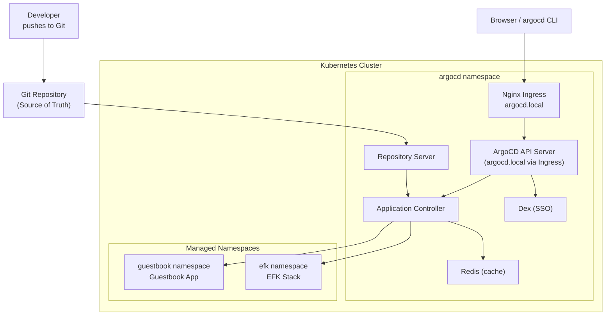
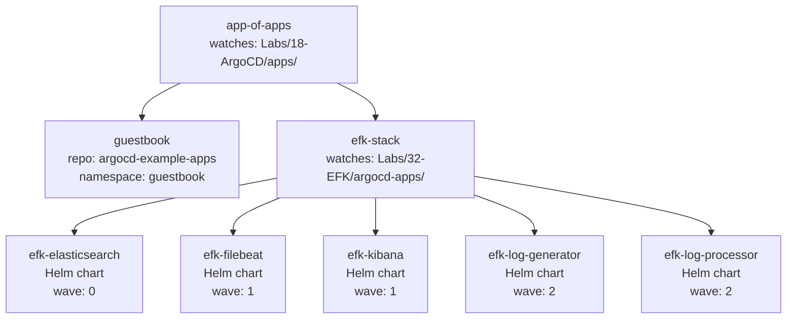
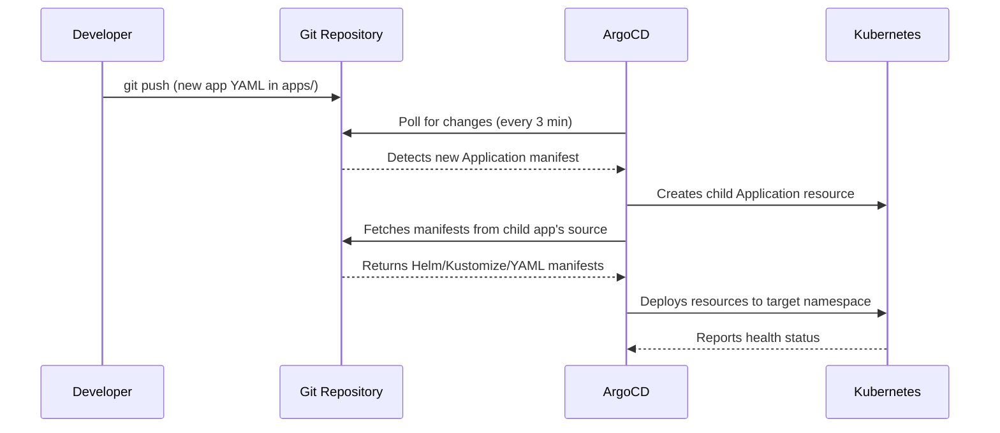

---

# ArgoCD

- `ArgoCD` is a declarative, GitOps continuous delivery tool for Kubernetes.
- It follows the **GitOps** pattern where a Git repository is the single source of truth for the desired application state.
- `ArgoCD` automates the deployment and reconciliation of applications against one or more Kubernetes clusters.

---

## What will we learn?

- What `ArgoCD` is and why it is useful for GitOps
- How to install and configure `ArgoCD` on Kubernetes using Helm
- `ArgoCD` core concepts: Applications, Projects, Sync, and Health
- How to expose ArgoCD via a Nginx Ingress
- How to deploy applications from Git repositories
- Application health and sync status monitoring
- Rollback and sync strategies
- The **App of Apps** pattern to manage multiple applications declaratively
- How to deploy the EFK stack (Lab 32) via ArgoCD

---

### What is ArgoCD?

- `ArgoCD` is a **pull-based** GitOps operator: it watches Git and continuously reconciles the cluster state to match what is defined in Git.
- It consists of a **control plane** (running in the cluster) and optionally a **CLI** for interacting with it.
- Unlike push-based CI/CD (Jenkins, GitHub Actions), no pipeline ever needs direct `kubectl` access to the cluster.

### Terminology

| Term             | Description                                                                                     |
| ---------------- | ----------------------------------------------------------------------------------------------- |
| **Application**  | An ArgoCD resource linking a Git path to a target Kubernetes cluster+namespace                  |
| **Project**      | A logical grouping of applications; controls permitted repos/clusters/namespaces                |
| **Sync**         | The process of applying Git state to the live cluster                                           |
| **Sync Status**  | `Synced` - live matches Git; `OutOfSync` - live differs from Git                               |
| **Health Status**| `Healthy`, `Progressing`, `Degraded`, `Suspended`, or `Missing`                                |
| **App of Apps**  | A pattern where one ArgoCD Application manages a directory of child Application manifests       |

### ArgoCD Components

| Component                  | Description                                                                              |
| -------------------------- | ---------------------------------------------------------------------------------------- |
| **API Server**             | Exposes REST/gRPC API consumed by Web UI, CLI, and CI/CD systems                        |
| **Repository Server**      | Local cache of Git repositories; renders Helm, Kustomize, plain YAML                    |
| **Application Controller** | Monitors live cluster state and compares against desired state from Git                  |
| **Dex**                    | Identity service for integrating with external SSO providers                             |
| **Redis**                  | Caching layer; short-lived state between components                                      |

### Common ArgoCD CLI Commands

| Command                                     | Description                                       |
| ------------------------------------------- | ------------------------------------------------- |
| `argocd login <server>`                     | Login to ArgoCD server                            |
| `argocd app create <name>`                  | Create a new application                          |
| `argocd app list`                           | List all applications                             |
| `argocd app get <name>`                     | Get details of an application                     |
| `argocd app sync <name>`                    | Sync (deploy) an application                      |
| `argocd app diff <name>`                    | Show diff between Git and live state              |
| `argocd app history <name>`                 | Show deployment history                           |
| `argocd app rollback <name> <revision>`     | Rollback to a previous revision                   |
| `argocd app delete <name>`                  | Delete an application                             |

---

## Architecture



---

## App of Apps Pattern



---

## Directory Structure

```
18-ArgoCD/
├── README.md                 # This file
├── demo.sh                   # Full automated demo script
├── ArgoCD.sh                 # Legacy install script (manual)
├── install-argocd.sh         # Install ArgoCD via kustomize (legacy)
├── install.sh                # Print admin password
├── run-demo.sh               # Run guestbook demo (legacy)
│
├── manifests/
│   └── argocd-ingress.yaml   # Nginx Ingress for ArgoCD UI
│
├── apps/                     # App of Apps - all YAML files here are managed
│   ├── app-of-apps.yaml      # Root application - points to this apps/ folder
│   ├── guestbook.yaml        # Guestbook demo application
│   └── efk-stack.yaml        # EFK stack App of Apps (points to Lab 32)
│
├── guestbook-app.yaml        # Standalone guestbook application manifest
├── kustomization.yaml        # Kustomize patch for argocd-server --insecure
└── patch-replace.yaml        # Kustomize strategic merge patch
```

---

## Prerequisites

- Kubernetes cluster (v1.24+)
- `kubectl` configured to access your cluster
- `Helm 3.x` installed
- Nginx Ingress Controller installed on the cluster
- (Optional) `argocd` CLI

```bash
# Install kubectl (macOS)
brew install kubectl

# Install Helm
brew install helm

# Install argocd CLI (optional)
brew install argocd

# Install Nginx Ingress Controller (if not present)
helm repo add ingress-nginx https://kubernetes.github.io/ingress-nginx
helm upgrade --install ingress-nginx ingress-nginx/ingress-nginx \
    --namespace ingress-nginx --create-namespace
```

---

# Lab

## Part 01 - Full Automated Demo

The `demo.sh` script handles the complete lifecycle in one command: ArgoCD installation via Helm, Ingress setup, Guestbook deployment, and App of Apps deployment.

### 01. Run the Demo

```bash
chmod +x demo.sh
./demo.sh deploy
```

The script will:

- Install ArgoCD via Helm (`argo/argo-cd` chart) with `--insecure` mode
- Apply the Nginx Ingress pointing `argocd.local` to the ArgoCD server
- Print admin credentials
- Deploy the Guestbook demo application and wait for it to sync
- Deploy the App of Apps, which triggers the EFK stack deployment from Lab 32

### 02. Other Commands

```bash
# Show current status of all applications
./demo.sh status

# Print admin username and password
./demo.sh credentials

# Remove all ArgoCD resources and managed apps
./demo.sh cleanup
```

---

## Part 02 - Manual ArgoCD Installation

### 01. Install ArgoCD via Helm

```bash
# Add Argo Helm repository
helm repo add argo https://argoproj.github.io/argo-helm
helm repo update argo

# Install ArgoCD (insecure mode - TLS handled by Ingress)
helm upgrade --install argocd argo/argo-cd \
    --namespace argocd \
    --create-namespace \
    --set server.insecure=true \
    --wait
```

### 02. Verify Installation

```bash
kubectl get pods -n argocd
```

Expected output (all pods Running):

```
NAME                                                READY   STATUS
argocd-application-controller-0                    1/1     Running
argocd-dex-server-xxxx                             1/1     Running
argocd-redis-xxxx                                  1/1     Running
argocd-repo-server-xxxx                            1/1     Running
argocd-server-xxxx                                 1/1     Running
```

### 03. Get Admin Password

```bash
kubectl -n argocd get secret argocd-initial-admin-secret \
    -o jsonpath="{.data.password}" | base64 -d; echo
```

!!! note
    Save this password — you'll need it to log in to the ArgoCD UI and CLI.

---

## Part 03 - Expose ArgoCD via Ingress

An Nginx Ingress allows you to access the ArgoCD UI at `http://argocd.local` instead of requiring port-forwarding.

!!! warning "Prerequisite"
    Nginx Ingress Controller must be installed in the cluster.

### 01. Apply the Ingress

```bash
kubectl apply -f manifests/argocd-ingress.yaml
```

The Ingress forwards HTTP traffic to the ArgoCD server which runs in `--insecure` mode (no TLS at the pod level):

```yaml
# manifests/argocd-ingress.yaml (summary)
metadata:
  annotations:
    nginx.ingress.kubernetes.io/backend-protocol: "HTTP"
spec:
  ingressClassName: nginx
  rules:
    - host: argocd.local
      http:
        paths:
          - path: /
            pathType: Prefix
            backend:
              service:
                name: argocd-server
                port:
                  number: 80
```

### 02. Add to /etc/hosts

```bash
# Get the node IP
INGRESS_IP=$(kubectl get nodes \
    -o jsonpath='{.items[0].status.addresses[?(@.type=="InternalIP")].address}')

# Add entry
echo "${INGRESS_IP}  argocd.local" | sudo tee -a /etc/hosts

# Open the UI
open http://argocd.local
```

### 03. Port-Forward Fallback

If Ingress is not available:

```bash
kubectl port-forward svc/argocd-server -n argocd 8080:80 &
open http://localhost:8080
```

---

## Part 04 - ArgoCD CLI

### 01. Install the CLI

```bash
# macOS
brew install argocd

# Linux
curl -sSL -o argocd-linux-amd64 \
    https://github.com/argoproj/argo-cd/releases/latest/download/argocd-linux-amd64
sudo install -m 555 argocd-linux-amd64 /usr/local/bin/argocd
```

### 02. Login

```bash
# Via Ingress
argocd login argocd.local --insecure

# Via port-forward
argocd login localhost:8080 --insecure

# Change admin password (recommended)
argocd account update-password
```

---

## Part 05 - Deploying the Guestbook Application

### 01. Create via Manifest

```bash
kubectl apply -f apps/guestbook.yaml
```

### 02. Create via CLI

```bash
argocd app create guestbook \
  --repo https://github.com/argoproj/argocd-example-apps.git \
  --path guestbook \
  --dest-server https://kubernetes.default.svc \
  --dest-namespace guestbook \
  --sync-policy automated \
  --auto-prune \
  --self-heal
```

### 03. Monitor Sync

```bash
# Via CLI
argocd app get guestbook

# Via kubectl
kubectl get application guestbook -n argocd -w
```

### 04. Access the Guestbook

```bash
kubectl port-forward svc/guestbook-ui -n guestbook 8081:80 &
open http://localhost:8081
```

---

## Part 06 - App of Apps Pattern

The **App of Apps** pattern uses a single root ArgoCD Application as a controller that watches a Git directory for Application manifests. Adding an app is as simple as committing a new YAML file.

### GitOps Flow



### 01. Deploy the App of Apps

```bash
kubectl apply -f apps/app-of-apps.yaml
```

ArgoCD will:

1. Detect the `apps/` directory in the repo
2. Create a child Application for each `.yaml` file found there
3. Each child Application then deploys its own resources

### 02. Verify All Applications

```bash
argocd app list
```

Expected output:

```
NAME               CLUSTER     NAMESPACE  STATUS  HEALTH   SYNCPOLICY
app-of-apps        in-cluster  argocd     Synced  Healthy  Auto-Prune
efk-stack          in-cluster  argocd     Synced  Healthy  Auto-Prune
efk-elasticsearch  in-cluster  efk        Synced  Healthy  Auto-Prune
efk-filebeat       in-cluster  efk        Synced  Healthy  Auto-Prune
efk-kibana         in-cluster  efk        Synced  Healthy  Auto-Prune
efk-log-generator  in-cluster  efk        Synced  Healthy  Auto-Prune
efk-log-processor  in-cluster  efk        Synced  Healthy  Auto-Prune
guestbook          in-cluster  guestbook  Synced  Healthy  Auto-Prune
```

### 03. Add a New Application

To add a new application, commit a new manifest to `apps/`:

```bash
cat > apps/my-new-app.yaml << 'EOF'
apiVersion: argoproj.io/v1alpha1
kind: Application
metadata:
  name: my-new-app
  namespace: argocd
  finalizers:
    - resources-finalizer.argocd.argoproj.io
spec:
  project: default
  source:
    repoURL: https://github.com/my-org/my-repo.git
    targetRevision: HEAD
    path: manifests
  destination:
    server: https://kubernetes.default.svc
    namespace: my-app
  syncPolicy:
    automated:
      prune: true
      selfHeal: true
    syncOptions:
      - CreateNamespace=true
EOF

git add apps/my-new-app.yaml
git commit -m "feat: add my-new-app to App of Apps"
git push
# ArgoCD automatically detects and deploys the new application
```

---

## Part 07 - Auto-Sync and Self-Healing

### Enable Auto-Sync

```bash
argocd app set guestbook \
  --sync-policy automated \
  --self-heal \
  --auto-prune
```

### Test Self-Healing

```bash
# Manually break the desired state
kubectl scale deployment guestbook-ui --replicas=5 -n guestbook

# ArgoCD detects the drift and restores the desired replica count from Git
watch argocd app get guestbook
```

---

## Part 08 - Rollback

```bash
# View deployment history
argocd app history guestbook

# Rollback to a specific revision
argocd app rollback guestbook <revision-id>

# Verify the rollback
argocd app get guestbook
kubectl get all -n guestbook
```

---

## Part 09 - Sync Waves (Deployment Ordering)

Sync waves control the order in which resources are applied during a sync. Resources in wave `N` are applied only after all resources in wave `N-1` are healthy. The EFK App of Apps uses waves to ensure Elasticsearch is ready before Filebeat and Kibana start.

```yaml
# wave 0: Elasticsearch (must be ready first)
metadata:
  annotations:
    argocd.argoproj.io/sync-wave: "0"

# wave 1: Filebeat and Kibana (require Elasticsearch)
metadata:
  annotations:
    argocd.argoproj.io/sync-wave: "1"

# wave 2: Log Generator and Processor (require everything else)
metadata:
  annotations:
    argocd.argoproj.io/sync-wave: "2"
```

---

## Part 10 - Working with Helm Charts

```bash
# Deploy a Helm chart from a registry
argocd app create nginx-helm \
  --repo https://charts.bitnami.com/bitnami \
  --helm-chart nginx \
  --revision 15.1.0 \
  --dest-server https://kubernetes.default.svc \
  --dest-namespace default \
  --helm-set service.type=NodePort \
  --helm-set replicaCount=3

argocd app sync nginx-helm
```

---

## Part 11 - Troubleshooting

### ArgoCD Server Not Accessible

```bash
# Check ArgoCD pods
kubectl get pods -n argocd -l app.kubernetes.io/name=argocd-server

# Check Ingress
kubectl get ingress -n argocd
kubectl describe ingress argocd-server-ingress -n argocd
```

### Application Stuck in Progressing

```bash
argocd app get <app-name>
kubectl describe application <app-name> -n argocd
kubectl logs -n argocd -l app.kubernetes.io/name=argocd-application-controller --tail=50
```

### Out of Sync / Repository Error

```bash
# Show the diff
argocd app diff <app-name>

# Force refresh from Git
argocd app get <app-name> --refresh

# Force sync
argocd app sync <app-name> --force
```

### App of Apps Not Creating Child Apps

```bash
# Check root app is synced
argocd app get app-of-apps

# Check ArgoCD can reach the repo
argocd repo list

# Check the apps/ directory exists in the configured path
argocd app manifests app-of-apps
```

---

## Cleanup

```bash
# Full cleanup via demo.sh
./demo.sh cleanup

# Or manually
kubectl delete applications --all -n argocd
helm uninstall argocd --namespace argocd
kubectl delete namespace argocd guestbook efk
```

---

## Resources

- [ArgoCD Official Documentation](https://argo-cd.readthedocs.io/)
- [ArgoCD Helm Chart](https://artifacthub.io/packages/helm/argo/argo-cd)
- [App of Apps Pattern](https://argo-cd.readthedocs.io/en/stable/operator-manual/cluster-bootstrapping/)
- [Sync Waves](https://argo-cd.readthedocs.io/en/stable/user-guide/sync-waves/)
- [ApplicationSet Controller](https://argo-cd.readthedocs.io/en/stable/user-guide/application-set/)
- [ArgoCD GitHub Repository](https://github.com/argoproj/argo-cd)
- [GitOps Principles](https://www.gitops.tech/)

