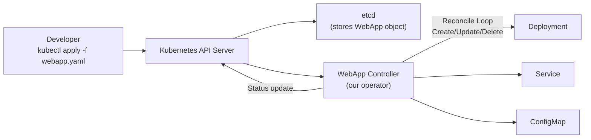
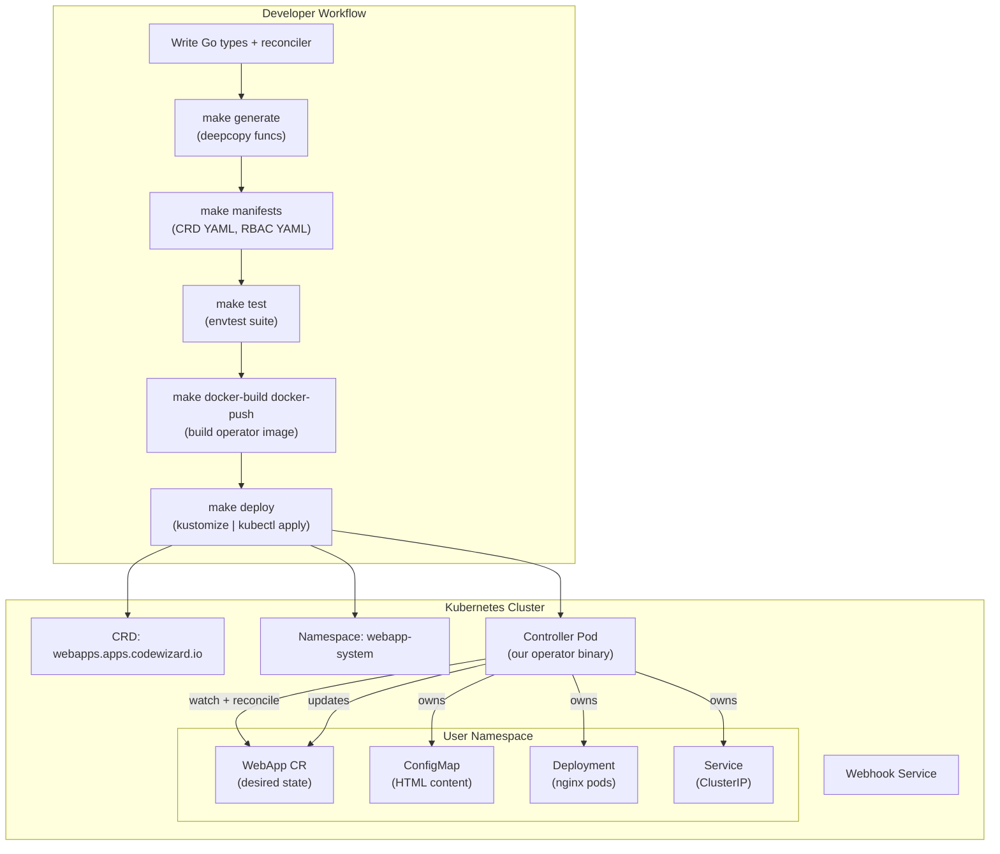
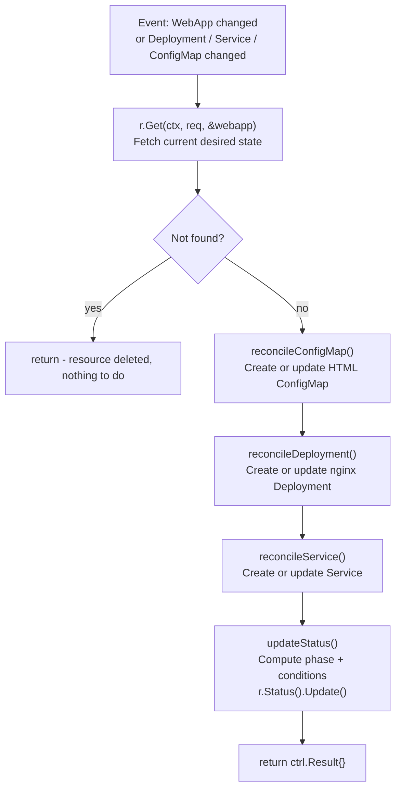

---

# Kubebuilder - Building Kubernetes Operators

- `Kubebuilder` is an SDK for building production-grade Kubernetes APIs and controllers (Operators) using Go and the `controller-runtime` library.
- Instead of writing low-level machinery by hand, `Kubebuilder` scaffolds everything - CRD types, RBAC manifests, Makefile targets, and the reconcile loop - so you can focus on business logic.
- In this lab we build a real **WebApp Operator** that manages a `WebApp` custom resource and automatically provisions the correct `Deployment`, `Service`, and `ConfigMap` in the cluster.

---

## What will we learn?

- What the **Operator pattern** is and why it exists
- How `Kubebuilder` scaffolds a complete operator project
- How to define a **Custom Resource Definition (CRD)** with validation markers
- How to write a **Reconciliation Loop** using `controller-runtime`
- How to manage child resources (`Deployment`, `Service`, `ConfigMap`) and their ownership
- How to update **Status subresources** and surface conditions
- How to run the operator **locally** and **in-cluster**
- How to write **admission webhooks** for defaulting and validation
- How to write **controller tests** with `envtest`
- How to build and push the operator **Docker image** and deploy via Kustomize

---

## Official Documentation & References

| Resource | Link |
|---|---|
| Kubebuilder Book (official) | [book.kubebuilder.io](https://book.kubebuilder.io/) |
| Kubebuilder GitHub | [github.com/kubernetes-sigs/kubebuilder](https://github.com/kubernetes-sigs/kubebuilder) |
| controller-runtime docs | [pkg.go.dev/sigs.k8s.io/controller-runtime](https://pkg.go.dev/sigs.k8s.io/controller-runtime) |
| Kubernetes API Conventions | [github.com/kubernetes/community/contributors/devel/sig-architecture/api-conventions.md](https://github.com/kubernetes/community/blob/master/contributors/devel/sig-architecture/api-conventions.md) |
| CRD Validation Markers | [book.kubebuilder.io/reference/markers/crd-validation](https://book.kubebuilder.io/reference/markers/crd-validation.html) |
| RBAC Markers | [book.kubebuilder.io/reference/markers/rbac](https://book.kubebuilder.io/reference/markers/rbac.html) |
| Operator SDK (alternative) | [sdk.operatorframework.io](https://sdk.operatorframework.io/) |
| OperatorHub.io | [operatorhub.io](https://operatorhub.io/) |
| envtest (controller tests) | [book.kubebuilder.io/cronjob-tutorial/writing-tests](https://book.kubebuilder.io/cronjob-tutorial/writing-tests.html) |
| Go Modules | [go.dev/ref/mod](https://go.dev/ref/mod) |

---

## Introduction

### What is the Operator Pattern?

- Kubernetes manages built-in resources (Pods, Deployments, Services) with built-in controllers that run a **reconciliation loop**.
- A **Kubernetes Operator** extends this pattern to **your own domain-specific resources**.
- An operator is a combination of:
  - A **Custom Resource Definition (CRD)** - defines the new resource type and its schema in the Kubernetes API
  - A **Controller** - watches for changes to the custom resource and reconciles the cluster state towards the desired state



### When should you write an Operator?

| Use case | Example |
|----------|---------|
| Manage a stateful application lifecycle | Database cluster (create, backup, restore, scale, upgrade) |
| Encode operational runbook as code | Auto-healing, canary rollouts |
| Extend Kubernetes with domain knowledge | CI/CD pipelines, ML training jobs |
| Complex multi-resource coordination | Provision `Deployment` + `Service` + `Certificate` as a single object |

### Kubebuilder vs Raw client-go

| | Raw client-go | Kubebuilder |
|---|---|---|
| Code scaffolding | Manual | Automated |
| CRD schema generation | Manual YAML | Auto-generated from Go struct + markers |
| RBAC generation | Manual | Auto-generated from `//+kubebuilder:rbac` markers |
| Controller boilerplate | Manual | Scaffolded |
| Testing framework | DIY | `envtest` built in |
| Webhook scaffolding | Manual | Scaffolded |

---

## Terminology

| Term                   | Description                                                                                     |
|------------------------|-------------------------------------------------------------------------------------------------|
| **CRD**                | Custom Resource Definition - registers a new resource type with the Kubernetes API              |
| **CR**                 | Custom Resource - an instance of a CRD (like a Pod is an instance of the Pod resource)          |
| **Operator**           | A controller that implements domain-specific logic for a custom resource                        |
| **Reconciler**         | The Go struct that implements the `Reconcile(ctx, req)` method                                  |
| **Reconcile Loop**     | Watch → Diff → Act cycle that continuously drives the cluster toward desired state              |
| **Desired State**      | What the user declared in the CR spec                                                           |
| **Observed State**     | What is actually running in the cluster                                                         |
| **Finalizer**          | A string added to `.metadata.finalizers`; prevents deletion until cleanup logic finished        |
| **Owner Reference**    | A pointer from a child resource (e.g. Deployment) back to its parent (WebApp CR)                |
| **Status Subresource** | A separate sub-API for writing `.status` without triggering watches on `.spec`                  |
| **Marker**             | A Go comment like `//+kubebuilder:...` that drives code/manifest generation                     |
| **envtest**            | A test environment that starts a real `kube-apiserver` + `etcd` binary for integration tests    |
| **Webhook**            | HTTP server ArgoCD calls before creating/updating resources; used for defaulting and validation |

---

## Architecture



---

## Project Structure

After running `kubebuilder init` and `kubebuilder create api`, the project looks like:

```
webapp-operator/
├── api/
│   └── v1/
│       ├── groupversion_info.go    # Group/Version registration
│       ├── webapp_types.go         # CRD Go types (Spec, Status, markers)
│       └── zz_generated.deepcopy.go  # Auto-generated (make generate)
│
├── internal/
│   └── controller/
│       ├── webapp_controller.go    # Reconcile() implementation
│       └── webapp_controller_test.go  # envtest-based integration tests
│
├── config/
│   ├── crd/                        # Generated CRD YAML manifests
│   ├── rbac/                       # Generated RBAC manifests
│   ├── manager/                    # Controller Deployment manifests
│   ├── default/                    # Kustomize base that wires everything together
│   ├── webhook/                    # Webhook certificates and Service
│   └── samples/
│       └── apps_v1_webapp.yaml     # Example CR for testing
│
├── cmd/
│   └── main.go                     # Entry point: registers scheme, starts manager
│
├── Dockerfile                      # Multi-stage build for the operator image
├── Makefile                        # All development targets
├── go.mod                          # Go module definition
└── go.sum                          # Dependency checksums
```

---

## Common Kubebuilder Commands

??? example "`kubebuilder init` - Initialize a new operator project"

    **Syntax:** `kubebuilder init --domain <domain> --repo <module>`

    **Description:** Scaffolds the complete project skeleton: `cmd/main.go`, `Makefile`, `go.mod`, base Kustomize configs, and `.gitignore`.

    - `--domain` sets the API group suffix (e.g., resources will be `<group>.<domain>`)
    - `--repo` sets the Go module path
    - `--plugins=go/v4` (default) uses the latest stable Go plugin

        ```bash
        # Initialize with domain codewizard.io
        kubebuilder init \
            --domain codewizard.io \
            --repo codewizard.io/webapp-operator

        # Initialize with an older plugin (kustomize only, no controller)
        kubebuilder init \
            --domain my.domain \
            --repo my.domain/guestbook \
            --plugins=kustomize/v2-alpha

        # Verify the scaffolded structure
        ls -la
        cat go.mod
        cat Makefile
        ```

??? example "`kubebuilder create api` - Create a new CRD + Controller"

    **Syntax:** `kubebuilder create api --group <group> --version <version> --kind <Kind>`

    **Description:** Scaffolds a new API type (CRD struct in `api/<version>/<kind>_types.go`) and a controller stub (`internal/controller/<kind>_controller.go`).

    - Prompts whether to create the Resource (CRD type) and the Controller
    - Adds the type to the scheme and wires the controller into `cmd/main.go`
    - Can be run multiple times to add more API kinds to the same project

        ```bash
        # Create WebApp API and controller
        kubebuilder create api \
            --group apps \
            --version v1 \
            --kind WebApp

        # Create a second kind in the same project
        kubebuilder create api \
            --group apps \
            --version v1 \
            --kind WebAppPolicy

        # Scaffolds CRD only, no controller
        kubebuilder create api \
            --group apps \
            --version v1 \
            --kind Database \
            --controller=false

        # View generated type
        cat api/v1/webapp_types.go
        ```

??? example "`kubebuilder create webhook` - Add defaulting or validation webhook"

    **Syntax:** `kubebuilder create webhook --group <group> --version <version> --kind <Kind>`

    **Description:** Scaffolds a webhook server for the given kind, supporting defaulting (mutating) and validation (validating) webhooks.

    - `--defaulting` generates a `Default()` method (MutatingAdmissionWebhook)
    - `--programmatic-validation` generates a `ValidateCreate/Update/Delete()` method (ValidatingAdmissionWebhook)
    - Also generates certificate management setup in `config/webhook/`

        ```bash
        # Add both defaulting and validation webhooks
        kubebuilder create webhook \
            --group apps \
            --version v1 \
            --kind WebApp \
            --defaulting \
            --programmatic-validation

        # View scaffolded webhook file
        cat api/v1/webapp_webhook.go
        ```

??? example "`make generate` - Generate DeepCopy functions"

    **Syntax:** `make generate`

    **Description:** Runs `controller-gen object` to auto-generate `DeepCopyObject()` methods for all types. These are required by the Kubernetes runtime and must be regenerated after every change to `*_types.go`.

        ```bash
        # Regenerate after changing types
        make generate

        # View generated file
        cat api/v1/zz_generated.deepcopy.go

        # What it runs under the hood:
        # controller-gen object:headerFile="hack/boilerplate.go.txt" paths="./..."
        ```

??? example "`make manifests` - Generate CRD and RBAC manifests"

    **Syntax:** `make manifests`

    **Description:** Runs `controller-gen` to generate CRD YAML, RBAC ClusterRole, and webhook manifests from Go markers. Must be run after every change to markers in `*_types.go` or `*_controller.go`.

        ```bash
        # Generate all manifests
        make manifests

        # View generated CRD YAML
        cat config/crd/bases/apps.codewizard.io_webapps.yaml

        # View generated RBAC
        cat config/rbac/role.yaml

        # What it runs:
        # controller-gen rbac:roleName=manager-role crd webhook paths="./..." \
        #   output:crd:artifacts:config=config/crd/bases
        ```

??? example "`make install` - Install CRDs into the cluster"

    **Syntax:** `make install`

    **Description:** Applies the generated CRD manifests to the currently active cluster using `kubectl apply`. After this, `kubectl get webapps` will work.

        ```bash
        # Install CRDs
        make install

        # Verify CRD is registered
        kubectl get crds | grep codewizard

        # Describe the CRD schema
        kubectl describe crd webapps.apps.codewizard.io

        # What it runs:
        # kubectl apply -k config/crd
        ```

??? example "`make run` - Run the controller locally"

    **Syntax:** `make run`

    **Description:** Runs the controller binary on your local machine using the kubeconfig in `~/.kube/config`. The controller connects to the cluster and reconciles resources but runs outside the cluster (useful for development).

        ```bash
        # Run controller locally (uses current kubeconfig)
        make run

        # Run with extra verbosity
        make run ARGS="--zap-log-level=debug"

        # Run with leader election disabled (single instance mode)
        make run ARGS="--leader-elect=false"
        ```

??? example "`make test` - Run controller tests with envtest"

    **Syntax:** `make test`

    **Description:** Runs the full test suite using `envtest`, which starts a real `kube-apiserver` and `etcd` binary locally - no cluster required.

        ```bash
        # Run all tests
        make test

        # Run with verbose output
        make test ARGS="-v"

        # Run only specific tests
        make test ARGS="-run TestWebAppReconciler"

        # Run with coverage report
        make test-coverage
        ```

??? example "`make docker-build` - Build the operator image"

    **Syntax:** `make docker-build IMG=<image:tag>`

    **Description:** Builds a multi-stage Docker image containing the compiled operator binary.

        ```bash
        # Build with a custom image name
        make docker-build IMG=ghcr.io/myorg/webapp-operator:v0.1.0

        # Build and push in one step
        make docker-build docker-push IMG=ghcr.io/myorg/webapp-operator:v0.1.0

        # Build for multiple platforms (requires buildx)
        make docker-buildx IMG=ghcr.io/myorg/webapp-operator:v0.1.0
        ```

??? example "`make deploy` - Deploy the operator to the cluster"

    **Syntax:** `make deploy IMG=<image:tag>`

    **Description:** Uses Kustomize to render all manifests (CRD, RBAC, Deployment, webhook certs) and applies them to the cluster.

        ```bash
        # Deploy with a specific image
        make deploy IMG=ghcr.io/myorg/webapp-operator:v0.1.0

        # Verify the operator pod is running
        kubectl get pods -n webapp-system

        # Check operator logs
        kubectl logs -n webapp-system -l control-plane=controller-manager -f

        # Undeploy
        make undeploy
        ```

---

# Lab

## Part 01 - Prerequisites

### 01.01 Install Go

Kubebuilder requires **Go 1.21+**.

=== "macOS"

    ```bash
    brew install go

    # Or download directly
    # https://go.dev/dl/
    ```

=== "Linux"

    ```bash
    # Download and install Go 1.22
    curl -LO https://go.dev/dl/go1.22.4.linux-amd64.tar.gz
    sudo tar -C /usr/local -xzf go1.22.4.linux-amd64.tar.gz
    echo 'export PATH=$PATH:/usr/local/go/bin' >> ~/.bashrc
    source ~/.bashrc
    ```

#### Verify

```bash
go version
# go version go1.22.x linux/amd64  (or darwin/arm64 etc.)
```

### 01.02 Install Kubebuilder

```bash
# Detect OS and architecture
OS=$(go env GOOS)
ARCH=$(go env GOARCH)

# Download the latest kubebuilder binary
curl -L "https://go.kubebuilder.io/dl/latest/${OS}/${ARCH}" \
    -o /tmp/kubebuilder

sudo mv /tmp/kubebuilder /usr/local/bin/kubebuilder
sudo chmod +x /usr/local/bin/kubebuilder
```

#### Verify

```bash
kubebuilder version
# Version: main.version{...KubeBuilderVersion:"4.x.x",...}
```

### 01.03 Install controller-gen and other tools

Kubebuilder uses several helper binaries installed by `make`. They are downloaded automatically on first use:

```bash
# These are auto-downloaded by the Makefile when needed:
# - controller-gen   (code + manifest generation)
# - envtest          (testing framework binaries)
# - kustomize        (manifest composition)
# - golangci-lint    (linter)

# You can pre-download them:
make controller-gen
make kustomize
```

### 01.04 Verify cluster access

```bash
kubectl cluster-info
kubectl get nodes
```

---

## Part 02 - Initialize the Project

We will build a **WebApp Operator** that manages a `WebApp` custom resource.
A `WebApp` CR creates a `Deployment` (nginx), a `Service` (ClusterIP), and a `ConfigMap` (HTML content) - all owned and reconciled by our controller.

### 02.01 Create and enter the project directory

```bash
mkdir webapp-operator
cd webapp-operator
```

### 02.02 Initialize the Kubebuilder project

```bash
kubebuilder init \
    --domain codewizard.io \
    --repo   codewizard.io/webapp-operator
```

Output:

```
Writing kustomize manifests for you to edit...
Writing scaffold for you to edit...
Get controller runtime:
$ go get sigs.k8s.io/controller-runtime@v0.18.x
go: downloading sigs.k8s.io/controller-runtime v0.18.x
...
Next: define a resource with:
$ kubebuilder create api
```

### 02.03 Inspect the scaffolded files

```bash
# Project layout
find . -type f | grep -v '.git\|vendor\|_test' | sort

# Go module
cat go.mod

# Entrypoint
cat cmd/main.go

# Makefile targets
make help
```

The `cmd/main.go` sets up the manager - it starts the controller, serves metrics, and manages leader election. You rarely need to edit this file by hand.

---

## Part 03 - Create the API (CRD + Controller Scaffold)

### 03.01 Scaffold the WebApp API

```bash
kubebuilder create api \
    --group   apps \
    --version v1 \
    --kind    WebApp
```

When prompted:
```
Create Resource [y/n]   → y
Create Controller [y/n] → y
```

### 03.02 Inspect the generated files

```bash
# Type definition (we will fill this in next)
cat api/v1/webapp_types.go

# Reconciler stub (we will fill this in next)
cat internal/controller/webapp_controller.go

# main.go is updated to register WebApp
grep WebApp cmd/main.go
```

---

## Part 04 - Define the CRD Types

This is the heart of the API definition. Open `api/v1/webapp_types.go` and **replace its contents** with the following:

```go
// api/v1/webapp_types.go
package v1

import (
	metav1 "k8s.io/apimachinery/pkg/apis/meta/v1"
)

// WebAppSpec defines the desired state of WebApp.
type WebAppSpec struct {
	// Replicas is the desired number of nginx Pods.
	// +kubebuilder:validation:Minimum=1
	// +kubebuilder:validation:Maximum=10
	// +kubebuilder:default=1
	Replicas int32 `json:"replicas,omitempty"`

	// Image is the nginx container image (repository:tag).
	// +kubebuilder:default="nginx:1.25.3"
	// +kubebuilder:validation:MinLength=1
	Image string `json:"image,omitempty"`

	// Message is the HTML body text served by nginx.
	// +kubebuilder:validation:MinLength=1
	// +kubebuilder:validation:MaxLength=500
	Message string `json:"message"`

	// Port is the container port nginx listens on.
	// +kubebuilder:validation:Minimum=1
	// +kubebuilder:validation:Maximum=65535
	// +kubebuilder:default=80
	Port int32 `json:"port,omitempty"`

	// ServiceType controls how the Service is exposed.
	// +kubebuilder:validation:Enum=ClusterIP;NodePort;LoadBalancer
	// +kubebuilder:default=ClusterIP
	ServiceType string `json:"serviceType,omitempty"`
}

// WebAppPhase is a simple enum for the overall lifecycle state.
// +kubebuilder:validation:Enum=Pending;Running;Degraded;Failed
type WebAppPhase string

const (
	WebAppPhasePending  WebAppPhase = "Pending"
	WebAppPhaseRunning  WebAppPhase = "Running"
	WebAppPhaseDegraded WebAppPhase = "Degraded"
	WebAppPhaseFailed   WebAppPhase = "Failed"
)

// WebAppStatus defines the observed state of WebApp.
type WebAppStatus struct {
	// AvailableReplicas is the number of Pods in the Ready state.
	AvailableReplicas int32 `json:"availableReplicas,omitempty"`

	// ReadyReplicas is the number of Pods that have passed readiness checks.
	ReadyReplicas int32 `json:"readyReplicas,omitempty"`

	// Phase is a high-level summary of the WebApp lifecycle.
	Phase WebAppPhase `json:"phase,omitempty"`

	// DeploymentName is the name of the managed Deployment.
	DeploymentName string `json:"deploymentName,omitempty"`

	// ServiceName is the name of the managed Service.
	ServiceName string `json:"serviceName,omitempty"`

	// Conditions holds standard API conditions.
	// +listType=map
	// +listMapKey=type
	Conditions []metav1.Condition `json:"conditions,omitempty"`
}

// Condition type constants
const (
	// ConditionTypeAvailable means the WebApp has at least one ready pod.
	ConditionTypeAvailable = "Available"
	// ConditionTypeProgressing means a rollout or scale is in progress.
	ConditionTypeProgressing = "Progressing"
	// ConditionTypeDegraded means some (but not all) replicas are ready.
	ConditionTypeDegraded = "Degraded"
)

//+kubebuilder:object:root=true
//+kubebuilder:subresource:status
//+kubebuilder:resource:shortName=wa,categories=all
//+kubebuilder:printcolumn:name="Replicas",type=integer,JSONPath=".spec.replicas"
//+kubebuilder:printcolumn:name="Available",type=integer,JSONPath=".status.availableReplicas"
//+kubebuilder:printcolumn:name="Phase",type=string,JSONPath=".status.phase"
//+kubebuilder:printcolumn:name="Image",type=string,JSONPath=".spec.image"
//+kubebuilder:printcolumn:name="Age",type=date,JSONPath=".metadata.creationTimestamp"

// WebApp is the Schema for the webapps API.
// It provisions a Deployment, Service, and ConfigMap that serve the configured HTML page.
type WebApp struct {
	metav1.TypeMeta   `json:",inline"`
	metav1.ObjectMeta `json:"metadata,omitempty"`

	Spec   WebAppSpec   `json:"spec,omitempty"`
	Status WebAppStatus `json:"status,omitempty"`
}

//+kubebuilder:object:root=true

// WebAppList contains a list of WebApp.
type WebAppList struct {
	metav1.TypeMeta `json:",inline"`
	metav1.ListMeta `json:"metadata,omitempty"`
	Items           []WebApp `json:"items"`
}

func init() {
	SchemeBuilder.Register(&WebApp{}, &WebAppList{})
}
```

### Marker Reference

| Marker | Effect |
|--------|--------|
| `//+kubebuilder:object:root=true` | Marks this type as a root object (has its own API endpoint) |
| `//+kubebuilder:subresource:status` | Generates a `/status` sub-resource (status updates don't trigger spec watches) |
| `//+kubebuilder:resource:shortName=wa` | Allows `kubectl get wa` as a shorthand |
| `//+kubebuilder:printcolumn:...` | Extra columns shown by `kubectl get wa` |
| `//+kubebuilder:validation:Minimum=1` | Adds server-side validation to the CRD schema |
| `//+kubebuilder:default=1` | Sets a default value when the field is omitted |
| `//+kubebuilder:validation:Enum=...` | Restricts the field to a fixed set of values |

### 04.01 Generate DeepCopy functions

After every change to `*_types.go` run:

```bash
make generate
```

This auto-generates `api/v1/zz_generated.deepcopy.go` which implements `DeepCopyObject()` - required by the Kubernetes runtime for garbage collection and caching.

### 04.02 Generate CRD manifest

```bash
make manifests
```

Inspect the generated CRD YAML:

```bash
cat config/crd/bases/apps.codewizard.io_webapps.yaml
```

You will see the full OpenAPI v3 schema, validation rules, printer columns, and status subresource settings - all derived from the Go markers.

---

## Part 05 - Implement the Reconciler

Open `internal/controller/webapp_controller.go` and **replace its contents** with the full reconciler:

```go
// internal/controller/webapp_controller.go
package controller

import (
	"context"
	"fmt"

	appsv1 "k8s.io/api/apps/v1"
	corev1 "k8s.io/api/core/v1"
	"k8s.io/apimachinery/pkg/api/errors"
	"k8s.io/apimachinery/pkg/api/meta"
	metav1 "k8s.io/apimachinery/pkg/apis/meta/v1"
	"k8s.io/apimachinery/pkg/runtime"
	"k8s.io/apimachinery/pkg/types"
	ctrl "sigs.k8s.io/controller-runtime"
	"sigs.k8s.io/controller-runtime/pkg/client"
	"sigs.k8s.io/controller-runtime/pkg/log"

	webappv1 "codewizard.io/webapp-operator/api/v1"
)

// WebAppReconciler reconciles a WebApp object.
type WebAppReconciler struct {
	client.Client
	Scheme *runtime.Scheme
}

// RBAC markers - these generate config/rbac/role.yaml when `make manifests` is run.
//
//+kubebuilder:rbac:groups=apps.codewizard.io,resources=webapps,verbs=get;list;watch;create;update;patch;delete
//+kubebuilder:rbac:groups=apps.codewizard.io,resources=webapps/status,verbs=get;update;patch
//+kubebuilder:rbac:groups=apps.codewizard.io,resources=webapps/finalizers,verbs=update
//+kubebuilder:rbac:groups=apps,resources=deployments,verbs=get;list;watch;create;update;patch;delete
//+kubebuilder:rbac:groups=core,resources=services,verbs=get;list;watch;create;update;patch;delete
//+kubebuilder:rbac:groups=core,resources=configmaps,verbs=get;list;watch;create;update;patch;delete
//+kubebuilder:rbac:groups=core,resources=events,verbs=create;patch

// Reconcile is the main reconciliation loop.
// It is called whenever a WebApp CR (or a resource it owns) changes.
func (r *WebAppReconciler) Reconcile(ctx context.Context, req ctrl.Request) (ctrl.Result, error) {
	logger := log.FromContext(ctx)

	// ── Step 1: Fetch the WebApp instance ────────────────────────────────────
	webapp := &webappv1.WebApp{}
	if err := r.Get(ctx, req.NamespacedName, webapp); err != nil {
		if errors.IsNotFound(err) {
			// Object was deleted before we could reconcile - nothing to do.
			logger.Info("WebApp not found, likely deleted", "name", req.Name)
			return ctrl.Result{}, nil
		}
		return ctrl.Result{}, fmt.Errorf("fetching WebApp: %w", err)
	}

	logger.Info("Reconciling WebApp",
		"name", webapp.Name,
		"namespace", webapp.Namespace,
		"replicas", webapp.Spec.Replicas)

	// ── Step 2: Reconcile ConfigMap (HTML content) ───────────────────────────
	if err := r.reconcileConfigMap(ctx, webapp); err != nil {
		return ctrl.Result{}, fmt.Errorf("reconciling ConfigMap: %w", err)
	}

	// ── Step 3: Reconcile Deployment ─────────────────────────────────────────
	deployment, err := r.reconcileDeployment(ctx, webapp)
	if err != nil {
		return ctrl.Result{}, fmt.Errorf("reconciling Deployment: %w", err)
	}

	// ── Step 4: Reconcile Service ─────────────────────────────────────────────
	if err := r.reconcileService(ctx, webapp); err != nil {
		return ctrl.Result{}, fmt.Errorf("reconciling Service: %w", err)
	}

	// ── Step 5: Update Status ─────────────────────────────────────────────────
	if err := r.updateStatus(ctx, webapp, deployment); err != nil {
		return ctrl.Result{}, fmt.Errorf("updating status: %w", err)
	}

	return ctrl.Result{}, nil
}

// ── reconcileConfigMap ensures the HTML ConfigMap exists and is up-to-date. ──

func (r *WebAppReconciler) reconcileConfigMap(ctx context.Context, webapp *webappv1.WebApp) error {
	logger := log.FromContext(ctx)

	desired := &corev1.ConfigMap{
		ObjectMeta: metav1.ObjectMeta{
			Name:      webapp.Name + "-html",
			Namespace: webapp.Namespace,
			Labels:    labelsForWebApp(webapp.Name),
		},
		Data: map[string]string{
			"index.html": fmt.Sprintf(`<!DOCTYPE html>
<html>
<head><title>%s</title></head>
<body>
  <h1>%s</h1>
  <p>Managed by the <strong>WebApp Operator</strong> | Instance: %s</p>
</body>
</html>`, webapp.Spec.Message, webapp.Spec.Message, webapp.Name),
		},
	}

	// Set the WebApp as the owner of the ConfigMap.
	// When the WebApp CR is deleted, Kubernetes garbage-collects the ConfigMap automatically.
	if err := ctrl.SetControllerReference(webapp, desired, r.Scheme); err != nil {
		return err
	}

	// Fetch the existing ConfigMap
	existing := &corev1.ConfigMap{}
	err := r.Get(ctx, types.NamespacedName{Name: desired.Name, Namespace: desired.Namespace}, existing)
	if errors.IsNotFound(err) {
		logger.Info("Creating ConfigMap", "name", desired.Name)
		return r.Create(ctx, desired)
	}
	if err != nil {
		return err
	}

	// Update if the content has changed
	if existing.Data["index.html"] != desired.Data["index.html"] {
		existing.Data = desired.Data
		logger.Info("Updating ConfigMap", "name", existing.Name)
		return r.Update(ctx, existing)
	}

	return nil
}

// ── reconcileDeployment ensures the nginx Deployment exists and matches spec. ──

func (r *WebAppReconciler) reconcileDeployment(ctx context.Context, webapp *webappv1.WebApp) (*appsv1.Deployment, error) {
	logger := log.FromContext(ctx)

	labels := labelsForWebApp(webapp.Name)
	replicas := webapp.Spec.Replicas

	desired := &appsv1.Deployment{
		ObjectMeta: metav1.ObjectMeta{
			Name:      webapp.Name,
			Namespace: webapp.Namespace,
			Labels:    labels,
		},
		Spec: appsv1.DeploymentSpec{
			Replicas: &replicas,
			Selector: &metav1.LabelSelector{MatchLabels: labels},
			Template: corev1.PodTemplateSpec{
				ObjectMeta: metav1.ObjectMeta{Labels: labels},
				Spec: corev1.PodSpec{
					Containers: []corev1.Container{
						{
							Name:            "nginx",
							Image:           webapp.Spec.Image,
							ImagePullPolicy: corev1.PullIfNotPresent,
							Ports: []corev1.ContainerPort{
								{ContainerPort: webapp.Spec.Port, Protocol: corev1.ProtocolTCP},
							},
							VolumeMounts: []corev1.VolumeMount{
								{
									Name:      "html",
									MountPath: "/usr/share/nginx/html",
								},
							},
							ReadinessProbe: &corev1.Probe{
								ProbeHandler: corev1.ProbeHandler{
									HTTPGet: &corev1.HTTPGetAction{
										Path: "/",
										Port: intOrString(webapp.Spec.Port),
									},
								},
								InitialDelaySeconds: 5,
								PeriodSeconds:       10,
							},
							LivenessProbe: &corev1.Probe{
								ProbeHandler: corev1.ProbeHandler{
									HTTPGet: &corev1.HTTPGetAction{
										Path: "/",
										Port: intOrString(webapp.Spec.Port),
									},
								},
								InitialDelaySeconds: 15,
								PeriodSeconds:       20,
							},
						},
					},
					Volumes: []corev1.Volume{
						{
							Name: "html",
							VolumeSource: corev1.VolumeSource{
								ConfigMap: &corev1.ConfigMapVolumeSource{
									LocalObjectReference: corev1.LocalObjectReference{
										Name: webapp.Name + "-html",
									},
								},
							},
						},
					},
				},
			},
		},
	}

	if err := ctrl.SetControllerReference(webapp, desired, r.Scheme); err != nil {
		return nil, err
	}

	existing := &appsv1.Deployment{}
	err := r.Get(ctx, types.NamespacedName{Name: desired.Name, Namespace: desired.Namespace}, existing)
	if errors.IsNotFound(err) {
		logger.Info("Creating Deployment", "name", desired.Name)
		if err := r.Create(ctx, desired); err != nil {
			return nil, err
		}
		return desired, nil
	}
	if err != nil {
		return nil, err
	}

	// Reconcile mutable fields: replicas and image
	needsUpdate := false
	if *existing.Spec.Replicas != replicas {
		existing.Spec.Replicas = &replicas
		needsUpdate = true
	}
	if existing.Spec.Template.Spec.Containers[0].Image != webapp.Spec.Image {
		existing.Spec.Template.Spec.Containers[0].Image = webapp.Spec.Image
		needsUpdate = true
	}

	if needsUpdate {
		logger.Info("Updating Deployment", "name", existing.Name,
			"replicas", replicas, "image", webapp.Spec.Image)
		if err := r.Update(ctx, existing); err != nil {
			return nil, err
		}
	}

	return existing, nil
}

// ── reconcileService ensures the Service exists and matches spec. ──────────────

func (r *WebAppReconciler) reconcileService(ctx context.Context, webapp *webappv1.WebApp) error {
	logger := log.FromContext(ctx)

	labels := labelsForWebApp(webapp.Name)
	svcType := corev1.ServiceType(webapp.Spec.ServiceType)

	desired := &corev1.Service{
		ObjectMeta: metav1.ObjectMeta{
			Name:      webapp.Name,
			Namespace: webapp.Namespace,
			Labels:    labels,
		},
		Spec: corev1.ServiceSpec{
			Selector: labels,
			Type:     svcType,
			Ports: []corev1.ServicePort{
				{
					Port:       webapp.Spec.Port,
					TargetPort: intOrString(webapp.Spec.Port),
					Protocol:   corev1.ProtocolTCP,
				},
			},
		},
	}

	if err := ctrl.SetControllerReference(webapp, desired, r.Scheme); err != nil {
		return err
	}

	existing := &corev1.Service{}
	err := r.Get(ctx, types.NamespacedName{Name: desired.Name, Namespace: desired.Namespace}, existing)
	if errors.IsNotFound(err) {
		logger.Info("Creating Service", "name", desired.Name)
		return r.Create(ctx, desired)
	}
	if err != nil {
		return err
	}

	// Reconcile Service type (immutable field - recreate required)
	if existing.Spec.Type != svcType {
		logger.Info("Recreating Service due to type change", "old", existing.Spec.Type, "new", svcType)
		if err := r.Delete(ctx, existing); err != nil {
			return err
		}
		return r.Create(ctx, desired)
	}

	return nil
}

// ── updateStatus computes and persists the WebApp status. ───────────────────────

func (r *WebAppReconciler) updateStatus(ctx context.Context, webapp *webappv1.WebApp, deployment *appsv1.Deployment) error {
	// Work on a copy to avoid mutating the cached object
	updated := webapp.DeepCopy()

	available := deployment.Status.AvailableReplicas
	ready := deployment.Status.ReadyReplicas

	updated.Status.AvailableReplicas = available
	updated.Status.ReadyReplicas = ready
	updated.Status.DeploymentName = deployment.Name
	updated.Status.ServiceName = webapp.Name

	// Compute phase
	switch {
	case available == 0:
		updated.Status.Phase = webappv1.WebAppPhasePending
	case ready < webapp.Spec.Replicas:
		updated.Status.Phase = webappv1.WebAppPhaseDegraded
	default:
		updated.Status.Phase = webappv1.WebAppPhaseRunning
	}

	// Set the Available condition
	availableCond := metav1.Condition{
		Type:               webappv1.ConditionTypeAvailable,
		ObservedGeneration: webapp.Generation,
		LastTransitionTime: metav1.Now(),
	}
	if available >= webapp.Spec.Replicas {
		availableCond.Status = metav1.ConditionTrue
		availableCond.Reason = "DeploymentAvailable"
		availableCond.Message = fmt.Sprintf("%d/%d replicas are available", available, webapp.Spec.Replicas)
	} else {
		availableCond.Status = metav1.ConditionFalse
		availableCond.Reason = "DeploymentUnavailable"
		availableCond.Message = fmt.Sprintf("only %d/%d replicas are available", available, webapp.Spec.Replicas)
	}
	meta.SetStatusCondition(&updated.Status.Conditions, availableCond)

	// Only issue an update if anything changed
	if updated.Status.Phase != webapp.Status.Phase ||
		updated.Status.AvailableReplicas != webapp.Status.AvailableReplicas {
		return r.Status().Update(ctx, updated)
	}

	return nil
}

// ── SetupWithManager wires the controller into the manager. ─────────────────────

func (r *WebAppReconciler) SetupWithManager(mgr ctrl.Manager) error {
	return ctrl.NewControllerManagedBy(mgr).
		// Primary watch: WebApp CRs
		For(&webappv1.WebApp{}).
		// Secondary watches: owned resources - any change triggers reconciliation
		Owns(&appsv1.Deployment{}).
		Owns(&corev1.Service{}).
		Owns(&corev1.ConfigMap{}).
		Complete(r)
}

// ── Helpers ───────────────────────────────────────────────────────────────────────

func labelsForWebApp(name string) map[string]string {
	return map[string]string{
		"app.kubernetes.io/name":       "webapp",
		"app.kubernetes.io/instance":   name,
		"app.kubernetes.io/managed-by": "webapp-operator",
	}
}

func intOrString(port int32) intstr.IntOrString {
	return intstr.FromInt32(port)
}
```

!!! tip "Add the missing import"
    The `intOrString` helper uses `k8s.io/apimachinery/pkg/util/intstr`. Add it to the import block:
    ```go
    "k8s.io/apimachinery/pkg/util/intstr"
    ```

### Understanding the Reconcile Loop



### Key controller-runtime Concepts

| Concept | Code | Explanation |
|---------|------|-------------|
| **Fetch CR** | `r.Get(ctx, req.NamespacedName, webapp)` | Always read fresh from API server |
| **IsNotFound** | `errors.IsNotFound(err)` | Distinguish "doesn't exist" from real errors |
| **Owner reference** | `ctrl.SetControllerReference(webapp, child, r.Scheme)` | Garbage-collect child when parent deleted |
| **Status update** | `r.Status().Update(ctx, updated)` | Use the status subresource, not `r.Update` |
| **Watch child** | `.Owns(&appsv1.Deployment{})` | Re-queue parent when child changes |
| **Logger** | `log.FromContext(ctx)` | Context-scoped structured logger |

---

## Part 06 - Install CRDs and Run Locally

### 06.01 Install CRDs into the cluster

```bash
# Generate manifests from markers
make manifests

# Apply CRDs to the cluster
make install

# Verify
kubectl get crds | grep codewizard
kubectl describe crd webapps.apps.codewizard.io | grep -A 20 "COLUMNS\|Validation"
```

### 06.02 Verify the short name works

```bash
# The //+kubebuilder:resource:shortName=wa marker enables this
kubectl get wa
# No resources found in default namespace.
```

### 06.03 Run the controller locally

```bash
make run
```

You will see logs like:

```
INFO    Starting manager
INFO    Starting Controller    {"controller": "webapp"}
INFO    Starting workers       {"controller": "webapp", "worker count": 1}
```

Leave this running in one terminal and open a second terminal for the next steps.

---

## Part 07 - Create Your First WebApp CR

### 07.01 Apply the sample CR

Create `config/samples/apps_v1_webapp.yaml`:

```yaml
apiVersion: apps.codewizard.io/v1
kind: WebApp
metadata:
  name: my-webapp
  namespace: default
spec:
  replicas: 2
  image: nginx:1.25.3
  message: "Hello from the WebApp Operator!"
  port: 80
  serviceType: ClusterIP
```

```bash
kubectl apply -f config/samples/apps_v1_webapp.yaml
```

### 07.02 Watch the controller create child resources

In your second terminal:

```bash
# Watch pods appear
kubectl get pods -l app.kubernetes.io/name=webapp -w

# Check all resources created by the operator
kubectl get deployment,service,configmap -l app.kubernetes.io/managed-by=webapp-operator
```

Expected output:

```
NAME                          READY   UP-TO-DATE   AVAILABLE
deployment.apps/my-webapp     2/2     2            2

NAME                 TYPE        CLUSTER-IP     PORT(S)
service/my-webapp    ClusterIP   10.96.x.x      80/TCP

NAME                          DATA
configmap/my-webapp-html      1
```

### 07.03 Inspect the WebApp status

```bash
kubectl get wa

# Output (notice the printer columns from our markers):
# NAME        REPLICAS   AVAILABLE   PHASE     IMAGE           AGE
# my-webapp   2          2           Running   nginx:1.25.3    30s

# Full status
kubectl get wa my-webapp -o jsonpath='{.status}' | jq .

# Check conditions
kubectl get wa my-webapp -o jsonpath='{.status.conditions}' | jq .
```

### 07.04 Test the application

```bash
kubectl port-forward svc/my-webapp 8080:80 &
sleep 2
curl http://localhost:8080
```

Expected:

```html
<!DOCTYPE html>
<html>
<head><title>Hello from the WebApp Operator!</title></head>
<body>
  <h1>Hello from the WebApp Operator!</h1>
  <p>Managed by the <strong>WebApp Operator</strong> | Instance: my-webapp</p>
</body>
</html>
```

```bash
kill %1  # stop port-forward
```

---

## Part 08 - Self-Healing: The Reconciler Restores Deleted Resources

This is one of the most powerful operator features: if someone manually deletes or modifies a child resource, the operator recreates it immediately.

### 08.01 Delete the Deployment manually

```bash
kubectl delete deployment my-webapp
```

### 08.02 Watch the operator restore it

```bash
# In the `make run` terminal you will see:
# INFO    Reconciling WebApp    {"name": "my-webapp"}
# INFO    Creating Deployment   {"name": "my-webapp"}

kubectl get deployment my-webapp
# NAME        READY   UP-TO-DATE   AVAILABLE   AGE
# my-webapp   2/2     2            2           5s
```

The deployment was recreated in seconds by the reconcile loop.

### 08.03 Why does this work?

When `.Owns(&appsv1.Deployment{})` is set in `SetupWithManager`, controller-runtime watches all Deployments that have an owner reference pointing to a `WebApp`. Any change (including deletion) enqueues the parent `WebApp` for reconciliation.

---

## Part 09 - Update the CR and Observe Reconciliation

### 09.01 Scale up to 4 replicas

```bash
kubectl patch wa my-webapp --type=merge -p '{"spec":{"replicas":4}}'
```

### 09.02 Watch the Deployment scale

```bash
kubectl get pods -l app.kubernetes.io/name=webapp -w
# NAME              READY   STATUS    ...
# my-webapp-xxx     1/1     Running
# my-webapp-yyy     1/1     Running
# my-webapp-zzz     1/1     Running   ← new
# my-webapp-aaa     1/1     Running   ← new

kubectl get wa my-webapp
# NAME        REPLICAS   AVAILABLE   PHASE     ...
# my-webapp   4          4           Running
```

### 09.03 Update the message

```bash
kubectl patch wa my-webapp --type=merge \
    -p '{"spec":{"message":"Updated by the operator!"}}'
```

```bash
kubectl port-forward svc/my-webapp 8080:80 &
sleep 2
curl http://localhost:8080 | grep "Updated"
kill %1
```

### 09.04 Update the image

```bash
kubectl patch wa my-webapp --type=merge \
    -p '{"spec":{"image":"nginx:1.26.0"}}'

kubectl get deployment my-webapp -o jsonpath='{.spec.template.spec.containers[0].image}'
# nginx:1.26.0
```

---

## Part 10 - Add a Finalizer for Cleanup Logic

Finalizers let you run custom cleanup code before the resource is actually deleted from etcd.

### 10.01 Add the finalizer constant

In `internal/controller/webapp_controller.go` add:

```go
const webappFinalizer = "apps.codewizard.io/finalizer"
```

### 10.02 Add finalizer handling to Reconcile

Insert this block at the **beginning** of the `Reconcile()` function, after fetching the WebApp:

```go
// ── Finalizer handling ────────────────────────────────────────────────────────
if webapp.DeletionTimestamp.IsZero() {
    // Not being deleted - ensure finalizer is present
    if !controllerutil.ContainsFinalizer(webapp, webappFinalizer) {
        controllerutil.AddFinalizer(webapp, webappFinalizer)
        if err := r.Update(ctx, webapp); err != nil {
            return ctrl.Result{}, err
        }
        return ctrl.Result{}, nil  // re-queue after update
    }
} else {
    // Being deleted - run cleanup before allowing deletion
    if controllerutil.ContainsFinalizer(webapp, webappFinalizer) {
        logger.Info("Running finalizer cleanup", "name", webapp.Name)
        // (perform any external cleanup here, e.g. cloud resources, DNS records)

        // Remove finalizer - Kubernetes will then delete the object
        controllerutil.RemoveFinalizer(webapp, webappFinalizer)
        if err := r.Update(ctx, webapp); err != nil {
            return ctrl.Result{}, err
        }
    }
    return ctrl.Result{}, nil
}
```

Add `"sigs.k8s.io/controller-runtime/pkg/controller/controllerutil"` to imports.

### 10.03 Test the finalizer

```bash
# Delete the WebApp
kubectl delete wa my-webapp

# Before the finalizer is removed, the object shows DeletionTimestamp
kubectl get wa my-webapp -o jsonpath='{.metadata.deletionTimestamp}'

# After cleanup the object and all owned resources disappear
kubectl get deployment,service,configmap -l app.kubernetes.io/managed-by=webapp-operator
# No resources found.
```

---

## Part 11 - Add a Validation Webhook

Webhooks intercept API calls to validate or mutate resources **before** they are persisted to etcd.

### 11.01 Scaffold the webhook

```bash
kubebuilder create webhook \
    --group apps \
    --version v1 \
    --kind WebApp \
    --defaulting \
    --programmatic-validation
```

This creates `api/v1/webapp_webhook.go`.

### 11.02 Implement defaulting (mutating webhook)

In `api/v1/webapp_webhook.go`, implement the `Default()` method:

```go
func (r *WebApp) Default() {
    log := logf.Log.WithName("webapp-resource")
    log.Info("Applying defaults", "name", r.Name)

    // Set default image if not provided
    if r.Spec.Image == "" {
        r.Spec.Image = "nginx:1.25.3"
    }

    // Set default replicas
    if r.Spec.Replicas == 0 {
        r.Spec.Replicas = 1
    }

    // Set default port
    if r.Spec.Port == 0 {
        r.Spec.Port = 80
    }

    // Set default service type
    if r.Spec.ServiceType == "" {
        r.Spec.ServiceType = "ClusterIP"
    }
}
```

### 11.03 Implement validation (validating webhook)

```go
func (r *WebApp) ValidateCreate() (admission.Warnings, error) {
    return r.validateWebApp()
}

func (r *WebApp) ValidateUpdate(old runtime.Object) (admission.Warnings, error) {
    return r.validateWebApp()
}

func (r *WebApp) ValidateDelete() (admission.Warnings, error) {
    return nil, nil
}

func (r *WebApp) validateWebApp() (admission.Warnings, error) {
    var errs field.ErrorList

    // Replicas must be between 1 and 10
    if r.Spec.Replicas < 1 || r.Spec.Replicas > 10 {
        errs = append(errs, field.Invalid(
            field.NewPath("spec", "replicas"),
            r.Spec.Replicas,
            "must be between 1 and 10",
        ))
    }

    // Message must not be empty
    if r.Spec.Message == "" {
        errs = append(errs, field.Required(
            field.NewPath("spec", "message"),
            "message is required and cannot be empty",
        ))
    }

    if len(errs) > 0 {
        return nil, apierrors.NewInvalid(
            schema.GroupKind{Group: "apps.codewizard.io", Kind: "WebApp"},
            r.Name,
            errs,
        )
    }

    return nil, nil
}
```

### 11.04 Test webhook validation

```bash
# This should fail - replicas = 15 exceeds maximum of 10
kubectl apply -f - <<EOF
apiVersion: apps.codewizard.io/v1
kind: WebApp
metadata:
  name: invalid-webapp
spec:
  replicas: 15
  message: "test"
  image: nginx:1.25.3
  port: 80
EOF

# Expected error:
# Error from server (WebApp.apps.codewizard.io "invalid-webapp" is invalid):
#   spec.replicas: Invalid value: 15: must be between 1 and 10
```

---

## Part 12 - Writing Controller Tests

Kubebuilder sets up `envtest` which runs a real `kube-apiserver` and `etcd` - no cluster needed.

### 12.01 Inspect the test suite setup

```bash
cat internal/controller/suite_test.go
```

### 12.02 Write a reconciler integration test

Create `internal/controller/webapp_controller_test.go`:

```go
package controller

import (
    "context"
    "time"

    . "github.com/onsi/ginkgo/v2"
    . "github.com/onsi/gomega"
    appsv1 "k8s.io/api/apps/v1"
    corev1 "k8s.io/api/core/v1"
    "k8s.io/apimachinery/pkg/types"

    webappv1 "codewizard.io/webapp-operator/api/v1"
    metav1 "k8s.io/apimachinery/pkg/apis/meta/v1"
)

var _ = Describe("WebApp Controller", func() {
    const (
        WebAppName      = "test-webapp"
        WebAppNamespace = "default"
        timeout         = time.Second * 30
        interval        = time.Millisecond * 250
    )

    ctx := context.Background()

    Context("When creating a WebApp", func() {
        It("should create a Deployment, Service and ConfigMap", func() {
            // ── Create the WebApp CR ────────────────────────────────────────
            webapp := &webappv1.WebApp{
                ObjectMeta: metav1.ObjectMeta{
                    Name:      WebAppName,
                    Namespace: WebAppNamespace,
                },
                Spec: webappv1.WebAppSpec{
                    Replicas:    2,
                    Image:       "nginx:1.25.3",
                    Message:     "Hello from test",
                    Port:        80,
                    ServiceType: "ClusterIP",
                },
            }
            Expect(k8sClient.Create(ctx, webapp)).To(Succeed())

            // ── Assert: Deployment is created ────────────────────────────────
            deploymentLookup := types.NamespacedName{Name: WebAppName, Namespace: WebAppNamespace}
            createdDeployment := &appsv1.Deployment{}

            Eventually(func() error {
                return k8sClient.Get(ctx, deploymentLookup, createdDeployment)
            }, timeout, interval).Should(Succeed())

            Expect(*createdDeployment.Spec.Replicas).To(Equal(int32(2)))
            Expect(createdDeployment.Spec.Template.Spec.Containers[0].Image).To(Equal("nginx:1.25.3"))

            // ── Assert: Service is created ───────────────────────────────────
            createdService := &corev1.Service{}
            Eventually(func() error {
                return k8sClient.Get(ctx, deploymentLookup, createdService)
            }, timeout, interval).Should(Succeed())

            Expect(createdService.Spec.Type).To(Equal(corev1.ServiceTypeClusterIP))

            // ── Assert: ConfigMap is created ─────────────────────────────────
            cmLookup := types.NamespacedName{Name: WebAppName + "-html", Namespace: WebAppNamespace}
            createdCM := &corev1.ConfigMap{}
            Eventually(func() error {
                return k8sClient.Get(ctx, cmLookup, createdCM)
            }, timeout, interval).Should(Succeed())

            Expect(createdCM.Data["index.html"]).To(ContainSubstring("Hello from test"))
        })

        It("should update the Deployment when replicas change", func() {
            // Patch replicas from 2 → 4
            webapp := &webappv1.WebApp{}
            Expect(k8sClient.Get(ctx, types.NamespacedName{
                Name:      WebAppName,
                Namespace: WebAppNamespace,
            }, webapp)).To(Succeed())

            webapp.Spec.Replicas = 4
            Expect(k8sClient.Update(ctx, webapp)).To(Succeed())

            // Assert Deployment reflects new replica count
            Eventually(func() int32 {
                dep := &appsv1.Deployment{}
                _ = k8sClient.Get(ctx, types.NamespacedName{
                    Name:      WebAppName,
                    Namespace: WebAppNamespace,
                }, dep)
                return *dep.Spec.Replicas
            }, timeout, interval).Should(Equal(int32(4)))
        })

        It("should update the ConfigMap when message changes", func() {
            webapp := &webappv1.WebApp{}
            Expect(k8sClient.Get(ctx, types.NamespacedName{
                Name:      WebAppName,
                Namespace: WebAppNamespace,
            }, webapp)).To(Succeed())

            webapp.Spec.Message = "Updated message via test"
            Expect(k8sClient.Update(ctx, webapp)).To(Succeed())

            Eventually(func() string {
                cm := &corev1.ConfigMap{}
                _ = k8sClient.Get(ctx, types.NamespacedName{
                    Name:      WebAppName + "-html",
                    Namespace: WebAppNamespace,
                }, cm)
                return cm.Data["index.html"]
            }, timeout, interval).Should(ContainSubstring("Updated message via test"))
        })
    })
})
```

### 12.03 Run the tests

```bash
make test

# With verbose output
make test ARGS="--v"

# Run only specific tests
go test ./internal/controller/... -run "WebApp Controller" -v
```

---

## Part 13 - Build and Deploy the Operator In-Cluster

### 13.01 Write the Dockerfile

The scaffolded `Dockerfile` uses a multi-stage build:

```dockerfile
# Build stage
FROM golang:1.22 AS builder
ARG TARGETOS
ARG TARGETARCH
WORKDIR /workspace

COPY go.mod go.sum ./
RUN go mod download

COPY cmd/       cmd/
COPY api/       api/
COPY internal/  internal/

RUN CGO_ENABLED=0 GOOS=${TARGETOS:-linux} GOARCH=${TARGETARCH} \
    go build -a -o manager cmd/main.go

# Runtime stage - distroless for minimal attack surface
FROM gcr.io/distroless/static:nonroot
WORKDIR /
COPY --from=builder /workspace/manager .
USER 65532:65532
ENTRYPOINT ["/manager"]
```

### 13.02 Build and push the image

```bash
# Set your image registry
export IMG=ghcr.io/your-org/webapp-operator:v0.1.0

# Build the image
make docker-build IMG=${IMG}

# Push (requires docker login)
make docker-push IMG=${IMG}
```

### 13.03 Deploy to the cluster

```bash
# Deploys CRDs, RBAC, and the operator Deployment via Kustomize
make deploy IMG=${IMG}

# Verify the operator pod is running
kubectl get pods -n webapp-system

# Watch the operator logs
kubectl logs -n webapp-system \
    -l control-plane=controller-manager \
    -f
```

### 13.04 Apply a WebApp CR in the cluster

```bash
kubectl apply -f config/samples/apps_v1_webapp.yaml

kubectl get wa -A
kubectl get deployment,service,configmap -l app.kubernetes.io/managed-by=webapp-operator
```

### 13.05 Undeploy

```bash
make undeploy
make uninstall   # remove CRDs
```

---

## Part 14 - Quick Reference Cheatsheet

| Goal | Command |
|------|---------|
| Init new project | `kubebuilder init --domain codewizard.io --repo codewizard.io/my-op` |
| Create CRD + controller | `kubebuilder create api --group apps --version v1 --kind MyKind` |
| Create webhook | `kubebuilder create webhook --group apps --version v1 --kind MyKind --defaulting --programmatic-validation` |
| Regenerate DeepCopy | `make generate` |
| Regenerate CRD/RBAC YAML | `make manifests` |
| Install CRDs to cluster | `make install` |
| Run controller locally | `make run` |
| Run tests (no cluster) | `make test` |
| Build operator image | `make docker-build IMG=myregistry/myop:v1` |
| Push operator image | `make docker-push IMG=myregistry/myop:v1` |
| Deploy to cluster | `make deploy IMG=myregistry/myop:v1` |
| Undeploy | `make undeploy` |
| Remove CRDs | `make uninstall` |
| View all API resources | `kubectl api-resources --api-group=apps.codewizard.io` |
| Short-name get | `kubectl get wa` |
| Watch reconcile logs | `kubectl logs -n webapp-system -l control-plane=controller-manager -f` |

---

## Exercises

The following exercises build on the `webapp-operator` created in this lab.

---

#### Exercise 01 - Add a `maxUnavailable` field

Add a `MaxUnavailable` field to `WebAppSpec` that maps to `deployment.spec.strategy.rollingUpdate.maxUnavailable`.

- Add the field with validation `Minimum=0`, `Maximum=replicas`
- Default it to `1`
- Implement the mapping in `reconcileDeployment()`
- Run `make generate && make manifests`
- Test with a patch: `kubectl patch wa my-webapp --type=merge -p '{"spec":{"maxUnavailable":2}}'`

<details>
<summary>Hint</summary>

```go
// In WebAppSpec
// +kubebuilder:validation:Minimum=0
// +kubebuilder:default=1
MaxUnavailable int32 `json:"maxUnavailable,omitempty"`

// In reconcileDeployment, set:
intMaxUnavailable := intstr.FromInt32(webapp.Spec.MaxUnavailable)
desired.Spec.Strategy = appsv1.DeploymentStrategy{
    Type: appsv1.RollingUpdateDeploymentStrategyType,
    RollingUpdate: &appsv1.RollingUpdateDeployment{
        MaxUnavailable: &intMaxUnavailable,
    },
}
```

</details>

---

#### Exercise 02 - Surface a URL in the status

Add a `URL` field to `WebAppStatus` that the controller populates with `http://<service-cluster-ip>:<port>`.

- Add `URL string` to `WebAppStatus`
- In `updateStatus()`, fetch the Service's `ClusterIP` and populate `updated.Status.URL`
- Verify: `kubectl get wa my-webapp -o jsonpath='{.status.url}'`

<details>
<summary>Hint</summary>

```go
// Fetch the service inside updateStatus
svc := &corev1.Service{}
if err := r.Get(ctx, types.NamespacedName{Name: webapp.Name, Namespace: webapp.Namespace}, svc); err == nil {
    if svc.Spec.ClusterIP != "" {
        updated.Status.URL = fmt.Sprintf("http://%s:%d", svc.Spec.ClusterIP, webapp.Spec.Port)
    }
}
```

</details>

---

#### Exercise 03 - Add a `Paused` field to skip reconciliation

Add a `Paused bool` field to `WebAppSpec`. When `true`, the controller exits the reconcile loop early with a log message, leaving all resources unchanged.

- Add `// +kubebuilder:default=false` and `Paused bool` to `WebAppSpec`
- In `Reconcile()`, check early: `if webapp.Spec.Paused { logger.Info("Skipping - paused"); return ctrl.Result{}, nil }`
- Test: `kubectl patch wa my-webapp --type=merge -p '{"spec":{"paused":true}}'`
  Then scale down manually and confirm the operator does **not** restore it.

---

#### Exercise 04 - Add a `WebAppPolicy` CRD

Create a second API kind `WebAppPolicy` in the same group that defines a `maxReplicas` namespace-scoped limit.

```bash
kubebuilder create api \
    --group apps \
    --version v1 \
    --kind WebAppPolicy
```

In the `WebAppReconciler`, after fetching the `WebApp`, look for a `WebAppPolicy` in the same namespace and enforce the `maxReplicas` limit by clamping `webapp.Spec.Replicas`.

---

#### Exercise 05 - Write a webhook that prevents downscaling to 0

Add a validating webhook that rejects any update to a `WebApp` where `spec.replicas` was changed from > 0 to 0.

```go
func (r *WebApp) ValidateUpdate(old runtime.Object) (admission.Warnings, error) {
    oldWebApp := old.(*WebApp)
    if oldWebApp.Spec.Replicas > 0 && r.Spec.Replicas == 0 {
        return nil, apierrors.NewForbidden(...)
    }
    return r.validateWebApp()
}
```

---

## Cleanup

```bash
# Delete sample CRs
kubectl delete wa --all

# Uninstall CRDs from the cluster
make uninstall

# If deployed in-cluster
make undeploy

# Remove the project directory
cd ..
rm -rf webapp-operator
```

---

## Troubleshooting

- **`make generate` fails with missing tool:**

The Makefile auto-downloads `controller-gen`. If it fails, install manually:

```bash
go install sigs.k8s.io/controller-tools/cmd/controller-gen@latest
```

<br>

- **CRD not appearing after `make install`:**

Verify the CRD was generated and applied:

```bash
cat config/crd/bases/*.yaml | head -20
kubectl get crds | grep <your-domain>
kubectl describe crd <crd-name>
```

<br>

- **Controller crashes with `cannot create resource` errors:**

The RBAC markers in your controller file may be incomplete. Ensure you have `//+kubebuilder:rbac` markers for every resource your controller touches:

```bash
# Check the generated RBAC role
cat config/rbac/role.yaml

# Regenerate after adding markers
make manifests
make deploy IMG=${IMG}
```

<br>

- **`make test` fails with `envtest` binary not found:**

Download the envtest binaries:

```bash
make envtest
source <(setup-envtest use -p env)
make test
```

<br>

- **Status not updating on the CR:**

Ensure you use `r.Status().Update()` (the status subresource), not `r.Update()`:

```bash
kubectl get <kind> -o jsonpath='{.status}'
kubectl describe <kind> <name> | grep -A10 "Status:"
```

<br>

- **Owner reference / garbage collection not working:**

Verify `ctrl.SetControllerReference()` is called for every child resource and that `.Owns()` is set in `SetupWithManager`:

```bash
kubectl get deployment <child> -o jsonpath='{.metadata.ownerReferences}' | jq
```

---

## Next Steps

- Explore the [Kubebuilder Book](https://book.kubebuilder.io/) for advanced patterns: multi-version APIs, conversion webhooks, and external event sources.
- Try the [Operator SDK](https://sdk.operatorframework.io/) which builds on Kubebuilder with Ansible and Helm-based operators.
- Browse [OperatorHub.io](https://operatorhub.io/) to see real-world operators and their patterns.
- Learn about [Finalizers](https://kubernetes.io/docs/concepts/overview/working-with-objects/finalizers/) for managing external resources during deletion.
- Combine your operator with [ArgoCD (Lab 18)](../18-ArgoCD/README.md) for GitOps-managed operator deployments.
- Practice operator tasks in the [Kubernetes Kubebuilder Tasks](../Tasks/Kubernetes-Kubebuilder-Tasks/README.md) section.

---
