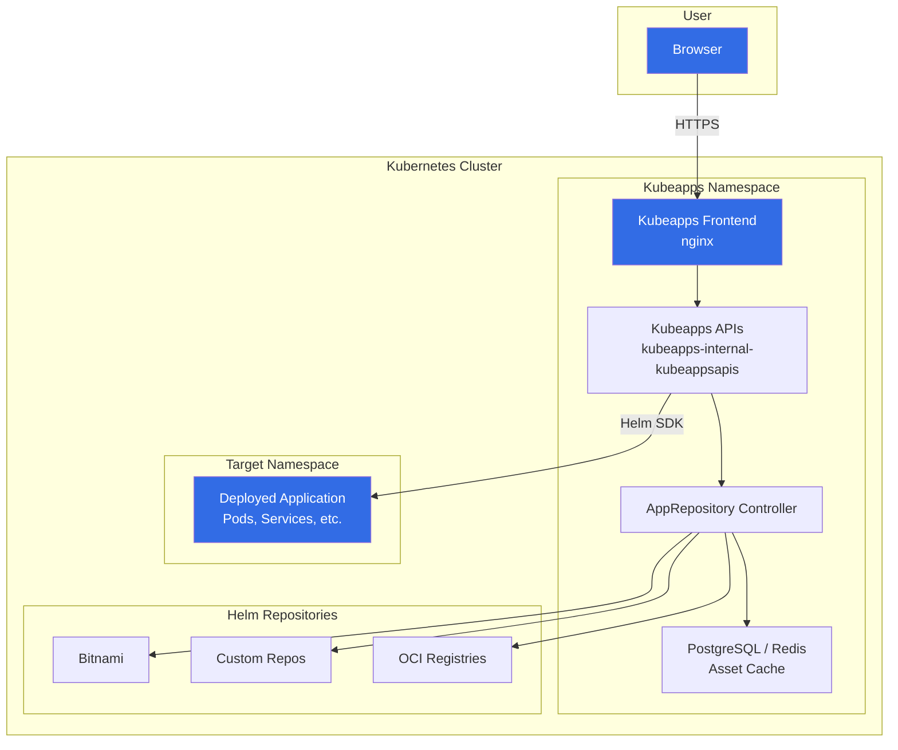

---

# Kubeapps - Application Dashboard for Kubernetes


- Welcome to the `Kubeapps` hands-on lab! In this tutorial, you'll learn how to install and use `Kubeapps`, a web-based UI for deploying and managing applications on your Kubernetes cluster using Helm charts.
- You'll set up Kubeapps, configure authentication, browse application catalogs, deploy applications, and manage their lifecycle through the dashboard.

---

## What will we learn?

- What `Kubeapps` is and why it is useful
- How to install `Kubeapps` using Helm
- How to configure authentication and RBAC for `Kubeapps`
- How to browse, deploy, upgrade, and delete applications from the dashboard
- How to add custom Helm repositories and private registries
- How to manage application catalogs and configurations
- Troubleshooting and best practices

---

## Official Documentation & References

| Resource                         | Link                                                                                                     |
| -------------------------------- | -------------------------------------------------------------------------------------------------------- |
| Kubeapps Official Site           | [kubeapps.dev](https://kubeapps.dev/)                                                                     |
| Kubeapps GitHub Repository       | [github.com/vmware-tanzu/kubeapps](https://github.com/vmware-tanzu/kubeapps)                             |
| Kubeapps Documentation           | [kubeapps.dev/docs](https://kubeapps.dev/docs/latest/)                                                    |
| Bitnami Kubeapps Helm Chart      | [artifacthub.io/packages/helm/bitnami/kubeapps](https://artifacthub.io/packages/helm/bitnami/kubeapps)   |
| Helm Official Docs               | [helm.sh/docs](https://helm.sh/docs/)                                                                     |
| Kubernetes RBAC                  | [kubernetes.io/docs/reference/access-authn-authz/rbac](https://kubernetes.io/docs/reference/access-authn-authz/rbac/) |

---

## Prerequisites

- A running Kubernetes cluster (minikube, kind, Docker Desktop, or cloud-managed)
- `kubectl` installed and configured to communicate with your cluster
- `Helm` (v3+) installed
- A web browser to access the Kubeapps dashboard
- Basic understanding of Helm charts (see [Lab 13 - HelmChart](../13-HelmChart/README.md))

---

## Introduction

### What is Kubeapps?

- `Kubeapps` is an **in-cluster web-based application** that enables users to deploy and manage applications on a Kubernetes cluster using Helm charts.
- It provides a **graphical user interface (GUI)** for browsing, deploying, upgrading, and deleting Helm-based applications.
- Think of it as an "App Store" for your Kubernetes cluster.

### Why use Kubeapps?

- **Visual application catalog**: Browse Helm charts from multiple repositories with a rich UI
- **One-click deployments**: Deploy complex applications without writing `helm install` commands
- **Self-service**: Enable developers to deploy applications without deep Kubernetes knowledge
- **Multi-repository support**: Aggregate charts from multiple Helm repositories and OCI registries
- **Upgrade management**: View available upgrades and apply them through the UI
- **Multi-cluster support**: Manage applications across multiple Kubernetes clusters
- **RBAC integration**: Control who can deploy what, based on Kubernetes RBAC

### Architecture



### Key Components

| Component                  | Description                                                                   |
| -------------------------- | ----------------------------------------------------------------------------- |
| **Kubeapps Frontend**      | Nginx-based web UI that users interact with through the browser               |
| **Kubeapps APIs**          | Backend service that handles Helm operations, catalog browsing, and auth      |
| **AppRepository Controller** | Syncs Helm chart metadata from configured repositories into the asset cache |
| **Asset Cache (DB)**       | PostgreSQL or Redis instance storing chart metadata for fast catalog browsing  |

---

## Common Operations

Below is a reference of common operations you'll perform with `Kubeapps`, both through the UI and via command line.

### Helm CLI Reference for Kubeapps

??? example "`helm install` - Install Kubeapps"

      **Syntax:** `helm install kubeapps bitnami/kubeapps [options]`

      **Description:** Deploys Kubeapps to your Kubernetes cluster.

      - Installs all Kubeapps components (frontend, API server, controller, database)
      - Creates the necessary RBAC resources
      - Configures the default chart repositories

          ```bash
          # Basic install
          helm install kubeapps bitnami/kubeapps \
            --namespace kubeapps --create-namespace

          # Install with custom values
          helm install kubeapps bitnami/kubeapps \
            --namespace kubeapps --create-namespace \
            -f custom-values.yaml

          # Install with specific chart version
          helm install kubeapps bitnami/kubeapps \
            --namespace kubeapps --create-namespace \
            --version 15.0.0
          ```

??? example "Create ServiceAccount and Token"

      **Description:** Create a ServiceAccount with cluster-admin permissions for Kubeapps authentication.

      - Kubeapps uses Kubernetes tokens for authentication
      - The ServiceAccount must have appropriate RBAC permissions
      - For production, use more restrictive roles than cluster-admin

          ```bash
          # Create a namespace for the operator
          kubectl create namespace kubeapps-user

          # Create a ServiceAccount
          kubectl create serviceaccount kubeapps-operator \
            -n kubeapps-user

          # Bind cluster-admin role
          kubectl create clusterrolebinding kubeapps-operator \
            --clusterrole=cluster-admin \
            --serviceaccount=kubeapps-user:kubeapps-operator

          # Create a token secret
          cat <<EOF | kubectl apply -f -
          apiVersion: v1
          kind: Secret
          metadata:
            name: kubeapps-operator-token
            namespace: kubeapps-user
            annotations:
              kubernetes.io/service-account.name: kubeapps-operator
          type: kubernetes.io/service-account-token
          EOF

          # Get the token
          kubectl get secret kubeapps-operator-token \
            -n kubeapps-user \
            -o go-template='{{.data.token | base64decode}}'
          ```

??? example "Access Kubeapps Dashboard"

      **Description:** Access the Kubeapps web UI through port-forwarding or Ingress.

      - Port-forwarding is the simplest approach for development
      - For production, configure an Ingress with TLS

          ```bash
          # Port-forward to access the dashboard
          kubectl port-forward svc/kubeapps \
            -n kubeapps 8080:80

          # Open in browser: http://localhost:8080
          # Paste the token from the previous step to log in
          ```

??? example "Add Custom Helm Repository"

      **Description:** Add a custom Helm chart repository to Kubeapps.

      - Can be done through the UI or using kubectl
      - Supports public and private repositories
      - Supports OCI-based registries

          ```bash
          # Add a custom repository via kubectl
          cat <<EOF | kubectl apply -f -
          apiVersion: kubeapps.com/v1alpha1
          kind: AppRepository
          metadata:
            name: my-custom-repo
            namespace: kubeapps
          spec:
            url: https://charts.example.com
            # For private repos, add auth:
            # auth:
            #   header:
            #     secretKeyRef:
            #       name: my-repo-auth
            #       key: authorizationHeader
          EOF
          ```

---

## RBAC Configuration

`Kubeapps` leverages Kubernetes RBAC to control access. Different roles provide different levels of access.

### Role Examples

#### Read-Only User (View Only)

```yaml
# kubeapps-viewer-role.yaml
apiVersion: rbac.authorization.k8s.io/v1
kind: ClusterRole
metadata:
  name: kubeapps-viewer
rules:
  # Allow listing Helm releases
  - apiGroups: [""]
    resources: ["secrets"]
    verbs: ["get", "list"]
  # Allow viewing workloads
  - apiGroups: ["apps"]
    resources: ["deployments", "statefulsets", "daemonsets"]
    verbs: ["get", "list", "watch"]
  - apiGroups: [""]
    resources: ["pods", "services", "configmaps"]
    verbs: ["get", "list", "watch"]
```

#### Namespace Deployer (Deploy to Specific Namespace)

```yaml
# kubeapps-deployer-role.yaml
apiVersion: rbac.authorization.k8s.io/v1
kind: Role
metadata:
  name: kubeapps-deployer
  namespace: my-team
rules:
  - apiGroups: ["*"]
    resources: ["*"]
    verbs: ["*"]
```

#### Cluster Admin (Full Access)

```bash
# For lab/development purposes, bind to cluster-admin
kubectl create clusterrolebinding kubeapps-admin \
  --clusterrole=cluster-admin \
  --serviceaccount=kubeapps-user:kubeapps-operator
```

!!! warning "Production RBAC"
    Never use `cluster-admin` in production environments. Create specific roles that grant only the minimum permissions needed for each user or team.

---

# Lab

### Step 01 - Install `Kubeapps`

#### Add the Bitnami Helm repository

```bash
# Add the Bitnami repository
helm repo add bitnami https://charts.bitnami.com/bitnami

# Update the repository index
helm repo update
```

#### Install Kubeapps

```bash
# Install Kubeapps in its own namespace
helm install kubeapps bitnami/kubeapps \
  --namespace kubeapps \
  --create-namespace \
  --wait
```

#### Verify the installation

```bash
# Check all pods are running
kubectl get pods -n kubeapps

# Expected output (pod names will vary):
# NAME                                                READY   STATUS    RESTARTS   AGE
# kubeapps-...                                        1/1     Running   0          2m
# kubeapps-internal-kubeappsapis-...                   1/1     Running   0          2m
# kubeapps-internal-apprepository-controller-...       1/1     Running   0          2m
# kubeapps-postgresql-0                                1/1     Running   0          2m

# Check all services
kubectl get svc -n kubeapps
```

---

### Step 02 - Create Authentication Credentials

- `Kubeapps` uses Kubernetes tokens for authentication. We need to create a ServiceAccount and generate a token:

```bash
# Create a dedicated namespace for Kubeapps users
kubectl create namespace kubeapps-user
```

```bash
# Create a ServiceAccount for the Kubeapps operator
kubectl create serviceaccount kubeapps-operator \
  -n kubeapps-user
```

```bash
# Bind the cluster-admin role to the service account
kubectl create clusterrolebinding kubeapps-operator \
  --clusterrole=cluster-admin \
  --serviceaccount=kubeapps-user:kubeapps-operator
```

```bash
# Create a Secret to generate the token
cat <<EOF | kubectl apply -f -
apiVersion: v1
kind: Secret
metadata:
  name: kubeapps-operator-token
  namespace: kubeapps-user
  annotations:
    kubernetes.io/service-account.name: kubeapps-operator
type: kubernetes.io/service-account-token
EOF
```

#### Retrieve the token

```bash
# Get the authentication token (save this - you'll need it to log in)
kubectl get secret kubeapps-operator-token \
  -n kubeapps-user \
  -o go-template='{{.data.token | base64decode}}'
```

!!! tip "Save the token"
    Copy the token output and save it somewhere accessible. You'll paste it into the Kubeapps login page.

---

### Step 03 - Access the Dashboard

#### Option A: Port Forwarding (Development)

```bash
# Forward port 8080 to the Kubeapps service
kubectl port-forward svc/kubeapps -n kubeapps 8080:80
```

- Open your browser and navigate to: **http://localhost:8080**
- Paste the token from Step 02 into the login field
- Click **Submit**

#### Option B: Ingress (Production-like)

```yaml
# kubeapps-ingress.yaml
apiVersion: networking.k8s.io/v1
kind: Ingress
metadata:
  name: kubeapps-ingress
  namespace: kubeapps
  annotations:
    nginx.ingress.kubernetes.io/rewrite-target: /
spec:
  ingressClassName: nginx
  rules:
    - host: kubeapps.local
      http:
        paths:
          - path: /
            pathType: Prefix
            backend:
              service:
                name: kubeapps
                port:
                  number: 80
```

```bash
# Apply the ingress
kubectl apply -f kubeapps-ingress.yaml

# Add to /etc/hosts (Linux/macOS)
echo "127.0.0.1 kubeapps.local" | sudo tee -a /etc/hosts

# Access via: http://kubeapps.local
```

---

### Step 04 - Browse the Application Catalog

Once logged in, you'll see the Kubeapps dashboard:

1. **Catalog tab**: Browse available Helm charts from configured repositories
2. **Applications tab**: View deployed Helm releases
3. **Configuration tab**: Manage app repositories and settings

#### Browse available charts

- Click on the **Catalog** tab
- Use the search bar to find applications (e.g., "nginx", "redis", "postgresql")
- Click on a chart card to see details, including:
  - Chart description and README
  - Available versions
  - Default configuration values
  - Installation instructions

---

### Step 05 - Deploy an Application via the UI

Let's deploy **NGINX** using the Kubeapps dashboard:

1. Click **Catalog** in the navigation
2. Search for **nginx**
3. Select **bitnami/nginx** from the results
4. Click **Deploy**
5. Configure the deployment:
   - **Name**: `my-nginx`
   - **Namespace**: `default` (or create a new one)
   - Review the default values in the YAML editor
   - Modify `replicaCount` to `2` if desired
6. Click **Deploy** to install

#### Verify from the command line

```bash
# Check the Helm release
helm list --all-namespaces

# Check the deployed resources
kubectl get all -l app.kubernetes.io/instance=my-nginx

# Check the pods
kubectl get pods -l app.kubernetes.io/instance=my-nginx
```

---

### Step 06 - Deploy an Application via CLI

You can also deploy applications that will appear in the Kubeapps dashboard using the Helm CLI:

```bash
# Deploy Redis via Helm (Kubeapps will detect it automatically)
helm install my-redis bitnami/redis \
  --namespace default \
  --set architecture=standalone \
  --set auth.enabled=false
```

- Go back to the Kubeapps dashboard
- Click on the **Applications** tab
- You should see both `my-nginx` and `my-redis` listed

---

### Step 07 - Upgrade an Application

#### Via the Dashboard

1. Click on **Applications** tab
2. Click on **my-nginx**
3. Click **Upgrade**
4. Modify the values (e.g., change `replicaCount` to `3`)
5. Click **Deploy** to apply the upgrade

#### Via CLI (also reflected in the dashboard)

```bash
# Upgrade Redis to enable auth
helm upgrade my-redis bitnami/redis \
  --set architecture=standalone \
  --set auth.enabled=true \
  --set auth.password=mypassword

# Check the upgrade in the dashboard
# The revision number should increment
helm history my-redis
```

---

### Step 08 - Add a Custom Repository

#### Via the Dashboard

1. Click on **Configuration** in the navigation (gear icon)
2. Click **App Repositories**
3. Click **Add App Repository**
4. Fill in:
   - **Name**: `codecentric`
   - **URL**: `https://codecentric.github.io/helm-charts`
5. Click **Install Repository**

#### Via kubectl

```bash
# Add a custom repository via kubectl manifest
cat <<EOF | kubectl apply -n kubeapps -f -
apiVersion: kubeapps.com/v1alpha1
kind: AppRepository
metadata:
  name: codecentric
  namespace: kubeapps
spec:
  url: https://codecentric.github.io/helm-charts
EOF
```

```bash
# Verify the repository was added
kubectl get apprepositories -n kubeapps
```

- Go to the **Catalog** tab and you should now see charts from the new repository.

---

### Step 09 - View Application Details

- In the Kubeapps dashboard, click on any deployed application to see:
  - **Status**: The current state of the Helm release
  - **Resources**: All Kubernetes resources created by the chart (Pods, Services, ConfigMaps, etc.)
  - **Notes**: Post-install notes from the chart
  - **Values**: The configuration values used for the deployment
  - **Revision History**: All previous versions and their configurations

#### Compare with CLI output

```bash
# View the same information from the command line
helm status my-nginx
helm get values my-nginx
helm history my-nginx
kubectl get all -l app.kubernetes.io/instance=my-nginx
```

---

### Step 10 - Delete an Application

#### Via the Dashboard

1. Click on **Applications** tab
2. Click on the application you want to delete (e.g., **my-nginx**)
3. Click **Delete**
4. Confirm the deletion

#### Via CLI

```bash
# Delete the Redis deployment
helm uninstall my-redis
```

---

### Step 11 - Create a Restricted User

Create a ServiceAccount with limited permissions (namespace-scoped only):

```bash
# Create a namespace for the restricted user
kubectl create namespace team-dev

# Create a ServiceAccount
kubectl create serviceaccount kubeapps-dev-user -n team-dev

# Create a Role with limited permissions
cat <<EOF | kubectl apply -f -
apiVersion: rbac.authorization.k8s.io/v1
kind: Role
metadata:
  name: kubeapps-dev-role
  namespace: team-dev
rules:
  - apiGroups: ["*"]
    resources: ["*"]
    verbs: ["*"]
EOF

# Bind the role to the ServiceAccount
cat <<EOF | kubectl apply -f -
apiVersion: rbac.authorization.k8s.io/v1
kind: RoleBinding
metadata:
  name: kubeapps-dev-binding
  namespace: team-dev
subjects:
  - kind: ServiceAccount
    name: kubeapps-dev-user
    namespace: team-dev
roleRef:
  kind: Role
  name: kubeapps-dev-role
  apiGroup: rbac.authorization.k8s.io
EOF

# Create a token for the dev user
cat <<EOF | kubectl apply -f -
apiVersion: v1
kind: Secret
metadata:
  name: kubeapps-dev-token
  namespace: team-dev
  annotations:
    kubernetes.io/service-account.name: kubeapps-dev-user
type: kubernetes.io/service-account-token
EOF

# Get the token
kubectl get secret kubeapps-dev-token \
  -n team-dev \
  -o go-template='{{.data.token | base64decode}}'
```

- Log out of Kubeapps and log in with this new token
- You should only be able to deploy applications to the `team-dev` namespace

---

# Exercises

The following exercises will test your understanding of `Kubeapps`.
Try to solve each exercise on your own before revealing the solution.

---

#### 01. Deploy WordPress with Custom Values

Deploy a WordPress instance using the Kubeapps dashboard with custom database credentials and a specific number of replicas.

#### Scenario:

- Your team needs a quick WordPress deployment for a staging environment.
- You need to customize the database password and blog name before deploying.

**Hint:** Search for "wordpress" in the catalog, modify the `wordpressPassword`, `wordpressBlogName`, and `replicaCount` values.

<details>
<summary>Solution</summary>

```bash
# Option 1: Via the Kubeapps UI
# 1. Go to Catalog > search "wordpress"
# 2. Select bitnami/wordpress
# 3. Click Deploy
# 4. In the values editor, set:
#    - wordpressUsername: admin
#    - wordpressPassword: my-staging-password
#    - wordpressBlogName: "Staging Blog"
#    - replicaCount: 2
# 5. Click Deploy

# Option 2: Via CLI (reflected in the dashboard)
helm install my-wordpress bitnami/wordpress \
  --namespace default \
  --set wordpressUsername=admin \
  --set wordpressPassword=my-staging-password \
  --set wordpressBlogName="Staging Blog" \
  --set replicaCount=2

# Verify the deployment
kubectl get pods -l app.kubernetes.io/instance=my-wordpress
kubectl get svc -l app.kubernetes.io/instance=my-wordpress

# Access WordPress via port-forward
kubectl port-forward svc/my-wordpress 8081:80

# Open http://localhost:8081 in your browser

# Clean up
helm uninstall my-wordpress
```

</details>

---

#### 02. Add a Private Helm Repository

Add a private Helm repository to Kubeapps that requires authentication. Use basic auth credentials.

#### Scenario:

- Your organization hosts internal Helm charts in a private repository.
- The repository requires basic authentication (username/password).

**Hint:** Create a Kubernetes Secret with auth credentials first, then reference it in the AppRepository.

<details>
<summary>Solution</summary>

```bash
# 1. Create a secret with the repository credentials
kubectl create secret generic my-private-repo-auth \
  -n kubeapps \
  --from-literal=authorizationHeader="Basic $(echo -n 'myuser:mypassword' | base64)"

# 2. Create the AppRepository with auth reference
cat <<EOF | kubectl apply -n kubeapps -f -
apiVersion: kubeapps.com/v1alpha1
kind: AppRepository
metadata:
  name: my-private-repo
  namespace: kubeapps
spec:
  url: https://charts.example.com
  auth:
    header:
      secretKeyRef:
        name: my-private-repo-auth
        key: authorizationHeader
EOF

# 3. Verify the repository was added
kubectl get apprepositories -n kubeapps

# 4. Check the sync status
kubectl get pods -n kubeapps -l app=apprepo-sync-my-private-repo

# Clean up
kubectl delete apprepository my-private-repo -n kubeapps
kubectl delete secret my-private-repo-auth -n kubeapps
```

</details>

---

#### 03. Upgrade an Application and Rollback

Deploy PostgreSQL, upgrade it with new configuration, then rollback to the previous version.

#### Scenario:

- You deployed PostgreSQL with default settings.
- After upgrading with new memory limits, the pods fail to start.
- You need to rollback to the working version.

**Hint:** Use the Kubeapps UI or `helm rollback` to revert to a previous revision.

<details>
<summary>Solution</summary>

```bash
# 1. Deploy PostgreSQL
helm install my-postgres bitnami/postgresql \
  --namespace default \
  --set auth.postgresPassword=initial-password

# Verify it's running
kubectl get pods -l app.kubernetes.io/instance=my-postgres

# 2. Upgrade with new configuration
helm upgrade my-postgres bitnami/postgresql \
  --set auth.postgresPassword=initial-password \
  --set primary.resources.requests.memory=2Gi \
  --set primary.resources.limits.memory=4Gi

# 3. Check the history
helm history my-postgres

# 4. Rollback to the previous revision (via CLI)
helm rollback my-postgres 1

# OR via the Kubeapps dashboard:
# - Go to Applications > my-postgres
# - Click on the revision dropdown
# - Select revision 1
# - Click Rollback

# 5. Verify the rollback
helm history my-postgres
kubectl get pods -l app.kubernetes.io/instance=my-postgres

# Clean up
helm uninstall my-postgres
```

</details>

---

#### 04. Multi-Namespace Deployment

Create two separate ServiceAccounts with permissions for different namespaces, deploy applications in each namespace using the appropriate token.

#### Scenario:

- Your organization has two teams: `team-frontend` and `team-backend`.
- Each team should only be able to deploy to their own namespace.
- Test that RBAC prevents cross-namespace deployments.

**Hint:** Create two namespaces, two ServiceAccounts, and namespace-scoped RoleBindings.

<details>
<summary>Solution</summary>

```bash
# 1. Create namespaces
kubectl create namespace team-frontend
kubectl create namespace team-backend

# 2. Create ServiceAccounts
kubectl create serviceaccount frontend-deployer -n team-frontend
kubectl create serviceaccount backend-deployer -n team-backend

# 3. Create namespace-scoped Roles and RoleBindings
for TEAM in frontend backend; do
  cat <<EOF | kubectl apply -f -
apiVersion: rbac.authorization.k8s.io/v1
kind: Role
metadata:
  name: deployer-role
  namespace: team-${TEAM}
rules:
  - apiGroups: ["*"]
    resources: ["*"]
    verbs: ["*"]
---
apiVersion: rbac.authorization.k8s.io/v1
kind: RoleBinding
metadata:
  name: deployer-binding
  namespace: team-${TEAM}
subjects:
  - kind: ServiceAccount
    name: ${TEAM}-deployer
    namespace: team-${TEAM}
roleRef:
  kind: Role
  name: deployer-role
  apiGroup: rbac.authorization.k8s.io
---
apiVersion: v1
kind: Secret
metadata:
  name: ${TEAM}-deployer-token
  namespace: team-${TEAM}
  annotations:
    kubernetes.io/service-account.name: ${TEAM}-deployer
type: kubernetes.io/service-account-token
EOF
done

# 4. Get tokens for each team
echo "=== Frontend Token ==="
kubectl get secret frontend-deployer-token \
  -n team-frontend \
  -o go-template='{{.data.token | base64decode}}'

echo ""
echo "=== Backend Token ==="
kubectl get secret backend-deployer-token \
  -n team-backend \
  -o go-template='{{.data.token | base64decode}}'

# 5. Log into Kubeapps with the frontend token
# - You should only see the team-frontend namespace
# - Try deploying nginx to team-frontend (should succeed)
# - Try deploying to team-backend (should fail)

# Clean up
kubectl delete namespace team-frontend team-backend
```

</details>

---

#### 05. Configure Kubeapps with Custom Values

Reinstall Kubeapps with custom configuration: enable Ingress, change the number of frontend replicas, and configure a specific set of default repositories.

#### Scenario:

- You're setting up Kubeapps for a production environment.
- You need to configure it with Ingress, high availability, and specific repositories.

**Hint:** Create a custom `values.yaml` and pass it to `helm upgrade --install`.

<details>
<summary>Solution</summary>

```bash
# 1. Show the default values
helm show values bitnami/kubeapps > kubeapps-default-values.yaml

# 2. Create a custom values file
cat <<EOF > kubeapps-custom-values.yaml
# Frontend configuration
frontend:
  replicaCount: 2

# Ingress configuration
ingress:
  enabled: true
  hostname: kubeapps.local
  ingressClassName: nginx
  annotations:
    nginx.ingress.kubernetes.io/proxy-body-size: "50m"

# Default app repositories
apprepository:
  initialRepos:
    - name: bitnami
      url: https://charts.bitnami.com/bitnami
    - name: ingress-nginx
      url: https://kubernetes.github.io/ingress-nginx
    - name: jetstack
      url: https://charts.jetstack.io
    - name: prometheus-community
      url: https://prometheus-community.github.io/helm-charts
EOF

# 3. Upgrade Kubeapps with custom values
helm upgrade --install kubeapps bitnami/kubeapps \
  --namespace kubeapps \
  --create-namespace \
  -f kubeapps-custom-values.yaml \
  --wait

# 4. Verify the changes
kubectl get pods -n kubeapps
kubectl get ingress -n kubeapps
kubectl get apprepositories -n kubeapps

# Clean up
rm kubeapps-default-values.yaml kubeapps-custom-values.yaml
```

</details>

---

#### 06. Monitor Application Health

Deploy an application through Kubeapps and use the dashboard to monitor its health. Intentionally break it and observe the status changes.

#### Scenario:

- You've deployed an application and need to ensure it stays healthy.
- You want to understand how Kubeapps reports application health status.

**Hint:** Deploy nginx, then force-delete a pod or scale down to 0 and observe the dashboard.

<details>
<summary>Solution</summary>

```bash
# 1. Deploy nginx via Kubeapps or CLI
helm install health-test bitnami/nginx \
  --namespace default \
  --set replicaCount=3

# 2. Check the healthy state in Kubeapps dashboard
# - Go to Applications > health-test
# - All pods should show as Running
# - Status should be "Deployed"

# 3. Break the application - delete a pod
kubectl delete pod -l app.kubernetes.io/instance=health-test --wait=false

# 4. Observe in the dashboard:
# - One pod will briefly show as Terminating
# - A new pod will appear as ContainerCreating
# - Eventually all pods return to Running

# 5. Scale down to 0 replicas
kubectl scale deployment health-test-nginx --replicas=0

# 6. Observe in the dashboard:
# - No pods running
# - Application shows degraded state

# 7. Scale back up
kubectl scale deployment health-test-nginx --replicas=3

# 8. Verify recovery in the dashboard

# Clean up
helm uninstall health-test
```

</details>

---

## Finalize & Cleanup

- To remove all resources created by this lab:

```bash
# Remove deployed applications
helm uninstall my-nginx 2>/dev/null
helm uninstall my-redis 2>/dev/null
helm uninstall my-wordpress 2>/dev/null
helm uninstall my-postgres 2>/dev/null
helm uninstall health-test 2>/dev/null

# Remove Kubeapps
helm uninstall kubeapps -n kubeapps

# Remove namespaces
kubectl delete namespace kubeapps kubeapps-user team-dev 2>/dev/null

# Remove ClusterRoleBinding
kubectl delete clusterrolebinding kubeapps-operator 2>/dev/null
```

---

## Troubleshooting

- **Kubeapps pods not starting:**

Check pod status and events:

```bash
kubectl get pods -n kubeapps
kubectl describe pod <pod-name> -n kubeapps
kubectl logs <pod-name> -n kubeapps
```

<br>

- **Cannot log in to Kubeapps:**

Ensure the ServiceAccount token is valid and the ClusterRoleBinding exists:

```bash
# Verify the token secret exists
kubectl get secret kubeapps-operator-token -n kubeapps-user

# Verify the ClusterRoleBinding exists
kubectl get clusterrolebinding kubeapps-operator

# Regenerate the token if needed
kubectl delete secret kubeapps-operator-token -n kubeapps-user
# Then recreate it (see Step 02)
```

<br>

- **Catalog shows no charts:**

The AppRepository controller may need time to sync. Check its logs:

```bash
# Check sync pods
kubectl get pods -n kubeapps -l app=apprepo

# Check controller logs
kubectl logs -n kubeapps -l app.kubernetes.io/component=apprepository-controller

# Verify AppRepositories exist
kubectl get apprepositories -n kubeapps
```

<br>

- **Port-forward not working:**

Ensure the service is running and no other process uses port 8080:

```bash
# Check the service exists
kubectl get svc kubeapps -n kubeapps

# Try a different local port
kubectl port-forward svc/kubeapps -n kubeapps 9090:80
```

<br>

- **Application deployment fails from the dashboard:**

Check the Kubeapps API server logs for details:

```bash
kubectl logs -n kubeapps -l app.kubernetes.io/component=kubeappsapis
```

<br>

- **RBAC errors (403 Forbidden):**

The token's ServiceAccount lacks necessary permissions. Check and update the RoleBinding:

```bash
# Check current bindings
kubectl get clusterrolebindings | grep kubeapps
kubectl get rolebindings -n <target-namespace> | grep kubeapps

# Verify the ServiceAccount exists
kubectl get serviceaccount -n kubeapps-user
```

---

## Next Steps

- Learn about [Kubeapps multi-cluster support](https://kubeapps.dev/docs/latest/howto/multi-cluster/) for managing apps across clusters
- Explore [OCI registry support](https://kubeapps.dev/docs/latest/howto/oci-registries/) for Helm charts stored in container registries
- Integrate Kubeapps with [OIDC providers](https://kubeapps.dev/docs/latest/howto/OIDC/) (Dex, Keycloak) for SSO authentication
- Set up [Kubeapps with Operators](https://kubeapps.dev/docs/latest/howto/operators/) to manage operator-based applications
- Explore [Carvel packages](https://kubeapps.dev/docs/latest/howto/carvel/) as an alternative packaging format
- Configure [private chart repositories](https://kubeapps.dev/docs/latest/howto/private-app-repository/) with Docker registry integration
