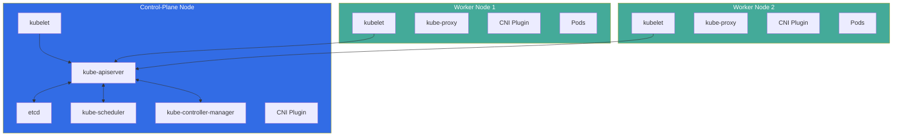

---

# kubeadm - Bootstrap a Kubernetes Cluster from Scratch

- In this lab we will learn how to use **kubeadm** to bootstrap a fully functional Kubernetes cluster. We will set up a control-plane node, join worker nodes, install a CNI plugin, and verify the cluster is operational.

---

## What will we learn?

- What `kubeadm` is and its role in the Kubernetes ecosystem
- How to prepare nodes (control-plane and workers) for cluster creation
- How to initialize a control-plane node with `kubeadm init`
- How to join worker nodes with `kubeadm join`
- How to install a Container Network Interface (CNI) plugin
- How to configure `kubectl` for the new cluster
- How to upgrade a cluster using `kubeadm upgrade`
- How to reset and tear down a cluster with `kubeadm reset`
- Best practices for production-grade cluster bootstrapping

---

## Official Documentation & References

| Resource                        | Link                                                                                                                |
|---------------------------------|---------------------------------------------------------------------------------------------------------------------|
| kubeadm Overview                | [kubernetes.io/docs](https://kubernetes.io/docs/reference/setup-tools/kubeadm/)                                     |
| Creating a cluster with kubeadm | [kubernetes.io/docs](https://kubernetes.io/docs/setup/production-environment/tools/kubeadm/create-cluster-kubeadm/) |
| kubeadm init                    | [kubernetes.io/docs](https://kubernetes.io/docs/reference/setup-tools/kubeadm/kubeadm-init/)                        |
| kubeadm join                    | [kubernetes.io/docs](https://kubernetes.io/docs/reference/setup-tools/kubeadm/kubeadm-join/)                        |
| kubeadm upgrade                 | [kubernetes.io/docs](https://kubernetes.io/docs/reference/setup-tools/kubeadm/kubeadm-upgrade/)                     |
| kubeadm reset                   | [kubernetes.io/docs](https://kubernetes.io/docs/reference/setup-tools/kubeadm/kubeadm-reset/)                       |
| Installing kubeadm              | [kubernetes.io/docs](https://kubernetes.io/docs/setup/production-environment/tools/kubeadm/install-kubeadm/)        |
| Container Runtimes              | [kubernetes.io/docs](https://kubernetes.io/docs/setup/production-environment/container-runtimes/)                   |
| CNI Plugins                     | [kubernetes.io/docs](https://kubernetes.io/docs/concepts/extend-kubernetes/compute-storage-net/network-plugins/)    |

---

## Prerequisites

- **Two or more Linux machines** (physical or virtual) - one for the control-plane and one or more for workers
- Each machine must have at least **2 CPUs** and **2 GB RAM** (recommended)
- Full network connectivity between all machines
- Unique hostname, MAC address, and `product_uuid` for each node
- Swap disabled on all nodes
- A supported container runtime installed (containerd, CRI-O, or Docker with cri-dockerd)

!!! note "Lab Environment Options"

    You can run this lab using:

    - **Multipass** VMs on macOS/Linux
    - **Vagrant + VirtualBox** or **libvirt**
    - **Cloud VMs** (AWS EC2, GCP Compute Engine, Azure VMs)
    - **Docker containers** for a quick local experiment (see the included `setup-k8s.sh`)
    - **LXD containers** on Linux

    For this lab, instructions are given for **Ubuntu/Debian**-based systems. Adapt package commands as needed for other distributions.

---

## kubeadm Architecture Overview



| Component               | Role                                                              |
| ------------------------ | ----------------------------------------------------------------- |
| `kubeadm init`           | Bootstraps the control-plane node                                 |
| `kubeadm join`           | Joins a worker (or additional control-plane) node to the cluster  |
| `kubeadm upgrade`        | Upgrades the cluster to a newer Kubernetes version                |
| `kubeadm reset`          | Tears down the cluster on a node (undo `init` or `join`)          |
| `kubeadm token`          | Manages bootstrap tokens for node joining                         |
| `kubeadm certs`          | Manages cluster certificates                                      |

---

## 01. Prepare all nodes

Run these steps on **every node** (control-plane and workers).

### 01.01 Disable swap

Kubernetes requires swap to be disabled:

```bash
# Disable swap immediately
sudo swapoff -a

# Disable swap permanently (comment out swap in fstab)
sudo sed -i '/ swap / s/^/#/' /etc/fstab
```

### 01.02 Load required kernel modules

```bash
# Load modules needed by containerd/Kubernetes networking
cat <<EOF | sudo tee /etc/modules-load.d/k8s.conf
overlay
br_netfilter
EOF

sudo modprobe overlay
sudo modprobe br_netfilter
```

### 01.03 Set sysctl parameters for Kubernetes networking

```bash
cat <<EOF | sudo tee /etc/sysctl.d/k8s.conf
net.bridge.bridge-nf-call-iptables  = 1
net.bridge.bridge-nf-call-ip6tables = 1
net.ipv4.ip_forward                 = 1
EOF

# Apply without reboot
sudo sysctl --system
```

### 01.04 Install the container runtime (containerd)

```bash
# Install containerd
sudo apt-get update
sudo apt-get install -y containerd

# Generate default config
sudo mkdir -p /etc/containerd
containerd config default | sudo tee /etc/containerd/config.toml

# Enable SystemdCgroup (required for kubeadm)
sudo sed -i 's/SystemdCgroup = false/SystemdCgroup = true/' /etc/containerd/config.toml

# Restart containerd
sudo systemctl restart containerd
sudo systemctl enable containerd
```

!!! tip "Why containerd?"

    * Since Kubernetes 1.24, **dockershim** was removed from `kubelet`.
    * The recommended container runtimes are **containerd** or **CRI-O**.
    * If you need Docker CLI tools, install Docker separately - it will use containerd under the hood.

### 01.05 Install kubeadm, kubelet, and kubectl

=== "Ubuntu / Debian"

    ```bash
    # Install prerequisites
    sudo apt-get update
    sudo apt-get install -y apt-transport-https ca-certificates curl gpg

    # Add the Kubernetes apt repository signing key
    sudo mkdir -p -m 755 /etc/apt/keyrings
    curl -fsSL https://pkgs.k8s.io/core:/stable:/v1.31/deb/Release.key | \
        sudo gpg --dearmor -o /etc/apt/keyrings/kubernetes-apt-keyring.gpg

    # Add the Kubernetes apt repository
    echo 'deb [signed-by=/etc/apt/keyrings/kubernetes-apt-keyring.gpg] https://pkgs.k8s.io/core:/stable:/v1.31/deb/ /' | \
        sudo tee /etc/apt/sources.list.d/kubernetes.list

    # Install kubeadm, kubelet, and kubectl
    sudo apt-get update
    sudo apt-get install -y kubelet kubeadm kubectl

    # Pin their versions to prevent accidental upgrades
    sudo apt-mark hold kubelet kubeadm kubectl
    ```

=== "RHEL / CentOS / Fedora"

    ```bash
    # Add the Kubernetes yum repository
    cat <<EOF | sudo tee /etc/yum.repos.d/kubernetes.repo
    [kubernetes]
    name=Kubernetes
    baseurl=https://pkgs.k8s.io/core:/stable:/v1.31/rpm/
    enabled=1
    gpgcheck=1
    gpgkey=https://pkgs.k8s.io/core:/stable:/v1.31/rpm/repodata/repomd.xml.key
    EOF

    # Install kubeadm, kubelet, and kubectl
    sudo yum install -y kubelet kubeadm kubectl --disableexcludes=kubernetes

    # Enable kubelet service
    sudo systemctl enable kubelet
    ```

### 01.06 Enable the kubelet service

```bash
sudo systemctl enable --now kubelet
```

!!! note

    At this point the kubelet will crash-loop every few seconds - this is **expected**. It is waiting for `kubeadm init` or `kubeadm join` to provide its configuration.

---

## 02. Initialize the control-plane node

Run these steps **only on the control-plane node**.

### 02.01 Run kubeadm init

```bash
sudo kubeadm init \
    --pod-network-cidr=10.244.0.0/16 \
    --apiserver-advertise-address=<CONTROL_PLANE_IP>
```

!!! warning "Replace Placeholders"

    Replace `<CONTROL_PLANE_IP>` with the actual IP address of your control-plane node. The `--pod-network-cidr` must match the CIDR expected by your CNI plugin (10.244.0.0/16 for Flannel, 192.168.0.0/16 for Calico).

Expected output (excerpt):

```text
Your Kubernetes control-plane has initialized successfully!

To start using your cluster, you need to run the following as a regular user:

  mkdir -p $HOME/.kube
  sudo cp -i /etc/kubernetes/admin.conf $HOME/.kube/config
  sudo chown $(id -u):$(id -g) $HOME/.kube/config

Then you can join any number of worker nodes by running the following
on each as root:

  kubeadm join <CONTROL_PLANE_IP>:6443 --token <TOKEN> \
      --discovery-token-ca-cert-hash sha256:<HASH>
```

### 02.02 Configure kubectl

```bash
# Set up kubectl for the current user
mkdir -p $HOME/.kube
sudo cp -i /etc/kubernetes/admin.conf $HOME/.kube/config
sudo chown $(id -u):$(id -g) $HOME/.kube/config
```

### 02.03 Verify control-plane status

```bash
# The node should appear with status NotReady (until CNI is installed)
kubectl get nodes

# Check that control-plane pods are running
kubectl get pods -n kube-system
```

Expected output:

```text
NAME                                   READY   STATUS    RESTARTS   AGE
coredns-xxxxxxxxxx-xxxxx               0/1     Pending   0          1m
coredns-xxxxxxxxxx-xxxxx               0/1     Pending   0          1m
etcd-control-plane                     1/1     Running   0          1m
kube-apiserver-control-plane           1/1     Running   0          1m
kube-controller-manager-control-plane  1/1     Running   0          1m
kube-proxy-xxxxx                       1/1     Running   0          1m
kube-scheduler-control-plane           1/1     Running   0          1m
```

!!! note

    CoreDNS pods will stay in **Pending** state until a CNI plugin is installed. This is normal.

---

## 03. Install a CNI plugin

A CNI (Container Network Interface) plugin is required so pods can communicate across nodes. Choose **one** of the following:

=== "Flannel"

    ```bash
    kubectl apply -f https://github.com/flannel-io/flannel/releases/latest/download/kube-flannel.yml
    ```

    !!! note
        Flannel requires `--pod-network-cidr=10.244.0.0/16` to be set during `kubeadm init`.

=== "Calico"

    ```bash
    kubectl apply -f https://raw.githubusercontent.com/projectcalico/calico/v3.27.0/manifests/calico.yaml
    ```

    !!! note
        If you used `--pod-network-cidr=192.168.0.0/16` during `kubeadm init`, Calico works with zero additional config. For custom CIDRs, edit the `CALICO_IPV4POOL_CIDR` environment variable in the manifest.

=== "Cilium"

    ```bash
    # Install Cilium CLI
    CILIUM_CLI_VERSION=$(curl -s https://raw.githubusercontent.com/cilium/cilium-cli/main/stable.txt)
    CLI_ARCH=amd64
    curl -L --fail --remote-name-all \
        https://github.com/cilium/cilium-cli/releases/download/${CILIUM_CLI_VERSION}/cilium-linux-${CLI_ARCH}.tar.gz
    sudo tar xzvfC cilium-linux-${CLI_ARCH}.tar.gz /usr/local/bin
    rm cilium-linux-${CLI_ARCH}.tar.gz

    # Install Cilium into the cluster
    cilium install
    ```

After installing the CNI, verify all pods come up:

```bash
# Wait for all system pods to be running
kubectl get pods -n kube-system -w

# Node should now show Ready
kubectl get nodes
```

Expected output:

```text
NAME            STATUS   ROLES           AGE   VERSION
control-plane   Ready    control-plane   5m    v1.31.x
```

---

## 04. Join worker nodes

Run these steps on **each worker node**.

### 04.01 Use the join command from kubeadm init output

```bash
sudo kubeadm join <CONTROL_PLANE_IP>:6443 \
    --token <TOKEN> \
    --discovery-token-ca-cert-hash sha256:<HASH>
```

!!! tip "Forgot the join command?"

    If you lost the join command, generate a new token on the **control-plane** node:

    ```bash
    kubeadm token create --print-join-command
    ```

### 04.02 Verify nodes from the control-plane

```bash
# Run on the control-plane node
kubectl get nodes
```

Expected output:

```text
NAME            STATUS   ROLES           AGE   VERSION
control-plane   Ready    control-plane   10m   v1.31.x
worker-1        Ready    <none>          2m    v1.31.x
worker-2        Ready    <none>          1m    v1.31.x
```

### 04.03 (Optional) Label worker nodes

```bash
kubectl label node worker-1 node-role.kubernetes.io/worker=worker
kubectl label node worker-2 node-role.kubernetes.io/worker=worker
```

---

## 05. Verify the cluster

### 05.01 Deploy a test application

```bash
kubectl create deployment nginx-test --image=nginx --replicas=3
kubectl expose deployment nginx-test --port=80 --type=NodePort
```

### 05.02 Check deployment status

```bash
# All 3 replicas should be running across the nodes
kubectl get pods -o wide

# Get the NodePort
kubectl get svc nginx-test
```

### 05.03 Test connectivity

```bash
# Get the NodePort assigned
NODE_PORT=$(kubectl get svc nginx-test -o jsonpath='{.spec.ports[0].nodePort}')

# Test from any node (replace with an actual node IP)
curl http://<NODE_IP>:${NODE_PORT}
```

### 05.04 Run a cluster health check

```bash
# Check component status
kubectl get componentstatuses 2>/dev/null || kubectl get --raw='/readyz?verbose'

# Check all namespaces
kubectl get pods --all-namespaces

# Verify DNS resolution
kubectl run dns-test --image=busybox:1.36 --rm -it --restart=Never -- \
    nslookup kubernetes.default.svc.cluster.local
```

### 05.05 Clean up the test deployment

```bash
kubectl delete deployment nginx-test
kubectl delete svc nginx-test
```

---

## 06. (Optional) Allow scheduling on the control-plane

By default, the control-plane node has a taint that prevents workload pods from being scheduled on it. For **single-node** clusters or development environments, remove it:

```bash
# Remove the control-plane taint
kubectl taint nodes --all node-role.kubernetes.io/control-plane-
```

!!! warning

    **Do not do this in production.** The control-plane node should be dedicated to running control-plane components for stability and security.

---

## 07. Managing bootstrap tokens

```bash
# List existing tokens
kubeadm token list

# Create a new token (default TTL: 24h)
kubeadm token create

# Create a token with a custom TTL
kubeadm token create --ttl 2h

# Create a token and print the full join command
kubeadm token create --print-join-command

# Delete a specific token
kubeadm token delete <TOKEN>
```

---

## 08. Upgrade the cluster

To upgrade a cluster from one Kubernetes minor version to the next:

### 08.01 Upgrade the control-plane

=== "Ubuntu / Debian"

    ```bash
    # Update the Kubernetes repo to the target version (e.g., v1.32)
    echo 'deb [signed-by=/etc/apt/keyrings/kubernetes-apt-keyring.gpg] https://pkgs.k8s.io/core:/stable:/v1.32/deb/ /' | \
        sudo tee /etc/apt/sources.list.d/kubernetes.list

    # Update apt and upgrade kubeadm
    sudo apt-get update
    sudo apt-mark unhold kubeadm
    sudo apt-get install -y kubeadm
    sudo apt-mark hold kubeadm

    # Verify kubeadm version
    kubeadm version
    ```

=== "RHEL / CentOS / Fedora"

    ```bash
    # Update the repo baseurl to v1.32
    sudo sed -i 's/v1.31/v1.32/' /etc/yum.repos.d/kubernetes.repo

    sudo yum install -y kubeadm --disableexcludes=kubernetes
    ```

```bash
# Check the upgrade plan
sudo kubeadm upgrade plan

# Apply the upgrade (replace with actual target version)
sudo kubeadm upgrade apply v1.32.0
```

### 08.02 Upgrade kubelet and kubectl on the control-plane

```bash
sudo apt-mark unhold kubelet kubectl
sudo apt-get install -y kubelet kubectl
sudo apt-mark hold kubelet kubectl

# Restart kubelet
sudo systemctl daemon-reload
sudo systemctl restart kubelet
```

### 08.03 Upgrade worker nodes

On **each worker node**:

```bash
# Drain the node (run from the control-plane)
kubectl drain <WORKER_NODE> --ignore-daemonsets --delete-emptydir-data

# On the worker node: upgrade kubeadm, then kubelet + kubectl
sudo apt-mark unhold kubeadm kubelet kubectl
sudo apt-get update
sudo apt-get install -y kubeadm kubelet kubectl
sudo apt-mark hold kubeadm kubelet kubectl

# Upgrade the node configuration
sudo kubeadm upgrade node

# Restart kubelet
sudo systemctl daemon-reload
sudo systemctl restart kubelet
```

```bash
# Uncordon the node (run from the control-plane)
kubectl uncordon <WORKER_NODE>
```

### 08.04 Verify the upgrade

```bash
kubectl get nodes
```

Expected output:

```text
NAME            STATUS   ROLES           AGE   VERSION
control-plane   Ready    control-plane   1d    v1.32.0
worker-1        Ready    worker          1d    v1.32.0
worker-2        Ready    worker          1d    v1.32.0
```

---

## 09. Certificate management

kubeadm manages cluster certificates automatically. Here are useful commands:

```bash
# Check certificate expiration dates
sudo kubeadm certs check-expiration

# Renew all certificates
sudo kubeadm certs renew all

# Renew a specific certificate
sudo kubeadm certs renew apiserver
```

!!! note "Certificate Validity"

    By default, kubeadm certificates are valid for **1 year**. The CA certificate is valid for **10 years**. Plan certificate renewal before expiration to avoid cluster downtime.

---

## 10. Using a kubeadm configuration file

Instead of passing many command-line flags, you can use a configuration file:

```yaml
# manifests/kubeadm-config.yaml
apiVersion: kubeadm.k8s.io/v1beta4
kind: ClusterConfiguration
kubernetesVersion: v1.31.0
controlPlaneEndpoint: "control-plane:6443"
networking:
  podSubnet: "10.244.0.0/16"
  serviceSubnet: "10.96.0.0/12"
  dnsDomain: "cluster.local"
apiServer:
  extraArgs:
    - name: audit-log-path
      value: /var/log/kubernetes/audit.log
    - name: audit-log-maxage
      value: "30"
etcd:
  local:
    dataDir: /var/lib/etcd
---
apiVersion: kubeadm.k8s.io/v1beta4
kind: InitConfiguration
nodeRegistration:
  criSocket: unix:///var/run/containerd/containerd.sock
  taints:
    - key: "node-role.kubernetes.io/control-plane"
      effect: "NoSchedule"
```

```bash
# Initialize using the config file
sudo kubeadm init --config manifests/kubeadm-config.yaml
```

!!! tip "Generating a Default Config"

    You can generate a default configuration to customize:

    ```bash
    kubeadm config print init-defaults > kubeadm-config.yaml
    ```

---

## 11. Reset and tear down

To completely remove Kubernetes from a node:

```bash
# Reset the node (removes all cluster state)
sudo kubeadm reset -f

# Clean up networking rules and CNI configs
sudo iptables -F && sudo iptables -t nat -F && sudo iptables -t mangle -F && sudo iptables -X
sudo rm -rf /etc/cni/net.d

# Remove kubeconfig
rm -rf $HOME/.kube

# (Optional) Uninstall packages
sudo apt-mark unhold kubelet kubeadm kubectl
sudo apt-get purge -y kubelet kubeadm kubectl
```

---

## Summary

| Concept                      | Key Takeaway                                                              |
| ---------------------------- | ------------------------------------------------------------------------- |
| **kubeadm init**             | Bootstraps a control-plane node with all required components              |
| **kubeadm join**             | Adds worker (or HA control-plane) nodes to the cluster                    |
| **CNI plugin**               | Required for pod networking - install immediately after `kubeadm init`    |
| **kubeadm upgrade**          | Safely upgrades cluster version one minor release at a time               |
| **kubeadm reset**            | Cleanly tears down cluster state on a node                                |
| **kubeadm token**            | Manages tokens for joining nodes (default 24h TTL)                        |
| **kubeadm certs**            | Manages TLS certificates (default 1-year validity)                        |
| **Swap must be off**         | kubelet will not start if swap is enabled                                 |
| **Container runtime**        | containerd or CRI-O required (dockershim removed since K8s 1.24)         |
| **Config file**              | `--config` flag allows declarative cluster configuration                  |

---

# Exercises

The following exercises will test your understanding of kubeadm and cluster bootstrapping. Try to solve each exercise on your own before revealing the solution.

---

#### 01. Create a single-node cluster that can run workloads

Create a cluster with `kubeadm init` that allows scheduling pods on the control-plane node.

<details>
  <summary>Solution</summary>

```bash
# Initialize the cluster
sudo kubeadm init --pod-network-cidr=10.244.0.0/16

# Set up kubeconfig
mkdir -p $HOME/.kube
sudo cp -i /etc/kubernetes/admin.conf $HOME/.kube/config
sudo chown $(id -u):$(id -g) $HOME/.kube/config

# Install CNI (Flannel)
kubectl apply -f https://github.com/flannel-io/flannel/releases/latest/download/kube-flannel.yml

# Remove the control-plane taint to allow scheduling
kubectl taint nodes --all node-role.kubernetes.io/control-plane-

# Verify the node is Ready
kubectl get nodes
```

</details>

---

#### 02. Generate a new join token and add a worker node

The original join token from `kubeadm init` has expired. Generate a new one and join a worker.

<details>
  <summary>Solution</summary>

```bash
# On the control-plane node - generate a new token with the full join command
kubeadm token create --print-join-command

# On the worker node - run the printed command, e.g.:
sudo kubeadm join 192.168.1.100:6443 \
    --token abc123.abcdefghijklmnop \
    --discovery-token-ca-cert-hash sha256:abc123...

# On the control-plane - verify the worker joined
kubectl get nodes
```

</details>

---

#### 03. Check and renew cluster certificates

Check when the cluster certificates expire and renew the API server certificate.

<details>
  <summary>Solution</summary>

```bash
# Check expiration dates for all certificates
sudo kubeadm certs check-expiration

# Renew only the API server certificate
sudo kubeadm certs renew apiserver

# Restart the API server to pick up the new cert
# (API server runs as a static pod, so restart kubelet or move the manifest)
sudo systemctl restart kubelet

# Verify the new certificate
sudo kubeadm certs check-expiration | grep apiserver
```

</details>

---

#### 04. Perform a cluster upgrade from v1.31 to v1.32

Plan and execute a full cluster upgrade across control-plane and worker nodes.

<details>
  <summary>Solution</summary>

```bash
# ---- Control-Plane Node ----

# 1. Update the apt repo to v1.32
echo 'deb [signed-by=/etc/apt/keyrings/kubernetes-apt-keyring.gpg] https://pkgs.k8s.io/core:/stable:/v1.32/deb/ /' | \
    sudo tee /etc/apt/sources.list.d/kubernetes.list

# 2. Upgrade kubeadm
sudo apt-get update
sudo apt-mark unhold kubeadm
sudo apt-get install -y kubeadm
sudo apt-mark hold kubeadm

# 3. Check the plan
sudo kubeadm upgrade plan

# 4. Apply the upgrade
sudo kubeadm upgrade apply v1.32.0

# 5. Upgrade kubelet and kubectl
sudo apt-mark unhold kubelet kubectl
sudo apt-get install -y kubelet kubectl
sudo apt-mark hold kubelet kubectl
sudo systemctl daemon-reload
sudo systemctl restart kubelet

# ---- Each Worker Node ----

# 6. Drain the worker (from control-plane)
kubectl drain worker-1 --ignore-daemonsets --delete-emptydir-data

# 7. On the worker: upgrade all components
sudo apt-mark unhold kubeadm kubelet kubectl
sudo apt-get update
sudo apt-get install -y kubeadm kubelet kubectl
sudo apt-mark hold kubeadm kubelet kubectl

# 8. Upgrade the node config
sudo kubeadm upgrade node

# 9. Restart kubelet
sudo systemctl daemon-reload
sudo systemctl restart kubelet

# 10. Uncordon the worker (from control-plane)
kubectl uncordon worker-1

# Verify
kubectl get nodes
```

</details>

---

## Troubleshooting

- **kubelet crash-loops after `kubeadm init`:**
  ```bash
  # Check kubelet logs
  sudo journalctl -xeu kubelet --no-pager | tail -50
  ```
  Common causes: swap is enabled, cgroup driver mismatch, containerd not running.

- **CoreDNS pods stuck in Pending:**
  A CNI plugin must be installed. CoreDNS cannot schedule without a pod network.
  ```bash
  # Verify no CNI is installed
  ls /etc/cni/net.d/
  # Install your chosen CNI plugin (see section 03)
  ```

- **Node remains NotReady:**
  ```bash
  # Check the kubelet status
  sudo systemctl status kubelet

  # Check for container runtime issues
  sudo crictl ps
  sudo crictl pods

  # Check node conditions
  kubectl describe node <NODE_NAME> | grep -A5 Conditions
  ```

- **Token expired when trying to join:**
  ```bash
  # Generate a new token
  kubeadm token create --print-join-command
  ```

- **`kubeadm init` fails with preflight errors:**
  ```bash
  # Run preflight checks to see all issues
  sudo kubeadm init phase preflight

  # Common fix: disable swap
  sudo swapoff -a

  # Common fix: ensure container runtime is running
  sudo systemctl status containerd
  ```

- **Certificate errors after cluster has been running for a year:**
  ```bash
  # Check certificate expiration
  sudo kubeadm certs check-expiration

  # Renew all certificates
  sudo kubeadm certs renew all

  # Restart control-plane components
  sudo systemctl restart kubelet
  ```

- **cgroup driver mismatch:**
  ```bash
  # Ensure containerd uses SystemdCgroup
  grep SystemdCgroup /etc/containerd/config.toml
  # Should show: SystemdCgroup = true

  # If not, fix it and restart
  sudo sed -i 's/SystemdCgroup = false/SystemdCgroup = true/' /etc/containerd/config.toml
  sudo systemctl restart containerd
  ```

---

## Next Steps

- Set up a **highly available (HA) control-plane** with multiple control-plane nodes and an external load balancer - see [HA topology](https://kubernetes.io/docs/setup/production-environment/tools/kubeadm/ha-topology/)
- Add **etcd encryption at rest** for secrets - see [Encrypting Secret Data](https://kubernetes.io/docs/tasks/administer-cluster/encrypt-data/)
- Configure **audit logging** to track API server requests
- Set up **RBAC** (see [Lab 31 - RBAC](../31-RBAC/README.md)) for fine-grained access control
- Explore **kubeadm phases** (`kubeadm init phase`) for granular control over cluster bootstrapping
- Consider managed alternatives for production: **EKS**, **GKE**, or **AKS** if cluster management overhead is too high
