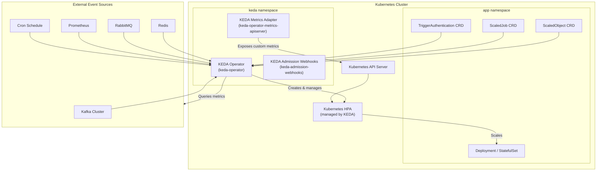
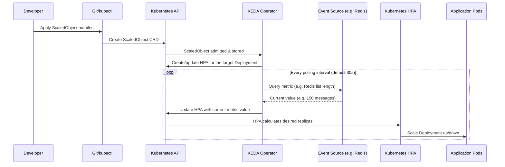
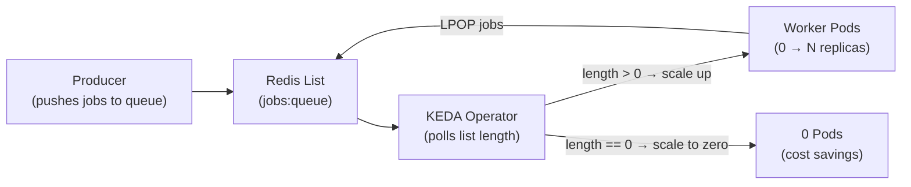
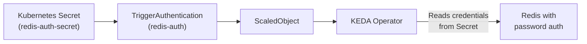
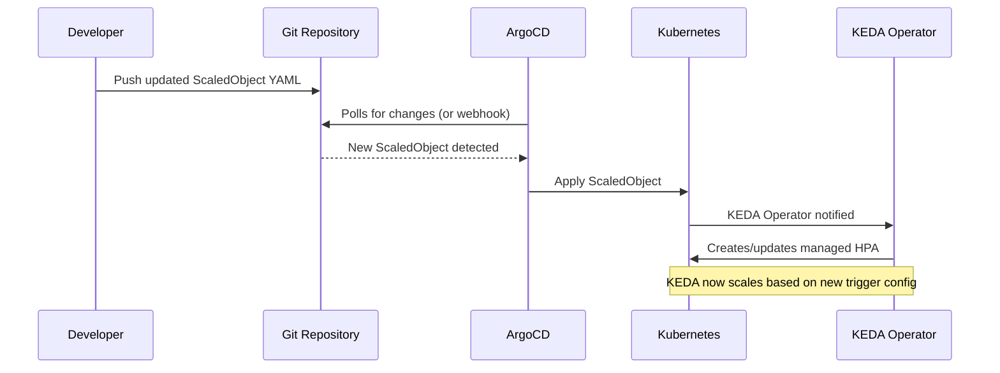

---

# KEDA - Kubernetes Event-Driven Autoscaling

- `KEDA` is a **Kubernetes-based Event Driven Autoscaler** that extends the native Kubernetes `HorizontalPodAutoscaler` (HPA).
- It allows you to scale any container in Kubernetes based on the number of events from virtually **any event source** - queues, streams, databases, HTTP traffic, cron schedules, and more.
- `KEDA` is a **CNCF Graduated project** (since 2023), widely adopted and production-proven.

---

## What will we learn?

- What `KEDA` is and how it differs from native HPA
- How KEDA architecture works (Operator, Metrics Adapter, Scalers)
- KEDA core CRDs: `ScaledObject`, `ScaledJob`, `TriggerAuthentication`
- How to install KEDA via Helm
- **Scale to zero** and **scale from zero** using event-driven triggers
- Real-world scalers: CPU/Memory, Cron, Redis, Kafka, HTTP, Prometheus
- Using `TriggerAuthentication` with Kubernetes Secrets
- Scaling **Jobs** (not Deployments) with `ScaledJob`
- Combining KEDA with ArgoCD (Lab 18) for GitOps-managed autoscaling

---

## Official Documentation & References

| Resource                          | Link                                                                  |
| --------------------------------- | --------------------------------------------------------------------- |
| KEDA Official Documentation       | [keda.sh](https://keda.sh/)                                           |
| KEDA Scalers Reference            | [keda.sh/docs/scalers](https://keda.sh/docs/latest/scalers/)         |
| KEDA on ArtifactHub (Helm)        | [artifacthub.io/keda](https://artifacthub.io/packages/helm/kedacore/keda) |
| KEDA GitHub Repository            | [github.com/kedacore/keda](https://github.com/kedacore/keda)         |
| KEDA HTTP Add-on                  | [github.com/kedacore/http-add-on](https://github.com/kedacore/http-add-on) |
| CNCF Project Page                 | [cncf.io/projects/keda](https://www.cncf.io/projects/keda/)          |

---

## The Problem KEDA Solves

### Native HPA Limitations

Kubernetes' built-in `HorizontalPodAutoscaler` only scales on **CPU and memory** metrics (or custom metrics via the Metrics API, which is complex to set up). This means you can't natively:

- Scale a worker deployment to zero when a job queue is empty
- Scale up when a Kafka topic has unread messages
- Scale based on a cron schedule (e.g., double capacity every weekday morning)
- Scale based on a Redis list length, database row count, or HTTP request rate

```mermaid
graph LR
    hpa["Native HPA"] -- "Only" --> cpu["CPU Metrics"]
    hpa -- "Only" --> mem["Memory Metrics"]
    hpa -- "Complex setup" --> custom["Custom Metrics API"]

    keda["KEDA"] -- "50+ scalers" --> kafka["Kafka"]
    keda --> rabbitmq["RabbitMQ"]
    keda --> redis["Redis"]
    keda --> cron["Cron Schedule"]
    keda --> http["HTTP Traffic"]
    keda --> prometheus["Prometheus"]
    keda --> aws["AWS SQS / SNS"]
    keda --> azure["Azure Service Bus"]
    keda --> gcp["GCP Pub/Sub"]
    keda --> "..."
```

### Scale-to-Zero: The Game Changer

KEDA's most powerful feature is **scale-to-zero**: when there are no events, pods scale down to **0 replicas**, saving resources. When events arrive, KEDA scales back up instantly.

| Scenario | Without KEDA | With KEDA |
|----------|-------------|-----------|
| Idle queue worker | 1-3 pods always running | 0 pods (scale to zero) |
| Morning traffic spike | Manual scaling or slow HPA | Pre-warmed via Cron scaler |
| Kafka consumer lag | Fixed replica count | Dynamic scaling on lag metric |
| Batch job | Long-running Deployment | Short-lived Jobs, scaled by queue depth |

---

## KEDA Architecture



### KEDA Components

| Component | Description |
|-----------|-------------|
| **keda-operator** | Watches `ScaledObject`/`ScaledJob` CRDs; creates/manages HPA objects; polls event sources |
| **keda-operator-metrics-apiserver** | Exposes custom metrics to the Kubernetes Metrics API so native HPA can read them |
| **keda-admission-webhooks** | Validates KEDA CRDs on admission (prevents misconfigurations) |

### How KEDA Works (Step by Step)



---

## KEDA Terminology

| Term | Kind | Description |
|------|------|-------------|
| **ScaledObject** | CRD | Links a Deployment/StatefulSet/custom workload to one or more scalers. KEDA creates a managed HPA for it. |
| **ScaledJob** | CRD | Like ScaledObject but for Kubernetes `Jobs` - creates one Job per event (or batches) instead of scaling pods |
| **TriggerAuthentication** | CRD | Stores authentication configs (secrets, pod identity) for scalers that need credentials |
| **ClusterTriggerAuthentication** | CRD | Same as TriggerAuthentication but cluster-scoped (reusable across namespaces) |
| **Scaler** | Built-in | A plugin inside KEDA that knows how to query a specific event/metric source |
| **Trigger** | Config | A single scaler configuration inside a ScaledObject/ScaledJob |
| **minReplicaCount** | Config | Minimum replicas (can be `0` for scale-to-zero) |
| **maxReplicaCount** | Config | Maximum replicas KEDA is allowed to scale to |
| **cooldownPeriod** | Config | Seconds KEDA waits after last event before scaling back to `minReplicaCount` |
| **pollingInterval** | Config | How often KEDA queries the scaler (default: 30 seconds) |

---

## Available Scalers (50+)

KEDA ships with scalers for virtually every major event/metric source:

| Category | Scalers |
|----------|---------|
| **Message Queues** | Apache Kafka, RabbitMQ, Azure Service Bus, AWS SQS, GCP Pub/Sub, NATS JetStream, IBM MQ |
| **Databases** | Redis (List/Stream/Cluster/Sentinel), PostgreSQL, MySQL, MSSQL, MongoDB, CouchDB |
| **Storage** | AWS S3, Azure Blob Storage, GCS Bucket |
| **Monitoring** | Prometheus, Datadog, Graphite, InfluxDB, New Relic |
| **HTTP** | HTTP Add-on (external component) |
| **Compute** | CPU, Memory (same as HPA but combined with other scalers) |
| **Time** | Cron |
| **Cloud Native** | ArgoCD, KEDA HTTP Add-on, Kubernetes Event-driven Jobs |
| **Cloud-Specific** | Azure Event Hub, Azure Log Analytics, AWS CloudWatch, GCP Stackdriver |

---

## Directory Structure

```
34-Keda/
├── README.md                          # This file
├── scripts/
│   ├── install.sh                     # Install KEDA via Helm
│   └── demo.sh                        # Full automated demo
└── manifests/
    ├── 00-namespace.yaml              # Namespace for demo workloads
    ├── 01-demo-deployment.yaml        # A simple nginx deployment to scale
    ├── 02-scaled-object-cpu.yaml      # ScaledObject: CPU-based scaling
    ├── 03-scaled-object-cron.yaml     # ScaledObject: Cron-based scheduling
    ├── 04-redis-stack.yaml            # Redis deployment for queue demo
    ├── 05-scaled-object-redis.yaml    # ScaledObject: Redis List scaler
    ├── 06-trigger-auth.yaml           # TriggerAuthentication with Secret
    ├── 07-scaled-object-redis-auth.yaml # ScaledObject with auth
    ├── 08-prometheus-scaler.yaml      # ScaledObject: Prometheus scaler
    └── 09-scaled-job.yaml             # ScaledJob: batch job per queue message
```

---

## Prerequisites

- Kubernetes cluster (v1.24+)
- `kubectl` configured to access your cluster
- `Helm 3.x` installed

```bash
# Verify prerequisites
kubectl version --client --short
helm version --short
```

---

# Installation

## Part 01 - Install KEDA via Helm

Helm is the recommended installation method for KEDA.

### 01. Add the KEDA Helm repository

```bash
helm repo add kedacore https://kedacore.github.io/charts
helm repo update kedacore

# Confirm available charts
helm search repo kedacore/keda
```

Expected output:
```
NAME            CHART VERSION   APP VERSION
kedacore/keda   2.x.x           2.x.x
```

### 02. Install KEDA

```bash
helm upgrade --install keda kedacore/keda \
    --namespace keda \
    --create-namespace \
    --wait
```

### 03. Verify the installation

```bash
kubectl get pods -n keda
```

Expected output (all `Running`):
```
NAME                                                READY   STATUS    RESTARTS
keda-admission-webhooks-xxxx                       1/1     Running   0
keda-operator-xxxx                                 1/1     Running   0
keda-operator-metrics-apiserver-xxxx               1/1     Running   0
```

### 04. Verify KEDA CRDs are registered

```bash
kubectl get crd | grep keda
```

Expected output:
```
clustertriggerauthentications.keda.sh
scaledjobs.keda.sh
scaledobjects.keda.sh
triggerauthentications.keda.sh
```

### 05. Verify the metrics API is available

```bash
kubectl get apiservice | grep keda
```

Expected:
```
v1beta1.external.metrics.k8s.io   keda/keda-operator-metrics-apiserver   True
```

---

## Part 02 - Install KEDA via kubectl (Alternative)

```bash
# Install KEDA using the official release manifest
kubectl apply --server-side \
    -f https://github.com/kedacore/keda/releases/latest/download/keda-2.x.x.yaml
```

!!! note
    Replace `2.x.x` with the latest KEDA version from [github.com/kedacore/keda/releases](https://github.com/kedacore/keda/releases).

---

# Core Concepts & Labs

## Part 03 - Your First ScaledObject (CPU Scaler)

The `CPU` scaler is the simplest way to start with KEDA - it works like HPA but lets you combine it with other KEDA scalers.

### Understanding the ScaledObject

A `ScaledObject` has three key sections:

```yaml
apiVersion: keda.sh/v1alpha1
kind: ScaledObject
metadata:
  name: my-scaler
spec:
  # 1. What to scale
  scaleTargetRef:
    name: my-deployment         # Must match a Deployment/StatefulSet name

  # 2. Scaling bounds
  minReplicaCount: 1            # 0 = scale to zero
  maxReplicaCount: 10

  # 3. When to scale (triggers)
  triggers:
    - type: cpu                 # Scaler type
      metadata:
        type: Utilization       # AverageValue or Utilization
        value: "60"             # Scale when CPU > 60%
```

### Lab: Deploy a workload and scale it on CPU

**Step 01** - Create the namespace and a demo deployment:

```bash
kubectl apply -f manifests/00-namespace.yaml
kubectl apply -f manifests/01-demo-deployment.yaml
```

Verify:
```bash
kubectl get deployment -n keda-demo
```

**Step 02** - Apply the CPU ScaledObject:

```bash
kubectl apply -f manifests/02-scaled-object-cpu.yaml
```

**Step 03** - Verify KEDA created an HPA:

```bash
# KEDA creates and manages an HPA automatically
kubectl get hpa -n keda-demo
```

Expected:
```
NAME                          REFERENCE              TARGETS      MINPODS   MAXPODS
keda-hpa-demo-cpu-scaler      Deployment/nginx-demo  5%/60%       1         10
```

**Step 04** - Generate CPU load and watch scaling:

```bash
# Terminal 1: Watch pods
kubectl get pods -n keda-demo -w

# Terminal 2: Generate CPU load
kubectl run -it --rm load-generator \
    --image=busybox \
    --namespace=keda-demo \
    --restart=Never \
    -- /bin/sh -c "while true; do wget -q -O- http://nginx-demo:80; done"
```

**Step 05** - Inspect the ScaledObject status:

```bash
kubectl get scaledobject -n keda-demo
kubectl describe scaledobject demo-cpu-scaler -n keda-demo
```

---

## Part 04 - Cron Scaler (Scheduled Scaling)

The **Cron scaler** lets you define time windows with specific replica counts. This is ideal for predictable traffic patterns - e.g., pre-warm your API servers every weekday morning.

### ScaledObject with Cron Trigger

```yaml
apiVersion: keda.sh/v1alpha1
kind: ScaledObject
metadata:
  name: nginx-cron-scaler
  namespace: keda-demo
spec:
  scaleTargetRef:
    name: nginx-demo
  minReplicaCount: 1      # Night/off-hours minimum
  maxReplicaCount: 10
  triggers:
    - type: cron
      metadata:
        timezone: "Asia/Jerusalem"     # Any valid IANA timezone
        start: "0 8 * * 1-5"          # Weekdays at 08:00
        end:   "0 18 * * 1-5"         # Weekdays at 18:00
        desiredReplicas: "5"           # Scale to 5 during business hours
```

### Multiple Cron Triggers

You can combine multiple cron triggers for different time windows:

```yaml
triggers:
  # Business hours: Mon-Fri, 08:00-18:00 → 5 replicas
  - type: cron
    metadata:
      timezone: "Asia/Jerusalem"
      start: "0 8 * * 1-5"
      end: "0 18 * * 1-5"
      desiredReplicas: "5"

  # Lunch peak: Mon-Fri, 12:00-14:00 → 8 replicas
  - type: cron
    metadata:
      timezone: "Asia/Jerusalem"
      start: "0 12 * * 1-5"
      end: "0 14 * * 1-5"
      desiredReplicas: "8"

  # Weekend reduced: Sat-Sun, 10:00-16:00 → 2 replicas
  - type: cron
    metadata:
      timezone: "Asia/Jerusalem"
      start: "0 10 * * 6-7"
      end: "0 16 * * 6-7"
      desiredReplicas: "2"
```

!!! info "How multiple triggers work"
    When multiple triggers are active at the same time, KEDA uses the **maximum** desired replica count across all active triggers.

### Lab: Apply the Cron ScaledObject

```bash
kubectl apply -f manifests/03-scaled-object-cron.yaml

# Check the current replica count
kubectl get scaledobject nginx-cron-scaler -n keda-demo

# Inspect the details including the active trigger
kubectl describe scaledobject nginx-cron-scaler -n keda-demo
```

---

## Part 05 - Scale to Zero with Redis Queue Scaler

The **Redis List scaler** monitors a Redis list length and scales the consumer Deployment up (or from 0) when there are items in the queue - and back down to zero when the queue is empty.

This is the classic "worker pool" autoscaling pattern:



### Step 01 - Deploy Redis

```bash
kubectl apply -f manifests/04-redis-stack.yaml

# Wait for Redis to be ready
kubectl rollout status deployment/redis -n keda-demo
```

### Step 02 - Deploy a Worker Deployment (starts at 0 replicas)

The worker deployment starts at 0 replicas - KEDA will scale it up when jobs arrive:

```yaml
# Part of manifests/04-redis-stack.yaml
apiVersion: apps/v1
kind: Deployment
metadata:
  name: redis-worker
  namespace: keda-demo
spec:
  replicas: 0           # Start at zero - KEDA controls this
  selector:
    matchLabels:
      app: redis-worker
  template:
    metadata:
      labels:
        app: redis-worker
    spec:
      containers:
        - name: worker
          image: redis:7-alpine
          # Simulates a worker: pops one job, sleeps 2s, repeat
          command: ["/bin/sh", "-c"]
          args:
            - |
              while true; do
                JOB=$(redis-cli -h redis LPOP jobs:queue)
                if [ -n "$JOB" ]; then
                  echo "Processing: $JOB"
                  sleep 2
                else
                  sleep 1
                fi
              done
```

### Step 03 - Apply the Redis ScaledObject

```bash
kubectl apply -f manifests/05-scaled-object-redis.yaml
```

The ScaledObject:

```yaml
apiVersion: keda.sh/v1alpha1
kind: ScaledObject
metadata:
  name: redis-worker-scaler
  namespace: keda-demo
spec:
  scaleTargetRef:
    name: redis-worker
  minReplicaCount: 0          # Scale to ZERO when queue is empty
  maxReplicaCount: 20
  cooldownPeriod: 30          # Wait 30s after last job before scaling to zero
  pollingInterval: 5          # Check every 5 seconds
  triggers:
    - type: redis
      metadata:
        address: redis:6379   # Redis host:port (within cluster)
        listName: jobs:queue  # The Redis list to monitor
        listLength: "5"       # One replica per 5 items in the queue
```

### Step 04 - Verify scale-to-zero

```bash
# Should show 0 pods (no jobs in queue yet)
kubectl get pods -n keda-demo -l app=redis-worker
kubectl get scaledobject redis-worker-scaler -n keda-demo
```

### Step 05 - Enqueue jobs and watch scale-up

```bash
# Terminal 1: Watch pods
kubectl get pods -n keda-demo -l app=redis-worker -w

# Terminal 2: Push 50 jobs to the queue
kubectl exec -it deployment/redis -n keda-demo -- \
    redis-cli RPUSH jobs:queue \
    job-1 job-2 job-3 job-4 job-5 \
    job-6 job-7 job-8 job-9 job-10 \
    job-11 job-12 job-13 job-14 job-15 \
    job-16 job-17 job-18 job-19 job-20 \
    job-21 job-22 job-23 job-24 job-25 \
    job-26 job-27 job-28 job-29 job-30 \
    job-31 job-32 job-33 job-34 job-35 \
    job-36 job-37 job-38 job-39 job-40 \
    job-41 job-42 job-43 job-44 job-45 \
    job-46 job-47 job-48 job-49 job-50

# Check queue length
kubectl exec -it deployment/redis -n keda-demo -- redis-cli LLEN jobs:queue
```

Observe the events:
1. KEDA detects 50 jobs in queue (50 / 5 = **10 replicas** desired)
2. Pods scale up from 0 → 10
3. Workers consume the jobs
4. Queue drains → worker pods scale back down to **0**

---

## Part 06 - TriggerAuthentication

Many scalers require credentials to connect to external services (password, token, connection string). `TriggerAuthentication` prevents putting secrets directly in the `ScaledObject`.

### Creating a TriggerAuthentication



**Step 01** - Create a Secret:

```bash
kubectl create secret generic redis-auth-secret \
    --namespace keda-demo \
    --from-literal=redis-password='super-secret-password'
```

**Step 02** - Create the TriggerAuthentication (references the Secret):

```yaml
# manifests/06-trigger-auth.yaml
apiVersion: keda.sh/v1alpha1
kind: TriggerAuthentication
metadata:
  name: redis-auth
  namespace: keda-demo
spec:
  secretTargetRef:
    - parameter: password          # The scaler parameter this maps to
      name: redis-auth-secret      # Kubernetes Secret name
      key: redis-password          # Key within the Secret
```

**Step 03** - Reference it in the ScaledObject:

```yaml
# manifests/07-scaled-object-redis-auth.yaml
apiVersion: keda.sh/v1alpha1
kind: ScaledObject
metadata:
  name: redis-auth-worker-scaler
  namespace: keda-demo
spec:
  scaleTargetRef:
    name: redis-worker
  minReplicaCount: 0
  maxReplicaCount: 10
  triggers:
    - type: redis
      authenticationRef:
        name: redis-auth          # Reference to TriggerAuthentication
      metadata:
        address: redis:6379
        listName: jobs:queue
        listLength: "5"
```

Apply:
```bash
kubectl apply -f manifests/06-trigger-auth.yaml
kubectl apply -f manifests/07-scaled-object-redis-auth.yaml
```

### ClusterTriggerAuthentication (Cluster-Wide)

For credentials used across multiple namespaces:

```yaml
apiVersion: keda.sh/v1alpha1
kind: ClusterTriggerAuthentication
metadata:
  name: global-redis-auth        # No namespace needed
spec:
  secretTargetRef:
    - parameter: password
      name: redis-auth-secret    # Secret must exist in the KEDA namespace
      key: redis-password
```

Reference with `kind`:
```yaml
authenticationRef:
  name: global-redis-auth
  kind: ClusterTriggerAuthentication
```

---

## Part 07 - Prometheus Scaler

The **Prometheus scaler** lets you scale based on any Prometheus metric - custom application metrics, business metrics, or infrastructure metrics.

```yaml
# manifests/08-prometheus-scaler.yaml
apiVersion: keda.sh/v1alpha1
kind: ScaledObject
metadata:
  name: prometheus-scaler
  namespace: keda-demo
spec:
  scaleTargetRef:
    name: nginx-demo
  minReplicaCount: 1
  maxReplicaCount: 20
  triggers:
    - type: prometheus
      metadata:
        # Prometheus server URL (in-cluster)
        serverAddress: http://prometheus-server.monitoring.svc:9090

        # The PromQL query to evaluate
        # This example scales on HTTP request rate
        query: |
          sum(rate(http_requests_total{namespace="keda-demo"}[1m]))

        # Scale threshold: add one replica per 100 req/sec
        threshold: "100"

        # Optional: activation threshold (below this = stay at minReplicaCount)
        activationThreshold: "10"
```

!!! tip "PromQL Tips for KEDA"
    - The query must return a **single scalar value**
    - Use `activationThreshold` to prevent scaling when traffic is very low
    - KEDA uses the formula: `desiredReplicas = ceil(metricValue / threshold)`

### Common Prometheus Scaling Patterns

```yaml
# Scale on response latency (p95 > 500ms)
query: |
  histogram_quantile(0.95,
    sum(rate(http_request_duration_seconds_bucket{
      namespace="keda-demo"
    }[2m])) by (le)
  ) * 1000

# Scale on queue depth from application metric
query: |
  myapp_queue_depth{namespace="keda-demo"}

# Scale on active WebSocket connections
query: |
  sum(websocket_active_connections{namespace="keda-demo"})
```

---

## Part 08 - ScaledJob (Batch Processing)

`ScaledJob` is designed for **batch workloads** where each event should be processed by its own short-lived Kubernetes `Job` (not a long-running pod).

Use cases:
- Video/image transcoding (one Job per file)
- Report generation (one Job per report request)
- ML batch inference (one Job per data chunk)

### ScaledObject vs ScaledJob

| Feature | ScaledObject | ScaledJob |
|---------|-------------|-----------|
| Target | Deployment / StatefulSet | Kubernetes Job |
| Scaling model | Adjust replica count | Create new Jobs per event |
| Idle behavior | Scale to zero replicas | No Jobs running |
| Best for | Long-running workers | Short-lived batch tasks |
| Parallelism | All pods share the workload | Each Job handles its own event |

### ScaledJob Example

```yaml
# manifests/09-scaled-job.yaml
apiVersion: keda.sh/v1alpha1
kind: ScaledJob
metadata:
  name: redis-batch-job
  namespace: keda-demo
spec:
  jobTargetRef:
    # This Job template is instantiated for each batch of events
    parallelism: 1
    completions: 1
    backoffLimit: 2
    template:
      spec:
        restartPolicy: Never
        containers:
          - name: batch-processor
            image: redis:7-alpine
            command: ["/bin/sh", "-c"]
            args:
              - |
                echo "Batch job started"
                # Pop and process up to 5 items from the queue
                for i in $(seq 1 5); do
                  JOB=$(redis-cli -h redis LPOP batch:queue)
                  if [ -n "$JOB" ]; then
                    echo "Processing batch item: $JOB"
                    sleep 1
                  fi
                done
                echo "Batch job done"

  # Scaling configuration
  minReplicaCount: 0           # No Jobs when queue is empty
  maxReplicaCount: 50          # At most 50 parallel Jobs
  pollingInterval: 10
  successfulJobsHistoryLimit: 5
  failedJobsHistoryLimit: 5

  # Scaling strategy
  scalingStrategy:
    strategy: "default"        # "default", "custom", or "accurate"
    # customScalingQueueLengthDeduction: 0
    # customScalingRunningJobPercentage: "0.5"

  triggers:
    - type: redis
      metadata:
        address: redis:6379
        listName: batch:queue
        listLength: "5"        # One Job per 5 items
```

### Push items and watch Jobs

```bash
# Push 25 items to the batch queue
kubectl exec -it deployment/redis -n keda-demo -- \
    redis-cli RPUSH batch:queue \
    batch-1 batch-2 batch-3 batch-4 batch-5 \
    batch-6 batch-7 batch-8 batch-9 batch-10 \
    batch-11 batch-12 batch-13 batch-14 batch-15 \
    batch-16 batch-17 batch-18 batch-19 batch-20 \
    batch-21 batch-22 batch-23 batch-24 batch-25

# Watch Jobs being created
kubectl get jobs -n keda-demo -w

# Watch the ScaledJob
kubectl get scaledjob -n keda-demo
```

---

## Part 09 - Scaling Behavior Tuning

KEDA inherits HPA's scaling behavior configuration, giving you fine-grained control over how fast pods scale up and down.

```yaml
apiVersion: keda.sh/v1alpha1
kind: ScaledObject
metadata:
  name: tuned-scaler
  namespace: keda-demo
spec:
  scaleTargetRef:
    name: nginx-demo
  minReplicaCount: 1
  maxReplicaCount: 20

  # Advanced HPA scaling behavior tuning
  advanced:
    # How quickly to scale UP
    horizontalPodAutoscalerConfig:
      behavior:
        scaleUp:
          stabilizationWindowSeconds: 0      # React immediately to scale up
          policies:
            - type: Pods
              value: 4                        # Add at most 4 pods per period
              periodSeconds: 15
            - type: Percent
              value: 100                      # Or double the pod count
              periodSeconds: 15
          selectPolicy: Max                   # Use whichever adds more pods

        scaleDown:
          stabilizationWindowSeconds: 120    # Wait 2 minutes before scaling down
          policies:
            - type: Pods
              value: 2                        # Remove at most 2 pods per period
              periodSeconds: 60

  triggers:
    - type: prometheus
      metadata:
        serverAddress: http://prometheus-server.monitoring.svc:9090
        query: sum(rate(http_requests_total{namespace="keda-demo"}[1m]))
        threshold: "100"
```

### Common Tuning Patterns

| Pattern | Config | Use Case |
|---------|--------|---------|
| Aggressive scale-up, slow scale-down | `scaleUp.stabilizationWindowSeconds: 0`, `scaleDown.stabilizationWindowSeconds: 300` | Spiky traffic - respond fast, avoid flapping |
| Gradual scale-up | `scaleUp.policies: [{type: Pods, value: 2, periodSeconds: 60}]` | Expensive pods, avoid overwhelming downstreams |
| No downscale | `scaleDown: {selectPolicy: Disabled}` | Stateful workloads, long-lived connections |
| Fast scale-down | `scaleDown.stabilizationWindowSeconds: 0` | Short-lived jobs, cost optimization |

---

## Part 10 - Kafka Scaler

The **Kafka scaler** scales Consumers based on consumer group lag - the number of messages in a topic that haven't been processed yet.

```yaml
apiVersion: keda.sh/v1alpha1
kind: ScaledObject
metadata:
  name: kafka-consumer-scaler
  namespace: keda-demo
spec:
  scaleTargetRef:
    name: kafka-consumer
  minReplicaCount: 0
  maxReplicaCount: 20
  triggers:
    - type: kafka
      metadata:
        bootstrapServers: kafka-broker:9092
        consumerGroup: my-consumer-group     # The consumer group to monitor
        topic: my-topic                       # The topic to watch
        lagThreshold: "10"                    # One replica per 10 unprocessed messages
        offsetResetPolicy: latest             # "latest" or "earliest"
```

### Kafka with SASL/TLS Authentication

```yaml
apiVersion: keda.sh/v1alpha1
kind: TriggerAuthentication
metadata:
  name: kafka-auth
  namespace: keda-demo
spec:
  secretTargetRef:
    - parameter: sasl          # "plaintext" | "scram_sha256" | "scram_sha512"
      name: kafka-credentials
      key: sasl-type
    - parameter: username
      name: kafka-credentials
      key: username
    - parameter: password
      name: kafka-credentials
      key: password
    - parameter: tls
      name: kafka-credentials
      key: tls-enabled          # "enable" | "disable"
```

---

## Part 11 - HTTP Scaler (KEDA HTTP Add-on)

The HTTP scaler requires installing the separate **KEDA HTTP Add-on**. It intercepts HTTP traffic and scales the target service based on request rate (including scale to zero).

### Install the HTTP Add-on

```bash
helm upgrade --install http-add-on kedacore/keda-add-ons-http \
    --namespace keda \
    --wait
```

### HTTPScaledObject

```yaml
apiVersion: http.keda.sh/v1alpha1
kind: HTTPScaledObject
metadata:
  name: nginx-http-scaler
  namespace: keda-demo
spec:
  hosts:
    - nginx-demo.keda-demo.svc    # The Kubernetes service hostname
  pathPrefixes:
    - /                            # Scale on all paths (optional filter)
  scaledownPeriod: 300             # Scale to zero after 5 minutes of no traffic
  scaleTargetRef:
    deployment: nginx-demo
    service: nginx-demo
    port: 80
  replicas:
    min: 0                         # Scale to zero when no HTTP traffic
    max: 10
  scalingMetric:
    requestRate:
      targetValue: 100             # One replica per 100 req/sec
      granularity: 1s
      window: 1m
```

---

## Part 12 - Combining Multiple Triggers

KEDA allows multiple triggers in a single `ScaledObject`. The scaling decision uses the **maximum** desired replica count across all active triggers.

```yaml
apiVersion: keda.sh/v1alpha1
kind: ScaledObject
metadata:
  name: multi-trigger-scaler
  namespace: keda-demo
spec:
  scaleTargetRef:
    name: nginx-demo
  minReplicaCount: 1
  maxReplicaCount: 20
  triggers:
    # Trigger 1: CPU-based (baseline HPA-like behavior)
    - type: cpu
      metadata:
        type: Utilization
        value: "60"

    # Trigger 2: Scale during business hours
    - type: cron
      metadata:
        timezone: "UTC"
        start: "0 8 * * 1-5"
        end: "0 18 * * 1-5"
        desiredReplicas: "5"

    # Trigger 3: Queue depth
    - type: redis
      metadata:
        address: redis:6379
        listName: jobs:queue
        listLength: "10"
```

!!! info "Multiple Trigger Evaluation"
    KEDA evaluates ALL triggers simultaneously and scales to whichever trigger demands the most replicas. If CPU wants 3, cron wants 5, and Redis wants 8 - KEDA scales to **8**.

---

## Part 13 - KEDA with ArgoCD (GitOps)

Managing `ScaledObject` and `TriggerAuthentication` through ArgoCD brings the GitOps benefits of version control, drift detection, and automatic reconciliation to your autoscaling configs.

### ArgoCD Application for KEDA Resources

```yaml
apiVersion: argoproj.io/v1alpha1
kind: Application
metadata:
  name: keda-autoscaling
  namespace: argocd
  finalizers:
    - resources-finalizer.argocd.argoproj.io
spec:
  project: default
  source:
    repoURL: https://github.com/nirgeier/KubernetesLabs.git
    targetRevision: HEAD
    path: Labs/34-Keda/manifests    # All ScaledObject manifests
  destination:
    server: https://kubernetes.default.svc
    namespace: keda-demo
  syncPolicy:
    automated:
      prune: true
      selfHeal: true               # ArgoCD reverts manual ScaledObject changes
    syncOptions:
      - CreateNamespace=true
```

When you push a new or updated `ScaledObject` manifest to Git, ArgoCD automatically applies it and KEDA starts the new scaling behavior - **no manual kubectl needed**.

### Workflow



---

## Part 14 - Monitoring KEDA

### KEDA Metrics (Prometheus)

KEDA exposes its own metrics that you can scrape with Prometheus:

```bash
# Check KEDA metrics endpoint
kubectl port-forward svc/keda-operator-metrics-apiserver -n keda 8080:8080 &
curl http://localhost:8080/metrics
```

Key metrics:

| Metric | Description |
|--------|-------------|
| `keda_scaler_active` | Whether a scaler is currently active (1=active, 0=inactive) |
| `keda_scaler_metrics_value` | The current metric value from a scaler |
| `keda_scaler_errors_total` | Number of errors encountered by a scaler |
| `keda_scaled_object_paused` | Whether a ScaledObject is paused |
| `keda_resource_totals` | Number of KEDA CRD resources |

### ServiceMonitor for Prometheus Operator

```yaml
apiVersion: monitoring.coreos.com/v1
kind: ServiceMonitor
metadata:
  name: keda-metrics
  namespace: keda
  labels:
    release: prometheus     # Must match your Prometheus release label
spec:
  selector:
    matchLabels:
      app: keda-operator-metrics-apiserver
  endpoints:
    - port: metrics
      interval: 30s
      path: /metrics
```

### Useful Grafana Dashboard

Import KEDA community dashboard from Grafana.com: **Dashboard ID `16543`**

```bash
# Quick verification with kubectl
kubectl get scaledobjects -A
kubectl get scaledjobs -A

# Describe for events and conditions
kubectl describe scaledobject <name> -n <namespace>

# Check KEDA operator logs
kubectl logs -n keda -l app=keda-operator --tail=50
```

---

## Part 15 - Pause and Resume Scaling

Sometimes you need to temporarily stop KEDA from scaling (e.g., during maintenance):

```bash
# Pause a ScaledObject (KEDA stops reconciling, current replicas stay)
kubectl annotate scaledobject nginx-cron-scaler \
    -n keda-demo \
    autoscaling.keda.sh/paused-replicas="2"

# Resume (delete the annotation)
kubectl annotate scaledobject nginx-cron-scaler \
    -n keda-demo \
    autoscaling.keda.sh/paused-replicas-

# Pause all scaling on a ScaledObject
kubectl annotate scaledobject nginx-cron-scaler \
    -n keda-demo \
    autoscaling.keda.sh/paused=true

# Resume
kubectl annotate scaledobject nginx-cron-scaler \
    -n keda-demo \
    autoscaling.keda.sh/paused-
```

---

## Part 16 - Fallback Configuration

Fallback allows KEDA to use a safe replica value if the scaler fails to query the metric source:

```yaml
apiVersion: keda.sh/v1alpha1
kind: ScaledObject
metadata:
  name: resilient-scaler
  namespace: keda-demo
spec:
  scaleTargetRef:
    name: nginx-demo
  minReplicaCount: 1
  maxReplicaCount: 10

  # Fallback: if the metric source is unavailable, use these settings
  fallback:
    failureThreshold: 3          # Fail 3 times before using fallback replicas
    replicas: 3                  # Fallback to 3 replicas when metric unavailable

  triggers:
    - type: redis
      metadata:
        address: redis:6379
        listName: jobs:queue
        listLength: "5"
```

---

## Part 17 - KEDA CLI (kubectl-keda Plugin)

The `keda` plugin for `kubectl` simplifies common KEDA operations:

### Install

```bash
# macOS via Homebrew
brew tap kedacore/keda
brew install keda

# Or via Krew (kubectl plugin manager)
kubectl krew install keda
```

### Common Commands

```bash
# List all ScaledObjects across all namespaces
kubectl keda list scaledobjects -A

# List ScaledJobs
kubectl keda list scaledjobs -A

# Check metric values for a ScaledObject
kubectl keda get scaledobject nginx-cron-scaler -n keda-demo

# Show events for a ScaledObject
kubectl keda describe scaledobject nginx-cron-scaler -n keda-demo

# Pause / resume a ScaledObject
kubectl keda pause scaledobject nginx-cron-scaler -n keda-demo
kubectl keda resume scaledobject nginx-cron-scaler -n keda-demo
```

---

## Part 18 - Troubleshooting

### ScaledObject Not Scaling

```bash
# 1. Check ScaledObject status and conditions
kubectl describe scaledobject <name> -n <namespace>

# Look for conditions like:
# Ready: True/False
# Active: True/False

# 2. Check KEDA operator logs
kubectl logs -n keda -l app=keda-operator --tail=100

# 3. Check the HPA managed by KEDA
kubectl get hpa -n <namespace>
kubectl describe hpa keda-hpa-<name> -n <namespace>

# 4. Check if metric is being received
kubectl get --raw "/apis/external.metrics.k8s.io/v1beta1" | jq .
```

### Scale to Zero Not Working

```bash
# Verify minReplicaCount is 0 in ScaledObject
kubectl get scaledobject <name> -n <namespace> -o yaml | grep minReplicaCount

# Check the cooldownPeriod hasn't passed yet
kubectl describe scaledobject <name> -n <namespace> | grep -A5 "Conditions"

# Verify the metric/queue is truly empty
kubectl exec -it deployment/redis -n keda-demo -- redis-cli LLEN jobs:queue
```

### Metric Source Connectivity Issues

```bash
# Check KEDA can reach the metric source
kubectl run debug-pod --image=busybox -n keda -it --rm --restart=Never \
    -- sh -c "nc -zv redis.keda-demo.svc.cluster.local 6379"

# Verify TriggerAuthentication is correct
kubectl describe triggerauthentication <name> -n <namespace>

# Check if secrets referenced in TriggerAuthentication exist
kubectl get secret <secret-name> -n <namespace>
```

### KEDA Webhook Errors

```bash
# Check admission webhook
kubectl get validatingwebhookconfigurations | grep keda
kubectl describe validatingwebhookconfiguration keda-admission

# Restart KEDA webhooks
kubectl rollout restart deployment/keda-admission-webhooks -n keda
```

---

## Common KEDA Cheatsheet

```bash
# --- Installation ---
helm repo add kedacore https://kedacore.github.io/charts
helm upgrade --install keda kedacore/keda --namespace keda --create-namespace --wait

# --- Inspect ---
kubectl get scaledobjects -A                               # List all ScaledObjects
kubectl get scaledjobs -A                                  # List all ScaledJobs
kubectl get triggerauthentications -A                      # List TriggerAuths
kubectl describe scaledobject <name> -n <ns>               # Full details + events
kubectl get hpa -n <ns>                                    # KEDA-managed HPAs

# --- Troubleshoot ---
kubectl logs -n keda -l app=keda-operator --tail=100       # Operator logs
kubectl logs -n keda -l app=keda-operator-metrics-apiserver --tail=50

# --- Pause / Resume ---
kubectl annotate scaledobject <name> -n <ns> autoscaling.keda.sh/paused=true
kubectl annotate scaledobject <name> -n <ns> autoscaling.keda.sh/paused-

# --- ScaledObject quick template ---
cat <<'EOF' | kubectl apply -f -
apiVersion: keda.sh/v1alpha1
kind: ScaledObject
metadata:
  name: my-scaler
  namespace: default
spec:
  scaleTargetRef:
    name: my-deployment
  minReplicaCount: 0
  maxReplicaCount: 10
  triggers:
    - type: redis
      metadata:
        address: redis:6379
        listName: my:queue
        listLength: "5"
EOF
```

---

## Exercises

The following exercises will test your understanding of KEDA concepts.
Try to solve each exercise on your own before revealing the solution.

---

#### 01. Scale a Deployment Based on a Custom Redis Key

Create a ScaledObject that monitors a Redis Sorted Set score instead of a list length. Use the `redis` scaler with `listName` pointing to a different key, and scale from 0 to 5 replicas.

#### Scenario:

◦ Your application uses a Redis sorted set for priority-based job queues.
◦ You want workers to scale up when high-priority jobs are enqueued.

**Hint:** Create a new Redis list key and a corresponding ScaledObject with `minReplicaCount: 0`.

<details>
<summary>Solution</summary>

```bash
# 1. Create a ScaledObject for a different queue
cat <<'EOF' | kubectl apply -f -
apiVersion: keda.sh/v1alpha1
kind: ScaledObject
metadata:
  name: priority-worker-scaler
  namespace: keda-demo
spec:
  scaleTargetRef:
    name: redis-worker
  minReplicaCount: 0
  maxReplicaCount: 5
  cooldownPeriod: 30
  pollingInterval: 5
  triggers:
    - type: redis
      metadata:
        address: redis:6379
        listName: priority:queue
        listLength: "3"
EOF

# 2. Push items to the priority queue
kubectl exec -it deployment/redis -n keda-demo -- \
    redis-cli RPUSH priority:queue job-a job-b job-c job-d job-e job-f

# 3. Watch pods scale up
kubectl get pods -n keda-demo -l app=redis-worker -w

# 4. Verify ScaledObject
kubectl get scaledobject priority-worker-scaler -n keda-demo
```

</details>

---

#### 02. Combine Cron and CPU Triggers

Create a ScaledObject that uses both a Cron trigger (scale to 3 during business hours) and a CPU trigger (scale beyond 3 when CPU exceeds 70%).

#### Scenario:

◦ Your API needs a baseline of 3 pods during work hours but should burst higher under load.
◦ Outside business hours, the minimum can drop to 1.

**Hint:** Use multiple triggers in a single ScaledObject. KEDA uses the maximum across active triggers.

<details>
<summary>Solution</summary>

```yaml
# Apply this ScaledObject
apiVersion: keda.sh/v1alpha1
kind: ScaledObject
metadata:
  name: hybrid-scaler
  namespace: keda-demo
spec:
  scaleTargetRef:
    name: nginx-demo
  minReplicaCount: 1
  maxReplicaCount: 10
  triggers:
    - type: cron
      metadata:
        timezone: "UTC"
        start: "0 8 * * 1-5"
        end: "0 18 * * 1-5"
        desiredReplicas: "3"
    - type: cpu
      metadata:
        type: Utilization
        value: "70"
```

```bash
kubectl apply -f - <<EOF
# (paste the YAML above)
EOF

# Verify KEDA created an HPA with both triggers
kubectl get hpa -n keda-demo
kubectl describe scaledobject hybrid-scaler -n keda-demo
```

</details>

---

#### 03. Use TriggerAuthentication with a Kubernetes Secret

Create a TriggerAuthentication that references a Kubernetes Secret containing a Redis password, then create a ScaledObject that uses it.

#### Scenario:

◦ Your production Redis requires authentication.
◦ You need to keep credentials out of the ScaledObject manifest.

**Hint:** Create a Secret, then a TriggerAuthentication referencing it, then a ScaledObject with `authenticationRef`.

<details>
<summary>Solution</summary>

```bash
# 1. Create the Secret
kubectl create secret generic my-redis-secret \
    --namespace keda-demo \
    --from-literal=redis-password='my-secure-password'

# 2. Create the TriggerAuthentication
cat <<'EOF' | kubectl apply -f -
apiVersion: keda.sh/v1alpha1
kind: TriggerAuthentication
metadata:
  name: my-redis-auth
  namespace: keda-demo
spec:
  secretTargetRef:
    - parameter: password
      name: my-redis-secret
      key: redis-password
EOF

# 3. Create the ScaledObject with authenticationRef
cat <<'EOF' | kubectl apply -f -
apiVersion: keda.sh/v1alpha1
kind: ScaledObject
metadata:
  name: auth-redis-scaler
  namespace: keda-demo
spec:
  scaleTargetRef:
    name: redis-worker
  minReplicaCount: 0
  maxReplicaCount: 10
  triggers:
    - type: redis
      authenticationRef:
        name: my-redis-auth
      metadata:
        address: redis:6379
        listName: secure:queue
        listLength: "5"
EOF

# 4. Verify
kubectl get triggerauthentication -n keda-demo
kubectl describe scaledobject auth-redis-scaler -n keda-demo
```

</details>

---

#### 04. Create a ScaledJob for Batch Processing

Create a ScaledJob that spawns one Kubernetes Job for every 3 items in a Redis list, with a maximum of 10 concurrent Jobs.

#### Scenario:

◦ Your data pipeline receives files for processing. Each Job should handle a small batch.
◦ When the queue is empty, no Jobs should be running.

**Hint:** Use `kind: ScaledJob` with `jobTargetRef` and the `redis` trigger.

<details>
<summary>Solution</summary>

```yaml
apiVersion: keda.sh/v1alpha1
kind: ScaledJob
metadata:
  name: batch-processor
  namespace: keda-demo
spec:
  jobTargetRef:
    parallelism: 1
    completions: 1
    backoffLimit: 2
    template:
      spec:
        restartPolicy: Never
        containers:
          - name: processor
            image: redis:7-alpine
            command: ["/bin/sh", "-c"]
            args:
              - |
                for i in $(seq 1 3); do
                  JOB=$(redis-cli -h redis LPOP processing:queue)
                  if [ -n "$JOB" ]; then
                    echo "Processing: $JOB"
                    sleep 2
                  fi
                done
                echo "Batch complete"
  minReplicaCount: 0
  maxReplicaCount: 10
  pollingInterval: 10
  successfulJobsHistoryLimit: 5
  failedJobsHistoryLimit: 3
  triggers:
    - type: redis
      metadata:
        address: redis:6379
        listName: processing:queue
        listLength: "3"
```

```bash
# Apply the ScaledJob
kubectl apply -f - <<EOF
# (paste the YAML above)
EOF

# Push items to trigger Job creation
kubectl exec -it deployment/redis -n keda-demo -- \
    redis-cli RPUSH processing:queue file-1 file-2 file-3 file-4 file-5 file-6 file-7 file-8 file-9

# Watch Jobs being created
kubectl get jobs -n keda-demo -w

# Check the ScaledJob
kubectl get scaledjob -n keda-demo
```

</details>

---

#### 05. Pause and Resume a ScaledObject

Pause an active ScaledObject at a fixed replica count, then resume normal scaling.

#### Scenario:

◦ You need to perform maintenance on the metric source and want to keep a stable replica count.
◦ After maintenance, resume event-driven scaling.

**Hint:** Use the `autoscaling.keda.sh/paused-replicas` annotation.

<details>
<summary>Solution</summary>

```bash
# 1. Pause the ScaledObject at 3 replicas
kubectl annotate scaledobject redis-worker-scaler \
    -n keda-demo \
    autoscaling.keda.sh/paused-replicas="3"

# 2. Verify it's paused
kubectl get scaledobject redis-worker-scaler -n keda-demo -o yaml | grep -A2 annotations

# 3. Check that replicas stay at 3 regardless of queue depth
kubectl get deployment redis-worker -n keda-demo

# 4. Resume normal scaling
kubectl annotate scaledobject redis-worker-scaler \
    -n keda-demo \
    autoscaling.keda.sh/paused-replicas-

# 5. Verify scaling resumes
kubectl describe scaledobject redis-worker-scaler -n keda-demo
```

</details>

---

## Cleanup

```bash
# Remove all KEDA demo resources
kubectl delete namespace keda-demo

# Uninstall KEDA
helm uninstall keda --namespace keda
kubectl delete namespace keda

# Remove KEDA CRDs
kubectl delete crd \
    scaledobjects.keda.sh \
    scaledjobs.keda.sh \
    triggerauthentications.keda.sh \
    clustertriggerauthentications.keda.sh
```

---

## Summary

| Concept | Key Takeaway |
|---------|-------------|
| **ScaledObject** | Links Deployments to any event source; KEDA manages an HPA for you |
| **ScaledJob** | Creates a new Job per event batch; ideal for batch processing |
| **TriggerAuthentication** | Externalizes credentials from ScaledObject specs |
| **Scale to Zero** | Set `minReplicaCount: 0` for complete cost savings when idle |
| **Multiple Triggers** | Combine triggers; KEDA uses whichever demands the most replicas |
| **Fallback** | Define safe replica counts when the metric source is unreachable |
| **Pause** | Temporarily halt KEDA scaling without removing resources |
| **GitOps** | Manage ScaledObjects via ArgoCD for full GitOps autoscaling |

---

## Next Steps

- Explore the full [KEDA Scalers catalog](https://keda.sh/docs/latest/scalers/) - 60+ event sources including AWS SQS, GCP Pub/Sub, and Azure Service Bus.
- Try the [KEDA HTTP Add-on](https://github.com/kedacore/http-add-on) for HTTP-based scale-to-zero.
- Combine KEDA with [ArgoCD (Lab 18)](../18-ArgoCD/README.md) for GitOps-managed autoscaling configurations.
- Learn about [Prometheus & Grafana (Lab 15)](../15-Prometheus-Grafana/README.md) for monitoring KEDA metrics.
- Explore the [KEDA community Grafana dashboard](https://grafana.com/grafana/dashboards/16543) for visualizing scaling behavior.
- Practice KEDA tasks in the [Kubernetes KEDA Tasks](../Tasks/Kubernetes-KEDA-Tasks/README.md) section.
