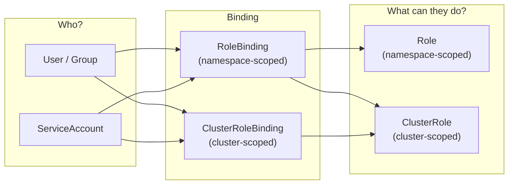

---

# RBAC — Role-Based Access Control

- In this lab we will learn how Kubernetes **Role-Based Access Control (RBAC)** works and how to use **Roles**, **ClusterRoles**, **RoleBindings**, **ClusterRoleBindings**, and **ServiceAccounts** to control who can do what inside a cluster.

---

## What will we learn?

- What RBAC is and why it is essential for Kubernetes security
- The four RBAC API objects: `Role`, `ClusterRole`, `RoleBinding`, `ClusterRoleBinding`
- How to create and assign fine-grained permissions to users and ServiceAccounts
- How to test permissions with `kubectl auth can-i`
- How to grant a pod access to the Kubernetes API using a ServiceAccount
- Difference between namespace-scoped and cluster-scoped permissions
- Best practices: principle of least privilege

---

## Official Documentation & References

| Resource                              | Link                                                                                              |
| ------------------------------------- | ------------------------------------------------------------------------------------------------- |
| RBAC Authorization                    | [kubernetes.io/docs](https://kubernetes.io/docs/reference/access-authn-authz/rbac/)               |
| Using RBAC Authorization              | [kubernetes.io/docs](https://kubernetes.io/docs/admin/authorization/rbac/)                        |
| ServiceAccounts                       | [kubernetes.io/docs](https://kubernetes.io/docs/concepts/security/service-accounts/)              |
| kubectl auth can-i                    | [kubernetes.io/docs](https://kubernetes.io/docs/reference/kubectl/generated/kubectl_auth_can-i/)  |

---

## Prerequisites

- A running Kubernetes cluster (`kubectl cluster-info` should work)
- `kubectl` configured against the cluster

---

## RBAC Overview



| Object               | Scope      | Purpose                                            |
| -------------------- | ---------- | -------------------------------------------------- |
| `Role`               | Namespace  | Defines a set of permissions within a namespace    |
| `ClusterRole`        | Cluster    | Defines a set of permissions cluster-wide          |
| `RoleBinding`        | Namespace  | Grants a Role/ClusterRole to a subject within a namespace |
| `ClusterRoleBinding` | Cluster    | Grants a ClusterRole to a subject cluster-wide     |
| `ServiceAccount`     | Namespace  | Identity for processes running in pods             |

---

## 01. Create namespace

```sh
# Clean up if it already exists
kubectl delete namespace rbac-lab --ignore-not-found

# Create the lab namespace
kubectl create namespace rbac-lab
```

---

## 02. Create a Role (namespace-scoped)

A `Role` grants permissions within a specific namespace. Create a Role that allows **read-only access to pods**:

```yaml
# manifests/role-pod-reader.yaml
apiVersion: rbac.authorization.k8s.io/v1
kind: Role
metadata:
  namespace: rbac-lab
  name: pod-reader
rules:
  - apiGroups: [""]           # "" = core API group
    resources: ["pods"]
    verbs: ["get", "watch", "list"]
```

```sh
kubectl apply -f manifests/role-pod-reader.yaml
```

!!! note "Understanding Rules"

    - **apiGroups**: `""` is the core API group (pods, services, configmaps). Use `"apps"` for deployments, `"batch"` for jobs, etc.
    - **resources**: Kubernetes resource types (pods, services, deployments, secrets, etc.)
    - **verbs**: Actions — `get`, `list`, `watch`, `create`, `update`, `patch`, `delete`

---

## 03. Create a ServiceAccount

```sh
# Create a ServiceAccount to bind our role to
kubectl create serviceaccount app-reader -n rbac-lab
```

---

## 04. Create a RoleBinding

Bind the `pod-reader` Role to our `app-reader` ServiceAccount:

```yaml
# manifests/rolebinding-pod-reader.yaml
apiVersion: rbac.authorization.k8s.io/v1
kind: RoleBinding
metadata:
  name: read-pods
  namespace: rbac-lab
subjects:
  - kind: ServiceAccount
    name: app-reader
    namespace: rbac-lab
roleRef:
  kind: Role
  name: pod-reader
  apiGroup: rbac.authorization.k8s.io
```

```sh
kubectl apply -f manifests/rolebinding-pod-reader.yaml
```

---

## 05. Test permissions with `kubectl auth can-i`

```sh
# Check: can the ServiceAccount list pods in rbac-lab?
kubectl auth can-i list pods \
  --namespace rbac-lab \
  --as system:serviceaccount:rbac-lab:app-reader
# Expected output: yes

# Check: can it delete pods? (should be denied)
kubectl auth can-i delete pods \
  --namespace rbac-lab \
  --as system:serviceaccount:rbac-lab:app-reader
# Expected output: no

# Check: can it list pods in the default namespace? (should be denied)
kubectl auth can-i list pods \
  --namespace default \
  --as system:serviceaccount:rbac-lab:app-reader
# Expected output: no
```

---

## 06. Use a ServiceAccount in a Pod

Deploy a pod that uses the `app-reader` ServiceAccount to query the Kubernetes API from within the pod:

```yaml
# manifests/pod-with-sa.yaml
apiVersion: v1
kind: Pod
metadata:
  name: api-explorer
  namespace: rbac-lab
spec:
  serviceAccountName: app-reader
  containers:
    - name: kubectl
      image: bitnami/kubectl:latest
      command: ["sleep", "3600"]
```

```sh
kubectl apply -f manifests/pod-with-sa.yaml

# Wait for the pod to be running
kubectl wait --for=condition=Ready pod/api-explorer -n rbac-lab --timeout=60s
```

Now exec into the pod and test the API access:

```sh
# Exec into the pod
kubectl exec -it api-explorer -n rbac-lab -- bash

# Inside the pod — list pods (should work)
kubectl get pods -n rbac-lab

# Inside the pod — try to delete a pod (should fail with Forbidden)
kubectl delete pod api-explorer -n rbac-lab

# Inside the pod — try to list services (should fail — not in our Role)
kubectl get services -n rbac-lab

# Exit the pod
exit
```

---

## 07. Create a ClusterRole and ClusterRoleBinding

A `ClusterRole` + `ClusterRoleBinding` grants permissions **across all namespaces**:

```yaml
# manifests/clusterrole-namespace-viewer.yaml
apiVersion: rbac.authorization.k8s.io/v1
kind: ClusterRole
metadata:
  name: namespace-viewer
rules:
  - apiGroups: [""]
    resources: ["namespaces"]
    verbs: ["get", "list", "watch"]
```

```yaml
# manifests/clusterrolebinding-namespace-viewer.yaml
apiVersion: rbac.authorization.k8s.io/v1
kind: ClusterRoleBinding
metadata:
  name: view-namespaces
subjects:
  - kind: ServiceAccount
    name: app-reader
    namespace: rbac-lab
roleRef:
  kind: ClusterRole
  name: namespace-viewer
  apiGroup: rbac.authorization.k8s.io
```

```sh
kubectl apply -f manifests/clusterrole-namespace-viewer.yaml
kubectl apply -f manifests/clusterrolebinding-namespace-viewer.yaml
```

Test it:

```sh
# Can now list namespaces cluster-wide
kubectl auth can-i list namespaces \
  --as system:serviceaccount:rbac-lab:app-reader
# Expected output: yes
```

---

## 08. Aggregate ClusterRoles

Kubernetes supports **aggregation** — automatically combining ClusterRoles via labels. The built-in `view`, `edit`, and `admin` ClusterRoles use this pattern:

```yaml
# manifests/clusterrole-custom-view.yaml
apiVersion: rbac.authorization.k8s.io/v1
kind: ClusterRole
metadata:
  name: custom-metrics-viewer
  labels:
    # This label makes it auto-aggregate into the built-in "view" ClusterRole
    rbac.authorization.k8s.io/aggregate-to-view: "true"
rules:
  - apiGroups: ["metrics.k8s.io"]
    resources: ["pods", "nodes"]
    verbs: ["get", "list"]
```

```sh
kubectl apply -f manifests/clusterrole-custom-view.yaml

# Verify it was aggregated into the "view" ClusterRole
kubectl get clusterrole view -o yaml | grep -A5 "aggregationRule"
```

---

## 09. Explore default ClusterRoles

Kubernetes ships with several built-in ClusterRoles:

```sh
# List all ClusterRoles
kubectl get clusterroles

# Inspect the built-in "view" role (read-only across most resources)
kubectl describe clusterrole view

# Inspect the built-in "edit" role (read-write but no RBAC changes)
kubectl describe clusterrole edit

# Inspect the built-in "admin" role (full access within a namespace)
kubectl describe clusterrole admin

# Inspect "cluster-admin" (full access to everything)
kubectl describe clusterrole cluster-admin
```

| Built-in ClusterRole | Permissions                                                   |
| -------------------- | ------------------------------------------------------------- |
| `view`               | Read-only access to most resources (no secrets)               |
| `edit`               | Read-write access to most resources (no RBAC or namespace)    |
| `admin`              | Full control within a namespace (including RBAC)              |
| `cluster-admin`      | Unrestricted access to everything (use with extreme caution!) |

!!! warning "Security Best Practice"

    **Never bind `cluster-admin` to application ServiceAccounts.** Follow the principle of least privilege — grant only the minimum permissions required.

---

## 10. Cleanup

```sh
kubectl delete namespace rbac-lab
kubectl delete clusterrole namespace-viewer custom-metrics-viewer --ignore-not-found
kubectl delete clusterrolebinding view-namespaces --ignore-not-found
```

---

## Summary

| Concept                        | Key Takeaway                                            |
| ------------------------------ | ------------------------------------------------------- |
| **Role**                       | Namespace-scoped permissions                            |
| **ClusterRole**                | Cluster-scoped permissions (or reusable across NS)      |
| **RoleBinding**                | Assigns Role/ClusterRole within a namespace             |
| **ClusterRoleBinding**         | Assigns ClusterRole cluster-wide                        |
| **ServiceAccount**             | Pod identity — attach Roles to pods via ServiceAccounts |
| **`kubectl auth can-i`**       | Test permissions without trial-and-error                |
| **Principle of Least Privilege** | Always grant the minimum permissions required          |

---

# Exercises

The following exercises will test your understanding of Kubernetes RBAC.
Try to solve each exercise on your own before revealing the solution.

---

#### 01. Create a Role That Grants Full Access to ConfigMaps

Create a Role named `configmap-admin` in the `rbac-lab` namespace that allows all operations (`get`, `list`, `watch`, `create`, `update`, `patch`, `delete`) on ConfigMaps. Bind it to a new ServiceAccount named `config-manager`.

#### Scenario:

◦ Your application needs to dynamically create and update ConfigMaps for feature flags.
◦ The ServiceAccount must have full CRUD access to ConfigMaps but nothing else.

**Hint:** Use `kubectl create role` with `--verb='*'` or list all verbs, and `kubectl create rolebinding` to bind it.

<details>
<summary>Solution</summary>

```bash
## Create the namespace (if not already created)
kubectl create namespace rbac-lab --dry-run=client -o yaml | kubectl apply -f -

## Create the ServiceAccount
kubectl create serviceaccount config-manager -n rbac-lab

## Create the Role with full ConfigMap access
kubectl create role configmap-admin \
  --namespace rbac-lab \
  --verb=get,list,watch,create,update,patch,delete \
  --resource=configmaps

## Bind the Role to the ServiceAccount
kubectl create rolebinding configmap-admin-binding \
  --namespace rbac-lab \
  --role=configmap-admin \
  --serviceaccount=rbac-lab:config-manager

## Test: can the ServiceAccount create configmaps?
kubectl auth can-i create configmaps \
  --namespace rbac-lab \
  --as system:serviceaccount:rbac-lab:config-manager
## Expected: yes

## Test: can it delete configmaps?
kubectl auth can-i delete configmaps \
  --namespace rbac-lab \
  --as system:serviceaccount:rbac-lab:config-manager
## Expected: yes

## Test: can it access secrets? (should be denied)
kubectl auth can-i get secrets \
  --namespace rbac-lab \
  --as system:serviceaccount:rbac-lab:config-manager
## Expected: no

## Clean up
kubectl delete rolebinding configmap-admin-binding -n rbac-lab
kubectl delete role configmap-admin -n rbac-lab
kubectl delete serviceaccount config-manager -n rbac-lab
```

</details>

---

#### 02. Use `kubectl auth can-i --list` to Audit Permissions

List all permissions that the `app-reader` ServiceAccount has in the `rbac-lab` namespace and cluster-wide. Identify which permissions come from the Role vs the ClusterRole.

#### Scenario:

◦ A security audit requires you to document all permissions granted to a ServiceAccount.
◦ You need to distinguish between namespace-scoped and cluster-scoped permissions.

**Hint:** Use `kubectl auth can-i --list --namespace rbac-lab --as system:serviceaccount:rbac-lab:app-reader`.

<details>
<summary>Solution</summary>

```bash
## Ensure the namespace and bindings exist (from the main lab)
kubectl create namespace rbac-lab --dry-run=client -o yaml | kubectl apply -f -
kubectl create serviceaccount app-reader -n rbac-lab --dry-run=client -o yaml | kubectl apply -f -
kubectl apply -f manifests/role-pod-reader.yaml
kubectl apply -f manifests/rolebinding-pod-reader.yaml
kubectl apply -f manifests/clusterrole-namespace-viewer.yaml
kubectl apply -f manifests/clusterrolebinding-namespace-viewer.yaml

## List namespace-scoped permissions in rbac-lab
kubectl auth can-i --list \
  --namespace rbac-lab \
  --as system:serviceaccount:rbac-lab:app-reader
## Expected output includes:
## pods      []    []    [get watch list]   <-- from Role pod-reader
## namespaces []   []    [get list watch]   <-- from ClusterRole namespace-viewer

## List cluster-scoped permissions (no namespace)
kubectl auth can-i --list \
  --as system:serviceaccount:rbac-lab:app-reader
## Expected output includes:
## namespaces []   []    [get list watch]   <-- from ClusterRoleBinding

## Check a specific permission
kubectl auth can-i list pods \
  --namespace rbac-lab \
  --as system:serviceaccount:rbac-lab:app-reader
## Expected: yes

kubectl auth can-i list pods \
  --namespace default \
  --as system:serviceaccount:rbac-lab:app-reader
## Expected: no (pod-reader Role is only in rbac-lab)
```

</details>

---

#### 03. Create a ClusterRole That Allows Reading Logs

Create a ClusterRole named `log-reader` that grants access to `pods/log` (a subresource). Bind it to a ServiceAccount `log-collector` in the `rbac-lab` namespace using a RoleBinding (not a ClusterRoleBinding) to limit it to the namespace.

#### Scenario:

◦ Your centralized logging agent needs to read pod logs but only in a specific namespace.
◦ You want to reuse a ClusterRole via a namespace-scoped RoleBinding.

**Hint:** Use `pods/log` as the resource in the ClusterRole. A RoleBinding can reference a ClusterRole but limits its scope to the binding's namespace.

<details>
<summary>Solution</summary>

```bash
## Create the ServiceAccount
kubectl create serviceaccount log-collector -n rbac-lab

## Create a ClusterRole for reading pod logs
cat <<'EOF' | kubectl apply -f -
apiVersion: rbac.authorization.k8s.io/v1
kind: ClusterRole
metadata:
  name: log-reader
rules:
  - apiGroups: [""]
    resources: ["pods", "pods/log"]
    verbs: ["get", "list"]
EOF

## Use a RoleBinding (not ClusterRoleBinding) to limit scope to rbac-lab
kubectl create rolebinding log-reader-binding \
  --namespace rbac-lab \
  --clusterrole=log-reader \
  --serviceaccount=rbac-lab:log-collector

## Test: can read logs in rbac-lab?
kubectl auth can-i get pods/log \
  --namespace rbac-lab \
  --as system:serviceaccount:rbac-lab:log-collector
## Expected: yes

## Test: can read logs in default namespace? (should be denied)
kubectl auth can-i get pods/log \
  --namespace default \
  --as system:serviceaccount:rbac-lab:log-collector
## Expected: no

## Clean up
kubectl delete rolebinding log-reader-binding -n rbac-lab
kubectl delete clusterrole log-reader
kubectl delete serviceaccount log-collector -n rbac-lab
```

</details>

---

#### 04. Restrict a ServiceAccount to Only `exec` into Pods

Create a Role that grants only `create` access on the `pods/exec` subresource, and basic `get` on pods. Bind it to a new ServiceAccount and verify it can exec but cannot delete or list pods.

#### Scenario:

◦ A debugging tool needs to exec into running pods for troubleshooting.
◦ It should not be able to list, delete, or modify pods — only exec into them.

**Hint:** Use two rules in the Role: one for `pods` with `get`, and one for `pods/exec` with `create`.

<details>
<summary>Solution</summary>

```bash
## Create the ServiceAccount
kubectl create serviceaccount exec-debugger -n rbac-lab

## Create the Role
cat <<'EOF' | kubectl apply -f -
apiVersion: rbac.authorization.k8s.io/v1
kind: Role
metadata:
  namespace: rbac-lab
  name: exec-only
rules:
  - apiGroups: [""]
    resources: ["pods"]
    verbs: ["get"]
  - apiGroups: [""]
    resources: ["pods/exec"]
    verbs: ["create"]
EOF

## Bind the Role
kubectl create rolebinding exec-debugger-binding \
  --namespace rbac-lab \
  --role=exec-only \
  --serviceaccount=rbac-lab:exec-debugger

## Test: can exec?
kubectl auth can-i create pods/exec \
  --namespace rbac-lab \
  --as system:serviceaccount:rbac-lab:exec-debugger
## Expected: yes

## Test: can get pods?
kubectl auth can-i get pods \
  --namespace rbac-lab \
  --as system:serviceaccount:rbac-lab:exec-debugger
## Expected: yes

## Test: can list pods? (should be denied)
kubectl auth can-i list pods \
  --namespace rbac-lab \
  --as system:serviceaccount:rbac-lab:exec-debugger
## Expected: no

## Test: can delete pods? (should be denied)
kubectl auth can-i delete pods \
  --namespace rbac-lab \
  --as system:serviceaccount:rbac-lab:exec-debugger
## Expected: no

## Clean up
kubectl delete rolebinding exec-debugger-binding -n rbac-lab
kubectl delete role exec-only -n rbac-lab
kubectl delete serviceaccount exec-debugger -n rbac-lab
```

</details>

---

#### 05. Verify That a Pod Uses the Correct ServiceAccount Token

Deploy a pod with a custom ServiceAccount and verify from inside the pod that it uses the correct token by querying the Kubernetes API directly (without kubectl).

#### Scenario:

◦ You need to verify that a pod's ServiceAccount token is correctly mounted and functional.
◦ The pod should be able to authenticate to the Kubernetes API using its token.

**Hint:** The ServiceAccount token is mounted at `/var/run/secrets/kubernetes.io/serviceaccount/token`. Use `curl` with the token to hit the API server.

<details>
<summary>Solution</summary>

```bash
## Create the ServiceAccount and Role (reuse from main lab)
kubectl create serviceaccount app-reader -n rbac-lab --dry-run=client -o yaml | kubectl apply -f -
kubectl apply -f manifests/role-pod-reader.yaml
kubectl apply -f manifests/rolebinding-pod-reader.yaml

## Deploy a pod with curl available
cat <<'EOF' | kubectl apply -f -
apiVersion: v1
kind: Pod
metadata:
  name: token-verifier
  namespace: rbac-lab
spec:
  serviceAccountName: app-reader
  containers:
    - name: curl
      image: curlimages/curl:latest
      command: ["sleep", "3600"]
EOF

kubectl wait --for=condition=Ready pod/token-verifier -n rbac-lab --timeout=60s

## Verify the token is mounted
kubectl exec token-verifier -n rbac-lab -- \
  ls /var/run/secrets/kubernetes.io/serviceaccount/

## Read the ServiceAccount name
kubectl exec token-verifier -n rbac-lab -- \
  cat /var/run/secrets/kubernetes.io/serviceaccount/namespace
echo  ## Newline
## Expected: rbac-lab

## Use the token to query the API server
kubectl exec token-verifier -n rbac-lab -- sh -c '
  TOKEN=$(cat /var/run/secrets/kubernetes.io/serviceaccount/token)
  CACERT=/var/run/secrets/kubernetes.io/serviceaccount/ca.crt
  curl -s --cacert $CACERT \
    -H "Authorization: Bearer $TOKEN" \
    https://kubernetes.default.svc/api/v1/namespaces/rbac-lab/pods | head -20
'
## Expected: JSON response listing pods in rbac-lab

## Clean up
kubectl delete pod token-verifier -n rbac-lab
```

</details>

---

## Troubleshooting

- **Permission denied (Forbidden):**

Verify the Role, RoleBinding, and subject names match exactly:

```bash
## Check Role exists and has correct rules
kubectl get role pod-reader -n rbac-lab -o yaml

## Check RoleBinding exists and references the correct Role and subject
kubectl get rolebinding read-pods -n rbac-lab -o yaml

## Common mistake: ServiceAccount name or namespace mismatch
kubectl get serviceaccount -n rbac-lab
```

<br>

- **`kubectl auth can-i` returns unexpected results:**

Ensure you are using the correct impersonation format:

```bash
## Correct format for ServiceAccounts:
kubectl auth can-i list pods \
  --as system:serviceaccount:<namespace>:<sa-name>

## Correct format for users:
kubectl auth can-i list pods --as <username>

## List all permissions for a ServiceAccount
kubectl auth can-i --list --as system:serviceaccount:rbac-lab:app-reader -n rbac-lab
```

<br>

- **ClusterRole not working across namespaces:**

Ensure you used a `ClusterRoleBinding` (not a `RoleBinding`). A `RoleBinding` limits a ClusterRole to a single namespace:

```bash
## Check the binding type
kubectl get clusterrolebinding view-namespaces -o yaml

## If it's a RoleBinding, it only works in the binding's namespace
kubectl get rolebinding -n rbac-lab
```

<br>

- **Pod cannot access the Kubernetes API:**

Check the ServiceAccount token is mounted and the pod identity is correct:

```bash
## Check if the pod uses the expected ServiceAccount
kubectl get pod api-explorer -n rbac-lab -o jsonpath='{.spec.serviceAccountName}'
echo

## Check if the ServiceAccount has the expected bindings
kubectl get rolebinding,clusterrolebinding -A -o wide | grep app-reader
```

<br>

- **Aggregated ClusterRole not working:**

Verify the label matches the aggregation label selector:

```bash
## Check the aggregation rule on the target ClusterRole
kubectl get clusterrole view -o yaml | grep -A5 aggregationRule

## The label must match exactly
kubectl get clusterrole custom-metrics-viewer -o yaml | grep -A2 labels
```

---

## Next Steps

- Explore [OPA Gatekeeper](https://open-policy-agent.github.io/gatekeeper/) or [Kyverno](https://kyverno.io/) for policy enforcement beyond RBAC.
- Learn about [Pod Security Standards](https://kubernetes.io/docs/concepts/security/pod-security-standards/) and Pod Security Admission to control what pods can do.
- Set up [Kubernetes Audit Logging](https://kubernetes.io/docs/tasks/debug/debug-cluster/audit/) to monitor RBAC events (who accessed what and when).
- Integrate RBAC with external identity providers (OIDC, LDAP) using [Dex](https://dexidp.io/) or your cloud provider's IAM integration.
- Explore [Hierarchical Namespaces](https://github.com/kubernetes-sigs/hierarchical-namespaces) for multi-tenant RBAC patterns.
- Study the [RBAC Good Practices](https://kubernetes.io/docs/concepts/security/rbac-good-practices/) guide from the official Kubernetes documentation.
