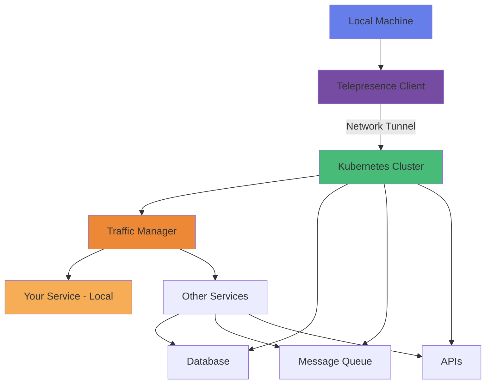
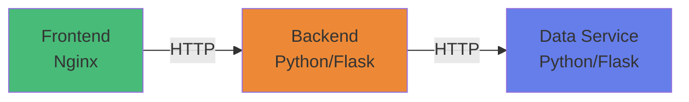

---

# Telepresence

---

## What You'll Learn

- What Telepresence is and why it's useful for Kubernetes development
- How to install and configure Telepresence on your system
- Creating and managing different types of service intercepts
- Debugging applications locally while connected to a cluster
- Team collaboration using personal intercepts and preview URLs
- Best practices for cloud-native development workflows

---

## Introduction

- **Telepresence** is a powerful tool that allows developers to code and test microservices **locally** while connecting to a **remote Kubernetes cluster**
- It bridges the gap between local development and cloud-native environments, enabling **fast feedback loops**
- Eliminates the need to continuously build, push, and deploy containers during development

### What is Telepresence?

- Telepresence is an open-source tool that creates a **bi-directional network proxy** between your local development machine and a Kubernetes cluster

!!! info "Telepresence Capabilities"
    **Local Development with Cluster Access**
    
    - Run a single service locally while connecting to remote Kubernetes services
    - Debug services using your local IDE, debuggers, and development tools
    - Test integrations with other services running in the cluster
    - Develop without waiting for container builds and deployments
    - Work with realistic data and dependencies from the cluster

### Architecture Overview



### Terminology

| Term | Description |
|------|-------------|
| **Traffic Manager** | Controller deployed in the cluster that manages intercepts and routing |
| **Intercept** | Route traffic from a service in the cluster to your local machine |
| **Global Intercept** | All traffic to a service goes to your local machine |
| **Personal Intercept** | Only traffic matching specific headers goes to your local machine |
| **Preview URL** | Shareable URL that routes to your local development environment |

---

## Key Features

<div class="grid cards" markdown>

-   :fontawesome-solid-bolt:{ .lg .middle } __Fast Inner Loop Development__

    ---

    - Edit code locally and see changes immediately. 
    - No container rebuilds required. 
    - Instant feedback on code changes.

-   :fontawesome-solid-network-wired:{ .lg .middle } __Full Network Access__

    ---

    - Access cluster resources as if running in the cluster. 
    - Connect to databases, message queues, and other services. 
    - Test with production-like data and dependencies.

-   :fontawesome-solid-route:{ .lg .middle } __Service Intercepts__

    ---

    - Route cluster traffic to your local machine. 
    - Debug production issues safely. 
    - Test changes without affecting teammates.

-   :fontawesome-solid-share-nodes:{ .lg .middle } __Preview URLs__

    ---

    - Share your local changes with stakeholders. 
    - Get feedback without deploying. 
    - Collaborate seamlessly.

-   :fontawesome-solid-user-lock:{ .lg .middle } __Personal Intercepts__

    ---

    - Header-based traffic routing. 
    - Multiple developers on the same service. Safe parallel development.

-   :fontawesome-solid-hard-drive:{ .lg .middle } __Volume Mounts__

    ---

    Access ConfigMaps and Secrets locally. Test with real cluster configurations. Develop with production-like settings.

</div>

---

## Prerequisites

!!! warning "Required Setup"
    - Running Kubernetes cluster (Minikube, Kind, or cloud provider)
    - `kubectl` configured and working
    - Admin access to the cluster (for Traffic Manager installation)
    - Docker Desktop or Docker Engine running
    - Internet connectivity
    - Code editor (VS Code recommended)

### System Requirements

| Requirement | Specification                   |
|-------------|---------------------------------|
| **OS**      | macOS, Linux, or Windows (WSL2) |
| **Memory**  | At least 4GB RAM available      |
| **Disk**    | 2GB free space                  |
| **Network** | Stable internet connection      |

---

## Installation

### Step 01 - Install Telepresence CLI

=== " macOS (Homebrew)"

    ```bash
    # Install using Homebrew
    brew install datawire/blackbird/telepresence
    
    # Verify installation
    telepresence version
    ```

=== " macOS (Manual)"

    ```bash
    # Download the binary
    sudo curl -fL https://app.getambassador.io/download/tel2/darwin/amd64/latest/telepresence \
      -o /usr/local/bin/telepresence
    
    # Make it executable
    sudo chmod a+x /usr/local/bin/telepresence
    
    # Verify installation
    telepresence version
    ```

=== "🐧 Linux"

    ```bash
    # Download the binary
    sudo curl -fL https://app.getambassador.io/download/tel2/linux/amd64/latest/telepresence \
      -o /usr/local/bin/telepresence
    
    # Make it executable
    sudo chmod a+x /usr/local/bin/telepresence
    
    # Verify installation
    telepresence version
    ```

=== "⊞ Windows (WSL2)"

    ```bash
    # In WSL2 terminal
    sudo curl -fL https://app.getambassador.io/download/tel2/linux/amd64/latest/telepresence \
      -o /usr/local/bin/telepresence
    
    sudo chmod a+x /usr/local/bin/telepresence
    
    telepresence version
    ```

### Step 02 - Verify Cluster Access

```bash
# Check cluster connectivity
kubectl cluster-info

# Check your context
kubectl config current-context

# Verify you have admin permissions
kubectl auth can-i create deployments --all-namespaces
```

### Step 03 - Connect Telepresence

```bash
# Connect to the cluster
# This installs the Traffic Manager in your cluster
telepresence connect

# Check connection status
telepresence status

# List available services
telepresence list
```

!!! success "Expected Output"
    ```
    Connected to context <your-context> (https://your-cluster)
      
    Traffic Manager:
      Version    : v2.x.x
      Status     : Running
      Namespace  : ambassador
    ```

### Step 04 - Verify DNS Access

```bash
# Test DNS resolution of cluster services
curl -k https://kubernetes.default.svc.cluster.local:443
```

---

## Demo Architecture

Our demo application consists of three microservices:



!!! info "Service Description"
    **Frontend** (Nginx)
    
    - Web UI for the application
    - Proxies API calls to backend
    
    **Backend** (Python/Flask) - *INTERCEPT POINT*
    
    - REST API with multiple endpoints
    - Communicates with data service
    - This is the service we'll intercept
    
    **Data Service** (Python/Flask)
    
    - Provides metrics and sample data
    - Simulates data layer

---

## Lab Setup

### Step 01 - Quick Setup

Use the automated setup script:

```bash
# Navigate to lab directory
cd Labs/31-Telepresence

# Run setup script
./setup.sh
```

??? question "What does setup.sh do?"
    - Creates the `telepresence-demo` namespace
    - Deploys all three microservices
    - Waits for services to be ready
    - Displays access information

### Step 02 - Manual Setup (Alternative)

If you prefer manual setup:

```bash
# Create namespace
kubectl create namespace telepresence-demo

# Set default namespace
kubectl config set-context --current --namespace=telepresence-demo

# Deploy services
kubectl apply -f resources/01-namespace.yaml
kubectl apply -f resources/02-dataservice.yaml
kubectl apply -f resources/03-backend.yaml
kubectl apply -f resources/04-frontend.yaml

# Wait for pods to be ready
kubectl wait --for=condition=ready pod --all --timeout=120s
```

### Step 03 - Verify Deployment

```bash
# Check all resources
kubectl get all -n telepresence-demo

# Test frontend
kubectl port-forward -n telepresence-demo svc/frontend 8080:80
```

Then open your browser to `http://localhost:8080`

---

## Exercise 1: Basic Intercept

!!! note "Goal"
    Intercept the backend service and route all traffic to your local development environment.

### Step 1 - Prepare Local Environment

```bash
# Navigate to backend source code
cd resources/backend-app

# Create Python virtual environment
python3 -m venv venv
source venv/bin/activate

# Install dependencies
pip install -r requirements.txt
```

### Step 2 - Connect Telepresence

```bash
# Ensure you're connected
telepresence connect

# List available services
telepresence list --namespace telepresence-demo
```

### Step 3 - Create Intercept

```bash
# Intercept the backend service on port 5000
telepresence intercept backend \
  --port 5000 \
  --namespace telepresence-demo
```

!!! success "Intercept Created"
    ```
    backend: intercepted
      Intercept name: backend
      State         : ACTIVE
      Workload kind : Deployment
      Destination   : 127.0.0.1:5000
      Intercepting  : all TCP connections
    ```

### Step 4 - Run Local Service

```bash
# Run the backend service locally
python app.py

# The service starts on port 5000
```

### Step 5 - Test the Intercept

```bash
# In a new terminal, forward the frontend
kubectl port-forward -n telepresence-demo svc/frontend 8080:80

# Open http://localhost:8080 in your browser
# All backend requests now go to your local machine!
```

### Step 6 - Make Live Changes

!!! example "Try This"
    1. Edit `resources/backend-app/app.py`
    2. Modify a response message
    3. Save the file (Flask auto-reloads in debug mode)
    4. Refresh your browser
    5. See your changes immediately!

### Step 7 - Remove Intercept

```bash
# Leave the intercept
telepresence leave backend

# Verify it's removed
telepresence list
```

---

## Exercise 2: Preview URLs

!!! note "Goal"
    Create a shareable preview URL for your local changes.

### Prerequisites

- Ambassador Cloud account (free tier available)
- Internet-accessible cluster

### Step 1 - Login to Ambassador Cloud

```bash
# Login (opens browser)
telepresence login
```

### Step 2 - Create Preview Intercept

```bash
# Create an intercept with preview URL
telepresence intercept backend \
  --port 5000 \
  --namespace telepresence-demo \
  --preview-url=true
```

!!! success "Preview URL Created"
    You'll receive a URL like:
    ```
    https://[random-id].preview.edgestack.me
    ```

### Step 3 - Share and Test

1. Copy the preview URL
2. Share it with teammates or stakeholders
3. Make changes to your local code
4. Others see changes in real-time via the preview URL!

---

## Exercise 3: Global Intercept

!!! note "Goal"
    Route ALL traffic for a service to your local machine.

!!! warning "Use with Caution"
    Global intercepts affect all users of the service. Only use in development environments or when you have exclusive access.

```bash
# Create a global intercept
telepresence intercept backend \
  --port 5000 \
  --namespace telepresence-demo

# All traffic to backend now goes to localhost:5000
```

**Use Cases:**

- Testing breaking changes
- Debugging production-like issues
- Performance testing with real load

---

## Exercise 4: Personal Intercept

!!! note "Goal"
    Only intercept requests that match specific HTTP headers. This allows multiple developers to work on the same service simultaneously.

### Step 1 - Create Selective Intercept

```bash
# Intercept only requests with specific header
telepresence intercept backend \
  --port 5000 \
  --namespace telepresence-demo \
  --http-match=auto
```

### Step 2 - Get Your Intercept ID

```bash
# List intercepts to see your ID
telepresence list --namespace telepresence-demo
```

### Step 3 - Test with Header

```bash
# Requests WITHOUT your header go to cluster
curl http://backend.telepresence-demo.svc.cluster.local:5000/api/health

# Requests WITH your header go to your local machine
curl -H "x-telepresence-intercept-id: [your-id]" \
  http://backend.telepresence-demo.svc.cluster.local:5000/api/health
```

### Step 4 - Browser Testing

Install a browser extension to add custom headers:

- **ModHeader** (Chrome/Firefox)
- **Modify Headers** (Firefox)

Add the header with your intercept ID, and only your browser will see your local changes!

---

## Advanced Features

### Environment Variables

Capture cluster environment variables:

```bash
# Intercept and capture environment
telepresence intercept backend \
  --port 5000 \
  --namespace telepresence-demo \
  --env-file=.env.cluster

# Load them in your app
source .env.cluster
python app.py
```

### Volume Mounts

Access remote volumes locally:

```bash
# Intercept with volume mounts
telepresence intercept backend \
  --port 5000 \
  --namespace telepresence-demo \
  --mount=true

# Volumes mounted at:
# ~/telepresence/[namespace]/[pod-name]/[volume-name]
```

### Docker Mode

Run your local service in Docker:

```bash
# Intercept and connect Docker container
telepresence intercept backend \
  --port 5000 \
  --namespace telepresence-demo \
  --docker-run -- \
  -v $(pwd):/app \
  my-backend-image:dev
```

---

## Common Commands Reference

| Command | Description |
|---------|-------------|
| `telepresence connect` | Connect to cluster |
| `telepresence status` | Show connection status |
| `telepresence list` | List available services |
| `telepresence intercept SERVICE --port PORT` | Create basic intercept |
| `telepresence leave SERVICE` | Remove specific intercept |
| `telepresence leave --all` | Remove all intercepts |
| `telepresence quit` | Disconnect from cluster |
| `telepresence loglevel debug` | Enable debug logging |

---

## Troubleshooting

### Connection Issues

```bash
# Check status
telepresence status

# Reconnect
telepresence quit
telepresence connect

# Check logs
telepresence loglevel debug
```

### DNS Not Working

```bash
# Try alternative DNS method
telepresence quit
telepresence connect --dns=google
```

### Intercept Not Working

```bash
# Check intercept status
telepresence list

# View traffic manager logs
kubectl logs -n ambassador deployment/traffic-manager
```

### Port Conflicts

```bash
# Use different local port
telepresence intercept backend \
  --port 5001:5000 \
  --namespace telepresence-demo
```

!!! tip "More Help"
    See [TROUBLESHOOTING.md](TROUBLESHOOTING.md) for detailed solutions to common issues.

---

## Best Practices

!!! success "Development Workflow"
    **Keep Connection Active**
    
    - Keep telepresence connected during development sessions
    
    **Use Personal Intercepts**
    
    - Avoid disrupting teammates in shared environments
    
    **Environment Parity**
    
    - Capture and use cluster environment variables
    
    **Clean Up**
    
    - Always remove intercepts when done
    - Use `telepresence leave --all`

!!! warning "Security"
    - Be cautious with sensitive environment variables
    - Don't expose internal services unnecessarily
    - Use preview URLs with expiration times
    - Follow your organization's security policies

!!! info "Performance"
    - Run heavy services (databases) in cluster
    - Understand that remote calls have network latency
    - Use selective intercepts to minimize overhead
    - Maintain stable internet connection

---

## Cleanup

### Remove Intercepts

```bash
# Leave specific intercept
telepresence leave backend

# Leave all intercepts
telepresence leave --all
```

### Disconnect from Cluster

```bash
# Disconnect but leave traffic manager
telepresence quit

# Disconnect and remove traffic manager
telepresence uninstall --everything
```

### Delete Demo Resources

```bash
# Use cleanup script
./cleanup.sh

# Or manually
kubectl delete namespace telepresence-demo
```

---

## Additional Resources

!!! info "Learn More"
    - [Official Documentation](https://www.telepresence.io/docs/)
    - [GitHub Repository](https://github.com/telepresenceio/telepresence)
    - [Community Slack](https://a8r.io/slack)
    - [EXAMPLES.md](EXAMPLES.md) - 12 practical examples
    - [TROUBLESHOOTING.md](TROUBLESHOOTING.md) - Detailed problem solving

---

## Key Takeaways

!!! success "What You Learned"
    ✅ Telepresence bridges local development and Kubernetes clusters
    
    ✅ Enables fast inner-loop development without container rebuilds
    
    ✅ Supports multiple intercept types for different scenarios
    
    ✅ Works with existing development tools and IDEs
    
    ✅ Dramatically improves developer productivity
    
    ✅ Essential tool for modern cloud-native development

---

## Next Steps

- Experiment with different intercept types
- Integrate Telepresence into your CI/CD pipeline
- Create team workflows using personal intercepts
- Explore [EXAMPLES.md](EXAMPLES.md) for more use cases
- Set up automated testing with Telepresence
- Configure Telepresence for your specific stack

---

**Happy Coding! 🚀**
