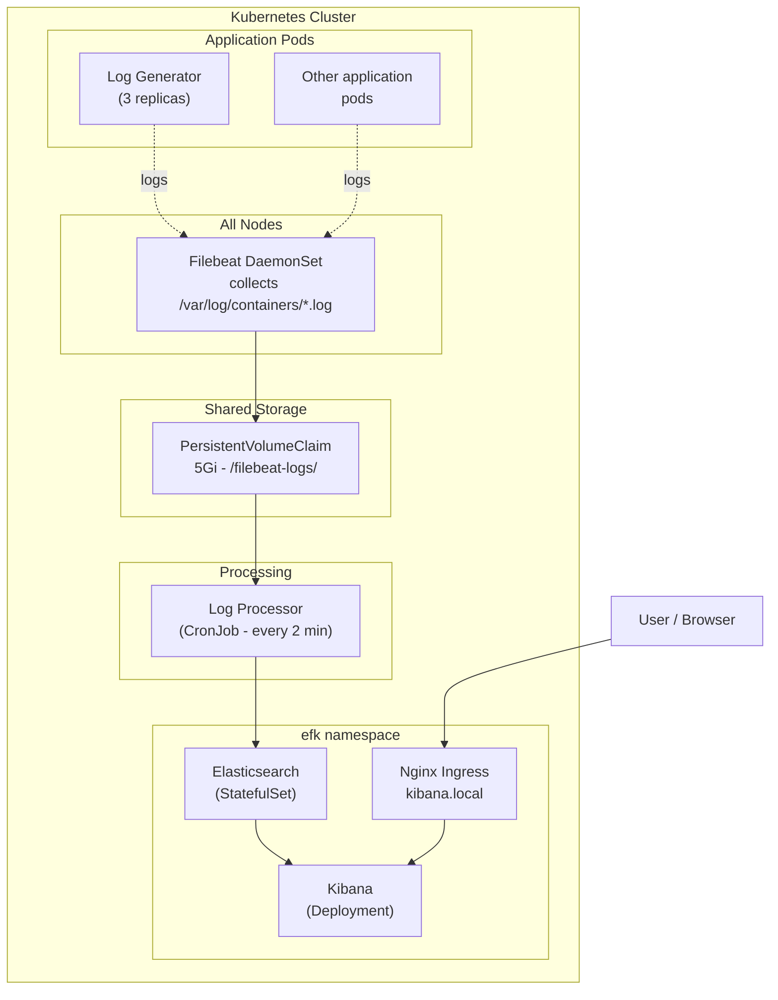
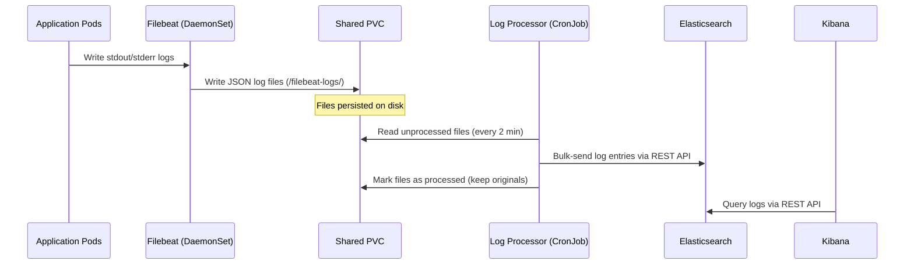
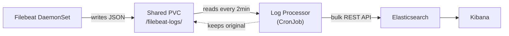
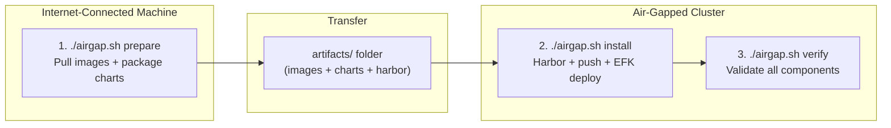

---

# EFK Stack - Elasticsearch, Filebeat, Kibana

- The **EFK stack** is a popular Kubernetes-native logging solution combining Elasticsearch (storage), Filebeat (collection), and Kibana (visualization).
- This lab deploys a **file-based processing architecture**: Filebeat writes logs to a shared PVC instead of directly to Elasticsearch, decoupling collection from indexing.
- Full **air-gapped / offline installation** support via Harbor registry is included.
- The entire stack can be deployed via **ArgoCD** using the App of Apps pattern from Lab 18.

---

## What will we learn?

- Deploy Elasticsearch, Filebeat, and Kibana on Kubernetes using Helm
- Implement a file-based log processing pipeline with a CronJob
- Use a shared PersistentVolumeClaim to buffer logs between collection and indexing
- Access Kibana via Nginx Ingress
- Query logs with KQL (Kibana Query Language)
- Deploy the EFK stack via ArgoCD App of Apps (from Lab 18)
- Perform air-gapped offline installation using Harbor as a local registry

---

### What is the EFK Stack?

| Component        | Role                                                                     |
| ---------------- | ------------------------------------------------------------------------ |
| **Elasticsearch**| Search and analytics engine — stores and indexes log data                |
| **Filebeat**     | Lightweight log shipper (DaemonSet) — collects container logs            |
| **Kibana**       | Web UI for searching, visualizing, and dashboarding log data             |

### Why File-Based Processing?

Traditional EFK sends logs directly from Filebeat to Elasticsearch. This lab uses an intermediate file approach:

| Aspect          | Direct (traditional)               | File-Based (this lab)                         |
| --------------- | ---------------------------------- | --------------------------------------------- |
| **Reliability** | Logs lost if ES is down            | Logs persist on PVC even if ES is down        |
| **Debugging**   | No raw log access                  | Raw JSON files always available               |
| **Reprocessing**| Not possible                       | Reprocess any time by rerunning the CronJob   |
| **Monitoring**  | Single pipeline                    | Clear separation: collection vs. indexing     |

---

## Architecture



### Data Flow



---

## Directory Structure

```
32-EFK/
├── README.md                       # This file
├── .env                            # Configuration (image tags, Harbor settings)
├── demo.sh                         # Online deployment script
├── monitor.sh                      # Monitoring and testing script
├── access-kibana.sh                # Kibana access helper
├── fix-kibana.sh                   # Dashboard re-import utility
├── airgap.sh                       # Offline/air-gapped installation orchestrator
│
├── argocd-apps/                    # ArgoCD Application manifests (App of Apps)
│   ├── elasticsearch.yaml          # ArgoCD App: Elasticsearch Helm chart
│   ├── filebeat.yaml               # ArgoCD App: Filebeat Helm chart (wave 1)
│   ├── kibana.yaml                 # ArgoCD App: Kibana Helm chart (wave 1)
│   ├── log-generator.yaml          # ArgoCD App: Log Generator Helm chart (wave 2)
│   └── log-processor.yaml          # ArgoCD App: Log Processor Helm chart (wave 2)
│
├── helm/
│   ├── elasticsearch/              # Elasticsearch Helm chart
│   ├── filebeat/                   # Filebeat Helm chart (file output mode)
│   ├── kibana/                     # Kibana Helm chart (+ dashboard importer)
│   │   └── dashboards/             # 8 pre-built NDJSON dashboard files
│   ├── log-processor/              # Log Processor CronJob Helm chart
│   └── log-generator/              # Log Generator Helm chart
│
├── scripts/
│   ├── common.sh                   # Shared functions and color helpers
│   ├── install-harbor.sh           # Install Harbor registry on K8s
│   ├── install-ingress.sh          # Install Nginx Ingress Controller
│   ├── retag-and-push-images.sh    # Retag images for Harbor and push
│   ├── upload-charts-to-harbor.sh  # Push Helm charts to Harbor OCI
│   ├── generate-harbor-values.sh   # Generate registry override values
│   ├── offline-install.sh          # Install EFK from Harbor
│   └── verify-deployment.sh        # Verify offline deployment
│
└── artifacts/                      # Offline artifacts (generated by airgap.sh)
    ├── download-all.sh
    ├── images/                     # Container images as .tar files
    ├── charts/                     # Packaged Helm charts (.tgz)
    └── harbor/                     # Harbor chart and images
```

---

## Prerequisites

- Kubernetes cluster (v1.20+) with at least 8 GB RAM
- `kubectl` configured to access your cluster
- `Helm 3.x` installed
- (Optional) Nginx Ingress Controller for Kibana access

```bash
# Install kubectl (macOS)
brew install kubectl

# Install Helm
brew install helm

# Verify
kubectl version --client
helm version
```

---

# Lab

## Part 01 - Deploy the EFK Stack

### 01. Deploy All Components

```bash
chmod +x demo.sh
./demo.sh deploy
```

The script will:

- Create the `efk` namespace
- Deploy Elasticsearch (StatefulSet)
- Deploy Kibana with Nginx Ingress
- Deploy Filebeat DaemonSet (writes logs to PVC files)
- Deploy Log Generator pods (3 replicas generating structured logs)
- Deploy Log Processor CronJob + run an initial Job immediately
- Wait for all pods to be ready
- Print Kibana access information

### 02. Access Kibana

#### Option A - Ingress (Recommended)

```bash
# Get the Ingress IP
INGRESS_IP=$(kubectl get ingress -n efk kibana \
    -o jsonpath='{.status.loadBalancer.ingress[0].ip}')

# Add to /etc/hosts if not already present
grep -q "kibana.local" /etc/hosts || \
    echo "${INGRESS_IP:-192.168.49.2} kibana.local" | sudo tee -a /etc/hosts

open http://kibana.local
```

#### Option B - Port-Forward

```bash
kubectl port-forward -n efk svc/kibana 5601:5601 &
open http://localhost:5601
```

---

## Part 02 - Kibana Dashboards

Dashboards are **automatically imported** during deployment via the Kibana Helm chart's dashboard importer init container.

### Available Dashboards (8)

| Dashboard                         | Description                                         |
| --------------------------------- | --------------------------------------------------- |
| **General Logs Dashboard**        | Overview of all logs by level, component, and time  |
| **Error Analysis Dashboard**      | Comprehensive error monitoring and analysis         |
| **Warning Analysis Dashboard**    | Track and analyze WARNING level logs                |
| **Component Activity Dashboard**  | Detailed per-component log breakdown                |
| **Performance Overview Dashboard**| Key metrics, volume trends, and health indicators   |
| **HTTP Access Dashboard**         | HTTP request logs and access patterns               |
| **K8s Monitoring Dashboard**      | Kubernetes cluster monitoring                       |
| **APM Dashboard**                 | Application performance monitoring                  |

### Access Steps

1. Open Kibana at `http://kibana.local`
2. Click **Dashboard** in the left sidebar
3. Select any dashboard to view logs

### Verify or Re-import Dashboards

```bash
# Check import job status
kubectl logs -n efk -l app=kibana,component=dashboard-importer

# Manually re-import by upgrading the chart
helm upgrade kibana ./helm/kibana -n efk
```

---

## Part 03 - Log Pipeline

### Log Generator

The log generator creates structured JSON logs with varying severity levels and simulated service names:

```json
{
  "timestamp": "2026-02-22T10:30:45Z",
  "level": "ERROR",
  "component": "PaymentService",
  "message": "Transaction failed: timeout",
  "request_id": "req-1740217845-12345",
  "counter": 42
}
```

Components that generate logs: `UserService`, `OrderService`, `PaymentService`, `AuthService`, `DatabaseService`, `CacheService`

### File-Based Pipeline Flow



### Monitor the Pipeline

```bash
# Interactive monitor
./monitor.sh

# Quick summary
./monitor.sh summary

# End-to-end pipeline test
./monitor.sh test

# Full detailed report
./monitor.sh full
```

### Manual Pipeline Checks

```bash
# Verify Filebeat is writing log files
kubectl exec -n efk -l app=filebeat -- ls -lh /filebeat-logs/

# Count documents in Elasticsearch
kubectl exec -n efk elasticsearch-0 -- \
    curl -s http://localhost:9200/filebeat-*/_count

# View CronJob schedule
kubectl get cronjob -n efk

# Manually trigger the log processor
kubectl create job -n efk --from=cronjob/log-processor manual-$(date +%s)
kubectl logs -n efk job/manual-* --tail=30
```

---

## Part 04 - Kibana Query Language (KQL)

```bash
# Show only ERROR logs
json.level: "ERROR"

# Show logs from a specific component
json.component: "PaymentService"

# Show ERROR or WARN logs
json.level: ("ERROR" OR "WARN")

# Show logs with a keyword in the message
json.message: *timeout*

# Combine multiple conditions
json.level: "ERROR" AND json.component: "PaymentService"
```

### Useful Prometheus-style Elasticsearch Queries

```bash
# List all indices
kubectl exec -n efk elasticsearch-0 -- \
    curl -s http://localhost:9200/_cat/indices?v

# Cluster health
kubectl exec -n efk elasticsearch-0 -- \
    curl -s http://localhost:9200/_cluster/health?pretty

# Count documents
kubectl exec -n efk elasticsearch-0 -- \
    curl -s http://localhost:9200/filebeat-*/_count?pretty

# Recent 5 log entries
kubectl exec -n efk elasticsearch-0 -- \
    curl -s "http://localhost:9200/filebeat-*/_search?size=5&sort=@timestamp:desc&pretty"
```

---

## Part 05 - Deploy via ArgoCD (App of Apps)

The EFK stack can be deployed via ArgoCD from Lab 18 using the **App of Apps** pattern. The `argocd-apps/` directory contains individual ArgoCD Application manifests for each Helm chart.

### Deploy via App of Apps (from Lab 18)

```bash
# From Lab 18 directory - deploy the root App of Apps
kubectl apply -f ../18-ArgoCD/apps/app-of-apps.yaml
```

ArgoCD will discover `Labs/32-EFK/argocd-apps/` and deploy each component with proper sync waves:

- **Wave 0** — Elasticsearch (deployed first)
- **Wave 1** — Filebeat, Kibana (deployed after Elasticsearch is healthy)
- **Wave 2** — Log Generator, Log Processor (deployed last)

### Deploy EFK App of Apps Directly

```bash
# Apply only the EFK App of Apps (without the full Lab 18 setup)
kubectl apply -f argocd-apps/elasticsearch.yaml
kubectl apply -f argocd-apps/filebeat.yaml
kubectl apply -f argocd-apps/kibana.yaml
kubectl apply -f argocd-apps/log-generator.yaml
kubectl apply -f argocd-apps/log-processor.yaml
```

### Monitor via ArgoCD

```bash
argocd app list | grep efk
argocd app get efk-elasticsearch
kubectl get applications -n argocd | grep efk
```

---

## Part 06 - Air-Gapped / Offline Installation

This lab supports fully offline deployment using **Harbor** as a local Docker and Helm chart registry.

### Air-Gapped Flow



### Configuration (.env)

```bash
# Harbor settings
HARBOR_DOMAIN="harbor.local"
HARBOR_ADMIN_PASSWORD="Harbor12345"
HARBOR_PROJECT="efk"

# Image versions
ES_TAG="8.11.0"
FILEBEAT_TAG="8.11.0"
KIBANA_TAG="8.11.0"
```

### Step 1 - Prepare Artifacts (requires internet)

```bash
# Download all container images, Helm charts, and Harbor installer
./airgap.sh prepare
```

### Step 2 - Transfer to Air-Gapped Machine

```bash
tar czf efk-offline.tar.gz 32-EFK/
# Copy efk-offline.tar.gz to the air-gapped machine
```

### Step 3 - Full Offline Install

```bash
# One command: installs Harbor, pushes content, deploys EFK
./airgap.sh install
```

### Step 4 - Verify

```bash
./airgap.sh verify
```

### All Air-Gap Commands

```bash
./airgap.sh prepare       # Download artifacts (needs internet)
./airgap.sh install       # Full install: Harbor + push + EFK
./airgap.sh harbor        # Install Harbor registry only
./airgap.sh push          # Push images and charts to Harbor
./airgap.sh efk           # Install EFK from Harbor
./airgap.sh verify        # Run verification tests
./airgap.sh status        # Show deployment status
./airgap.sh cleanup       # Remove EFK (keep Harbor)
./airgap.sh cleanup-all   # Remove everything
```

---

## Part 07 - Configuration

### Elasticsearch

Edit `helm/elasticsearch/values.yaml`:

```yaml
resources:
  requests:
    memory: "2Gi"
    cpu: "1000m"
  limits:
    memory: "2Gi"
    cpu: "1000m"
persistence:
  size: 10Gi
```

### Log Processor (CronJob Schedule)

Edit `helm/log-processor/values.yaml`:

```yaml
# How often to process log files
schedule: "*/2 * * * *"    # Every 2 minutes (default)
# schedule: "*/1 * * * *"  # Every 1 minute
# schedule: "*/5 * * * *"  # Every 5 minutes

processing:
  keepOriginalFiles: true   # Keep files in /filebeat-logs/ for inspection
  createBackups: true       # Also create copies in /filebeat-logs/processed/
```

### Log Generator

Edit `helm/log-generator/values.yaml`:

```yaml
replicaCount: 3     # Pods generating logs
logInterval: 5      # Seconds between log messages per pod
```

---

## Part 08 - Troubleshooting

### Pods Not Starting

```bash
kubectl get events -n efk --sort-by='.lastTimestamp'
kubectl describe pod <pod-name> -n efk
```

### Filebeat Not Collecting Logs

```bash
# Check DaemonSet coverage
kubectl get daemonset -n efk filebeat

# Verify RBAC
kubectl get clusterrole filebeat
kubectl get clusterrolebinding filebeat

# Check log files are being written
kubectl exec -n efk -l app=filebeat -- ls -lh /filebeat-logs/
```

### Log Processor Not Running

```bash
# Check CronJob status
kubectl get cronjob -n efk log-processor

# View recent job executions
kubectl get jobs -n efk -l app=log-processor --sort-by=.metadata.creationTimestamp

# View processor logs
kubectl logs -n efk -l app=log-processor --tail=100

# Manually trigger for testing
kubectl create job -n efk --from=cronjob/log-processor test-run-$(date +%s)
```

### No Data in Kibana

```bash
# 1. Verify Filebeat is writing files
kubectl exec -n efk -l app=filebeat -- ls -lh /filebeat-logs/

# 2. Check Log Processor has run
kubectl get jobs -n efk -l app=log-processor

# 3. Confirm data in Elasticsearch
kubectl exec -n efk elasticsearch-0 -- \
    curl -s http://localhost:9200/filebeat-*/_count

# 4. Check index pattern in Kibana matches: filebeat-*
# 5. Adjust the time range in Kibana (top right corner)
```

!!! note
    The first log data appears in Kibana after the Log Processor CronJob runs (up to 2 minutes after deployment).

### Kibana Dashboard Import Failed

```bash
kubectl logs -n efk -l app=kibana,component=dashboard-importer

# Re-import by upgrading the chart
helm upgrade kibana ./helm/kibana -n efk
```

---

## Cleanup

```bash
# Full cleanup
./demo.sh cleanup

# Manual cleanup
helm uninstall elasticsearch filebeat kibana log-processor log-generator -n efk
kubectl delete namespace efk
```

---

## Resources

- [Elasticsearch Documentation](https://www.elastic.co/guide/en/elasticsearch/reference/current/index.html)
- [Filebeat Documentation](https://www.elastic.co/guide/en/beats/filebeat/current/index.html)
- [Kibana Documentation](https://www.elastic.co/guide/en/kibana/current/index.html)
- [Kubernetes Logging Architecture](https://kubernetes.io/docs/concepts/cluster-administration/logging/)
- [Harbor Registry](https://goharbor.io/docs/)
