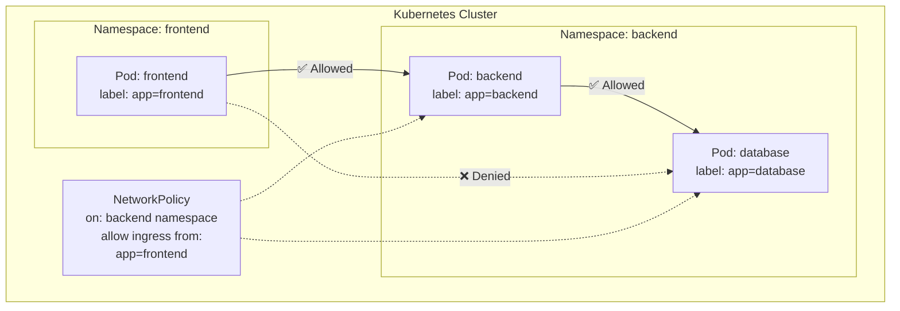

---

# NetworkPolicies - Pod-Level Firewall Rules

- In this lab we will learn how to use Kubernetes **NetworkPolicies** to control traffic flow between pods, namespaces, and external endpoints - effectively creating firewall rules at the pod level.

---

## What will we learn?

- What NetworkPolicies are and how they work
- Default behavior: all pods can talk to all pods (open by default)
- How to create **ingress** and **egress** rules
- How to isolate namespaces from each other
- How to allow traffic only from specific pods using `podSelector`
- How to allow traffic only from specific namespaces using `namespaceSelector`
- How to restrict egress to specific CIDR blocks
- How to implement a **default-deny** policy
- Testing network policies with real traffic

---

## Official Documentation & References

| Resource                    | Link                                                                                                          |
|-----------------------------|---------------------------------------------------------------------------------------------------------------|
| Network Policies            | [kubernetes.io/docs](https://kubernetes.io/docs/concepts/services-networking/network-policies/)               |
| Declare Network Policy      | [kubernetes.io/docs](https://kubernetes.io/docs/tasks/administer-cluster/declare-network-policy/)             |
| NetworkPolicy API Reference | [kubernetes.io/docs](https://kubernetes.io/docs/reference/kubernetes-api/policy-resources/network-policy-v1/) |

---

## Prerequisites

- A running Kubernetes cluster with a **CNI plugin that supports NetworkPolicies** (e.g., Calico, Cilium, Weave Net)
- `kubectl` configured against the cluster

!!! warning "Important: CNI Plugin Required"

    The default Kind/Minikube cluster with the default CNI (kindnet/bridge) does **not** enforce NetworkPolicies. You need a CNI that supports them:

    === "Kind with Calico"

        ```sh
        # Create a Kind cluster without default CNI
        kind create cluster --name netpol-lab --config manifests/kind-config.yaml

        # Install Calico
        kubectl apply -f https://raw.githubusercontent.com/projectcalico/calico/v3.27.0/manifests/calico.yaml

        # Wait for Calico to be ready
        kubectl wait --for=condition=Ready pods -l k8s-app=calico-node -n kube-system --timeout=120s
        ```

    === "Minikube with Calico"

        ```sh
        minikube start --cni=calico
        ```

---

## NetworkPolicy Overview



| Concept          | Description                                                 |
| ---------------- | ----------------------------------------------------------- |
| **Ingress rule** | Controls incoming traffic to selected pods                  |
| **Egress rule**  | Controls outgoing traffic from selected pods                |
| **podSelector**  | Selects which pods the policy applies to (by labels)        |
| **Default deny** | When a policy selects a pod, all non-matching traffic is denied |

---

## 01. Setup: Create namespaces and test pods

```sh
# Clean up
kubectl delete namespace netpol-frontend netpol-backend --ignore-not-found

# Create namespaces with labels (needed for namespaceSelector)
kubectl create namespace netpol-frontend
kubectl label namespace netpol-frontend role=frontend

kubectl create namespace netpol-backend
kubectl label namespace netpol-backend role=backend
```

Deploy test workloads:

```yaml
# manifests/test-pods.yaml
apiVersion: apps/v1
kind: Deployment
metadata:
  name: web
  namespace: netpol-backend
spec:
  replicas: 1
  selector:
    matchLabels:
      app: web
  template:
    metadata:
      labels:
        app: web
    spec:
      containers:
        - name: nginx
          image: nginx:alpine
          ports:
            - containerPort: 80
---
apiVersion: v1
kind: Service
metadata:
  name: web
  namespace: netpol-backend
spec:
  selector:
    app: web
  ports:
    - port: 80
---
apiVersion: v1
kind: Pod
metadata:
  name: client
  namespace: netpol-frontend
  labels:
    app: client
spec:
  containers:
    - name: curl
      image: curlimages/curl:latest
      command: ["sleep", "3600"]
---
apiVersion: v1
kind: Pod
metadata:
  name: rogue
  namespace: netpol-frontend
  labels:
    app: rogue
spec:
  containers:
    - name: curl
      image: curlimages/curl:latest
      command: ["sleep", "3600"]
```

```sh
kubectl apply -f manifests/test-pods.yaml

# Wait for pods to be ready
kubectl wait --for=condition=Ready pod/client -n netpol-frontend --timeout=60s
kubectl wait --for=condition=Ready pod/rogue -n netpol-frontend --timeout=60s
kubectl wait --for=condition=Ready -l app=web pod -n netpol-backend --timeout=60s
```

---

## 02. Verify: Default behavior (all-open)

Without any NetworkPolicy, all pods can communicate:

```sh
# client can reach the web service
kubectl exec client -n netpol-frontend -- \
  curl -s --max-time 3 web.netpol-backend.svc.cluster.local
# Expected: nginx welcome page HTML

# rogue can also reach it
kubectl exec rogue -n netpol-frontend -- \
  curl -s --max-time 3 web.netpol-backend.svc.cluster.local
# Expected: nginx welcome page HTML
```

---

## 03. Default Deny All Ingress

Apply a **default deny** policy - blocks ALL incoming traffic to pods in `netpol-backend`:

```yaml
# manifests/default-deny-ingress.yaml
apiVersion: networking.k8s.io/v1
kind: NetworkPolicy
metadata:
  name: default-deny-ingress
  namespace: netpol-backend
spec:
  podSelector: {}    # Selects ALL pods in this namespace
  policyTypes:
    - Ingress        # No ingress rules = deny all incoming traffic
```

```sh
kubectl apply -f manifests/default-deny-ingress.yaml
```

Test - both pods should now be blocked:

```sh
# Both should time out
kubectl exec client -n netpol-frontend -- \
  curl -s --max-time 3 web.netpol-backend.svc.cluster.local
# Expected: timeout / connection refused

kubectl exec rogue -n netpol-frontend -- \
  curl -s --max-time 3 web.netpol-backend.svc.cluster.local
# Expected: timeout / connection refused
```

---

## 04. Allow traffic from specific pods (podSelector)

Allow only pods with label `app=client` from the `netpol-frontend` namespace:

```yaml
# manifests/allow-client-ingress.yaml
apiVersion: networking.k8s.io/v1
kind: NetworkPolicy
metadata:
  name: allow-client-ingress
  namespace: netpol-backend
spec:
  podSelector:
    matchLabels:
      app: web
  policyTypes:
    - Ingress
  ingress:
    - from:
        - namespaceSelector:
            matchLabels:
              role: frontend
          podSelector:
            matchLabels:
              app: client
      ports:
        - protocol: TCP
          port: 80
```

```sh
kubectl apply -f manifests/allow-client-ingress.yaml
```

!!! note "AND vs OR in NetworkPolicy selectors"

    When `namespaceSelector` and `podSelector` are in the **same `from` entry** (no dash between them), they are combined with **AND** - both must match. If they were separate entries (each with its own dash), they would be **OR**.

Test:

```sh
# client should work (matches app=client in frontend namespace)
kubectl exec client -n netpol-frontend -- \
  curl -s --max-time 3 web.netpol-backend.svc.cluster.local
# Expected: nginx welcome page HTML ✅

# rogue should still be blocked (has app=rogue, not app=client)
kubectl exec rogue -n netpol-frontend -- \
  curl -s --max-time 3 web.netpol-backend.svc.cluster.local
# Expected: timeout ❌
```

---

## 05. Egress policy - Restrict outgoing traffic

Restrict pods in `netpol-backend` to only communicate with DNS and internal cluster IPs:

```yaml
# manifests/restrict-egress.yaml
apiVersion: networking.k8s.io/v1
kind: NetworkPolicy
metadata:
  name: restrict-egress
  namespace: netpol-backend
spec:
  podSelector:
    matchLabels:
      app: web
  policyTypes:
    - Egress
  egress:
    # Allow DNS resolution
    - to: []
      ports:
        - protocol: UDP
          port: 53
        - protocol: TCP
          port: 53
    # Allow traffic to pods within the same namespace
    - to:
        - namespaceSelector:
            matchLabels:
              role: backend
```

```sh
kubectl apply -f manifests/restrict-egress.yaml
```

---

## 06. Default Deny All (Ingress + Egress)

The most restrictive baseline - deny everything, then allowlist:

```yaml
# manifests/default-deny-all.yaml
apiVersion: networking.k8s.io/v1
kind: NetworkPolicy
metadata:
  name: default-deny-all
  namespace: netpol-backend
spec:
  podSelector: {}
  policyTypes:
    - Ingress
    - Egress
```

```sh
# Apply the policy (removes all the previous specific policies first)
kubectl delete networkpolicy --all -n netpol-backend
kubectl apply -f manifests/default-deny-all.yaml
```

!!! tip "Production Pattern"

    The recommended production approach:

    1. Start with a **default-deny-all** policy in each namespace
    2. Add specific **allow** policies for each required communication path
    3. This is a "whitelist" approach - explicit is better than implicit

---

## 07. Inspect and debug NetworkPolicies

```sh
# List all network policies in a namespace
kubectl get networkpolicy -n netpol-backend

# Describe a specific policy to see its rules
kubectl describe networkpolicy allow-client-ingress -n netpol-backend

# Check which pods are selected by a policy
kubectl get pods -n netpol-backend -l app=web
```

---

## 08. Cleanup

```sh
kubectl delete namespace netpol-frontend netpol-backend
```

---

## Summary

| Concept                  | Key Takeaway                                                    |
| ------------------------ | --------------------------------------------------------------- |
| **Default behavior**     | Without NetworkPolicies, all pods can communicate freely        |
| **Default deny**         | `podSelector: {}` with no rules = deny all                     |
| **Ingress rules**        | Control who can send traffic TO your pods                       |
| **Egress rules**         | Control where your pods can send traffic                        |
| **podSelector**          | Match traffic sources/destinations by pod labels                |
| **namespaceSelector**    | Match traffic sources/destinations by namespace labels          |
| **AND vs OR**            | Same `from` entry = AND; separate `from` entries = OR           |
| **Best practice**        | Default deny + explicit allow (whitelist approach)              |

---

# Exercises

The following exercises will test your understanding of Kubernetes NetworkPolicies.
Try to solve each exercise on your own before revealing the solution.

---

#### 01. Allow Ingress Only on a Specific Port

Create a NetworkPolicy that allows ingress to pods labeled `app=api` only on port 8080 (TCP), denying traffic on all other ports.

#### Scenario:

◦ Your API server listens on port 8080 but also has a debug port 9090 that should never be accessible.
◦ You need to ensure only port 8080 is reachable from other pods.

**Hint:** Use `spec.ingress.ports` to specify the allowed port. All other ports will be denied once a policy selects the pod.

<details>
<summary>Solution</summary>

```bash
## Create the namespace
kubectl create namespace netpol-exercise --dry-run=client -o yaml | kubectl apply -f -

## Deploy an API pod that listens on two ports
cat <<'EOF' | kubectl apply -f -
apiVersion: v1
kind: Pod
metadata:
  name: api-server
  namespace: netpol-exercise
  labels:
    app: api
spec:
  containers:
    - name: api
      image: nginx:alpine
      ports:
        - containerPort: 80
EOF

## Deploy a client pod
cat <<'EOF' | kubectl apply -f -
apiVersion: v1
kind: Pod
metadata:
  name: test-client
  namespace: netpol-exercise
  labels:
    app: client
spec:
  containers:
    - name: curl
      image: curlimages/curl:latest
      command: ["sleep", "3600"]
EOF

## Wait for pods
kubectl wait --for=condition=Ready pod/api-server -n netpol-exercise --timeout=60s
kubectl wait --for=condition=Ready pod/test-client -n netpol-exercise --timeout=60s

## Apply the NetworkPolicy allowing only port 8080
cat <<'EOF' | kubectl apply -f -
apiVersion: networking.k8s.io/v1
kind: NetworkPolicy
metadata:
  name: allow-api-port-only
  namespace: netpol-exercise
spec:
  podSelector:
    matchLabels:
      app: api
  policyTypes:
    - Ingress
  ingress:
    - ports:
        - protocol: TCP
          port: 8080
EOF

## Test: port 8080 would be allowed (if it were listening)
## Port 80 should be denied by the policy
kubectl exec test-client -n netpol-exercise -- \
  curl -s --max-time 3 api-server:80 2>&1 || echo "Blocked as expected"

## Clean up
kubectl delete namespace netpol-exercise
```

</details>

---

#### 02. Allow Traffic Between Specific Namespaces Only

Create two namespaces (`team-a` and `team-b`) and a NetworkPolicy that allows pods in `team-b` to receive ingress only from pods in `team-a`.

#### Scenario:

◦ Team A runs a frontend that needs to call Team B's backend service.
◦ No other namespaces should be able to reach Team B's pods.

**Hint:** Label the namespaces and use `namespaceSelector` in the ingress rule.

<details>
<summary>Solution</summary>

```bash
## Create namespaces with labels
kubectl create namespace team-a
kubectl label namespace team-a team=a
kubectl create namespace team-b
kubectl label namespace team-b team=b

## Deploy a backend in team-b
cat <<'EOF' | kubectl apply -f -
apiVersion: v1
kind: Pod
metadata:
  name: backend
  namespace: team-b
  labels:
    app: backend
spec:
  containers:
    - name: nginx
      image: nginx:alpine
      ports:
        - containerPort: 80
---
apiVersion: v1
kind: Service
metadata:
  name: backend
  namespace: team-b
spec:
  selector:
    app: backend
  ports:
    - port: 80
EOF

## Deploy clients in team-a and default namespace
cat <<'EOF' | kubectl apply -f -
apiVersion: v1
kind: Pod
metadata:
  name: frontend
  namespace: team-a
  labels:
    app: frontend
spec:
  containers:
    - name: curl
      image: curlimages/curl:latest
      command: ["sleep", "3600"]
EOF

## Wait for pods
kubectl wait --for=condition=Ready pod/backend -n team-b --timeout=60s
kubectl wait --for=condition=Ready pod/frontend -n team-a --timeout=60s

## Apply default deny + allow from team-a only
cat <<'EOF' | kubectl apply -f -
apiVersion: networking.k8s.io/v1
kind: NetworkPolicy
metadata:
  name: deny-all-ingress
  namespace: team-b
spec:
  podSelector: {}
  policyTypes:
    - Ingress
---
apiVersion: networking.k8s.io/v1
kind: NetworkPolicy
metadata:
  name: allow-from-team-a
  namespace: team-b
spec:
  podSelector:
    matchLabels:
      app: backend
  policyTypes:
    - Ingress
  ingress:
    - from:
        - namespaceSelector:
            matchLabels:
              team: a
      ports:
        - protocol: TCP
          port: 80
EOF

## Test: frontend in team-a can reach backend
kubectl exec frontend -n team-a -- \
  curl -s --max-time 3 backend.team-b.svc.cluster.local
## Expected: nginx welcome page ✅

## Clean up
kubectl delete namespace team-a team-b
```

</details>

---

#### 03. Create an Egress Policy That Only Allows DNS and HTTPS

Create a NetworkPolicy for pods labeled `app=secure-app` that only allows egress to DNS (UDP/TCP port 53) and HTTPS (TCP port 443).

#### Scenario:

◦ Your application needs to resolve DNS names and make HTTPS API calls.
◦ All other outbound traffic (HTTP, SSH, database ports) must be blocked.

**Hint:** Use multiple entries in `spec.egress` with specific port rules.

<details>
<summary>Solution</summary>

```bash
## Create namespace
kubectl create namespace egress-test

## Deploy the pod
cat <<'EOF' | kubectl apply -f -
apiVersion: v1
kind: Pod
metadata:
  name: secure-app
  namespace: egress-test
  labels:
    app: secure-app
spec:
  containers:
    - name: curl
      image: curlimages/curl:latest
      command: ["sleep", "3600"]
EOF

kubectl wait --for=condition=Ready pod/secure-app -n egress-test --timeout=60s

## Apply the egress policy
cat <<'EOF' | kubectl apply -f -
apiVersion: networking.k8s.io/v1
kind: NetworkPolicy
metadata:
  name: restrict-egress-dns-https
  namespace: egress-test
spec:
  podSelector:
    matchLabels:
      app: secure-app
  policyTypes:
    - Egress
  egress:
    # Allow DNS resolution
    - ports:
        - protocol: UDP
          port: 53
        - protocol: TCP
          port: 53
    # Allow HTTPS traffic
    - ports:
        - protocol: TCP
          port: 443
EOF

## Test: HTTPS should work (port 443)
kubectl exec secure-app -n egress-test -- \
  curl -s --max-time 5 -o /dev/null -w "%{http_code}" https://kubernetes.default.svc:443 -k 2>&1 || echo "May vary by cluster"

## Test: HTTP on port 80 should be blocked
kubectl exec secure-app -n egress-test -- \
  curl -s --max-time 3 http://kubernetes.default.svc:80 2>&1 || echo "Blocked as expected"

## Clean up
kubectl delete namespace egress-test
```

</details>

---

#### 04. Implement a Zero-Trust Network Model

Implement a complete zero-trust model for a three-tier application: frontend (port 80), backend (port 8080), and database (port 5432). Each tier can only communicate with its adjacent tier.

#### Scenario:

◦ Frontend pods can receive traffic from anywhere but can only talk to backend pods.
◦ Backend pods can only receive traffic from frontend pods and can only talk to database pods.
◦ Database pods can only receive traffic from backend pods and cannot make any outbound connections.

**Hint:** Start with default-deny-all in the namespace, then add specific allow policies for each tier.

<details>
<summary>Solution</summary>

```bash
## Create namespace
kubectl create namespace zero-trust

## Deploy all three tiers
cat <<'EOF' | kubectl apply -f -
apiVersion: v1
kind: Pod
metadata:
  name: frontend
  namespace: zero-trust
  labels:
    tier: frontend
spec:
  containers:
    - name: nginx
      image: nginx:alpine
      ports:
        - containerPort: 80
---
apiVersion: v1
kind: Pod
metadata:
  name: backend
  namespace: zero-trust
  labels:
    tier: backend
spec:
  containers:
    - name: nginx
      image: nginx:alpine
      ports:
        - containerPort: 80
---
apiVersion: v1
kind: Pod
metadata:
  name: database
  namespace: zero-trust
  labels:
    tier: database
spec:
  containers:
    - name: nginx
      image: nginx:alpine
      ports:
        - containerPort: 80
EOF

## Wait for pods
kubectl wait --for=condition=Ready pod -l tier -n zero-trust --timeout=60s

## Step 1: Default deny all traffic
cat <<'EOF' | kubectl apply -f -
apiVersion: networking.k8s.io/v1
kind: NetworkPolicy
metadata:
  name: default-deny-all
  namespace: zero-trust
spec:
  podSelector: {}
  policyTypes:
    - Ingress
    - Egress
EOF

## Step 2: Frontend can receive from anywhere, egress to backend + DNS
cat <<'EOF' | kubectl apply -f -
apiVersion: networking.k8s.io/v1
kind: NetworkPolicy
metadata:
  name: frontend-policy
  namespace: zero-trust
spec:
  podSelector:
    matchLabels:
      tier: frontend
  policyTypes:
    - Ingress
    - Egress
  ingress:
    - {}
  egress:
    - to:
        - podSelector:
            matchLabels:
              tier: backend
    - ports:
        - protocol: UDP
          port: 53
        - protocol: TCP
          port: 53
EOF

## Step 3: Backend receives from frontend, egress to database + DNS
cat <<'EOF' | kubectl apply -f -
apiVersion: networking.k8s.io/v1
kind: NetworkPolicy
metadata:
  name: backend-policy
  namespace: zero-trust
spec:
  podSelector:
    matchLabels:
      tier: backend
  policyTypes:
    - Ingress
    - Egress
  ingress:
    - from:
        - podSelector:
            matchLabels:
              tier: frontend
  egress:
    - to:
        - podSelector:
            matchLabels:
              tier: database
    - ports:
        - protocol: UDP
          port: 53
        - protocol: TCP
          port: 53
EOF

## Step 4: Database receives from backend only, no egress
cat <<'EOF' | kubectl apply -f -
apiVersion: networking.k8s.io/v1
kind: NetworkPolicy
metadata:
  name: database-policy
  namespace: zero-trust
spec:
  podSelector:
    matchLabels:
      tier: database
  policyTypes:
    - Ingress
    - Egress
  ingress:
    - from:
        - podSelector:
            matchLabels:
              tier: backend
  egress: []
EOF

## Verify policies
kubectl get networkpolicy -n zero-trust

## Clean up
kubectl delete namespace zero-trust
```

</details>

---

## Troubleshooting

- **NetworkPolicy has no effect:**

Verify your CNI plugin supports NetworkPolicies:

```bash
## Check which CNI is installed
kubectl get pods -n kube-system | grep -E "calico|cilium|weave"

## If using Kind with default CNI (kindnet), NetworkPolicies are NOT enforced
## Reinstall with Calico:
## kind delete cluster && kind create cluster --config manifests/kind-config.yaml
## kubectl apply -f https://raw.githubusercontent.com/projectcalico/calico/v3.27.0/manifests/calico.yaml
```

<br>

- **Pods cannot resolve DNS after applying deny policy:**

Default-deny policies block DNS (port 53). Always include a DNS allow rule in egress policies:

```bash
## Add DNS egress to your policy:
## egress:
##   - ports:
##       - protocol: UDP
##         port: 53
##       - protocol: TCP
##         port: 53
```

<br>

- **Traffic still getting through after applying deny policy:**

Check that the policy selects the correct pods and is in the correct namespace:

```bash
## Verify the policy is applied
kubectl get networkpolicy -n <namespace>

## Describe the policy to see which pods it selects
kubectl describe networkpolicy <policy-name> -n <namespace>

## Verify pod labels match
kubectl get pods -n <namespace> --show-labels
```

<br>

- **Cannot determine if AND or OR logic is being used:**

Remember: items in the same `from` entry (same `-`) are ANDed; separate `from` entries (separate `-`) are ORed:

```yaml
## AND (both must match):
ingress:
  - from:
      - namespaceSelector:
          matchLabels:
            role: frontend
        podSelector:            # No dash - same entry = AND
          matchLabels:
            app: client

## OR (either can match):
ingress:
  - from:
      - namespaceSelector:
          matchLabels:
            role: frontend
      - podSelector:            # Dash - separate entry = OR
          matchLabels:
            app: client
```

<br>

- **Testing connectivity between pods:**

Use `curl` or `wget` with timeouts to test connectivity:

```bash
## Using curl with timeout
kubectl exec <pod> -n <namespace> -- curl -s --max-time 3 <service>.<namespace>.svc.cluster.local

## Using wget (if curl not available)
kubectl exec <pod> -n <namespace> -- wget -qO- --timeout=3 <service>.<namespace>.svc.cluster.local

## Using nc (netcat) for specific ports
kubectl exec <pod> -n <namespace> -- nc -zv -w 3 <service> <port>
```

---

## Next Steps

- Explore [Cilium NetworkPolicies](https://docs.cilium.io/en/stable/security/policy/) for advanced L7 (HTTP, gRPC) filtering and DNS-aware policies.
- Learn about [Calico NetworkPolicies](https://docs.tigera.io/calico/latest/network-policy/) for enterprise-grade network security with global policies and FQDN-based rules.
- Try [Network Policy Editor](https://editor.networkpolicy.io/) - a visual tool for building and visualizing NetworkPolicies.
- Implement [Kubernetes Security Best Practices](https://kubernetes.io/docs/concepts/security/) combining NetworkPolicies with RBAC, Pod Security Standards, and Secrets management.
- Explore service mesh solutions (Istio, Linkerd) for mTLS and L7 traffic management on top of NetworkPolicies.
