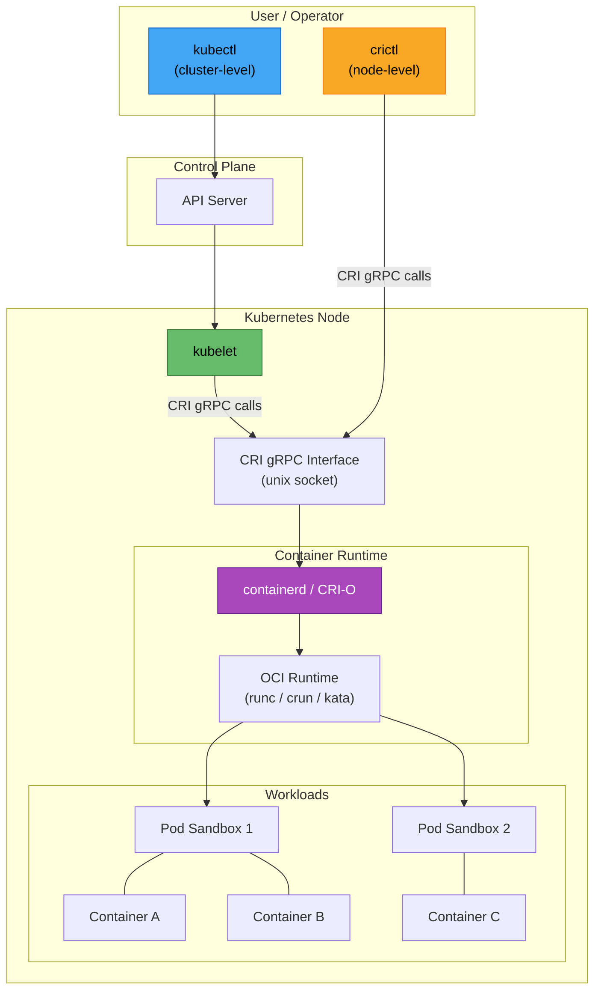

---

# crictl - Container Runtime Interface CLI

- Welcome to the `crictl` hands-on lab! In this tutorial, you will learn how to use `crictl`, the command-line interface for CRI-compatible container runtimes.
- `crictl` is an essential debugging and inspection tool that operates at the container runtime level, giving you visibility into what is happening beneath the Kubernetes API layer.
- Unlike `kubectl`, which communicates with the Kubernetes API server, `crictl` talks directly to the container runtime (such as `containerd` or `CRI-O`) on a specific node.

!!! danger "Node-Level Tool"
    `crictl` runs **directly on Kubernetes nodes**, not from your local workstation.
    All commands in this lab assume you have SSH access to a Kubernetes node (control plane or worker).
    You must run these commands as `root` or with `sudo` privileges.

---

## What will we learn?

- What the Container Runtime Interface (CRI) is and why it exists
- How `crictl` fits into the Kubernetes architecture
- How to install and configure `crictl` on a Kubernetes node
- How to list, inspect, and filter pods and containers at the runtime level
- How to view container logs directly from the runtime
- How to execute commands inside running containers
- How to manage container images at the runtime level
- How to monitor resource usage with runtime-level stats
- How to query runtime information for debugging
- How to manually create pod sandboxes and containers (advanced debugging)
- When to use `crictl` versus `kubectl` and other container CLI tools

---

## Official Documentation & References

| Resource                                  | Link                                                                                                                                 |
| ----------------------------------------- | ------------------------------------------------------------------------------------------------------------------------------------ |
| crictl Official Repository                | [github.com/kubernetes-sigs/cri-tools](https://github.com/kubernetes-sigs/cri-tools)                                                |
| CRI Specification                         | [kubernetes.io/docs/concepts/architecture/cri](https://kubernetes.io/docs/concepts/architecture/cri/)                                |
| crictl User Guide                         | [github.com/kubernetes-sigs/cri-tools/blob/master/docs/crictl.md](https://github.com/kubernetes-sigs/cri-tools/blob/master/docs/crictl.md) |
| Kubernetes Container Runtimes             | [kubernetes.io/docs/setup/production-environment/container-runtimes](https://kubernetes.io/docs/setup/production-environment/container-runtimes/) |
| containerd Documentation                  | [containerd.io/docs](https://containerd.io/docs/)                                                                                    |
| CRI-O Documentation                       | [cri-o.io](https://cri-o.io/)                                                                                                       |
| Debugging Kubernetes Nodes                | [kubernetes.io/docs/tasks/debug/debug-cluster/crictl](https://kubernetes.io/docs/tasks/debug/debug-cluster/crictl/)                  |
| Migrating from Docker to containerd       | [kubernetes.io/docs/tasks/administer-cluster/migrating-from-dockershim](https://kubernetes.io/docs/tasks/administer-cluster/migrating-from-dockershim/) |
| OCI Runtime Specification                 | [github.com/opencontainers/runtime-spec](https://github.com/opencontainers/runtime-spec)                                            |

---

## Introduction

### What is CRI (Container Runtime Interface)?

- The **Container Runtime Interface (CRI)** is a plugin interface that allows the kubelet to use a wide variety of container runtimes without needing to recompile the kubelet itself.
- CRI defines a set of gRPC services that a container runtime must implement so that the kubelet can manage pods and containers on a node.
- Before CRI existed, Kubernetes was tightly coupled to Docker. CRI decoupled Kubernetes from any specific runtime, enabling alternatives like `containerd` and `CRI-O`.

The CRI specification defines two main gRPC services:

| Service            | Responsibility                                                                                       |
| ------------------ | ---------------------------------------------------------------------------------------------------- |
| `RuntimeService`   | Manages pod sandboxes and containers: creating, starting, stopping, removing, and listing them.      |
| `ImageService`     | Manages container images: pulling, listing, inspecting, and removing images on the node.             |

### Why crictl Exists

- `crictl` (pronounced "cry-cuttle") is a **CLI tool for CRI-compatible container runtimes**.
- It provides a way to **inspect and debug** the container runtime directly on a Kubernetes node.
- It was created as part of the `cri-tools` project by the Kubernetes SIG Node team.
- `crictl` is the recommended replacement for `docker` CLI commands when your cluster uses `containerd` or `CRI-O` instead of Docker.

Common use cases for `crictl`:

- Debugging container issues that are not visible through `kubectl`
- Inspecting the state of containers and pods at the runtime level
- Viewing logs when the Kubernetes API server is unavailable
- Checking image availability on a specific node
- Investigating pod sandbox networking issues
- Monitoring resource usage at the runtime level
- Troubleshooting CrashLoopBackOff and ImagePullBackOff errors from the node perspective

### crictl vs docker CLI vs nerdctl vs ctr

Since the removal of `dockershim` in Kubernetes 1.24, multiple CLI tools exist for interacting with container runtimes. Here is how they compare:

| Feature                    | `crictl`                          | `docker`                        | `nerdctl`                         | `ctr`                             |
| -------------------------- | --------------------------------- | ------------------------------- | --------------------------------- | --------------------------------- |
| **Purpose**                | CRI debugging                     | Docker Engine management        | containerd management (Docker-compatible) | Low-level containerd client |
| **Target Runtime**         | Any CRI runtime                   | Docker Engine only              | containerd only                   | containerd only                   |
| **Kubernetes-aware**       | Yes (pods, sandboxes)             | No                              | Yes (with nerdctl ps -a)          | No                                |
| **Pod support**            | Yes (native)                      | No                              | Limited                           | No                                |
| **Image management**       | Pull, list, remove                | Full (build, push, pull)        | Full (build, push, pull)          | Pull, list, remove                |
| **Container creation**     | Manual (debugging only)           | Full lifecycle                  | Full lifecycle                    | Full lifecycle                    |
| **Build images**           | No                                | Yes                             | Yes                               | No                                |
| **Compose support**        | No                                | Yes (docker compose)            | Yes (nerdctl compose)             | No                                |
| **Recommended for K8s**    | Yes (node debugging)              | No (deprecated in K8s)          | Yes (development)                 | No (too low-level)                |
| **Installed by default**   | Often (kubeadm nodes)             | No (unless Docker runtime)      | No                                | Yes (with containerd)             |

!!! tip "Rule of Thumb"
    - Use `kubectl` for **cluster-level** operations (from your workstation).
    - Use `crictl` for **node-level** debugging (SSH into the node).
    - Use `nerdctl` if you need a **Docker-compatible** CLI for `containerd`.
    - Use `ctr` only for **very low-level** containerd operations.

### CRI Architecture

The following diagram shows how `crictl` fits into the Kubernetes container runtime architecture:



Key points from the architecture:

1. **kubectl** communicates with the **API Server** over HTTPS (cluster-level).
2. The **API Server** instructs the **kubelet** on each node.
3. The **kubelet** communicates with the **container runtime** via **CRI gRPC** over a Unix socket.
4. **crictl** connects to the **same Unix socket**, bypassing the API Server entirely.
5. The container runtime (`containerd` or `CRI-O`) delegates actual container execution to an **OCI runtime** like `runc`.

### When to Use crictl vs kubectl

| Scenario                                           | Use `kubectl`    | Use `crictl`     |
| -------------------------------------------------- | ---------------- | ---------------- |
| Deploy, scale, or manage workloads                 | Yes              | No               |
| View pod logs (API server is healthy)              | Yes              | Optional         |
| View pod logs (API server is down or unreachable)  | No               | Yes              |
| Inspect container state on a specific node         | Limited          | Yes              |
| Debug networking at the pod sandbox level          | No               | Yes              |
| Check which images are cached on a node            | No               | Yes              |
| Monitor per-container resource usage on a node     | No               | Yes              |
| Investigate why a container keeps crashing         | Partially        | Yes (more detail)|
| Create test pods and containers                    | Yes              | Yes (manual)     |
| Manage cluster resources (Services, Ingress, etc.) | Yes              | No               |

### Configuration File

`crictl` uses a configuration file at `/etc/crictl.yaml` to determine which runtime endpoint to connect to. This avoids having to pass the `--runtime-endpoint` flag with every command.

```yaml
## /etc/crictl.yaml
## Configuration file for crictl
runtime-endpoint: unix:///run/containerd/containerd.sock
image-endpoint: unix:///run/containerd/containerd.sock
timeout: 10
debug: false
pull-image-on-create: false
disable-pull-on-run: false
```

| Field                   | Description                                                                                         |
| ----------------------- | --------------------------------------------------------------------------------------------------- |
| `runtime-endpoint`      | The Unix socket path for the container runtime's CRI service.                                       |
| `image-endpoint`        | The Unix socket path for the image service (often the same as `runtime-endpoint`).                  |
| `timeout`               | Timeout in seconds for CRI gRPC calls.                                                              |
| `debug`                 | When `true`, enables verbose debug output for all commands.                                         |
| `pull-image-on-create`  | When `true`, automatically pulls the image when creating a container.                               |
| `disable-pull-on-run`   | When `true`, disables automatic image pulling when running a container.                             |

Common runtime endpoint paths:

| Runtime       | Socket Path                                    |
| ------------- | ---------------------------------------------- |
| `containerd`  | `unix:///run/containerd/containerd.sock`       |
| `CRI-O`       | `unix:///var/run/crio/crio.sock`               |
| `Docker` (via cri-dockerd) | `unix:///run/cri-dockerd.sock`      |

---

## Prerequisites

Before starting this lab, ensure you have:

- A running Kubernetes cluster (single-node or multi-node)
- **SSH access** to at least one Kubernetes node (control plane or worker)
- **Root or sudo privileges** on the node
- A container runtime installed on the node (`containerd` or `CRI-O`)
- Basic familiarity with `kubectl` and Kubernetes concepts (pods, containers, namespaces)
- Some workloads already running on the cluster (for inspection)

!!! warning "This Lab Requires Node Access"
    Unlike most Kubernetes labs where you run commands from your workstation using `kubectl`, this lab requires you to **SSH into a Kubernetes node** and run commands directly on it. If you are using a managed Kubernetes service (EKS, GKE, AKS), you will need to SSH into a worker node or use a node shell utility like `kubectl debug node/<node-name> -it --image=ubuntu`.

To SSH into a node (example):

```bash
## If you know the node IP address
ssh user@<node-ip>

## Using kubectl to get node IPs first
kubectl get nodes -o wide

## Alternative: use kubectl debug to get a shell on a node
## (requires Kubernetes 1.18+ with ephemeral containers enabled)
kubectl debug node/<node-name> -it --image=ubuntu
```

---

# Lab

### Step 01 - Install crictl

- `crictl` is distributed as a standalone binary from the `cri-tools` project.
- On many Kubernetes distributions (kubeadm, k3s, etc.), `crictl` is already installed. Check first before installing.

#### Check if crictl is Already Installed

```bash
## Check if crictl is available on the node
which crictl

## If installed, check the version
crictl --version

## Expected output (example):
## crictl version v1.29.0
```

#### Install crictl (if not present)

=== "Linux (amd64)"

    ```bash
    ## Set the desired version
    VERSION="v1.29.0"

    ## Download the crictl tarball
    curl -L "https://github.com/kubernetes-sigs/cri-tools/releases/download/${VERSION}/crictl-${VERSION}-linux-amd64.tar.gz" \
      -o crictl-${VERSION}-linux-amd64.tar.gz

    ## Extract the binary to /usr/local/bin
    sudo tar zxvf crictl-${VERSION}-linux-amd64.tar.gz -C /usr/local/bin

    ## Verify the installation
    crictl --version

    ## Clean up the tarball
    rm -f crictl-${VERSION}-linux-amd64.tar.gz
    ```

=== "Linux (arm64)"

    ```bash
    ## Set the desired version
    VERSION="v1.29.0"

    ## Download the crictl tarball for arm64
    curl -L "https://github.com/kubernetes-sigs/cri-tools/releases/download/${VERSION}/crictl-${VERSION}-linux-arm64.tar.gz" \
      -o crictl-${VERSION}-linux-arm64.tar.gz

    ## Extract the binary to /usr/local/bin
    sudo tar zxvf crictl-${VERSION}-linux-arm64.tar.gz -C /usr/local/bin

    ## Verify the installation
    crictl --version

    ## Clean up the tarball
    rm -f crictl-${VERSION}-linux-arm64.tar.gz
    ```

!!! note "Version Compatibility"
    It is recommended to use a `crictl` version that matches your Kubernetes minor version.
    For example, use `crictl` v1.29.x with Kubernetes v1.29.x.
    Check the [compatibility matrix](https://github.com/kubernetes-sigs/cri-tools#compatibility-matrix) for details.

---

### Step 02 - Configure crictl

- Before using `crictl`, you need to configure it to connect to the correct container runtime socket.
- Without configuration, `crictl` will attempt to auto-detect the runtime, but it is best to be explicit.

#### Identify Your Container Runtime

```bash
## Check which container runtime the kubelet is using
ps aux | grep kubelet | grep -- --container-runtime-endpoint

## Alternative: check the kubelet configuration
sudo cat /var/lib/kubelet/config.yaml | grep -i container

## For containerd, check if the socket exists
ls -la /run/containerd/containerd.sock

## For CRI-O, check if the socket exists
ls -la /var/run/crio/crio.sock
```

#### Create the Configuration File

=== "containerd"

    ```bash
    ## Create the crictl configuration for containerd
    sudo tee /etc/crictl.yaml <<EOF
    runtime-endpoint: unix:///run/containerd/containerd.sock
    image-endpoint: unix:///run/containerd/containerd.sock
    timeout: 10
    debug: false
    EOF

    ## Verify the configuration
    cat /etc/crictl.yaml
    ```

=== "CRI-O"

    ```bash
    ## Create the crictl configuration for CRI-O
    sudo tee /etc/crictl.yaml <<EOF
    runtime-endpoint: unix:///var/run/crio/crio.sock
    image-endpoint: unix:///var/run/crio/crio.sock
    timeout: 10
    debug: false
    EOF

    ## Verify the configuration
    cat /etc/crictl.yaml
    ```

#### Using the --runtime-endpoint Flag (Alternative)

```bash
## Instead of a config file, you can specify the endpoint per command
crictl --runtime-endpoint unix:///run/containerd/containerd.sock ps

## Or set it as an environment variable
export CONTAINER_RUNTIME_ENDPOINT=unix:///run/containerd/containerd.sock

## Now all crictl commands will use this endpoint
crictl ps
```

#### Enable Debug Mode (Optional)

```bash
## Temporarily enable debug mode for troubleshooting
## This shows the gRPC calls being made to the runtime
sudo tee /etc/crictl.yaml <<EOF
runtime-endpoint: unix:///run/containerd/containerd.sock
image-endpoint: unix:///run/containerd/containerd.sock
timeout: 10
debug: true
EOF

## Run a command with debug output
crictl ps

## Remember to disable debug mode when done
## (set debug: false in /etc/crictl.yaml)
```

!!! tip "Debug Mode"
    Enabling `debug: true` in `/etc/crictl.yaml` prints the raw gRPC requests and responses.
    This is extremely useful when troubleshooting connectivity issues with the container runtime socket.

#### Test the Configuration

```bash
## Verify crictl can communicate with the runtime
crictl info

## Expected output: JSON with runtime information including
## version, storage driver, and runtime conditions

## Quick sanity check: list running containers
crictl ps

## List all pods managed by the runtime
crictl pods
```

---

### Step 03 - Listing Pods with crictl pods

- The `crictl pods` command lists all pod sandboxes managed by the container runtime.
- A **pod sandbox** is the runtime's representation of a Kubernetes pod. It holds the shared Linux namespaces (network, IPC, PID) that containers within the pod share.

#### Basic Pod Listing

```bash
## List all pod sandboxes (running and stopped)
crictl pods

## Example output:
## POD ID         CREATED        STATE   NAME                          NAMESPACE     ATTEMPT  RUNTIME
## a1b2c3d4e5f6   2 hours ago    Ready   nginx-7d456b8f9c-abcde       default       0        (default)
## f6e5d4c3b2a1   3 hours ago    Ready   coredns-5dd5756b68-xyz12     kube-system   0        (default)
```

#### Filtering Pods

```bash
## Filter pods by name
crictl pods --name nginx

## Filter pods by namespace
crictl pods --namespace kube-system

## Filter pods by state (Ready or NotReady)
crictl pods --state Ready

## Filter pods that are not ready (stopped, failed, etc.)
crictl pods --state NotReady

## Filter pods by label
crictl pods --label app=nginx

## Filter by multiple labels
crictl pods --label app=nginx --label version=v1

## Combine multiple filters
crictl pods --namespace default --state Ready --label app=nginx
```

#### Verbose Pod Listing

```bash
## Show full pod IDs (not truncated)
crictl pods --no-trunc

## Show only pod IDs (useful for scripting)
crictl pods --quiet

## Show pods with additional information in verbose mode
crictl pods --verbose

## Output in JSON format for programmatic consumption
crictl pods -o json

## Output in YAML format
crictl pods -o yaml

## Output in table format (default)
crictl pods -o table
```

#### Listing Pods by Last N

```bash
## Show only the last 5 pods created
crictl pods --last 5

## Show the most recently created pod
crictl pods --last 1
```

!!! note "Pod Sandbox vs Kubernetes Pod"
    Every Kubernetes pod corresponds to a **pod sandbox** in the container runtime.
    The sandbox is created first (with its own "pause" container), and then the actual
    application containers are started inside it. When you see a sandbox in `crictl pods`,
    it maps 1:1 to a pod you would see in `kubectl get pods`.

---

### Step 04 - Inspecting Pods with crictl inspectp

- The `crictl inspectp` command provides detailed information about a specific pod sandbox.
- This includes network configuration, DNS settings, Linux namespace paths, labels, annotations, and more.

#### Inspect a Pod

```bash
## First, get the pod ID you want to inspect
crictl pods
## Note the POD ID from the output (e.g., a1b2c3d4e5f6)

## Inspect the pod sandbox by its ID
crictl inspectp a1b2c3d4e5f6

## You can also use a partial ID (as long as it is unique)
crictl inspectp a1b2c3
```

#### Understanding the Inspect Output

The output is a JSON document with several important sections:

```bash
## Inspect a pod and pipe through jq for readability
crictl inspectp a1b2c3d4e5f6 | jq .

## Get the pod's network information
## This shows the pod IP address and network namespace
crictl inspectp a1b2c3d4e5f6 | jq '.status.network'

## Example output:
## {
##   "additionalIps": [],
##   "ip": "10.244.0.15"
## }

## Get the pod's Linux namespace paths
crictl inspectp a1b2c3d4e5f6 | jq '.info.runtimeSpec.linux.namespaces'

## Get the pod's labels
crictl inspectp a1b2c3d4e5f6 | jq '.status.labels'

## Get the pod's annotations
crictl inspectp a1b2c3d4e5f6 | jq '.status.annotations'

## Get the pod's DNS configuration
crictl inspectp a1b2c3d4e5f6 | jq '.info.runtimeSpec.linux.resources'

## Get the creation timestamp
crictl inspectp a1b2c3d4e5f6 | jq '.status.createdAt'

## Get the pod's state
crictl inspectp a1b2c3d4e5f6 | jq '.status.state'
```

#### Inspect Network Namespace

```bash
## Get the network namespace path for a pod
## This is useful for debugging networking issues with nsenter
NETNS=$(crictl inspectp a1b2c3d4e5f6 | jq -r '.info.runtimeSpec.linux.namespaces[] | select(.type=="network") | .path')
echo "Network namespace: $NETNS"

## Enter the pod's network namespace to debug networking
## (requires nsenter installed on the node)
sudo nsenter --net=$NETNS ip addr show

## Check the routes inside the pod's network namespace
sudo nsenter --net=$NETNS ip route show

## Check DNS resolution from inside the network namespace
sudo nsenter --net=$NETNS cat /etc/resolv.conf
```

!!! warning "Info Section Requires Runtime Support"
    The `.info` section in the `crictl inspectp` output requires the container runtime to
    support the verbose inspection feature. Some runtimes may return an empty info section.
    If this happens, the `.status` section will still contain essential information like
    the pod ID, state, labels, and creation time.

---

### Step 05 - Listing Containers with crictl ps

- The `crictl ps` command lists containers managed by the container runtime.
- By default, it shows only **running** containers. Use the `-a` flag to include all states.

#### Basic Container Listing

```bash
## List all running containers
crictl ps

## Example output:
## CONTAINER      IMAGE          CREATED        STATE    NAME       ATTEMPT  POD ID         POD
## b1c2d3e4f5g6   nginx:1.25     2 hours ago    Running  nginx      0        a1b2c3d4e5f6   nginx-7d456b8f9c-abcde
## h7i8j9k0l1m2   coredns:1.11   3 hours ago    Running  coredns    0        f6e5d4c3b2a1   coredns-5dd5756b68-xyz12

## List ALL containers (including exited, created, unknown states)
crictl ps -a

## Example output showing exited containers:
## CONTAINER      IMAGE          CREATED        STATE    NAME       ATTEMPT  POD ID         POD
## b1c2d3e4f5g6   nginx:1.25     2 hours ago    Running  nginx      0        a1b2c3d4e5f6   nginx-...
## n3o4p5q6r7s8   busybox:1.36   1 hour ago     Exited   init-db    0        t9u0v1w2x3y4   myapp-...
```

#### Filtering Containers

```bash
## Filter containers by name
crictl ps --name nginx

## Filter containers by state
crictl ps --state Running
crictl ps --state Exited
crictl ps --state Created
crictl ps --state Unknown

## Filter containers by image
crictl ps --image nginx

## Filter containers by label
crictl ps --label io.kubernetes.container.name=nginx

## Filter containers belonging to a specific pod
crictl ps --pod a1b2c3d4e5f6

## Combine filters: show exited containers for a specific pod
crictl ps -a --state Exited --pod a1b2c3d4e5f6

## Show only the last N containers
crictl ps -a --last 10
```

#### Output Formatting

```bash
## Show full IDs (not truncated)
crictl ps --no-trunc

## Show only container IDs (useful for scripting)
crictl ps --quiet

## JSON output for programmatic processing
crictl ps -o json

## YAML output
crictl ps -o yaml

## Show all containers with verbose output
crictl ps -a --verbose
```

#### Counting Containers by State

```bash
## Count running containers
crictl ps --quiet | wc -l

## Count all containers (including stopped)
crictl ps -a --quiet | wc -l

## Count exited containers only
crictl ps -a --state Exited --quiet | wc -l

## List all containers with their exit codes (exited containers)
crictl ps -a --state Exited -o json | jq '.containers[] | {name: .metadata.name, id: .id, exitCode: .state}'
```

!!! note "Container States"
    Containers in CRI can be in one of four states:

    - **Created**: The container has been created but not started.
    - **Running**: The container is currently executing.
    - **Exited**: The container has finished executing (with an exit code).
    - **Unknown**: The container state cannot be determined.

---

### Step 06 - Inspecting Containers with crictl inspect

- The `crictl inspect` command provides detailed information about a specific container.
- This includes the container's full configuration, resource limits, mounts, environment variables, process info, and more.

#### Inspect a Container

```bash
## First, get the container ID
crictl ps
## Note the CONTAINER ID (e.g., b1c2d3e4f5g6)

## Inspect the container
crictl inspect b1c2d3e4f5g6

## Inspect with pretty-printed JSON (pipe through jq)
crictl inspect b1c2d3e4f5g6 | jq .
```

#### Extract Specific Information

```bash
## Get the container's image reference
crictl inspect b1c2d3e4f5g6 | jq '.status.image.image'

## Get the container's PID (process ID on the host)
crictl inspect b1c2d3e4f5g6 | jq '.info.pid'

## Get the container's resource limits (CPU and memory)
crictl inspect b1c2d3e4f5g6 | jq '.info.runtimeSpec.linux.resources'

## Get CPU limits specifically
crictl inspect b1c2d3e4f5g6 | jq '.info.runtimeSpec.linux.resources.cpu'

## Get memory limits specifically
crictl inspect b1c2d3e4f5g6 | jq '.info.runtimeSpec.linux.resources.memory'

## Get the container's environment variables
crictl inspect b1c2d3e4f5g6 | jq '.info.runtimeSpec.process.env'

## Get the container's mount points
crictl inspect b1c2d3e4f5g6 | jq '.info.runtimeSpec.mounts'

## Get the container's startup command and arguments
crictl inspect b1c2d3e4f5g6 | jq '.info.runtimeSpec.process.args'

## Get the container's working directory
crictl inspect b1c2d3e4f5g6 | jq '.info.runtimeSpec.process.cwd'

## Get the container's state and exit code (for exited containers)
crictl inspect b1c2d3e4f5g6 | jq '{state: .status.state, exitCode: .status.exitCode, reason: .status.reason}'

## Get the container's creation and start timestamps
crictl inspect b1c2d3e4f5g6 | jq '{created: .status.createdAt, started: .status.startedAt, finished: .status.finishedAt}'

## Get the container's log path
crictl inspect b1c2d3e4f5g6 | jq '.status.logPath'
```

#### Inspecting Exited Containers

```bash
## When debugging a CrashLoopBackOff, inspect the exited container
## to find the exit code and reason

## List exited containers
crictl ps -a --state Exited

## Inspect the exited container
crictl inspect n3o4p5q6r7s8 | jq '{
  name: .status.metadata.name,
  state: .status.state,
  exitCode: .status.exitCode,
  reason: .status.reason,
  message: .status.message,
  startedAt: .status.startedAt,
  finishedAt: .status.finishedAt
}'

## Common exit codes:
## 0   = Success (normal termination)
## 1   = General error
## 126 = Command not executable
## 127 = Command not found
## 137 = Killed by SIGKILL (OOMKilled or manual kill)
## 139 = Segmentation fault (SIGSEGV)
## 143 = Killed by SIGTERM (graceful shutdown)
```

!!! tip "Understanding Exit Code 137"
    Exit code **137** (128 + 9 = SIGKILL) is one of the most common crash indicators.
    It usually means the container was **OOMKilled** (ran out of memory) or was killed by
    the kubelet because it exceeded its memory limit. Check the container's memory limits
    and actual usage with `crictl inspect` and `crictl stats` to confirm.

---

### Step 07 - Viewing Container Logs with crictl logs

- The `crictl logs` command reads the stdout/stderr logs of a container.
- It works similarly to `kubectl logs` but operates directly at the runtime level.
- This is especially useful when the Kubernetes API server is unavailable.

#### Basic Log Viewing

```bash
## View logs for a running container
crictl logs b1c2d3e4f5g6

## View logs for an exited container (useful for crash debugging)
## First find the exited container ID
crictl ps -a --state Exited
## Then view its logs
crictl logs n3o4p5q6r7s8
```

#### Log Options

```bash
## Follow logs in real-time (like tail -f)
crictl logs --follow b1c2d3e4f5g6

## Show only the last N lines
crictl logs --tail 50 b1c2d3e4f5g6

## Show only the last 10 lines
crictl logs --tail 10 b1c2d3e4f5g6

## Show logs with timestamps
crictl logs --timestamps b1c2d3e4f5g6

## Example output with timestamps:
## 2024-01-15T10:30:45.123456789Z 172.17.0.1 - - [15/Jan/2024:10:30:45 +0000] "GET / HTTP/1.1" 200 615

## Show logs since a specific time (RFC3339 format)
crictl logs --since "2024-01-15T10:00:00Z" b1c2d3e4f5g6

## Show logs from the last 5 minutes
## (Calculate the timestamp 5 minutes ago)
crictl logs --since "$(date -u -d '5 minutes ago' +%Y-%m-%dT%H:%M:%SZ)" b1c2d3e4f5g6

## Show logs until a specific time
crictl logs --until "2024-01-15T11:00:00Z" b1c2d3e4f5g6

## Combine: follow logs with timestamps, showing only the last 20 lines
crictl logs --follow --timestamps --tail 20 b1c2d3e4f5g6
```

#### Viewing Logs of Previous Container Instances

```bash
## When a container restarts (CrashLoopBackOff), you may want to see
## logs from the previous instance

## List all containers (including exited) for a specific pod
crictl ps -a --pod a1b2c3d4e5f6

## The output shows ATTEMPT numbers:
## CONTAINER      IMAGE     CREATED        STATE    NAME     ATTEMPT  POD ID
## b1c2d3e4f5g6   nginx     1 min ago      Running  nginx    3        a1b2...
## x1y2z3a4b5c6   nginx     3 min ago      Exited   nginx    2        a1b2...
## d6e7f8g9h0i1   nginx     5 min ago      Exited   nginx    1        a1b2...

## View logs from the previous (exited) container instance
crictl logs x1y2z3a4b5c6

## View logs from the oldest instance
crictl logs d6e7f8g9h0i1
```

!!! note "Log File Location"
    Container logs are stored on disk at a path determined by the container runtime.
    You can find the log path with `crictl inspect <container-id> | jq '.status.logPath'`.
    For `containerd`, logs are typically stored under `/var/log/pods/`.

---

### Step 08 - Executing Commands Inside Containers with crictl exec

- The `crictl exec` command runs a command inside a running container.
- It works similarly to `kubectl exec` but at the runtime level.

#### Basic Command Execution

```bash
## Execute a single command in a container
crictl exec b1c2d3e4f5g6 ls /

## Execute a command with arguments
crictl exec b1c2d3e4f5g6 cat /etc/hostname

## Check the container's IP address
crictl exec b1c2d3e4f5g6 ip addr show

## View running processes inside the container
crictl exec b1c2d3e4f5g6 ps aux

## Check DNS resolution inside the container
crictl exec b1c2d3e4f5g6 cat /etc/resolv.conf

## Test network connectivity from inside the container
crictl exec b1c2d3e4f5g6 wget -qO- http://kubernetes.default.svc.cluster.local/healthz
```

#### Interactive Shell

```bash
## Open an interactive shell inside the container
## -i = interactive (keep stdin open)
## -t = allocate a pseudo-TTY
crictl exec -it b1c2d3e4f5g6 /bin/sh

## If the container has bash available
crictl exec -it b1c2d3e4f5g6 /bin/bash

## Once inside the container, you can run commands interactively:
## # ls /app
## # env
## # curl localhost:8080/health
## # exit
```

#### Debugging with exec

```bash
## Check if a specific port is listening inside the container
crictl exec b1c2d3e4f5g6 netstat -tlnp

## Check environment variables (useful for debugging misconfiguration)
crictl exec b1c2d3e4f5g6 env

## Check file system mounts inside the container
crictl exec b1c2d3e4f5g6 mount

## Read application configuration files
crictl exec b1c2d3e4f5g6 cat /etc/nginx/nginx.conf

## Check available disk space inside the container
crictl exec b1c2d3e4f5g6 df -h

## Test if another service is reachable from this container
crictl exec b1c2d3e4f5g6 ping -c 3 google.com
```

!!! warning "exec Only Works on Running Containers"
    You cannot use `crictl exec` on exited or stopped containers.
    For debugging crashed containers, use `crictl logs` to view their output, or
    `crictl inspect` to examine their exit code and state.

---

### Step 09 - Image Management

- `crictl` provides commands to manage container images on the node.
- This is useful for verifying that images are available, checking disk usage, and cleaning up unused images.

#### Listing Images

```bash
## List all images on the node
crictl images

## Example output:
## IMAGE                                     TAG        IMAGE ID       SIZE
## docker.io/library/nginx                   1.25       a6bd71f48f68   67.3MB
## registry.k8s.io/coredns/coredns           v1.11.1    cbb01a7bd410   16.2MB
## registry.k8s.io/etcd                      3.5.10     a0d6d4a97e3c   102MB
## registry.k8s.io/kube-apiserver            v1.29.0    e7972205b661   128MB
## registry.k8s.io/kube-proxy                v1.29.0    2d4e6e23bb50   82.5MB
## registry.k8s.io/pause                     3.9        e6f181688397   744kB

## Show full image IDs (not truncated)
crictl images --no-trunc

## Show only image IDs (useful for scripting)
crictl images --quiet

## Show images with digests
crictl images --digests

## Output in JSON format
crictl images -o json

## Output in YAML format
crictl images -o yaml

## Filter images by repository name
crictl images nginx

## Filter images by full reference
crictl images docker.io/library/nginx:1.25
```

#### Pulling Images

```bash
## Pull an image from a registry
crictl pull nginx:latest

## Pull a specific version
crictl pull nginx:1.25.3

## Pull from a specific registry
crictl pull docker.io/library/alpine:3.19

## Pull from a private registry (requires authentication configured in containerd)
crictl pull myregistry.example.com/myapp:v1.0

## Pull and show progress
crictl pull --no-trunc busybox:latest
```

#### Inspecting Images

```bash
## Inspect a specific image to see its details
crictl inspecti nginx:latest

## Pretty-print the image inspection
crictl inspecti nginx:latest | jq .

## Get the image size
crictl inspecti nginx:latest | jq '.info.size'

## Get the image's environment variables
crictl inspecti nginx:latest | jq '.info.imageSpec.config.Env'

## Get the image's entrypoint and command
crictl inspecti nginx:latest | jq '{entrypoint: .info.imageSpec.config.Entrypoint, cmd: .info.imageSpec.config.Cmd}'

## Get the image's exposed ports
crictl inspecti nginx:latest | jq '.info.imageSpec.config.ExposedPorts'

## Get the image's labels
crictl inspecti nginx:latest | jq '.info.imageSpec.config.Labels'
```

#### Removing Images

```bash
## Remove a specific image by tag
crictl rmi nginx:latest

## Remove a specific image by image ID
crictl rmi a6bd71f48f68

## Remove multiple images at once
crictl rmi nginx:latest alpine:3.19 busybox:latest

## Remove all unused images (images not referenced by any container)
crictl rmi --prune

## Force remove all images (use with caution!)
## This will remove images even if containers are using them
crictl rmi --all
```

#### Image Filesystem Information

```bash
## Show image filesystem usage on the node
crictl imagefsinfo

## Pretty-print the output
crictl imagefsinfo | jq .

## This shows:
## - Timestamp of the information
## - Filesystem identifier (device, mountpoint)
## - Used bytes and inodes
## - Total bytes and inodes available
```

!!! danger "Removing Images in Production"
    Be very careful when removing images on production nodes.
    If you remove an image that a running pod depends on, the pod may fail to restart
    (e.g., during a node reboot or pod rescheduling).
    Always use `crictl rmi --prune` instead of `crictl rmi --all` in production environments.

---

### Step 10 - Stats and Resource Usage

- `crictl` provides commands to monitor resource usage of containers and pods in real-time.
- This is useful for identifying resource-hungry containers and debugging performance issues.

#### Container Stats

```bash
## Show resource usage for all running containers
crictl stats

## Example output:
## CONTAINER        CPU %   MEM         DISK        INODES
## b1c2d3e4f5g6     0.15    25.6MB      12.4kB      15
## h7i8j9k0l1m2     0.08    18.2MB      8.2kB       12

## Show stats for a specific container
crictl stats b1c2d3e4f5g6

## Show stats for all containers (including stopped)
crictl stats -a

## Output stats in JSON format
crictl stats -o json

## Output stats in YAML format
crictl stats -o yaml

## Filter stats by label
crictl stats --label io.kubernetes.container.name=nginx

## Show stats by container ID
crictl stats --id b1c2d3e4f5g6
```

#### Pod Stats

```bash
## Show resource usage for all pods (aggregated)
crictl statsp

## Example output:
## POD                                CPU %   MEM
## a1b2c3d4e5f6                       0.23    43.8MB
## f6e5d4c3b2a1                       0.08    18.2MB

## Show stats for a specific pod
crictl statsp --id a1b2c3d4e5f6

## Filter pod stats by label
crictl statsp --label app=nginx

## Output pod stats in JSON format
crictl statsp -o json
```

#### Analyzing Resource Usage

```bash
## Find the container using the most memory
## (using JSON output and jq for sorting)
crictl stats -o json | jq -r '.stats | sort_by(.memory.workingSetBytes.value) | reverse | .[] | "\(.attributes.id[0:12]) \(.attributes.labels["io.kubernetes.container.name"]) \(.memory.workingSetBytes.value / 1048576)MB"'

## Find the container using the most CPU
crictl stats -o json | jq -r '.stats | sort_by(.cpu.usageCoreNanoSeconds.value) | reverse | .[] | "\(.attributes.id[0:12]) \(.attributes.labels["io.kubernetes.container.name"]) CPU: \(.cpu.usageCoreNanoSeconds.value)"'

## Monitor stats continuously (watch mode)
## Use the 'watch' command to refresh stats every 2 seconds
watch -n 2 crictl stats

## Monitor a specific container continuously
watch -n 2 crictl stats --id b1c2d3e4f5g6
```

!!! tip "Comparing with kubectl top"
    `crictl stats` shows the raw resource usage from the container runtime, while
    `kubectl top pods` shows metrics from the Kubernetes Metrics Server.
    The values may differ slightly because they come from different sources and
    measure different things. `crictl stats` is node-local and does not require
    the Metrics Server to be installed.

---

### Step 11 - Runtime Info and Debugging

- `crictl` provides commands to query the container runtime itself for version information, configuration, and health status.
- These commands are essential for diagnosing runtime-level issues.

#### Runtime Version

```bash
## Show the CRI version and the container runtime version
crictl version

## Example output:
## Version:  0.1.0
## RuntimeName:  containerd
## RuntimeVersion:  v1.7.11
## RuntimeApiVersion:  v1
```

#### Runtime Information

```bash
## Show detailed runtime information (configuration, features, status)
crictl info

## Pretty-print the runtime info
crictl info | jq .

## Get the runtime's storage driver
crictl info | jq '.config.containerd.snapshotter'

## Get the runtime's CNI configuration
crictl info | jq '.config.cni'

## Get the runtime's cgroup driver
crictl info | jq '.config.containerd.runtimes.runc.options.SystemdCgroup'

## Check if the runtime is ready
crictl info | jq '.status.conditions'

## Example output for conditions:
## [
##   { "type": "RuntimeReady", "status": true, "reason": "", "message": "" },
##   { "type": "NetworkReady", "status": true, "reason": "", "message": "" }
## ]
```

#### Runtime Status and Health Check

```bash
## Check the runtime status conditions
## This tells you if the runtime and network plugins are healthy
crictl info | jq '.status'

## Check specifically if RuntimeReady is true
crictl info | jq '.status.conditions[] | select(.type=="RuntimeReady")'

## Check specifically if NetworkReady is true
crictl info | jq '.status.conditions[] | select(.type=="NetworkReady")'
```

#### Debugging Common Runtime Issues

```bash
## Check if the runtime socket exists and is accessible
ls -la /run/containerd/containerd.sock

## Check if the containerd service is running
systemctl status containerd

## Check containerd logs for errors
journalctl -u containerd --since "10 minutes ago" --no-pager

## For CRI-O:
systemctl status crio
journalctl -u crio --since "10 minutes ago" --no-pager

## Check the kubelet logs for CRI-related errors
journalctl -u kubelet --since "10 minutes ago" --no-pager | grep -i "cri\|runtime\|container"

## Verify the CRI socket permissions
stat /run/containerd/containerd.sock

## Test connectivity to the runtime socket directly
crictl --runtime-endpoint unix:///run/containerd/containerd.sock version
```

!!! warning "RuntimeReady and NetworkReady"
    If `crictl info` shows `RuntimeReady: false` or `NetworkReady: false`, it means
    the container runtime or the CNI plugin is not functioning correctly. This will prevent
    new pods from starting on this node. Check the runtime logs and CNI configuration immediately.

---

### Step 12 - Advanced Debugging: Creating Pods and Containers Manually

- For advanced debugging scenarios, `crictl` allows you to manually create pod sandboxes and containers.
- This is useful for testing runtime behavior, reproducing issues, and understanding the pod lifecycle.

!!! danger "Manual Pod/Container Creation"
    Pods and containers created manually with `crictl` are **not managed by the kubelet**.
    The kubelet will not know about them, they will not appear in `kubectl get pods`, and
    they will not be automatically restarted or garbage collected.
    **Use this only for debugging purposes and clean up afterward.**

#### Create a Pod Sandbox

```bash
## First, create a pod sandbox configuration file
cat <<EOF > /tmp/pod-sandbox-config.json
{
  "metadata": {
    "name": "debug-sandbox",
    "namespace": "default",
    "attempt": 1,
    "uid": "debug-sandbox-uid-001"
  },
  "log_directory": "/tmp/debug-sandbox-logs",
  "linux": {}
}
EOF

## Create the log directory
mkdir -p /tmp/debug-sandbox-logs

## Create (run) the pod sandbox
## The 'runp' command creates and starts a new pod sandbox
SANDBOX_ID=$(crictl runp /tmp/pod-sandbox-config.json)
echo "Created sandbox: $SANDBOX_ID"

## Verify the sandbox was created
crictl pods --name debug-sandbox

## Inspect the sandbox
crictl inspectp $SANDBOX_ID | jq .
```

#### Create a Container Inside the Sandbox

```bash
## Create a container configuration file
cat <<EOF > /tmp/container-config.json
{
  "metadata": {
    "name": "debug-container"
  },
  "image": {
    "image": "docker.io/library/busybox:latest"
  },
  "command": [
    "/bin/sh", "-c", "echo 'Hello from crictl debug container!' && sleep 3600"
  ],
  "log_path": "debug-container.log",
  "linux": {}
}
EOF

## Make sure the image is available locally
crictl pull busybox:latest

## Create the container (does NOT start it yet)
## Arguments: container-config sandbox-config sandbox-id
CONTAINER_ID=$(crictl create $SANDBOX_ID /tmp/container-config.json /tmp/pod-sandbox-config.json)
echo "Created container: $CONTAINER_ID"

## Verify the container was created (state = Created)
crictl ps -a --id $CONTAINER_ID

## Start the container
crictl start $CONTAINER_ID

## Verify the container is now running
crictl ps --id $CONTAINER_ID
```

#### Interact with the Manual Container

```bash
## View the container logs
crictl logs $CONTAINER_ID

## Execute a command inside the container
crictl exec $CONTAINER_ID hostname

## Open an interactive shell
crictl exec -it $CONTAINER_ID /bin/sh
```

#### Clean Up Manual Pods and Containers

```bash
## Stop the container
crictl stop $CONTAINER_ID

## Remove the container
crictl rm $CONTAINER_ID

## Stop the pod sandbox
crictl stopp $SANDBOX_ID

## Remove the pod sandbox
crictl rmp $SANDBOX_ID

## Verify everything is cleaned up
crictl pods --name debug-sandbox
crictl ps -a --id $CONTAINER_ID

## Remove the temporary config files
rm -f /tmp/pod-sandbox-config.json /tmp/container-config.json
rm -rf /tmp/debug-sandbox-logs
```

#### Understanding the Manual Lifecycle

The manual pod/container lifecycle mirrors what the kubelet does automatically:


!!! tip "kubelet Garbage Collection"
    In normal Kubernetes operation, the kubelet automatically garbage collects exited containers
    and unused pod sandboxes. When you create pods and containers manually with `crictl`,
    the kubelet **may** garbage collect them if they are not associated with a known pod
    in the API server. Always clean up your manual resources promptly.

---

### crictl Command Reference

Below is a quick-reference table of all major `crictl` commands:

| Command              | Description                                                      |
| -------------------- | ---------------------------------------------------------------- |
| `crictl pods`        | List pod sandboxes                                               |
| `crictl inspectp`    | Inspect a pod sandbox                                            |
| `crictl runp`        | Create and start a pod sandbox                                   |
| `crictl stopp`       | Stop a pod sandbox                                               |
| `crictl rmp`         | Remove a pod sandbox                                             |
| `crictl ps`          | List containers                                                  |
| `crictl inspect`     | Inspect a container                                              |
| `crictl create`      | Create a container                                               |
| `crictl start`       | Start a container                                                |
| `crictl stop`        | Stop a container                                                 |
| `crictl rm`          | Remove a container                                               |
| `crictl exec`        | Execute a command in a running container                         |
| `crictl logs`        | View container logs                                              |
| `crictl attach`      | Attach to a running container                                    |
| `crictl port-forward`| Forward local port to a pod sandbox                              |
| `crictl images`      | List images                                                      |
| `crictl inspecti`    | Inspect an image                                                 |
| `crictl pull`        | Pull an image                                                    |
| `crictl rmi`         | Remove an image                                                  |
| `crictl imagefsinfo` | Show image filesystem info                                       |
| `crictl stats`       | Show container resource usage                                    |
| `crictl statsp`      | Show pod resource usage                                          |
| `crictl info`        | Show runtime information                                         |
| `crictl version`     | Show CRI and runtime versions                                    |
| `crictl completion`  | Generate shell completion scripts                                |

---

# Exercises

The following exercises will test your understanding of `crictl` concepts.
Try to solve each exercise on your own before revealing the solution.

---

#### 01. List All Pods in a Specific Namespace

List all pod sandboxes running in the `kube-system` namespace using `crictl`.

#### Scenario:

◦ You are debugging DNS issues and need to check the state of CoreDNS pods on a specific node.
◦ You need to verify that all system-level pods are in the `Ready` state.

**Hint:** Use `crictl pods` with the `--namespace` filter.

<details>
<summary>Solution</summary>

```bash
## List all pods in the kube-system namespace
crictl pods --namespace kube-system

## List only Ready pods in kube-system
crictl pods --namespace kube-system --state Ready

## List pods in kube-system with specific labels (e.g., CoreDNS)
crictl pods --namespace kube-system --label k8s-app=kube-dns

## Show full output in JSON format for detailed inspection
crictl pods --namespace kube-system -o json | jq '.items[] | {name: .metadata.name, state: .state, id: .id}'
```

</details>

---

#### 02. Find All Exited Containers and Get Their Exit Codes

Identify all containers that have exited and determine their exit codes.

#### Scenario:

◦ A pod is in `CrashLoopBackOff` and you need to understand why containers keep failing.
◦ Exit codes provide critical information about the nature of the failure.

**Hint:** Use `crictl ps -a` to show all containers, filter by state `Exited`, and then use `crictl inspect` to get the exit codes.

<details>
<summary>Solution</summary>

```bash
## List all exited containers
crictl ps -a --state Exited

## Get exit codes for all exited containers using JSON output and jq
crictl ps -a --state Exited -o json | jq '.containers[] | {
  name: .metadata.name,
  id: .id,
  podSandboxId: .podSandboxId,
  state: .state,
  createdAt: .createdAt,
  finishedAt: .finishedAt
}'

## Inspect a specific exited container for its exit code
## Replace <container-id> with the actual container ID
crictl inspect <container-id> | jq '{
  name: .status.metadata.name,
  exitCode: .status.exitCode,
  reason: .status.reason,
  message: .status.message,
  finishedAt: .status.finishedAt
}'

## Quick one-liner: list all exited containers with exit codes
for CID in $(crictl ps -a --state Exited -q); do
  NAME=$(crictl inspect $CID 2>/dev/null | jq -r '.status.metadata.name')
  EXIT=$(crictl inspect $CID 2>/dev/null | jq -r '.status.exitCode')
  echo "Container: $CID Name: $NAME ExitCode: $EXIT"
done

## Common exit codes reference:
##   0   = Success
##   1   = General error
##   137 = OOMKilled (SIGKILL)
##   139 = Segfault (SIGSEGV)
##   143 = Graceful termination (SIGTERM)
```

</details>

---

#### 03. Get Container Logs from the Last 5 Minutes

Retrieve the logs from a specific container, showing only entries from the last 5 minutes, with timestamps.

#### Scenario:

◦ An application started misbehaving 5 minutes ago, and you need to see only the recent log entries.
◦ Including timestamps helps correlate log events with external incidents.

**Hint:** Use `crictl logs` with `--since` and `--timestamps` flags. You will need to calculate the timestamp for 5 minutes ago.

<details>
<summary>Solution</summary>

```bash
## First, identify the container you want to inspect
crictl ps

## Note the container ID from the output

## Calculate the timestamp for 5 minutes ago and get logs
## On most Linux systems:
SINCE=$(date -u -d '5 minutes ago' +%Y-%m-%dT%H:%M:%SZ)
crictl logs --since "$SINCE" --timestamps <container-id>

## On systems without GNU date (e.g., Alpine / BusyBox):
## Use a specific timestamp instead
crictl logs --since "2024-01-15T10:25:00Z" --timestamps <container-id>

## Alternative: get the last 100 lines with timestamps
## (useful when you are not sure of the exact time range)
crictl logs --tail 100 --timestamps <container-id>

## Follow logs from now with timestamps (real-time monitoring)
crictl logs --follow --timestamps --tail 0 <container-id>
```

</details>

---

#### 04. Execute a Command Inside a Running Container

Use `crictl exec` to check the environment variables and network configuration of a running container.

#### Scenario:

◦ An application is failing to connect to a database, and you suspect the environment variables are misconfigured.
◦ You need to verify both the environment variables and the network connectivity from inside the container.

**Hint:** Use `crictl exec` with commands like `env`, `cat /etc/resolv.conf`, and `wget` or `curl`.

<details>
<summary>Solution</summary>

```bash
## First, identify the running container
crictl ps

## Check environment variables inside the container
crictl exec <container-id> env

## Filter for specific environment variables (e.g., database-related)
crictl exec <container-id> env | grep -i db

## Check DNS configuration
crictl exec <container-id> cat /etc/resolv.conf

## Check the container's IP address
crictl exec <container-id> ip addr show 2>/dev/null || \
  crictl exec <container-id> cat /etc/hosts

## Test connectivity to a database service
crictl exec <container-id> wget -qO- --timeout=5 http://db-service:5432 2>&1 || \
  echo "Connection test completed (non-zero exit may be expected for non-HTTP services)"

## Test DNS resolution
crictl exec <container-id> nslookup db-service.default.svc.cluster.local 2>/dev/null || \
  crictl exec <container-id> cat /etc/hosts

## Check listening ports inside the container
crictl exec <container-id> netstat -tlnp 2>/dev/null || \
  crictl exec <container-id> ss -tlnp 2>/dev/null || \
  echo "Neither netstat nor ss available in container"

## Open an interactive shell for more thorough investigation
crictl exec -it <container-id> /bin/sh
```

</details>

---

#### 05. Pull an Image and Verify It Is Available

Pull the `alpine:3.19` image using `crictl` and verify it is available in the local container runtime image store.

#### Scenario:

◦ You need to pre-pull images on a node before deploying pods to reduce startup time.
◦ You want to verify that a specific image version is available on the node.

**Hint:** Use `crictl pull` to download the image and `crictl images` to verify it is present.

<details>
<summary>Solution</summary>

```bash
## Check if the image is already available
crictl images | grep alpine

## Pull the specific image
crictl pull alpine:3.19

## Verify the image was pulled successfully
crictl images | grep alpine

## Get detailed information about the pulled image
crictl inspecti alpine:3.19 | jq '{
  size: .info.size,
  entrypoint: .info.imageSpec.config.Entrypoint,
  cmd: .info.imageSpec.config.Cmd,
  env: .info.imageSpec.config.Env
}'

## Verify by pulling with the full registry path
crictl pull docker.io/library/alpine:3.19

## List all alpine images with their digests
crictl images --digests | grep alpine

## Show image filesystem usage to see the impact of the new image
crictl imagefsinfo | jq '.status.usedBytes'
```

</details>

---

#### 06. Find the Container Runtime Version and Socket Path

Determine the container runtime version, the CRI socket path, and whether the runtime is healthy.

#### Scenario:

◦ You are troubleshooting node issues and need to verify that the container runtime is functioning correctly.
◦ You need to document the runtime version for compliance and compatibility purposes.

**Hint:** Use `crictl version`, `crictl info`, and check the configuration file at `/etc/crictl.yaml`.

<details>
<summary>Solution</summary>

```bash
## Get the CRI and runtime version
crictl version

## Sample output:
## Version:  0.1.0
## RuntimeName:  containerd
## RuntimeVersion:  v1.7.11
## RuntimeApiVersion:  v1

## Check the configured socket path
cat /etc/crictl.yaml

## Get detailed runtime information
crictl info | jq '{
  runtime: .status,
  cniConfig: .config.cni,
  cgroupDriver: .config.containerd.runtimes.runc.options.SystemdCgroup
}'

## Check the runtime health (conditions)
crictl info | jq '.status.conditions[] | {type, status}'

## Verify the socket file exists and check permissions
ls -la /run/containerd/containerd.sock

## Check the containerd (or CRI-O) service status
systemctl status containerd 2>/dev/null || systemctl status crio 2>/dev/null

## Get the runtime's build information
containerd --version 2>/dev/null || crio --version 2>/dev/null
```

</details>

---

#### 07. Get Resource Usage Stats for All Running Pods

Display the CPU and memory usage for all running pods on this node.

#### Scenario:

◦ You suspect a noisy-neighbor problem where one pod is consuming excessive resources.
◦ You need a quick overview of resource consumption on this specific node.

**Hint:** Use `crictl statsp` to get pod-level stats and `crictl stats` for container-level stats.

<details>
<summary>Solution</summary>

```bash
## Show resource usage for all pods
crictl statsp

## Show resource usage for all containers (more granular)
crictl stats

## Get pod stats in JSON format for analysis
crictl statsp -o json | jq '.stats[] | {
  podId: .attributes.id[0:12],
  podName: .attributes.labels["io.kubernetes.pod.name"],
  namespace: .attributes.labels["io.kubernetes.pod.namespace"],
  cpu: .cpu.usageCoreNanoSeconds.value,
  memory: (.memory.workingSetBytes.value / 1048576)
}' | head -50

## Get container stats in JSON format for analysis
crictl stats -o json | jq '.stats[] | {
  containerId: .attributes.id[0:12],
  containerName: .attributes.labels["io.kubernetes.container.name"],
  cpu: .cpu.usageCoreNanoSeconds.value,
  memoryMB: (.memory.workingSetBytes.value / 1048576)
}'

## Monitor stats in real-time with watch
watch -n 5 crictl statsp

## Sort containers by memory usage (highest first)
crictl stats -o json | jq '[.stats[] | {
  name: .attributes.labels["io.kubernetes.container.name"],
  memoryMB: (.memory.workingSetBytes.value / 1048576)
}] | sort_by(.memoryMB) | reverse'
```

</details>

---

#### 08. Inspect a Pod's Network Configuration

Find the IP address, DNS settings, and network namespace of a specific pod using `crictl`.

#### Scenario:

◦ A pod cannot communicate with other pods, and you need to verify its network configuration.
◦ You need the network namespace path to run low-level debugging tools like `tcpdump`.

**Hint:** Use `crictl inspectp` with jq to extract the network information, and `nsenter` to inspect the network namespace.

<details>
<summary>Solution</summary>

```bash
## First, identify the pod sandbox
crictl pods --name <pod-name>

## Note the POD ID from the output

## Get the pod's IP address
crictl inspectp <pod-id> | jq '.status.network'

## Expected output:
## { "additionalIps": [], "ip": "10.244.0.15" }

## Get the pod's full network namespace information
crictl inspectp <pod-id> | jq '.info.runtimeSpec.linux.namespaces[] | select(.type=="network")'

## Get the network namespace path
NETNS=$(crictl inspectp <pod-id> | jq -r '.info.runtimeSpec.linux.namespaces[] | select(.type=="network") | .path')
echo "Network namespace: $NETNS"

## Enter the pod's network namespace and inspect network interfaces
sudo nsenter --net=$NETNS ip addr show

## Check routes in the pod's network namespace
sudo nsenter --net=$NETNS ip route show

## Check DNS resolution from the pod's perspective
sudo nsenter --net=$NETNS cat /etc/resolv.conf

## Run tcpdump in the pod's network namespace (for packet capture)
sudo nsenter --net=$NETNS tcpdump -i eth0 -c 10

## Check iptables rules in the pod's namespace
sudo nsenter --net=$NETNS iptables -L -n -v

## Test connectivity from the pod's namespace
sudo nsenter --net=$NETNS ping -c 3 <target-ip>
```

</details>

---

#### 09. Find Which Container Is Using the Most Memory

Identify the container on this node that is consuming the most memory.

#### Scenario:

◦ The node is under memory pressure and pods are being evicted.
◦ You need to quickly identify the biggest memory consumer to take corrective action.

**Hint:** Use `crictl stats` with JSON output and jq to sort by memory usage.

<details>
<summary>Solution</summary>

```bash
## Get stats in JSON and sort by memory (highest first)
crictl stats -o json | jq '[.stats[] | {
  id: .attributes.id[0:12],
  name: .attributes.labels["io.kubernetes.container.name"],
  pod: .attributes.labels["io.kubernetes.pod.name"],
  namespace: .attributes.labels["io.kubernetes.pod.namespace"],
  memoryMB: ((.memory.workingSetBytes.value // 0) / 1048576 | floor)
}] | sort_by(.memoryMB) | reverse | .[0:10]'

## Quick one-liner to find the top memory consumer
crictl stats -o json | jq '[.stats[] | {
  name: .attributes.labels["io.kubernetes.container.name"],
  memoryMB: ((.memory.workingSetBytes.value // 0) / 1048576 | floor)
}] | sort_by(.memoryMB) | reverse | .[0]'

## After identifying the container, inspect its memory limits
crictl inspect <container-id> | jq '.info.runtimeSpec.linux.resources.memory'

## Check if the container has an OOMKilled history
## Look for exited containers with exit code 137
crictl ps -a --state Exited -o json | jq '.containers[] | select(.metadata.name == "<container-name>")' | head -20

## Get the PID of the top consumer and check its memory map on the host
PID=$(crictl inspect <container-id> | jq '.info.pid')
cat /proc/$PID/status | grep -i vmrss
```

</details>

---

#### 10. Debug a CrashLoopBackOff Pod Using crictl

A pod is in `CrashLoopBackOff`. Use `crictl` to investigate the root cause by examining container exit codes and logs.

#### Scenario:

◦ `kubectl describe pod` shows the pod is in `CrashLoopBackOff`, but the events do not give enough detail.
◦ You need to inspect the actual container exit codes and logs from previous crash instances to understand the failure.

**Hint:** Use `crictl ps -a` to find all container instances (including exited ones), then use `crictl inspect` for exit codes and `crictl logs` for the crash output.

<details>
<summary>Solution</summary>

```bash
## Step 1: Find the pod sandbox for the crashing pod
crictl pods --name <pod-name>
## Note the POD ID

## Step 2: List ALL containers for this pod (including exited ones)
crictl ps -a --pod <pod-id>

## You should see multiple instances with increasing ATTEMPT numbers:
## CONTAINER      IMAGE     CREATED        STATE    NAME     ATTEMPT  POD ID
## aaa111bbb222   myapp     30s ago        Running  myapp    5        pod-id...
## ccc333ddd444   myapp     2m ago         Exited   myapp    4        pod-id...
## eee555fff666   myapp     4m ago         Exited   myapp    3        pod-id...

## Step 3: Inspect an exited container to find the exit code
crictl inspect ccc333ddd444 | jq '{
  name: .status.metadata.name,
  state: .status.state,
  exitCode: .status.exitCode,
  reason: .status.reason,
  message: .status.message,
  startedAt: .status.startedAt,
  finishedAt: .status.finishedAt
}'

## Step 4: View the logs from the exited (crashed) container
crictl logs ccc333ddd444

## Step 5: View logs from the oldest crash instance for comparison
crictl logs eee555fff666

## Step 6: Check if it is an OOMKill (exit code 137)
EXIT_CODE=$(crictl inspect ccc333ddd444 | jq '.status.exitCode')
if [ "$EXIT_CODE" == "137" ]; then
  echo "Container was OOMKilled!"
  echo "Check memory limits:"
  crictl inspect ccc333ddd444 | jq '.info.runtimeSpec.linux.resources.memory'
  echo "Check current memory usage of the running instance:"
  RUNNING_CID=$(crictl ps --pod <pod-id> -q)
  crictl stats --id $RUNNING_CID
fi

## Step 7: Check if it is a command-not-found issue (exit code 127)
if [ "$EXIT_CODE" == "127" ]; then
  echo "Command not found inside container!"
  echo "Check the entrypoint/command:"
  crictl inspect ccc333ddd444 | jq '.info.runtimeSpec.process.args'
fi

## Step 8: If it is a configuration issue, check env vars
crictl inspect ccc333ddd444 | jq '.info.runtimeSpec.process.env'
```

</details>

---

#### 11. Clean Up Unused Images to Free Disk Space

Remove all container images that are not currently referenced by any container on the node.

#### Scenario:

◦ The node's disk is running low because old images from previous deployments are still cached.
◦ You need to safely clean up unused images without affecting running workloads.

**Hint:** Use `crictl rmi --prune` to remove images not referenced by any container. Use `crictl imagefsinfo` to check disk usage before and after.

<details>
<summary>Solution</summary>

```bash
## Step 1: Check current disk usage by images
crictl imagefsinfo | jq '{
  usedBytes: .status.usedBytes.value,
  usedMB: (.status.usedBytes.value / 1048576 | floor),
  totalBytes: .status.fsId
}'

## Step 2: List all images to see what is on the node
crictl images

## Step 3: Count total images
echo "Total images: $(crictl images -q | wc -l)"

## Step 4: Count running containers (to understand which images are in use)
echo "Running containers: $(crictl ps -q | wc -l)"

## Step 5: Prune unused images (safe - only removes unreferenced images)
crictl rmi --prune

## Step 6: Verify the cleanup
crictl images
echo "Remaining images: $(crictl images -q | wc -l)"

## Step 7: Check disk usage after cleanup
crictl imagefsinfo | jq '{
  usedBytes: .status.usedBytes.value,
  usedMB: (.status.usedBytes.value / 1048576 | floor)
}'

## Note: If you need to remove a specific old image
crictl rmi <image-name>:<tag>

## To see which images are in use by running containers:
for CID in $(crictl ps -q); do
  crictl inspect $CID 2>/dev/null | jq -r '.status.image.image'
done | sort -u
```

</details>

---

#### 12. Create a Pod Sandbox and Container Manually with crictl (Advanced)

Create a pod sandbox and run a container inside it manually using `crictl`. This simulates what the kubelet does when it creates a pod.

#### Scenario:

◦ You want to understand the pod lifecycle at the runtime level.
◦ You need to test whether the container runtime can create and run containers independently of the kubelet (to isolate issues).

**Hint:** Create JSON config files for the pod sandbox and container, then use `crictl runp`, `crictl create`, and `crictl start`.

<details>
<summary>Solution</summary>

```bash
## Step 1: Create the pod sandbox configuration
cat <<EOF > /tmp/test-sandbox.json
{
  "metadata": {
    "name": "test-pod",
    "namespace": "default",
    "attempt": 1,
    "uid": "test-pod-uid-$(date +%s)"
  },
  "log_directory": "/tmp/test-pod-logs",
  "linux": {}
}
EOF

## Create the log directory
mkdir -p /tmp/test-pod-logs

## Step 2: Create the pod sandbox
SANDBOX_ID=$(crictl runp /tmp/test-sandbox.json)
echo "Sandbox ID: $SANDBOX_ID"

## Step 3: Verify the sandbox is running
crictl pods --id $SANDBOX_ID

## Step 4: Create the container configuration
cat <<EOF > /tmp/test-container.json
{
  "metadata": {
    "name": "test-nginx"
  },
  "image": {
    "image": "docker.io/library/nginx:alpine"
  },
  "log_path": "test-nginx.log",
  "linux": {}
}
EOF

## Step 5: Pull the image if not already available
crictl pull nginx:alpine

## Step 6: Create the container (returns container ID)
CONTAINER_ID=$(crictl create $SANDBOX_ID /tmp/test-container.json /tmp/test-sandbox.json)
echo "Container ID: $CONTAINER_ID"

## Step 7: Start the container
crictl start $CONTAINER_ID

## Step 8: Verify the container is running
crictl ps --id $CONTAINER_ID

## Step 9: Test the container
crictl exec $CONTAINER_ID nginx -v
crictl exec $CONTAINER_ID curl -s http://localhost:80 2>/dev/null || \
  crictl exec $CONTAINER_ID wget -qO- http://localhost:80

## Step 10: View container logs
crictl logs $CONTAINER_ID

## Step 11: Inspect the container
crictl inspect $CONTAINER_ID | jq '{
  state: .status.state,
  image: .status.image.image,
  pid: .info.pid,
  startedAt: .status.startedAt
}'

## Step 12: Clean up everything
crictl stop $CONTAINER_ID
crictl rm $CONTAINER_ID
crictl stopp $SANDBOX_ID
crictl rmp $SANDBOX_ID

## Verify cleanup
crictl pods --id $SANDBOX_ID
crictl ps -a --id $CONTAINER_ID

## Remove temp files
rm -f /tmp/test-sandbox.json /tmp/test-container.json
rm -rf /tmp/test-pod-logs
```

</details>

---

## Finalize & Cleanup

- If you created any manual pods or containers during this lab, clean them up:

```bash
## List all manually created sandboxes (ones not managed by kubelet)
## These typically have simple names like "debug-sandbox" or "test-pod"
crictl pods

## Stop and remove any manual sandboxes
## Replace <sandbox-id> with the actual ID
crictl stopp <sandbox-id>
crictl rmp <sandbox-id>

## Clean up any stopped containers that you created
crictl ps -a --state Exited

## Remove stopped containers by ID
crictl rm <container-id>
```

- If you pulled test images that you no longer need:

```bash
## Remove specific test images
crictl rmi busybox:latest
crictl rmi alpine:3.19
crictl rmi nginx:alpine

## Or prune all unused images
crictl rmi --prune
```

- If you modified the `crictl` configuration (e.g., enabled debug mode), restore it:

```bash
## Restore the standard crictl configuration
sudo tee /etc/crictl.yaml <<EOF
runtime-endpoint: unix:///run/containerd/containerd.sock
image-endpoint: unix:///run/containerd/containerd.sock
timeout: 10
debug: false
EOF
```

- Remove any temporary files created during the lab:

```bash
## Clean up temporary config files
rm -f /tmp/pod-sandbox-config.json
rm -f /tmp/container-config.json
rm -f /tmp/test-sandbox.json
rm -f /tmp/test-container.json
rm -rf /tmp/debug-sandbox-logs
rm -rf /tmp/test-pod-logs
```

---

## Troubleshooting

- **"crictl: command not found":**

Ensure `crictl` is installed and in your `PATH`. Check the installation step or verify the binary location:

```bash
## Check if crictl exists anywhere on the system
find / -name "crictl" -type f 2>/dev/null

## If found but not in PATH, add it
export PATH=$PATH:/usr/local/bin
```

<br>

- **"failed to connect: connection error: ... /run/containerd/containerd.sock: no such file or directory":**

The container runtime socket does not exist at the configured path. Check which runtime is installed and update the configuration:

```bash
## Check which sockets exist on the system
ls -la /run/containerd/containerd.sock 2>/dev/null
ls -la /var/run/crio/crio.sock 2>/dev/null
ls -la /run/cri-dockerd.sock 2>/dev/null

## Check if containerd is running
systemctl status containerd

## Update /etc/crictl.yaml with the correct socket path
```

<br>

- **"permission denied" when running crictl commands:**

`crictl` needs access to the container runtime socket, which typically requires root privileges:

```bash
## Run with sudo
sudo crictl ps

## Or check socket permissions
ls -la /run/containerd/containerd.sock

## The socket should be owned by root:root with permissions srw-rw----
## You can add your user to the appropriate group if needed
```

<br>

- **"crictl pods" returns empty output but pods are running (kubectl shows pods):**

This usually means `crictl` is connected to the wrong runtime socket:

```bash
## Check which runtime the kubelet is using
ps aux | grep kubelet | grep container-runtime-endpoint

## Verify your crictl configuration matches
cat /etc/crictl.yaml

## Try specifying the endpoint explicitly
crictl --runtime-endpoint unix:///run/containerd/containerd.sock pods
```

<br>

- **"context deadline exceeded" errors:**

The runtime is not responding within the configured timeout. This could indicate the runtime is overloaded or having issues:

```bash
## Increase the timeout in /etc/crictl.yaml
sudo sed -i 's/timeout: 10/timeout: 30/' /etc/crictl.yaml

## Or pass a longer timeout on the command line
crictl --timeout 30 ps

## Check the runtime's health
systemctl status containerd
journalctl -u containerd --since "5 minutes ago" --no-pager
```

<br>

- **"jq: command not found" when trying to parse JSON output:**

Install `jq` to parse JSON output from `crictl`:

```bash
## Debian/Ubuntu
sudo apt-get install -y jq

## RHEL/CentOS/Fedora
sudo yum install -y jq

## Alpine
sudo apk add jq
```

<br>

- **"crictl info" shows `RuntimeReady: false`:**

The container runtime is not healthy. Check the runtime service and its logs:

```bash
## Restart the container runtime
sudo systemctl restart containerd

## Check the runtime logs for errors
journalctl -u containerd --since "10 minutes ago" --no-pager

## Verify the runtime recovers
crictl info | jq '.status.conditions'
```

<br>

- **"crictl info" shows `NetworkReady: false`:**

The CNI plugin is not functioning correctly. Check the CNI configuration:

```bash
## Check CNI configuration files
ls -la /etc/cni/net.d/

## Check CNI binary directory
ls -la /opt/cni/bin/

## Check kubelet logs for CNI errors
journalctl -u kubelet --since "10 minutes ago" --no-pager | grep -i cni

## Restart the kubelet to re-initialize networking
sudo systemctl restart kubelet
```

---

## Next Steps

- Explore `nerdctl` for a Docker-compatible CLI experience with `containerd`: [nerdctl on GitHub](https://github.com/containerd/nerdctl).
- Learn about `ctr`, the low-level `containerd` CLI tool, for even deeper runtime debugging.
- Study the CRI specification to understand the full gRPC API that `crictl` uses: [CRI API](https://github.com/kubernetes/cri-api).
- Practice using `nsenter` together with `crictl` for advanced network debugging inside pod sandboxes.
- Explore the `kubectl debug node/<node-name>` command as an alternative way to get a shell on a node without SSH.
- Learn about Kubernetes node-level troubleshooting: [Kubernetes Node Debugging Guide](https://kubernetes.io/docs/tasks/debug/debug-cluster/).
- Set up shell completion for `crictl` to speed up your debugging workflow: `crictl completion bash > /etc/bash_completion.d/crictl`.
- Explore the `RuntimeClass` feature to understand how Kubernetes supports multiple container runtimes on the same node.
