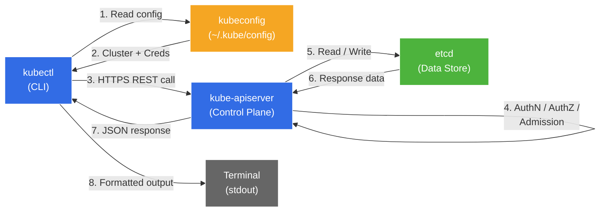

---

# kubectl Deep Dive

- Welcome to the `kubectl` deep-dive hands-on lab! This is not a beginner tutorial - it is a comprehensive, in-depth exploration of everything `kubectl` can do.
- You will master advanced output formatting, JSONPath expressions, resource patching strategies, interactive debugging, RBAC inspection, raw API access, plugin management, and performance optimization techniques.
- By the end of this lab, `kubectl` will feel like a natural extension of your hands when working with any Kubernetes cluster.

---

## What will we learn?

- How `kubectl` communicates with the Kubernetes API server (the full request lifecycle)
- kubeconfig file structure: clusters, users, contexts, and merging multiple configs
- The Kubernetes API resource model (Group, Version, Resource)
- All output formats: JSON, YAML, wide, name, JSONPath, custom-columns, go-template
- Advanced JSONPath expressions for filtering, sorting, and extracting data
- Field selectors, label selectors, and advanced `get` operations
- Resource inspection with `describe`, `explain`, `api-resources`, and `api-versions`
- Declarative vs. imperative resource management (`apply` vs. `create` vs. `replace`)
- Server-side apply, dry-run modes, and `kubectl diff`
- All three patching strategies: strategic merge, JSON merge, and JSON patch
- Interactive debugging: `exec`, `cp`, `port-forward`, `attach`, and `debug`
- Operational commands: `wait`, `rollout`, and `autoscale`
- RBAC inspection with `auth can-i`, `auth whoami`, and `auth reconcile`
- Extending kubectl with plugins and krew
- Raw API access via `kubectl proxy` and token-based requests
- Performance tips: watch mode, bash completion, aliases, and resource caching

---

## Official Documentation & References

| Resource                       | Link                                                                                                                                                                              |
|--------------------------------|-----------------------------------------------------------------------------------------------------------------------------------------------------------------------------------|
| kubectl Official Reference     | [kubernetes.io/docs/reference/kubectl](https://kubernetes.io/docs/reference/kubectl/)                                                                                             |
| kubectl Cheat Sheet            | [kubernetes.io/docs/reference/kubectl/cheatsheet](https://kubernetes.io/docs/reference/kubectl/cheatsheet/)                                                                       |
| kubeconfig Documentation       | [kubernetes.io/docs/concepts/configuration/organize-cluster-access-kubeconfig](https://kubernetes.io/docs/concepts/configuration/organize-cluster-access-kubeconfig/)             |
| JSONPath Support               | [kubernetes.io/docs/reference/kubectl/jsonpath](https://kubernetes.io/docs/reference/kubectl/jsonpath/)                                                                           |
| kubectl apply Documentation    | [kubernetes.io/docs/reference/kubectl/generated/kubectl_apply](https://kubernetes.io/docs/reference/kubectl/generated/kubectl_apply/)                                             |
| Server-Side Apply              | [kubernetes.io/docs/reference/using-api/server-side-apply](https://kubernetes.io/docs/reference/using-api/server-side-apply/)                                                     |
| kubectl patch Documentation    | [kubernetes.io/docs/tasks/manage-kubernetes-objects/update-api-object-kubectl-patch](https://kubernetes.io/docs/tasks/manage-kubernetes-objects/update-api-object-kubectl-patch/) |
| kubectl debug Documentation    | [kubernetes.io/docs/tasks/debug/debug-application/debug-running-pod](https://kubernetes.io/docs/tasks/debug/debug-application/debug-running-pod/)                                 |
| RBAC Authorization             | [kubernetes.io/docs/reference/access-authn-authz/rbac](https://kubernetes.io/docs/reference/access-authn-authz/rbac/)                                                             |
| Extending kubectl with Plugins | [kubernetes.io/docs/tasks/extend-kubectl/kubectl-plugins](https://kubernetes.io/docs/tasks/extend-kubectl/kubectl-plugins/)                                                       |
| Krew Plugin Manager            | [krew.sigs.k8s.io](https://krew.sigs.k8s.io/)                                                                                                                                     |
| Kubernetes API Concepts        | [kubernetes.io/docs/reference/using-api](https://kubernetes.io/docs/reference/using-api/)                                                                                         |
| Managing Resources             | [kubernetes.io/docs/concepts/cluster-administration/manage-deployment](https://kubernetes.io/docs/concepts/cluster-administration/manage-deployment/)                             |

---

## Introduction

### How kubectl Works

- `kubectl` is the **command-line tool** for interacting with Kubernetes clusters.
- It does **not** communicate directly with nodes, pods, or containers. Instead, every single `kubectl` command translates into one or more **HTTP requests** to the Kubernetes API server.
- The flow is always the same: `kubectl` reads your **kubeconfig** file to determine which cluster to talk to, authenticates with the API server, sends the request, and displays the response.

The full request lifecycle looks like this:

1. **Read kubeconfig** - `kubectl` locates the kubeconfig file (default: `~/.kube/config` or `$KUBECONFIG`) and reads the current context.
2. **Resolve cluster and credentials** - From the current context, `kubectl` determines the API server URL, the client certificate or token, and the CA bundle.
3. **Build HTTP request** - The `kubectl` command is translated into an HTTP verb (`GET`, `POST`, `PUT`, `PATCH`, `DELETE`) against a REST endpoint (e.g., `/api/v1/namespaces/default/pods`).
4. **TLS handshake and authentication** - `kubectl` establishes a TLS connection to the API server and presents its credentials.
5. **API server processing** - The API server authenticates the request, checks authorization (RBAC), runs admission controllers, and reads from or writes to **etcd**.
6. **Response** - The API server returns a JSON response, which `kubectl` formats according to your output flags and displays.



!!! note "Every kubectl command is just an API call"
    Understanding this is the single most important insight for mastering `kubectl`. When you run `kubectl get pods`, you are sending `GET /api/v1/namespaces/default/pods` to the API server. When you run `kubectl apply -f deployment.yaml`, you are sending a `PATCH` or `POST` request. This mental model will help you debug every issue you encounter.

---

### kubeconfig File Structure

The kubeconfig file is a YAML file with three main sections: **clusters**, **users**, and **contexts**. A context binds a cluster to a user (and optionally a namespace).

```yaml
apiVersion: v1
kind: Config

## The currently active context
current-context: my-cluster-context

## Cluster definitions - where to connect
clusters:
  - name: production-cluster
    cluster:
      ## The API server URL
      server: https://k8s-prod.example.com:6443
      ## CA certificate to verify the API server's TLS cert
      certificate-authority-data: LS0tLS1CRUdJTi...base64...
  - name: staging-cluster
    cluster:
      server: https://k8s-staging.example.com:6443
      certificate-authority-data: LS0tLS1CRUdJTi...base64...

## User credentials - how to authenticate
users:
  - name: admin-user
    user:
      ## Client certificate authentication
      client-certificate-data: LS0tLS1CRUdJTi...base64...
      client-key-data: LS0tLS1CRUdJTi...base64...
  - name: dev-user
    user:
      ## Token-based authentication
      token: eyJhbGciOiJSUzI1Ni...

## Contexts bind a cluster + user + optional namespace
contexts:
  - name: my-cluster-context
    context:
      cluster: production-cluster
      user: admin-user
      namespace: default
  - name: staging-context
    context:
      cluster: staging-cluster
      user: dev-user
      namespace: staging
```

!!! tip "kubeconfig supports multiple authentication methods"
    Besides client certificates and tokens, kubeconfig supports: exec-based credential plugins (e.g., `aws-iam-authenticator`, `gke-gcloud-auth-plugin`), OIDC tokens, username/password (deprecated), and auth provider plugins.

---

### API Resource Model

Every Kubernetes resource belongs to an **API Group**, has a **Version**, and is identified by its **Resource** type (GVR). Understanding GVR is essential for advanced `kubectl` usage.

| Component    | Description                               | Examples                                          |
|--------------|-------------------------------------------|---------------------------------------------------|
| **Group**    | A logical collection of related resources | `""` (core), `apps`, `batch`, `networking.k8s.io` |
| **Version**  | The API version within a group            | `v1`, `v1beta1`, `v2`                             |
| **Resource** | The actual resource type                  | `pods`, `deployments`, `services`, `ingresses`    |

The REST path for a resource follows this pattern:

- **Core group:** `/api/v1/namespaces/{ns}/{resource}`
- **Named group:** `/apis/{group}/{version}/namespaces/{ns}/{resource}`

For example:

- Pods: `/api/v1/namespaces/default/pods` (core group, so just `/api/v1`)
- Deployments: `/apis/apps/v1/namespaces/default/deployments` (apps group)
- Ingresses: `/apis/networking.k8s.io/v1/namespaces/default/ingresses`

---

### Verbosity Levels

`kubectl` supports verbosity levels from `-v=0` to `-v=9`. These are invaluable for debugging:

| Level   | What it shows                                                                           |
| ------- | --------------------------------------------------------------------------------------- |
| `-v=0`  | Default output only                                                                     |
| `-v=1`  | Adds the HTTP method used (GET, POST, etc.)                                             |
| `-v=2`  | Adds timing information for API calls                                                   |
| `-v=3`  | Adds extended information about changes                                                 |
| `-v=4`  | Adds debug-level verbosity                                                              |
| `-v=5`  | Adds trace-level verbosity                                                              |
| `-v=6`  | Shows the full HTTP request URL                                                         |
| `-v=7`  | Shows HTTP request headers                                                              |
| `-v=8`  | Shows the HTTP request body                                                             |
| `-v=9`  | Shows the full HTTP response body (untruncated) - everything the API server returns     |

!!! warning "Use -v=6 or higher to debug API calls"
    When something is not working as expected, `-v=6` is the sweet spot. It shows you the exact URL being called without flooding you with body content. Use `-v=9` only when you need to see the full response payload.

```bash
## See the exact API URL being called
kubectl get pods -v=6

## See full request and response headers
kubectl get pods -v=7

## See the complete request body (useful for apply/patch debugging)
kubectl apply -f deployment.yaml -v=8

## See the complete response body (the raw JSON from the API server)
kubectl get pods -v=9
```

---

## Prerequisites

- A running Kubernetes cluster (minikube, kind, Docker Desktop, or a remote cluster)
- `kubectl` installed and configured (version 1.25 or higher recommended)
- Basic familiarity with Kubernetes concepts (pods, deployments, services, namespaces)
- Terminal access (bash or zsh)

#### Verify your environment

```bash
## Check kubectl version (client and server)
kubectl version

## Check cluster connectivity
kubectl cluster-info

## Check that you have at least one node ready
kubectl get nodes
```

---

# Lab

### Step 01 - kubeconfig Mastery

- In this step you will learn to manage multiple cluster configurations, switch contexts, merge kubeconfig files, and use the `KUBECONFIG` environment variable.

#### View your current kubeconfig

```bash
## Display the full kubeconfig (with sensitive data redacted)
kubectl config view

## Display the full kubeconfig with secrets visible
kubectl config view --raw

## Show only the current context name
kubectl config current-context
```

#### Work with contexts

```bash
## List all available contexts
kubectl config get-contexts

## Switch to a different context
kubectl config use-context <context-name>

## Show details about a specific context
kubectl config get-contexts <context-name>

## Set a default namespace for the current context
## This avoids having to pass -n <namespace> on every command
kubectl config set-context --current --namespace=kubectl-lab
```

#### Create and manage contexts manually

```bash
## Add a new cluster entry
kubectl config set-cluster my-new-cluster \
  --server=https://k8s.example.com:6443 \
  --certificate-authority=/path/to/ca.crt

## Add a new user entry with token authentication
kubectl config set-credentials my-user \
  --token=eyJhbGciOiJSUzI1NiIsInR5cCI6IkpXVCJ9...

## Add a new user entry with client certificate authentication
kubectl config set-credentials cert-user \
  --client-certificate=/path/to/client.crt \
  --client-key=/path/to/client.key

## Create a new context that binds cluster + user + namespace
kubectl config set-context my-context \
  --cluster=my-new-cluster \
  --user=my-user \
  --namespace=default

## Delete a context
kubectl config delete-context my-context

## Delete a cluster entry
kubectl config delete-cluster my-new-cluster

## Delete a user entry
kubectl config delete-user my-user
```

#### Merge multiple kubeconfig files

```bash
## The KUBECONFIG environment variable accepts a colon-separated list of files
## kubectl merges them at runtime (the first file is the default for writes)
export KUBECONFIG=~/.kube/config:~/.kube/cluster-2.config:~/.kube/cluster-3.config

## Verify that contexts from all files are visible
kubectl config get-contexts

## Permanently merge multiple files into one
## This creates a single flat file with all clusters, users, and contexts
KUBECONFIG=~/.kube/config:~/.kube/cluster-2.config kubectl config view \
  --flatten > ~/.kube/merged-config

## Use the merged config
export KUBECONFIG=~/.kube/merged-config
```

!!! tip "Use KUBECONFIG per terminal session"
    You can set `KUBECONFIG` per shell session to isolate cluster access. This is safer than having all clusters in one file, because you cannot accidentally run commands against the wrong cluster.

#### One-off context override without switching

```bash
## Run a command against a different context without switching
kubectl get pods --context=staging-context

## Run a command in a specific namespace without changing default
kubectl get pods --namespace=kube-system

## Combine both overrides
kubectl get pods --context=production-context --namespace=monitoring
```

---

### Step 02 - Output Formatting Mastery

- `kubectl` supports many output formats. Mastering them transforms you from someone who reads terminal walls to someone who extracts exactly the data they need.

#### Set up the lab namespace and resources

```bash
## Create the lab namespace
kubectl apply -f manifests/namespace.yaml

## Deploy sample resources
kubectl apply -f manifests/sample-deployment.yaml

## Wait for the deployment to be ready
kubectl wait --for=condition=available deployment/nginx-lab \
  -n kubectl-lab --timeout=120s
```

#### All output formats

```bash
## Default table output (human-readable)
kubectl get pods -n kubectl-lab

## Wide output - shows additional columns (node name, IP, etc.)
kubectl get pods -n kubectl-lab -o wide

## YAML output - the full resource definition as YAML
kubectl get pods -n kubectl-lab -o yaml

## JSON output - the full resource definition as JSON
kubectl get pods -n kubectl-lab -o json

## Name-only output - just the resource type/name (great for scripting)
kubectl get pods -n kubectl-lab -o name

## JSONPath output - extract specific fields using JSONPath expressions
kubectl get pods -n kubectl-lab \
  -o jsonpath='{.items[*].metadata.name}'

## Custom columns - define your own tabular output
kubectl get pods -n kubectl-lab \
  -o custom-columns='NAME:.metadata.name,STATUS:.status.phase,IP:.status.podIP'

## Go template - use Go template syntax for complex formatting
kubectl get pods -n kubectl-lab \
  -o go-template='{{range .items}}{{.metadata.name}}{{"\n"}}{{end}}'
```

#### YAML and JSON output details

```bash
## Get a single pod as YAML (shows the complete spec including defaults)
kubectl get pod -n kubectl-lab -l app=nginx-lab -o yaml | head -80

## Get a single pod as JSON and pipe to jq for pretty formatting
kubectl get pod -n kubectl-lab -l app=nginx-lab -o json | jq '.items[0].metadata'

## Get just the spec section of a deployment
kubectl get deployment nginx-lab -n kubectl-lab -o json | jq '.spec'

## Get the status section of all pods
kubectl get pods -n kubectl-lab -o json | jq '.items[].status.phase'
```

#### Name output for scripting

```bash
## Get just pod names (useful for loops)
kubectl get pods -n kubectl-lab -o name
## Output: pod/nginx-lab-xxxx-yyyy

## Use in a loop to describe each pod
for pod in $(kubectl get pods -n kubectl-lab -o name); do
  echo "=== $pod ==="
  kubectl describe "$pod" -n kubectl-lab | head -20
done

## Delete all pods matching a label (using -o name)
## (Dry run - remove --dry-run=client to actually delete)
kubectl get pods -n kubectl-lab -l app=nginx-lab -o name | \
  xargs kubectl delete --dry-run=client
```

---

### Step 03 - JSONPath Deep Dive

- JSONPath is a query language for JSON. kubectl's JSONPath implementation lets you extract, filter, and format data from API responses with surgical precision.

#### JSONPath syntax reference

| Expression        | Meaning                                                        |
| ----------------- | -------------------------------------------------------------- |
| `$`               | The root object (implicit in kubectl, can be omitted)          |
| `.field`          | Child field access                                             |
| `[n]`             | Array index (0-based)                                          |
| `[*]`             | All elements of an array                                       |
| `[start:end]`     | Array slice                                                    |
| `[?(@.field==x)]` | Filter expression - select elements where condition is true    |
| `..field`         | Recursive descent - find field at any depth                    |
| `{"\n"}`          | Newline character (for formatting)                             |
| `{"\t"}`          | Tab character (for formatting)                                 |
| `{range}{end}`    | Iterate over array elements                                    |

#### Basic JSONPath expressions

```bash
## Get all pod names as a space-separated list
kubectl get pods -n kubectl-lab \
  -o jsonpath='{.items[*].metadata.name}'

## Get the first pod's name
kubectl get pods -n kubectl-lab \
  -o jsonpath='{.items[0].metadata.name}'

## Get all pod IPs
kubectl get pods -n kubectl-lab \
  -o jsonpath='{.items[*].status.podIP}'

## Get pod names with newlines between them
kubectl get pods -n kubectl-lab \
  -o jsonpath='{range .items[*]}{.metadata.name}{"\n"}{end}'
```

#### Formatted multi-field output

```bash
## Get pod name and status on each line
kubectl get pods -n kubectl-lab \
  -o jsonpath='{range .items[*]}{.metadata.name}{"\t"}{.status.phase}{"\n"}{end}'

## Get pod name, node name, and pod IP (tab-separated)
kubectl get pods -n kubectl-lab \
  -o jsonpath='{range .items[*]}{.metadata.name}{"\t"}{.spec.nodeName}{"\t"}{.status.podIP}{"\n"}{end}'

## Get container images for all pods
kubectl get pods -n kubectl-lab \
  -o jsonpath='{range .items[*]}{.metadata.name}{"\t"}{.spec.containers[*].image}{"\n"}{end}'
```

#### Filter expressions

```bash
## Get pods that are in Running phase
kubectl get pods -n kubectl-lab \
  -o jsonpath='{.items[?(@.status.phase=="Running")].metadata.name}'

## Get pods scheduled on a specific node (replace NODE_NAME with an actual node)
NODE_NAME=$(kubectl get nodes -o jsonpath='{.items[0].metadata.name}')
kubectl get pods -n kubectl-lab \
  -o jsonpath="{.items[?(@.spec.nodeName==\"${NODE_NAME}\")].metadata.name}"

## Get containers with memory limit of 128Mi
kubectl get pods -n kubectl-lab \
  -o jsonpath='{.items[*].spec.containers[?(@.resources.limits.memory=="128Mi")].name}'
```

#### Nested and recursive descent

```bash
## Find all container names across all pods (recursive descent)
kubectl get pods -n kubectl-lab \
  -o jsonpath='{..containers[*].name}'

## Find all image names using recursive descent
kubectl get pods -n kubectl-lab \
  -o jsonpath='{..image}'

## Get all label values for the "app" key
kubectl get pods -n kubectl-lab \
  -o jsonpath='{.items[*].metadata.labels.app}'
```

#### Real-world JSONPath examples

```bash
## Get all node names and their kernel versions
kubectl get nodes \
  -o jsonpath='{range .items[*]}{.metadata.name}{"\t"}{.status.nodeInfo.kernelVersion}{"\n"}{end}'

## Get all namespaces and their status
kubectl get namespaces \
  -o jsonpath='{range .items[*]}{.metadata.name}{"\t"}{.status.phase}{"\n"}{end}'

## Get all PVCs with their capacity and storage class
kubectl get pvc --all-namespaces \
  -o jsonpath='{range .items[*]}{.metadata.namespace}{"\t"}{.metadata.name}{"\t"}{.spec.resources.requests.storage}{"\t"}{.spec.storageClassName}{"\n"}{end}'

## Extract all unique container images running in the cluster
kubectl get pods --all-namespaces \
  -o jsonpath='{.items[*].spec.containers[*].image}' | tr ' ' '\n' | sort -u
```

---

### Step 04 - Custom Columns and Advanced Get Operations

- Custom columns give you full control over tabular output. Combined with field selectors, label selectors, and sort operations, `get` becomes an incredibly powerful query tool.

#### Custom columns

```bash
## Basic custom columns - pod name and status
kubectl get pods -n kubectl-lab \
  -o custom-columns='NAME:.metadata.name,STATUS:.status.phase'

## Extended custom columns - name, node, IP, status, restarts
kubectl get pods -n kubectl-lab \
  -o custom-columns='\
NAME:.metadata.name,\
NODE:.spec.nodeName,\
IP:.status.podIP,\
STATUS:.status.phase,\
RESTARTS:.status.containerStatuses[0].restartCount'

## Custom columns for deployments - name, replicas, available, image
kubectl get deployments -n kubectl-lab \
  -o custom-columns='\
NAME:.metadata.name,\
DESIRED:.spec.replicas,\
AVAILABLE:.status.availableReplicas,\
IMAGE:.spec.template.spec.containers[0].image'

## Custom columns from a file (for reuse)
## Create a columns file:
## NAME          NAMESPACE          NODE             STATUS
## .metadata.name .metadata.namespace .spec.nodeName  .status.phase
## Then use it:
## kubectl get pods --all-namespaces -o custom-columns-file=columns.txt
```

#### Label selectors (-l / --selector)

```bash
## Select pods with a specific label
kubectl get pods -n kubectl-lab -l app=nginx-lab

## Select pods with multiple label requirements (AND logic)
kubectl get pods -n kubectl-lab -l app=nginx-lab,tier=frontend

## Select pods where a label exists (any value)
kubectl get pods -n kubectl-lab -l 'tier'

## Select pods where a label does NOT exist
kubectl get pods -n kubectl-lab -l '!tier'

## Select pods with set-based requirements
kubectl get pods -n kubectl-lab -l 'tier in (frontend, backend)'
kubectl get pods -n kubectl-lab -l 'environment notin (production)'
kubectl get pods -n kubectl-lab -l 'version in (v1, v2),tier=frontend'

## Show labels as columns in the output
kubectl get pods -n kubectl-lab --show-labels

## Show specific labels as extra columns
kubectl get pods -n kubectl-lab -L app,tier,version
```

#### Field selectors (--field-selector)

```bash
## Get pods by their status phase
kubectl get pods -n kubectl-lab --field-selector status.phase=Running

## Get pods NOT in Running state (find problematic pods)
kubectl get pods --all-namespaces --field-selector status.phase!=Running

## Get pods on a specific node
NODE_NAME=$(kubectl get nodes -o jsonpath='{.items[0].metadata.name}')
kubectl get pods --all-namespaces --field-selector "spec.nodeName=${NODE_NAME}"

## Get a specific pod by name using field selector
kubectl get pods -n kubectl-lab --field-selector metadata.name=nginx-lab

## Combine field selectors (AND logic)
kubectl get pods --all-namespaces \
  --field-selector 'status.phase=Running,metadata.namespace!=kube-system'

## Get events for a specific namespace
kubectl get events -n kubectl-lab --field-selector type=Warning
```

!!! note "Field selectors are limited"
    Not all fields support field selectors. The supported fields vary by resource type. Common supported fields are `metadata.name`, `metadata.namespace`, `spec.nodeName`, and `status.phase` for pods. Use `kubectl get pods --field-selector help` to see which fields are supported (this will produce an error message listing valid fields).

#### Sorting

```bash
## Sort pods by creation timestamp (oldest first)
kubectl get pods -n kubectl-lab --sort-by='.metadata.creationTimestamp'

## Sort pods by restart count (ascending)
kubectl get pods -n kubectl-lab \
  --sort-by='.status.containerStatuses[0].restartCount'

## Sort nodes by capacity CPU
kubectl get nodes --sort-by='.status.capacity.cpu'

## Sort events by last timestamp
kubectl get events -n kubectl-lab --sort-by='.lastTimestamp'

## Sort namespaces by name
kubectl get namespaces --sort-by='.metadata.name'
```

#### All-namespaces flag

```bash
## List pods across ALL namespaces
kubectl get pods --all-namespaces
kubectl get pods -A  ## shorthand

## Combine with selectors and output formatting
kubectl get pods -A -l tier=frontend -o wide

## Get all services across all namespaces with custom columns
kubectl get svc -A \
  -o custom-columns='NAMESPACE:.metadata.namespace,NAME:.metadata.name,TYPE:.spec.type,CLUSTER-IP:.spec.clusterIP'
```

---

### Step 05 - Resource Inspection

- Beyond `get`, kubectl provides powerful commands for understanding resource schemas, discovering API capabilities, and deep-inspecting running resources.

#### kubectl describe

```bash
## Describe a pod - shows events, conditions, container status, volumes, etc.
kubectl describe pod -l app=nginx-lab -n kubectl-lab

## Describe a deployment - shows rollout status, replica sets, conditions
kubectl describe deployment nginx-lab -n kubectl-lab

## Describe a node - shows capacity, allocatable, conditions, running pods
kubectl describe node $(kubectl get nodes -o jsonpath='{.items[0].metadata.name}')

## Describe a namespace
kubectl describe namespace kubectl-lab

## Describe a service
kubectl describe service nginx-lab -n kubectl-lab
```

!!! tip "`describe` vs `get -o yaml`"
    `describe` gives you a human-readable summary with events and computed status. `get -o yaml` gives you the raw API object, which is useful for programmatic access and for understanding exactly what is stored in etcd. Use `describe` for debugging and `get -o yaml` for full detail.

#### kubectl explain

```bash
## Explain a resource type (top-level fields)
kubectl explain pod

## Explain a specific field
kubectl explain pod.spec

## Explain a deeply nested field
kubectl explain pod.spec.containers

## Explain with full recursive output (shows ALL fields at all levels)
kubectl explain pod.spec.containers --recursive

## Explain deployment spec
kubectl explain deployment.spec

## Explain deployment strategy (shows the rollingUpdate fields)
kubectl explain deployment.spec.strategy

## Explain a CRD resource (if installed)
## kubectl explain myresource.spec

## Specify an API version if multiple versions exist
kubectl explain deployment --api-version=apps/v1
```

#### kubectl api-resources

```bash
## List ALL available resource types in the cluster
kubectl api-resources

## Show only namespaced resources
kubectl api-resources --namespaced=true

## Show only cluster-scoped resources
kubectl api-resources --namespaced=false

## Show resources in a specific API group
kubectl api-resources --api-group=apps
kubectl api-resources --api-group=batch
kubectl api-resources --api-group=networking.k8s.io
kubectl api-resources --api-group=rbac.authorization.k8s.io

## Show resources that support a specific verb
kubectl api-resources --verbs=list
kubectl api-resources --verbs=create,delete
kubectl api-resources --verbs=watch

## Show output with more detail (including short names and API group)
kubectl api-resources -o wide

## Find a resource by short name
kubectl api-resources | grep -i deploy
## Shows: deployments  deploy  apps/v1  true  Deployment
```

#### kubectl api-versions

```bash
## List all available API versions
kubectl api-versions

## Filter for a specific group
kubectl api-versions | grep apps
kubectl api-versions | grep networking
kubectl api-versions | grep batch
```

#### Comparing resources

```bash
## Get the full YAML of a running resource (useful for comparison)
kubectl get deployment nginx-lab -n kubectl-lab -o yaml > running-deployment.yaml

## Compare a local manifest with what is running in the cluster
## (This shows what would change if you applied the local file)
kubectl diff -f manifests/sample-deployment.yaml

## Clean up the temporary file
rm -f running-deployment.yaml
```

---

### Step 06 - apply vs create vs replace

- Understanding when to use `apply`, `create`, or `replace` is critical for managing resources safely and predictably.

#### The three approaches

| Command       | Style       | Behavior                                                                          | When to use                                          |
| ------------- | ----------- | --------------------------------------------------------------------------------- | ---------------------------------------------------- |
| `kubectl apply`   | Declarative | Creates or updates resources by merging with existing state                      | Day-to-day GitOps and config management              |
| `kubectl create`  | Imperative  | Creates a resource. Fails if the resource already exists                          | One-time creation, quick prototyping                 |
| `kubectl replace` | Imperative  | Replaces the entire resource. Fails if it does not exist                          | Full replacement (all unspecified fields are removed) |

#### kubectl create (imperative)

```bash
## Create a namespace imperatively
kubectl create namespace test-imperative

## Create a deployment imperatively (no manifest file needed)
kubectl create deployment nginx-test \
  --image=nginx:1.25-alpine \
  --replicas=2 \
  -n test-imperative

## Create a service imperatively
kubectl create service clusterip nginx-test \
  --tcp=80:80 \
  -n test-imperative

## Create a configmap from literal values
kubectl create configmap app-config \
  --from-literal=key1=value1 \
  --from-literal=key2=value2 \
  -n test-imperative

## Create a secret from literal values
kubectl create secret generic db-secret \
  --from-literal=username=admin \
  --from-literal=password=secret123 \
  -n test-imperative

## Generate YAML without creating the resource (useful for bootstrapping manifests)
kubectl create deployment nginx-gen \
  --image=nginx:1.25-alpine \
  --replicas=3 \
  --dry-run=client -o yaml > generated-deployment.yaml

## Clean up
kubectl delete namespace test-imperative
rm -f generated-deployment.yaml
```

#### kubectl apply (declarative)

```bash
## Apply a single manifest file
kubectl apply -f manifests/sample-deployment.yaml

## Apply all manifests in a directory
kubectl apply -f manifests/

## Apply with a specific namespace override
kubectl apply -f manifests/sample-deployment.yaml -n kubectl-lab

## Apply from a URL
## kubectl apply -f https://raw.githubusercontent.com/example/repo/main/manifest.yaml

## Apply and record the command in the annotation (deprecated but still used)
kubectl apply -f manifests/sample-deployment.yaml --record

## Server-side apply (recommended for CI/CD and controllers)
## Server-side apply tracks field ownership and prevents conflicts
kubectl apply -f manifests/sample-deployment.yaml --server-side

## Server-side apply with a custom field manager name
kubectl apply -f manifests/sample-deployment.yaml \
  --server-side \
  --field-manager=my-ci-pipeline

## Force-apply to resolve conflicts (use with caution)
kubectl apply -f manifests/sample-deployment.yaml \
  --server-side \
  --force-conflicts
```

!!! note "Server-Side Apply vs Client-Side Apply"
    **Client-side apply** (default) uses the `kubectl.kubernetes.io/last-applied-configuration` annotation to compute diffs. **Server-side apply** (SSA) uses field ownership tracking in the API server. SSA is more reliable and is the recommended approach for CI/CD pipelines and controllers. SSA allows multiple managers to own different fields of the same resource without conflicts.

#### Dry-run modes

```bash
## Client-side dry run - validates locally, does NOT contact the API server
## Catches YAML syntax errors but NOT schema violations
kubectl apply -f manifests/sample-deployment.yaml --dry-run=client

## Server-side dry run - sends the request to the API server but does NOT persist
## Catches schema violations, admission webhook rejections, and RBAC issues
kubectl apply -f manifests/sample-deployment.yaml --dry-run=server

## Combine dry-run with output to see what would be created
kubectl apply -f manifests/sample-deployment.yaml --dry-run=server -o yaml

## Generate manifests with create and dry-run (great for bootstrapping)
kubectl create deployment test-gen \
  --image=nginx:latest \
  --replicas=3 \
  --dry-run=client -o yaml
```

!!! warning "Always prefer --dry-run=server over --dry-run=client"
    Client-side dry-run only validates YAML syntax. Server-side dry-run sends the request to the API server, which validates the schema, runs admission webhooks, and checks RBAC - without actually creating the resource. This catches many more errors.

#### kubectl diff

```bash
## Show what would change if you applied a manifest
## (similar to 'git diff' - shows additions, removals, changes)
kubectl diff -f manifests/sample-deployment.yaml

## Diff all manifests in a directory
kubectl diff -f manifests/

## Diff with server-side apply
kubectl diff -f manifests/sample-deployment.yaml --server-side
```

#### kubectl replace

```bash
## Replace replaces the ENTIRE resource (not a merge)
## First export the current state
kubectl get deployment nginx-lab -n kubectl-lab -o yaml > /tmp/nginx-lab.yaml

## Modify the file, then replace
## Any fields not in the file will be REMOVED from the resource
kubectl replace -f /tmp/nginx-lab.yaml

## Replace with --force (deletes and re-creates the resource)
## WARNING: this causes downtime!
kubectl replace -f /tmp/nginx-lab.yaml --force

## Clean up temp file
rm -f /tmp/nginx-lab.yaml
```

---

### Step 07 - kubectl patch

- `kubectl patch` modifies a resource in-place without replacing the entire object. There are three patch types, each with different merge semantics.

#### Deploy the patch target

```bash
## Deploy the resource we will use for patching exercises
kubectl apply -f manifests/patch-examples.yaml

## Verify the initial state
kubectl get deployment patch-target -n kubectl-lab -o yaml | head -40
```

#### Patch type 1: Strategic Merge Patch (default)

- This is the default and most commonly used patch type. It is Kubernetes-specific and understands how to merge lists (e.g., containers, volumes) by their merge key (usually `name`).

```bash
## Add an annotation using strategic merge patch
kubectl patch deployment patch-target -n kubectl-lab \
  --type=strategic \
  -p '{"metadata":{"annotations":{"patched-by":"strategic-merge"}}}'

## Update the replica count
kubectl patch deployment patch-target -n kubectl-lab \
  -p '{"spec":{"replicas":3}}'

## Add a new container to the pod spec
## Strategic merge patch uses the container "name" as the merge key,
## so this ADDS a sidecar without removing the existing nginx container
kubectl patch deployment patch-target -n kubectl-lab \
  -p '{"spec":{"template":{"spec":{"containers":[{"name":"sidecar","image":"busybox:1.36","command":["sh","-c","while true; do echo sidecar; sleep 60; done"]}]}}}}'

## Update an existing container's image (matched by name)
kubectl patch deployment patch-target -n kubectl-lab \
  -p '{"spec":{"template":{"spec":{"containers":[{"name":"nginx","image":"nginx:1.25-alpine"}]}}}}'

## Verify the patch was applied
kubectl get deployment patch-target -n kubectl-lab -o jsonpath='{.spec.template.spec.containers[*].name}'
```

#### Patch type 2: JSON Merge Patch (RFC 7386)

- JSON merge patch is simpler but less powerful. It completely replaces lists instead of merging them.

```bash
## Reset the deployment first
kubectl apply -f manifests/patch-examples.yaml

## Add an annotation using JSON merge patch
kubectl patch deployment patch-target -n kubectl-lab \
  --type=merge \
  -p '{"metadata":{"annotations":{"patched-by":"json-merge"}}}'

## Update the image
kubectl patch deployment patch-target -n kubectl-lab \
  --type=merge \
  -p '{"spec":{"template":{"spec":{"containers":[{"name":"nginx","image":"nginx:1.25-alpine"}]}}}}'
```

!!! danger "JSON Merge Patch replaces arrays entirely"
    If you use `--type=merge` and specify a containers list with only one container, it will **replace** the entire containers array. Any containers not in your patch will be removed. This is why strategic merge patch is the default for Kubernetes resources.

#### Patch type 3: JSON Patch (RFC 6902)

- JSON Patch uses an array of operations (`add`, `remove`, `replace`, `move`, `copy`, `test`) with explicit paths. It is the most precise patch type.

```bash
## Reset the deployment
kubectl apply -f manifests/patch-examples.yaml

## Add an annotation using JSON Patch
kubectl patch deployment patch-target -n kubectl-lab \
  --type=json \
  -p '[{"op":"add","path":"/metadata/annotations/patched-by","value":"json-patch"}]'

## Replace the replica count using JSON Patch
kubectl patch deployment patch-target -n kubectl-lab \
  --type=json \
  -p '[{"op":"replace","path":"/spec/replicas","value":4}]'

## Add a new label using JSON Patch
kubectl patch deployment patch-target -n kubectl-lab \
  --type=json \
  -p '[{"op":"add","path":"/metadata/labels/patched","value":"true"}]'

## Remove an annotation using JSON Patch
kubectl patch deployment patch-target -n kubectl-lab \
  --type=json \
  -p '[{"op":"remove","path":"/metadata/annotations/patched-by"}]'

## Multiple operations in a single patch
kubectl patch deployment patch-target -n kubectl-lab \
  --type=json \
  -p '[
    {"op":"replace","path":"/spec/replicas","value":2},
    {"op":"add","path":"/metadata/labels/multi-patched","value":"true"},
    {"op":"replace","path":"/spec/template/spec/containers/0/image","value":"nginx:1.25-alpine"}
  ]'

## Test operation - succeeds only if the value matches (useful for conditional updates)
## This will fail if the replicas is not 2
kubectl patch deployment patch-target -n kubectl-lab \
  --type=json \
  -p '[
    {"op":"test","path":"/spec/replicas","value":2},
    {"op":"replace","path":"/spec/replicas","value":5}
  ]'
```

#### Patch comparison summary

| Feature               | Strategic Merge         | JSON Merge              | JSON Patch              |
| --------------------- | ----------------------- | ----------------------- | ----------------------- |
| Flag                  | `--type=strategic`      | `--type=merge`          | `--type=json`           |
| List handling          | Merges by key (e.g. name) | Replaces entire list   | Operates on specific indices |
| Can delete fields     | Set to `null`           | Set to `null`           | Use `"op":"remove"`     |
| Kubernetes-aware      | Yes                     | No                      | No                      |
| Best for              | Most K8s resources      | Simple updates          | Surgical precision      |

---

### Step 08 - exec, cp, port-forward, attach, debug

- These commands are your interactive debugging toolkit for troubleshooting running pods.

#### Deploy the multi-container pod

```bash
## Deploy the multi-container pod for debugging exercises
kubectl apply -f manifests/multi-container-pod.yaml

## Wait for the pod to be ready
kubectl wait --for=condition=Ready pod/multi-container-pod \
  -n kubectl-lab --timeout=120s
```

#### kubectl exec

```bash
## Execute a command in the default container
kubectl exec multi-container-pod -n kubectl-lab -- ls /

## Execute a command in a specific container
kubectl exec multi-container-pod -n kubectl-lab -c app -- nginx -v

## Execute a command in the sidecar container
kubectl exec multi-container-pod -n kubectl-lab -c sidecar -- cat /var/log/app/sidecar.log

## Open an interactive shell in the default container
kubectl exec -it multi-container-pod -n kubectl-lab -- /bin/sh

## Open an interactive shell in a specific container
kubectl exec -it multi-container-pod -n kubectl-lab -c sidecar -- /bin/sh

## Run multiple commands using sh -c
kubectl exec multi-container-pod -n kubectl-lab -- \
  sh -c 'echo "Hostname: $(hostname)" && echo "Date: $(date)"'

## Check environment variables
kubectl exec multi-container-pod -n kubectl-lab -- env

## Check network connectivity from inside the pod
kubectl exec multi-container-pod -n kubectl-lab -- \
  sh -c 'wget -qO- --timeout=5 http://nginx-lab.kubectl-lab.svc.cluster.local || echo "Service not reachable"'

## Check DNS resolution inside the pod
kubectl exec multi-container-pod -n kubectl-lab -- \
  sh -c 'nslookup kubernetes.default.svc.cluster.local 2>/dev/null || cat /etc/resolv.conf'
```

#### kubectl logs

```bash
## View logs from the default container
kubectl logs multi-container-pod -n kubectl-lab

## View logs from a specific container
kubectl logs multi-container-pod -n kubectl-lab -c app
kubectl logs multi-container-pod -n kubectl-lab -c sidecar

## Follow logs in real time (like tail -f)
kubectl logs -f multi-container-pod -n kubectl-lab -c sidecar

## Show logs from the last 10 lines
kubectl logs --tail=10 multi-container-pod -n kubectl-lab -c sidecar

## Show logs from the last 30 seconds
kubectl logs --since=30s multi-container-pod -n kubectl-lab -c sidecar

## Show logs from all containers in a pod
kubectl logs multi-container-pod -n kubectl-lab --all-containers=true

## Show logs from all pods with a specific label
kubectl logs -l app=nginx-lab -n kubectl-lab

## Show logs with timestamps
kubectl logs --timestamps multi-container-pod -n kubectl-lab -c sidecar

## Show previous container logs (if the container crashed and restarted)
kubectl logs multi-container-pod -n kubectl-lab -c app --previous 2>/dev/null || \
  echo "No previous container logs (container has not restarted)"
```

#### kubectl cp

```bash
## Copy a file FROM a pod to local machine
kubectl exec multi-container-pod -n kubectl-lab -c app -- \
  sh -c 'echo "Hello from pod" > /tmp/test.txt'
kubectl cp kubectl-lab/multi-container-pod:/tmp/test.txt /tmp/from-pod.txt -c app
cat /tmp/from-pod.txt

## Copy a file TO a pod from local machine
echo "Hello from local" > /tmp/to-pod.txt
kubectl cp /tmp/to-pod.txt kubectl-lab/multi-container-pod:/tmp/to-pod.txt -c app
kubectl exec multi-container-pod -n kubectl-lab -c app -- cat /tmp/to-pod.txt

## Copy a directory from a pod
kubectl cp kubectl-lab/multi-container-pod:/etc/nginx /tmp/nginx-config -c app

## Clean up temp files
rm -f /tmp/from-pod.txt /tmp/to-pod.txt
rm -rf /tmp/nginx-config
```

!!! warning "kubectl cp requires tar in the container"
    `kubectl cp` uses `tar` under the hood. If the container does not have `tar` installed (e.g., distroless images), `cp` will fail. In that case, use `kubectl exec` with I/O redirection instead: `kubectl exec pod -- cat /path/to/file > local-file`.

#### kubectl port-forward

```bash
## Forward local port 8080 to pod port 80
kubectl port-forward multi-container-pod 8080:80 -n kubectl-lab &
## Test it: curl http://localhost:8080
## Kill the port-forward: kill %1

## Forward to a service (distributes across pods)
kubectl port-forward service/nginx-lab 8080:80 -n kubectl-lab &
## Test it: curl http://localhost:8080
## Kill the port-forward: kill %1

## Forward to a deployment (picks one pod)
kubectl port-forward deployment/nginx-lab 8080:80 -n kubectl-lab &
## Kill the port-forward: kill %1

## Forward multiple ports
kubectl port-forward multi-container-pod 8080:80 9090:9090 -n kubectl-lab &
## Kill the port-forward: kill %1

## Bind to all interfaces (not just localhost) - useful in VMs/containers
kubectl port-forward --address 0.0.0.0 multi-container-pod 8080:80 -n kubectl-lab &
## Kill the port-forward: kill %1
```

#### kubectl attach

```bash
## Attach to a running container's stdout (read-only by default)
## This is different from exec - attach connects to the main process
kubectl attach multi-container-pod -n kubectl-lab -c sidecar

## Attach with stdin enabled (for interactive processes)
## kubectl attach -it <pod> -c <container> -n <namespace>

## Press Ctrl+C to detach
```

#### kubectl debug

```bash
## Create an ephemeral debug container in a running pod
## This adds a temporary container with debugging tools
kubectl debug multi-container-pod -n kubectl-lab \
  --image=busybox:1.36 \
  -it \
  --target=app \
  -- /bin/sh

## Debug by creating a copy of the pod (original pod is untouched)
kubectl debug multi-container-pod -n kubectl-lab \
  --image=busybox:1.36 \
  --copy-to=debug-pod \
  -it \
  -- /bin/sh

## Debug a node by creating a privileged pod on it
## This gives you access to the node's filesystem at /host
NODE_NAME=$(kubectl get nodes -o jsonpath='{.items[0].metadata.name}')
kubectl debug node/${NODE_NAME} -it --image=busybox:1.36

## Clean up debug pods
kubectl delete pod debug-pod -n kubectl-lab --ignore-not-found
```

!!! tip "Ephemeral containers vs copy-to"
    Ephemeral containers (`--target=app`) run inside the same pod and share namespaces with the target container. This means they can see the same network, PIDs, and filesystem mounts. The `--copy-to` flag creates a new pod which is a clone - useful when you want to debug without affecting the running pod.

---

### Step 09 - wait, rollout, autoscale

- These operational commands help you manage the lifecycle of deployments and wait for conditions.

#### kubectl wait

```bash
## Wait for a deployment to be available
kubectl wait --for=condition=available deployment/nginx-lab \
  -n kubectl-lab --timeout=120s

## Wait for a pod to be ready
kubectl wait --for=condition=Ready pod -l app=nginx-lab \
  -n kubectl-lab --timeout=60s

## Wait for a pod to be deleted
## (start a deletion in another terminal first)
## kubectl wait --for=delete pod/<pod-name> -n kubectl-lab --timeout=60s

## Wait for a job to complete
## kubectl wait --for=condition=complete job/<job-name> -n kubectl-lab --timeout=300s

## Wait for all pods in a namespace to be ready
kubectl wait --for=condition=Ready pods --all -n kubectl-lab --timeout=120s

## Wait using a JSONPath expression
## Wait until a deployment has the desired replicas available
kubectl wait --for=jsonpath='{.status.availableReplicas}'=3 \
  deployment/nginx-lab -n kubectl-lab --timeout=120s
```

#### kubectl rollout

```bash
## Check the rollout status of a deployment
kubectl rollout status deployment/nginx-lab -n kubectl-lab

## View the rollout history (shows revisions)
kubectl rollout history deployment/nginx-lab -n kubectl-lab

## View details of a specific revision
kubectl rollout history deployment/nginx-lab -n kubectl-lab --revision=1

## Trigger a new rollout by updating the image
kubectl set image deployment/nginx-lab nginx=nginx:1.25-alpine -n kubectl-lab

## Watch the rollout progress
kubectl rollout status deployment/nginx-lab -n kubectl-lab --watch

## Pause a rollout (prevents further updates from being applied)
kubectl rollout pause deployment/nginx-lab -n kubectl-lab

## Resume a paused rollout
kubectl rollout resume deployment/nginx-lab -n kubectl-lab

## Undo the last rollout (rollback to previous revision)
kubectl rollout undo deployment/nginx-lab -n kubectl-lab

## Rollback to a specific revision
kubectl rollout undo deployment/nginx-lab -n kubectl-lab --to-revision=1

## Restart all pods in a deployment (rolling restart)
## This is useful to pick up configmap/secret changes
kubectl rollout restart deployment/nginx-lab -n kubectl-lab
```

#### kubectl autoscale

```bash
## Create a Horizontal Pod Autoscaler (HPA)
## Scales between 2 and 10 replicas based on CPU utilization
kubectl autoscale deployment nginx-lab -n kubectl-lab \
  --min=2 --max=10 --cpu-percent=50

## Check the HPA status
kubectl get hpa -n kubectl-lab

## Describe the HPA for detailed metrics and conditions
kubectl describe hpa nginx-lab -n kubectl-lab

## Delete the HPA when done
kubectl delete hpa nginx-lab -n kubectl-lab
```

!!! note "HPA requires metrics-server"
    The Horizontal Pod Autoscaler needs a metrics source. For CPU/memory-based autoscaling, you need `metrics-server` installed in the cluster. For custom metrics, you need a custom metrics adapter (e.g., Prometheus Adapter).

---

### Step 10 - kubectl auth

- The `auth` subcommand lets you inspect and debug RBAC (Role-Based Access Control) permissions.

#### Deploy RBAC resources

```bash
## Deploy the RBAC demo resources
kubectl apply -f manifests/rbac-demo.yaml

## Verify the resources were created
kubectl get serviceaccount,role,rolebinding -n kubectl-lab -l app=rbac-demo
```

#### kubectl auth can-i

```bash
## Check if your current user can perform an action
kubectl auth can-i create pods -n kubectl-lab
kubectl auth can-i delete deployments -n kubectl-lab
kubectl auth can-i get secrets -n kubectl-lab
kubectl auth can-i create clusterroles

## Check what a specific service account can do
kubectl auth can-i list pods \
  --as=system:serviceaccount:kubectl-lab:lab-viewer \
  -n kubectl-lab

## The lab-viewer service account should be able to list pods
kubectl auth can-i get pods \
  --as=system:serviceaccount:kubectl-lab:lab-viewer \
  -n kubectl-lab

## The lab-viewer service account should NOT be able to create pods
kubectl auth can-i create pods \
  --as=system:serviceaccount:kubectl-lab:lab-viewer \
  -n kubectl-lab

## The lab-restricted service account has NO permissions
kubectl auth can-i list pods \
  --as=system:serviceaccount:kubectl-lab:lab-restricted \
  -n kubectl-lab

## Check all permissions (list everything the user can do)
kubectl auth can-i --list -n kubectl-lab

## Check all permissions for a service account
kubectl auth can-i --list \
  --as=system:serviceaccount:kubectl-lab:lab-viewer \
  -n kubectl-lab

## Check access to a specific resource by name
kubectl auth can-i get pods/nginx-lab \
  --as=system:serviceaccount:kubectl-lab:lab-viewer \
  -n kubectl-lab

## Check access to subresources (like pod logs)
kubectl auth can-i get pods/log \
  --as=system:serviceaccount:kubectl-lab:lab-viewer \
  -n kubectl-lab
```

#### kubectl auth whoami

```bash
## Show the current user information (requires K8s 1.27+)
kubectl auth whoami 2>/dev/null || echo "whoami requires Kubernetes 1.27+"

## Show whoami output as YAML
kubectl auth whoami -o yaml 2>/dev/null || echo "whoami requires Kubernetes 1.27+"
```

#### Inspecting RBAC resources directly

```bash
## List all roles in the namespace
kubectl get roles -n kubectl-lab

## List all role bindings in the namespace
kubectl get rolebindings -n kubectl-lab

## Get the full YAML of a role (to see its rules)
kubectl get role pod-reader -n kubectl-lab -o yaml

## List cluster-level roles (there are many built-in ones)
kubectl get clusterroles | head -20

## Show details of the built-in admin ClusterRole
kubectl get clusterrole admin -o yaml

## List all cluster role bindings
kubectl get clusterrolebindings | head -20
```

---

### Step 11 - kubectl Plugins and Krew

- `kubectl` can be extended with plugins. Any executable in your `PATH` named `kubectl-*` becomes a kubectl subcommand.

#### How plugins work

```bash
## kubectl discovers plugins automatically
## Any executable named "kubectl-<name>" in your PATH becomes "kubectl <name>"

## List all installed plugins
kubectl plugin list

## Example: create a simple plugin
## (This creates a script that shows pod count per namespace)
cat > /tmp/kubectl-pod-count << 'SCRIPT'
#!/bin/bash
## kubectl pod-count - Shows the number of pods in each namespace
echo "NAMESPACE            POD_COUNT"
echo "-------------------  ---------"
kubectl get pods --all-namespaces --no-headers 2>/dev/null | \
  awk '{count[$1]++} END {for (ns in count) printf "%-20s %d\n", ns, count[ns]}' | \
  sort
SCRIPT
chmod +x /tmp/kubectl-pod-count

## Add to PATH and test it
export PATH=$PATH:/tmp
kubectl pod-count

## Clean up
rm -f /tmp/kubectl-pod-count
```

#### Installing Krew (kubectl plugin manager)

=== "macOS"

    ```bash
    ## Install Krew using Homebrew
    brew install krew

    ## Add krew to your PATH (add to ~/.bashrc or ~/.zshrc for persistence)
    export PATH="${KREW_ROOT:-$HOME/.krew}/bin:$PATH"
    ```

=== "Linux"

    ```bash
    ## Install Krew using the official installer
    (
      set -x; cd "$(mktemp -d)" &&
      OS="$(uname | tr '[:upper:]' '[:lower:]')" &&
      ARCH="$(uname -m | sed -e 's/x86_64/amd64/' -e 's/aarch64/arm64/')" &&
      KREW="krew-${OS}_${ARCH}" &&
      curl -fsSLO "https://github.com/kubernetes-sigs/krew/releases/latest/download/${KREW}.tar.gz" &&
      tar zxvf "${KREW}.tar.gz" &&
      ./"${KREW}" install krew
    )

    ## Add krew to your PATH (add to ~/.bashrc or ~/.zshrc for persistence)
    export PATH="${KREW_ROOT:-$HOME/.krew}/bin:$PATH"
    ```

#### Using Krew

```bash
## Update the krew plugin index
kubectl krew update

## Search for plugins
kubectl krew search

## Search for a specific plugin
kubectl krew search ctx
kubectl krew search ns

## Install popular plugins
kubectl krew install ctx        ## Switch contexts easily
kubectl krew install ns         ## Switch namespaces easily
kubectl krew install neat       ## Remove clutter from kubectl output
kubectl krew install tree       ## Show resource ownership tree
kubectl krew install images     ## Show container images in use
kubectl krew install access-matrix  ## Show RBAC access matrix
kubectl krew install who-can    ## Show who can perform an action

## Use installed plugins
kubectl ctx                     ## List and switch contexts
kubectl ns                      ## List and switch namespaces
kubectl neat get pod -n kubectl-lab -l app=nginx-lab -o yaml  ## Clean YAML output
kubectl tree deployment nginx-lab -n kubectl-lab               ## Resource hierarchy

## Show info about a plugin
kubectl krew info ctx

## Uninstall a plugin
kubectl krew uninstall ctx

## List installed plugins
kubectl krew list
```

!!! tip "Essential krew plugins"
    The most useful plugins for daily work are: `ctx` (context switching), `ns` (namespace switching), `neat` (clean YAML output), `tree` (resource hierarchy), `images` (list container images), `who-can` (RBAC query), and `stern` (multi-pod log tailing).

---

### Step 12 - kubectl proxy, Raw API Calls, and Token-Based Access

- Sometimes you need to bypass kubectl and talk directly to the Kubernetes API. This section covers three ways to do that.

#### kubectl proxy

```bash
## Start the kubectl proxy (runs in background on port 8001)
## The proxy handles authentication for you
kubectl proxy --port=8001 &

## Now you can make unauthenticated HTTP requests to the API server
## List all API versions
curl -s http://localhost:8001/api | jq .

## List all available API groups
curl -s http://localhost:8001/apis | jq '.groups[].name'

## List pods in the kubectl-lab namespace
curl -s http://localhost:8001/api/v1/namespaces/kubectl-lab/pods | jq '.items[].metadata.name'

## Get a specific deployment
curl -s http://localhost:8001/apis/apps/v1/namespaces/kubectl-lab/deployments/nginx-lab | jq '.metadata.name'

## List all services in all namespaces
curl -s http://localhost:8001/api/v1/services | jq '.items[] | {namespace: .metadata.namespace, name: .metadata.name}'

## List all nodes
curl -s http://localhost:8001/api/v1/nodes | jq '.items[].metadata.name'

## Get cluster health endpoints
curl -s http://localhost:8001/healthz
curl -s http://localhost:8001/readyz
curl -s http://localhost:8001/livez

## Stop the proxy
kill %1 2>/dev/null
```

#### kubectl raw API calls

```bash
## kubectl get --raw sends a raw GET request and returns the raw response
## This is useful for accessing API endpoints that kubectl doesn't have a command for

## Get the API server version
kubectl get --raw /version | jq .

## List API discovery document
kubectl get --raw /api/v1 | jq '.resources[].name' | head -20

## Get metrics (requires metrics-server)
kubectl get --raw /apis/metrics.k8s.io/v1beta1/nodes 2>/dev/null | jq . || \
  echo "metrics-server not installed"

## Get pod metrics
kubectl get --raw /apis/metrics.k8s.io/v1beta1/namespaces/kubectl-lab/pods 2>/dev/null | jq . || \
  echo "metrics-server not installed"

## Health check endpoints
kubectl get --raw /healthz
kubectl get --raw /readyz
kubectl get --raw /livez
```

#### Token-based access (without kubectl)

```bash
## Get the API server URL from kubeconfig
APISERVER=$(kubectl config view --minify -o jsonpath='{.clusters[0].cluster.server}')
echo "API Server: ${APISERVER}"

## Create a service account token for direct API access
TOKEN=$(kubectl create token lab-viewer -n kubectl-lab --duration=10m 2>/dev/null)

## If the create token command is not available (K8s < 1.24), use:
## TOKEN=$(kubectl get secret -n kubectl-lab -o jsonpath='{.items[?(@.type=="kubernetes.io/service-account-token")].data.token}' | base64 -d)

if [ -n "${TOKEN}" ]; then
  ## Make an API call using the token
  ## --insecure is used here for lab purposes; in production, use the CA cert
  curl -s --insecure \
    -H "Authorization: Bearer ${TOKEN}" \
    "${APISERVER}/api/v1/namespaces/kubectl-lab/pods" | jq '.items[].metadata.name'

  ## This should fail because lab-viewer can only read pods, not deployments
  curl -s --insecure \
    -H "Authorization: Bearer ${TOKEN}" \
    "${APISERVER}/apis/apps/v1/namespaces/kubectl-lab/deployments" | jq '.message'
else
  echo "Could not create token. Skipping token-based access exercise."
fi
```

!!! warning "TLS certificates in production"
    The examples above use `--insecure` to skip TLS verification for lab purposes. In production, always use the CA certificate: `curl --cacert /path/to/ca.crt -H "Authorization: Bearer $TOKEN" https://...`

---

### Step 13 - Performance Tips and Productivity

- This final step covers techniques that make you faster and more efficient with kubectl.

#### Bash/Zsh completion

=== "macOS (zsh)"

    ```bash
    ## Enable kubectl completion for zsh
    ## Add this to your ~/.zshrc file
    source <(kubectl completion zsh)

    ## If you have an alias for kubectl, enable completion for the alias too
    alias k=kubectl
    compdef __start_kubectl k
    ```

=== "Linux (bash)"

    ```bash
    ## Enable kubectl completion for bash
    ## Add this to your ~/.bashrc file
    source <(kubectl completion bash)

    ## If you have an alias for kubectl, enable completion for the alias too
    alias k=kubectl
    complete -o default -F __start_kubectl k
    ```

#### Useful aliases

```bash
## Add these to your ~/.bashrc or ~/.zshrc

## Basic alias
alias k='kubectl'

## Get commands
alias kg='kubectl get'
alias kgp='kubectl get pods'
alias kgd='kubectl get deployments'
alias kgs='kubectl get services'
alias kgn='kubectl get nodes'
alias kga='kubectl get all'

## Get with options
alias kgpw='kubectl get pods -o wide'
alias kgpa='kubectl get pods --all-namespaces'

## Describe
alias kd='kubectl describe'
alias kdp='kubectl describe pod'
alias kdd='kubectl describe deployment'

## Apply and delete
alias ka='kubectl apply -f'
alias kdel='kubectl delete'

## Logs
alias kl='kubectl logs'
alias klf='kubectl logs -f'

## Exec
alias kex='kubectl exec -it'

## Context and namespace
alias kctx='kubectl config get-contexts'
alias kns='kubectl config set-context --current --namespace'
```

#### Watch mode

```bash
## Watch pods continuously (updates in place)
kubectl get pods -n kubectl-lab --watch

## Short form
kubectl get pods -n kubectl-lab -w

## Watch with wide output
kubectl get pods -n kubectl-lab -o wide -w

## Watch events as they happen
kubectl get events -n kubectl-lab --watch

## Watch a specific resource
kubectl get deployment nginx-lab -n kubectl-lab -w
```

!!! note "watch vs --watch"
    `kubectl get pods --watch` uses the Kubernetes watch API, which is efficient - the API server pushes updates. The `watch kubectl get pods` command (using the Unix `watch` utility) re-runs the full GET request every 2 seconds, which is less efficient but works with any output format.

#### Resource caching and fast lookups

```bash
## kubectl caches API discovery information locally
## Force refresh the discovery cache
kubectl api-resources --cached=false > /dev/null

## The discovery cache is stored at:
## ~/.kube/cache/discovery/

## For frequently repeated commands in scripts, use --request-timeout
kubectl get pods -n kubectl-lab --request-timeout=5s

## Use --chunk-size to paginate large result sets
kubectl get pods --all-namespaces --chunk-size=100
```

#### Quick YAML generation with --dry-run

```bash
## Generate deployment YAML without creating it
kubectl create deployment quick-nginx \
  --image=nginx:alpine \
  --replicas=3 \
  --dry-run=client -o yaml

## Generate service YAML
kubectl create service clusterip my-service \
  --tcp=80:8080 \
  --dry-run=client -o yaml

## Generate job YAML
kubectl create job my-job \
  --image=busybox \
  --dry-run=client -o yaml -- echo "Hello"

## Generate cronjob YAML
kubectl create cronjob my-cronjob \
  --image=busybox \
  --schedule="0 * * * *" \
  --dry-run=client -o yaml -- echo "Hello"

## Generate configmap YAML
kubectl create configmap my-config \
  --from-literal=key=value \
  --dry-run=client -o yaml

## Generate secret YAML
kubectl create secret generic my-secret \
  --from-literal=password=s3cr3t \
  --dry-run=client -o yaml

## Generate namespace YAML
kubectl create namespace my-ns \
  --dry-run=client -o yaml

## Generate serviceaccount YAML
kubectl create serviceaccount my-sa \
  --dry-run=client -o yaml

## Generate role YAML
kubectl create role my-role \
  --verb=get,list \
  --resource=pods \
  --dry-run=client -o yaml

## Generate rolebinding YAML
kubectl create rolebinding my-binding \
  --role=my-role \
  --serviceaccount=default:my-sa \
  --dry-run=client -o yaml
```

#### kubectl top (resource usage)

```bash
## Show resource usage for nodes (requires metrics-server)
kubectl top nodes 2>/dev/null || echo "metrics-server not installed"

## Show resource usage for pods
kubectl top pods -n kubectl-lab 2>/dev/null || echo "metrics-server not installed"

## Sort by CPU usage
kubectl top pods -n kubectl-lab --sort-by=cpu 2>/dev/null || echo "metrics-server not installed"

## Sort by memory usage
kubectl top pods -n kubectl-lab --sort-by=memory 2>/dev/null || echo "metrics-server not installed"

## Show container-level resource usage
kubectl top pods -n kubectl-lab --containers 2>/dev/null || echo "metrics-server not installed"

## Show resource usage across all namespaces
kubectl top pods -A --sort-by=cpu 2>/dev/null || echo "metrics-server not installed"
```

---

# Exercises

The following exercises will test your deep understanding of `kubectl`.
Try to solve each exercise on your own before revealing the solution.

---

#### 01. Get All Non-Running Pods

Get all pods across all namespaces that are NOT in `Running` state using a field selector.

#### Scenario:

◦ You are troubleshooting a cluster and need to quickly find all pods that are not healthy.
◦ Field selectors let you filter server-side, which is more efficient than client-side filtering.

**Hint:** Use `--field-selector` with the `status.phase` field and the `!=` operator.

<details>
<summary>Solution</summary>

```bash
## Get all pods that are NOT in Running state across all namespaces
## The field selector status.phase!=Running filters on the API server side
kubectl get pods --all-namespaces \
  --field-selector status.phase!=Running

## For more detail, add wide output
kubectl get pods --all-namespaces \
  --field-selector status.phase!=Running \
  -o wide

## Combine with other phases to be more specific
## Find only Failed pods
kubectl get pods --all-namespaces \
  --field-selector status.phase=Failed

## Find Pending pods (often indicates scheduling issues)
kubectl get pods --all-namespaces \
  --field-selector status.phase=Pending
```

</details>

---

#### 02. Extract All Container Images

Extract all unique container images running in the cluster using JSONPath.

#### Scenario:

◦ You need to audit which container images are deployed across the cluster for security scanning.
◦ JSONPath combined with shell tools gives you a powerful extraction pipeline.

**Hint:** Use `-o jsonpath` to extract `.spec.containers[*].image` from all pods.

<details>
<summary>Solution</summary>

```bash
## Method 1: JSONPath with tr and sort
## Get all container images from all pods, deduplicate and sort
kubectl get pods --all-namespaces \
  -o jsonpath='{.items[*].spec.containers[*].image}' | \
  tr ' ' '\n' | sort -u

## Method 2: JSONPath range for cleaner output
kubectl get pods --all-namespaces \
  -o jsonpath='{range .items[*]}{range .spec.containers[*]}{.image}{"\n"}{end}{end}' | \
  sort -u

## Method 3: Include init containers too (for a complete audit)
echo "=== Regular Containers ==="
kubectl get pods --all-namespaces \
  -o jsonpath='{.items[*].spec.containers[*].image}' | tr ' ' '\n' | sort -u

echo ""
echo "=== Init Containers ==="
kubectl get pods --all-namespaces \
  -o jsonpath='{.items[*].spec.initContainers[*].image}' | tr ' ' '\n' | sort -u

## Method 4: custom-columns approach
kubectl get pods --all-namespaces \
  -o custom-columns='IMAGE:.spec.containers[*].image' --no-headers | \
  tr ',' '\n' | sort -u
```

</details>

---

#### 03. Custom Columns: Pod Dashboard

Use custom-columns to display pod name, node, status, and restart count in a clean table.

#### Scenario:

◦ You want a quick dashboard view of pod health without the noise of full `get -o wide` output.
◦ Custom columns let you select exactly the fields you care about.

**Hint:** Use `-o custom-columns` with JSONPath expressions for each column.

<details>
<summary>Solution</summary>

```bash
## Custom columns showing name, node, status, restart count, and age
kubectl get pods -n kubectl-lab \
  -o custom-columns='\
NAME:.metadata.name,\
NODE:.spec.nodeName,\
STATUS:.status.phase,\
RESTARTS:.status.containerStatuses[0].restartCount,\
IP:.status.podIP'

## Extended version with container image
kubectl get pods -n kubectl-lab \
  -o custom-columns='\
NAME:.metadata.name,\
NODE:.spec.nodeName,\
STATUS:.status.phase,\
RESTARTS:.status.containerStatuses[0].restartCount,\
IMAGE:.spec.containers[0].image,\
IP:.status.podIP'

## All namespaces with namespace column
kubectl get pods --all-namespaces \
  -o custom-columns='\
NAMESPACE:.metadata.namespace,\
NAME:.metadata.name,\
STATUS:.status.phase,\
RESTARTS:.status.containerStatuses[0].restartCount,\
NODE:.spec.nodeName'
```

</details>

---

#### 04. Switch Kubeconfig Contexts

Switch between multiple kubeconfig contexts and verify which cluster is active after each switch.

#### Scenario:

◦ You manage multiple clusters (dev, staging, production) and need to switch between them safely.
◦ Always verify the active context before running commands to avoid accidental changes to the wrong cluster.

**Hint:** Use `kubectl config get-contexts`, `kubectl config use-context`, and `kubectl config current-context`.

<details>
<summary>Solution</summary>

```bash
## Step 1: List all available contexts
kubectl config get-contexts

## Step 2: Note the current context (the one marked with *)
kubectl config current-context

## Step 3: Switch to a different context (replace with your actual context name)
## kubectl config use-context <other-context-name>

## Step 4: Verify the switch
kubectl config current-context

## Step 5: Verify the cluster you are now connected to
kubectl cluster-info

## Step 6: Switch back to the original context
## kubectl config use-context <original-context-name>

## Step 7: Use --context flag for one-off commands without switching
## kubectl get pods --context=<other-context-name>

## Pro tip: use kubectl config rename-context for clearer names
## kubectl config rename-context old-name new-name
```

</details>

---

#### 05. Preview Changes with kubectl diff

Use `kubectl diff` to preview what changes would be applied to the cluster before actually applying a manifest.

#### Scenario:

◦ Before applying changes to production, you want to see exactly what will change.
◦ `kubectl diff` shows a unified diff between the live cluster state and the local manifest.

**Hint:** Modify a field in the local manifest (e.g., replica count) and run `kubectl diff -f <file>`.

<details>
<summary>Solution</summary>

```bash
## Step 1: Make sure the deployment is applied
kubectl apply -f manifests/sample-deployment.yaml

## Step 2: Create a modified version of the manifest
cp manifests/sample-deployment.yaml /tmp/modified-deployment.yaml

## Step 3: Change the replica count in the modified file (from 3 to 5)
sed -i.bak 's/replicas: 3/replicas: 5/' /tmp/modified-deployment.yaml

## Step 4: Use kubectl diff to preview the changes
## Lines prefixed with - are the current state, + are the proposed changes
kubectl diff -f /tmp/modified-deployment.yaml

## Step 5: If the diff looks good, apply it
## kubectl apply -f /tmp/modified-deployment.yaml

## Step 6: You can also diff an entire directory
kubectl diff -f manifests/

## Clean up
rm -f /tmp/modified-deployment.yaml /tmp/modified-deployment.yaml.bak

## Restore original state
kubectl apply -f manifests/sample-deployment.yaml
```

</details>

---

#### 06. Patch a Deployment with Strategic Merge Patch

Use `kubectl patch` with a strategic merge patch to add an annotation and update the deployment's labels without affecting other fields.

#### Scenario:

◦ You need to add monitoring annotations to existing deployments without redeploying.
◦ Strategic merge patch is the safest option because it merges intelligently.

**Hint:** Use `kubectl patch` with `--type=strategic` (or omit `--type` as it is the default) and a JSON payload.

<details>
<summary>Solution</summary>

```bash
## Add annotations to the deployment
kubectl patch deployment nginx-lab -n kubectl-lab \
  -p '{
    "metadata": {
      "annotations": {
        "monitoring.example.com/enabled": "true",
        "monitoring.example.com/port": "80"
      }
    }
  }'

## Verify the annotations were added
kubectl get deployment nginx-lab -n kubectl-lab \
  -o jsonpath='{.metadata.annotations}' | jq .

## Add a new label without removing existing ones
kubectl patch deployment nginx-lab -n kubectl-lab \
  -p '{"metadata":{"labels":{"patched":"true"}}}'

## Verify the labels (all original labels should still be present)
kubectl get deployment nginx-lab -n kubectl-lab \
  -o jsonpath='{.metadata.labels}' | jq .

## Clean up the patch - remove the added annotation
kubectl patch deployment nginx-lab -n kubectl-lab \
  --type=json \
  -p '[{"op":"remove","path":"/metadata/annotations/monitoring.example.com~1enabled"},
       {"op":"remove","path":"/metadata/annotations/monitoring.example.com~1port"}]'
```

</details>

---

#### 07. Debug with an Ephemeral Container

Use `kubectl debug` to attach an ephemeral container to a running pod and inspect its network connectivity and filesystem.

#### Scenario:

◦ A pod is experiencing network issues, but its container does not have debugging tools installed.
◦ Ephemeral containers let you inject a debugging container into the running pod without restarting it.

**Hint:** Use `kubectl debug <pod> --image=busybox --target=<container> -it -- /bin/sh`.

<details>
<summary>Solution</summary>

```bash
## Get the name of a running pod
POD_NAME=$(kubectl get pods -n kubectl-lab -l app=nginx-lab \
  -o jsonpath='{.items[0].metadata.name}')
echo "Debugging pod: ${POD_NAME}"

## Attach an ephemeral container to the running pod
## --target=nginx shares the PID namespace with the nginx container
kubectl debug "${POD_NAME}" -n kubectl-lab \
  --image=busybox:1.36 \
  --target=nginx \
  -it -- /bin/sh

## Inside the ephemeral container, you can:
## - Check network: wget -qO- http://localhost
## - Check DNS:     nslookup kubernetes.default.svc.cluster.local
## - Check processes: ps aux (if PID sharing is enabled)
## - Check filesystem: ls /proc/1/root/ (access target container's filesystem)
## - Exit: type 'exit'

## Alternative: create a copy of the pod for debugging
kubectl debug "${POD_NAME}" -n kubectl-lab \
  --image=busybox:1.36 \
  --copy-to=debug-copy-pod \
  -it -- /bin/sh

## Clean up the debug copy pod
kubectl delete pod debug-copy-pod -n kubectl-lab --ignore-not-found
```

</details>

---

#### 08. Server-Side Dry Run Validation

Use `--dry-run=server` to validate a manifest against the API server without actually creating the resource.

#### Scenario:

◦ You have a YAML manifest and want to ensure it is valid against the cluster's schema and admission webhooks before applying it.
◦ Server-side dry run catches more errors than client-side dry run.

**Hint:** Use `kubectl apply -f <file> --dry-run=server` and observe the output for validation errors.

<details>
<summary>Solution</summary>

```bash
## Step 1: Validate a correct manifest (should succeed)
kubectl apply -f manifests/sample-deployment.yaml --dry-run=server
## Output: deployment.apps/nginx-lab configured (server dry run)

## Step 2: Create an intentionally broken manifest
cat > /tmp/broken-manifest.yaml << 'EOF'
apiVersion: apps/v1
kind: Deployment
metadata:
  name: broken-deploy
  namespace: kubectl-lab
spec:
  replicas: 3
  selector:
    matchLabels:
      app: broken
  template:
    metadata:
      labels:
        app: broken
    spec:
      containers:
        - name: app
          image: nginx:latest
          ports:
            - containerPort: "eighty"  ## Invalid: must be integer
EOF

## Step 3: Validate the broken manifest with server-side dry run
## This should return an error about the invalid port
kubectl apply -f /tmp/broken-manifest.yaml --dry-run=server 2>&1 || true

## Step 4: Compare with client-side dry run (may not catch the error)
kubectl apply -f /tmp/broken-manifest.yaml --dry-run=client 2>&1 || true

## Step 5: Fix the manifest and validate again
sed 's/"eighty"/80/' /tmp/broken-manifest.yaml | kubectl apply --dry-run=server -f -

## Clean up
rm -f /tmp/broken-manifest.yaml
```

</details>

---

#### 09. Find API Resources by Verb

Find all Kubernetes API resources that support the "list" verb.

#### Scenario:

◦ You are building automation and need to know which resources can be listed programmatically.
◦ Different resources support different verbs (get, list, create, update, delete, watch, patch).

**Hint:** Use `kubectl api-resources` with the `--verbs` flag.

<details>
<summary>Solution</summary>

```bash
## List all resources that support the "list" verb
kubectl api-resources --verbs=list

## List resources that support both "list" and "watch" (for informer-based controllers)
kubectl api-resources --verbs=list,watch

## List resources that support "create" (can be created)
kubectl api-resources --verbs=create

## List resources that can be deleted
kubectl api-resources --verbs=delete

## Find resources that support the "patch" verb
kubectl api-resources --verbs=patch

## Combine with namespace filter to show only namespaced resources that support list
kubectl api-resources --verbs=list --namespaced=true

## Count resources by API group
kubectl api-resources --verbs=list -o name | cut -d. -f2- | sort | uniq -c | sort -rn

## Find resources that DON'T support create (read-only resources)
## Compare the full list with create-supporting resources
diff <(kubectl api-resources -o name | sort) \
     <(kubectl api-resources --verbs=create -o name | sort) | \
     grep '^<' | sed 's/< //'
```

</details>

---

#### 10. Check Service Account Permissions

Use `kubectl auth can-i` to check what a specific service account is allowed to do.

#### Scenario:

◦ A team member reports that their application (running as a service account) cannot access certain resources.
◦ You need to diagnose the exact RBAC permissions.

**Hint:** Use `kubectl auth can-i` with the `--as=system:serviceaccount:<namespace>:<name>` flag and `--list`.

<details>
<summary>Solution</summary>

```bash
## Make sure RBAC resources are deployed
kubectl apply -f manifests/rbac-demo.yaml

## Check if lab-viewer can list pods (should be YES)
kubectl auth can-i list pods \
  --as=system:serviceaccount:kubectl-lab:lab-viewer \
  -n kubectl-lab

## Check if lab-viewer can create pods (should be NO)
kubectl auth can-i create pods \
  --as=system:serviceaccount:kubectl-lab:lab-viewer \
  -n kubectl-lab

## Check if lab-viewer can read pod logs (should be YES, per the Role definition)
kubectl auth can-i get pods/log \
  --as=system:serviceaccount:kubectl-lab:lab-viewer \
  -n kubectl-lab

## Check if lab-viewer can delete deployments (should be NO)
kubectl auth can-i delete deployments \
  --as=system:serviceaccount:kubectl-lab:lab-viewer \
  -n kubectl-lab

## List ALL permissions for the lab-viewer service account
kubectl auth can-i --list \
  --as=system:serviceaccount:kubectl-lab:lab-viewer \
  -n kubectl-lab

## Check the restricted service account (should have NO permissions)
kubectl auth can-i --list \
  --as=system:serviceaccount:kubectl-lab:lab-restricted \
  -n kubectl-lab

## Check if the restricted account can even list pods (should be NO)
kubectl auth can-i list pods \
  --as=system:serviceaccount:kubectl-lab:lab-restricted \
  -n kubectl-lab
```

</details>

---

#### 11. Generate a CSV with Go Templates

Use go-template output formatting to generate a CSV of pod information (name, namespace, status, IP, node).

#### Scenario:

◦ You need to export pod information to a spreadsheet or feed it into another tool.
◦ Go templates give you complete control over output formatting.

**Hint:** Use `-o go-template` with `{{range .items}}` and `{{"\n"}}` for newlines.

<details>
<summary>Solution</summary>

```bash
## Generate a CSV header and data for all pods in the namespace
echo "NAME,NAMESPACE,STATUS,POD_IP,NODE"
kubectl get pods -n kubectl-lab \
  -o go-template='{{range .items}}{{.metadata.name}},{{.metadata.namespace}},{{.status.phase}},{{.status.podIP}},{{.spec.nodeName}}{{"\n"}}{{end}}'

## Generate CSV for all namespaces
echo "NAME,NAMESPACE,STATUS,POD_IP,NODE"
kubectl get pods --all-namespaces \
  -o go-template='{{range .items}}{{.metadata.name}},{{.metadata.namespace}},{{.status.phase}},{{.status.podIP}},{{.spec.nodeName}}{{"\n"}}{{end}}'

## Generate CSV with container information
echo "POD,CONTAINER,IMAGE"
kubectl get pods -n kubectl-lab \
  -o go-template='{{range .items}}{{$pod := .metadata.name}}{{range .spec.containers}}{{$pod}},{{.name}},{{.image}}{{"\n"}}{{end}}{{end}}'

## Save to a file
echo "NAME,NAMESPACE,STATUS,POD_IP,NODE" > /tmp/pods.csv
kubectl get pods --all-namespaces \
  -o go-template='{{range .items}}{{.metadata.name}},{{.metadata.namespace}},{{.status.phase}},{{.status.podIP}},{{.spec.nodeName}}{{"\n"}}{{end}}' >> /tmp/pods.csv

echo "CSV saved to /tmp/pods.csv"
cat /tmp/pods.csv

## Clean up
rm -f /tmp/pods.csv
```

</details>

---

#### 12. Wait for a Deployment Rollout

Use `kubectl wait` to block until a deployment is fully rolled out with all replicas available.

#### Scenario:

◦ In a CI/CD pipeline, you need to wait for a deployment to be fully ready before proceeding with integration tests.
◦ `kubectl wait` is designed exactly for this purpose - it exits with code 0 when the condition is met.

**Hint:** Use `kubectl wait --for=condition=available` or `kubectl rollout status`.

<details>
<summary>Solution</summary>

```bash
## Method 1: kubectl wait with condition
## Wait for the deployment to report the Available condition as True
kubectl wait --for=condition=available deployment/nginx-lab \
  -n kubectl-lab --timeout=120s

## Method 2: kubectl rollout status (blocks until complete)
kubectl rollout status deployment/nginx-lab -n kubectl-lab

## Method 3: Wait for a specific number of ready replicas using JSONPath
kubectl wait --for=jsonpath='{.status.readyReplicas}'=3 \
  deployment/nginx-lab -n kubectl-lab --timeout=120s

## Simulate a rollout and wait for it
## Step 1: Trigger a rolling update
kubectl set image deployment/nginx-lab nginx=nginx:1.25-alpine -n kubectl-lab

## Step 2: Wait for the rollout to complete
kubectl rollout status deployment/nginx-lab -n kubectl-lab --timeout=120s
echo "Rollout complete! Deployment is ready."

## Method 4: Wait for all pods to be Ready
kubectl wait --for=condition=Ready pod -l app=nginx-lab \
  -n kubectl-lab --timeout=120s

## Use in a script (checking exit code)
if kubectl wait --for=condition=available deployment/nginx-lab \
  -n kubectl-lab --timeout=60s; then
  echo "Deployment is ready, proceeding with tests..."
else
  echo "Deployment failed to become ready within timeout!"
  exit 1
fi
```

</details>

---

#### 13. Access the API via kubectl proxy

Use `kubectl proxy` to access the Kubernetes API server via a local HTTP proxy without authentication.

#### Scenario:

◦ You want to explore the Kubernetes API using `curl` or a web browser for debugging or learning.
◦ `kubectl proxy` handles all the authentication so you can make simple HTTP requests.

**Hint:** Start the proxy with `kubectl proxy &`, then use `curl http://localhost:8001/api/...`.

<details>
<summary>Solution</summary>

```bash
## Start the kubectl proxy in the background on port 8001
kubectl proxy --port=8001 &
PROXY_PID=$!
echo "Proxy started with PID: ${PROXY_PID}"

## Wait a moment for the proxy to start
sleep 2

## List the core API versions
curl -s http://localhost:8001/api | jq '.versions'

## List all pods in the kubectl-lab namespace
curl -s http://localhost:8001/api/v1/namespaces/kubectl-lab/pods | \
  jq '.items[].metadata.name'

## Get a specific deployment
curl -s http://localhost:8001/apis/apps/v1/namespaces/kubectl-lab/deployments/nginx-lab | \
  jq '{name: .metadata.name, replicas: .spec.replicas, availableReplicas: .status.availableReplicas}'

## List all namespaces
curl -s http://localhost:8001/api/v1/namespaces | jq '.items[].metadata.name'

## Check the API server health
echo "Health: $(curl -s http://localhost:8001/healthz)"
echo "Ready:  $(curl -s http://localhost:8001/readyz)"

## List all API groups
curl -s http://localhost:8001/apis | jq '.groups[].name'

## Stop the proxy
kill ${PROXY_PID}
echo "Proxy stopped."
```

</details>

---

#### 14. Create a Custom kubectl Alias Script

Create a shell function or alias that shows pods alongside their resource requests and limits.

#### Scenario:

◦ You frequently need to check pod resource allocation to debug scheduling and OOM issues.
◦ A custom alias saves you from typing complex JSONPath expressions every time.

**Hint:** Create a shell function that uses `-o custom-columns` or `-o go-template` with resource fields.

<details>
<summary>Solution</summary>

```bash
## Method 1: Shell function using custom-columns
kpod_resources() {
  local ns="${1:---all-namespaces}"
  if [ "$ns" != "--all-namespaces" ] && [ "$ns" != "-A" ]; then
    ns="-n $ns"
  fi
  kubectl get pods ${ns} \
    -o custom-columns='\
NAMESPACE:.metadata.namespace,\
NAME:.metadata.name,\
CPU_REQ:.spec.containers[0].resources.requests.cpu,\
CPU_LIM:.spec.containers[0].resources.limits.cpu,\
MEM_REQ:.spec.containers[0].resources.requests.memory,\
MEM_LIM:.spec.containers[0].resources.limits.memory,\
STATUS:.status.phase'
}

## Use it for a specific namespace
kpod_resources kubectl-lab

## Use it for all namespaces
kpod_resources --all-namespaces

## Method 2: Shell function using go-template for CSV-style output
kpod_csv() {
  echo "NAMESPACE,POD,CONTAINER,CPU_REQ,CPU_LIM,MEM_REQ,MEM_LIM"
  kubectl get pods "${@}" \
    -o go-template='{{range .items}}{{$ns := .metadata.namespace}}{{$pod := .metadata.name}}{{range .spec.containers}}{{$ns}},{{$pod}},{{.name}},{{if .resources.requests.cpu}}{{.resources.requests.cpu}}{{else}}<none>{{end}},{{if .resources.limits.cpu}}{{.resources.limits.cpu}}{{else}}<none>{{end}},{{if .resources.requests.memory}}{{.resources.requests.memory}}{{else}}<none>{{end}},{{if .resources.limits.memory}}{{.resources.limits.memory}}{{else}}<none>{{end}}{{"\n"}}{{end}}{{end}}'
}

## Use it
kpod_csv -n kubectl-lab

## To make these permanent, add them to ~/.bashrc or ~/.zshrc
```

</details>

---

#### 15. Find Resource-Hungry Pods with kubectl top

Use `kubectl top` with `--sort-by` to find the most resource-hungry pods in the cluster.

#### Scenario:

◦ The cluster is running low on resources and you need to identify which pods are consuming the most CPU and memory.
◦ `kubectl top` provides real-time resource consumption data (requires metrics-server).

**Hint:** Use `kubectl top pods --sort-by=cpu` or `--sort-by=memory` with `--all-namespaces`.

<details>
<summary>Solution</summary>

```bash
## NOTE: These commands require metrics-server to be installed in the cluster
## Install metrics-server if not present:
## kubectl apply -f https://github.com/kubernetes-sigs/metrics-server/releases/latest/download/components.yaml

## Find top CPU consumers across all namespaces
kubectl top pods --all-namespaces --sort-by=cpu 2>/dev/null | head -20 || \
  echo "metrics-server not installed. Install it first."

## Find top memory consumers across all namespaces
kubectl top pods --all-namespaces --sort-by=memory 2>/dev/null | head -20 || \
  echo "metrics-server not installed. Install it first."

## Find top CPU consumers in a specific namespace
kubectl top pods -n kubectl-lab --sort-by=cpu 2>/dev/null || \
  echo "metrics-server not installed."

## Show per-container resource usage
kubectl top pods -n kubectl-lab --containers --sort-by=cpu 2>/dev/null || \
  echo "metrics-server not installed."

## Node resource usage (to check overall cluster capacity)
kubectl top nodes --sort-by=cpu 2>/dev/null || \
  echo "metrics-server not installed."

## Combine with other commands for a complete picture
## Show pods sorted by CPU alongside their resource requests
echo "=== Top CPU Pods ==="
kubectl top pods -n kubectl-lab --sort-by=cpu 2>/dev/null || echo "metrics-server required"
echo ""
echo "=== Pod Resource Requests ==="
kubectl get pods -n kubectl-lab \
  -o custom-columns='\
NAME:.metadata.name,\
CPU_REQ:.spec.containers[0].resources.requests.cpu,\
MEM_REQ:.spec.containers[0].resources.requests.memory'
```

</details>

---

## Finalize & Cleanup

- To remove all resources created by this lab, run the following commands:

```bash
## Delete all lab resources by removing the namespace
## This deletes everything inside it (pods, deployments, services, roles, etc.)
kubectl delete namespace kubectl-lab

## Verify the namespace is deleted
kubectl get namespace kubectl-lab 2>&1 || echo "Namespace kubectl-lab deleted successfully"
```

- If you created any temporary files during the exercises:

```bash
## Clean up any temp files created during the lab
rm -f /tmp/from-pod.txt /tmp/to-pod.txt /tmp/broken-manifest.yaml
rm -f /tmp/modified-deployment.yaml /tmp/pods.csv
rm -rf /tmp/nginx-config
rm -f /tmp/kubectl-pod-count
```

- If you modified your shell configuration for aliases or completions, those changes persist in your `~/.bashrc` or `~/.zshrc` file. They are useful to keep.

---

## Troubleshooting

- **kubectl: command not found:**

Make sure `kubectl` is installed and in your `PATH`. Check with:

```bash
which kubectl
kubectl version --client
```

<br>

- **Unable to connect to the server:**

Check that your cluster is running and your kubeconfig is correct:

```bash
## Check the current context
kubectl config current-context

## Check the cluster endpoint
kubectl config view --minify -o jsonpath='{.clusters[0].cluster.server}'

## Try to reach the API server
kubectl cluster-info
```

<br>

- **error: the server doesn't have a resource type:**

The resource might be in a different API group, or the CRD might not be installed:

```bash
## List all available API resources
kubectl api-resources | grep -i <resource-name>

## Check if a CRD is installed
kubectl get crd | grep -i <resource-name>
```

<br>

- **pods not starting (Pending, CrashLoopBackOff, ImagePullBackOff):**

```bash
## Check pod status and events
kubectl describe pod <pod-name> -n kubectl-lab

## Check pod logs
kubectl logs <pod-name> -n kubectl-lab

## Check events in the namespace
kubectl get events -n kubectl-lab --sort-by='.lastTimestamp'
```

<br>

- **RBAC permission denied:**

```bash
## Check what your current user can do
kubectl auth can-i --list -n kubectl-lab

## Check with verbosity to see the API call
kubectl get pods -n kubectl-lab -v=6
```

<br>

- **JSONPath expressions returning empty results:**

```bash
## First, check the raw JSON structure to understand the path
kubectl get pods -n kubectl-lab -o json | jq '.' | head -50

## Verify the field exists at the expected path
kubectl get pods -n kubectl-lab -o json | jq '.items[0].status.phase'
```

<br>

- **metrics-server not available (kubectl top fails):**

```bash
## Check if metrics-server is installed
kubectl get deployment metrics-server -n kube-system 2>/dev/null || \
  echo "metrics-server is not installed"

## Install metrics-server (for lab/dev clusters)
## kubectl apply -f https://github.com/kubernetes-sigs/metrics-server/releases/latest/download/components.yaml
```

<br>

- **kubectl debug fails (ephemeral containers not supported):**

Ephemeral containers require Kubernetes 1.25+. Check your cluster version:

```bash
kubectl version
```

---

## Next Steps

- Practice these commands daily until they become muscle memory. The best way to learn kubectl is to use it constantly.
- Explore the [kubectl reference documentation](https://kubernetes.io/docs/reference/kubectl/) for commands not covered in this lab.
- Try writing shell scripts that combine multiple kubectl commands for real operational tasks (e.g., automated health checks, resource reports, cleanup scripts).
- Install and explore additional krew plugins: `stern` (multi-pod log tailing), `sniff` (packet capture), `resource-capacity` (node capacity planning), `ktop` (terminal-based resource dashboard).
- Learn about Kubernetes client libraries (client-go, Python kubernetes client) for programmatic access to the same API that kubectl uses.
- Study the [Kubernetes API conventions](https://github.com/kubernetes/community/blob/master/contributors/devel/sig-architecture/api-conventions.md) to understand why the API works the way it does.
- Explore [kubectl plugins development](https://kubernetes.io/docs/tasks/extend-kubectl/kubectl-plugins/) to build your own custom commands for your organization.
