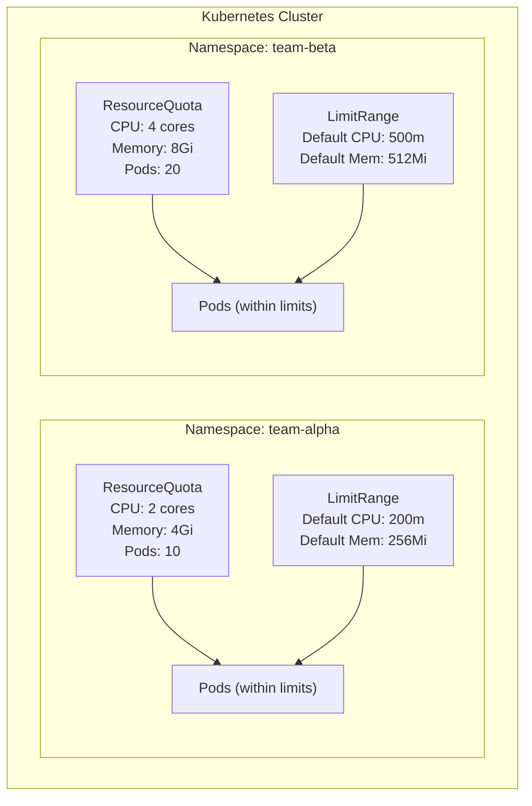

---

# ResourceQuotas & LimitRanges - Multi-Tenant Resource Control

- In this lab we will learn how to use **ResourceQuotas** and **LimitRanges** to control and limit resource consumption per namespace, ensuring fair sharing in multi-tenant Kubernetes clusters.

---

## What will we learn?

- What ResourceQuotas and LimitRanges are
- How to set CPU, memory, and object count limits per namespace
- How to enforce default resource requests/limits for every container
- How to prevent namespace resource starvation
- How ResourceQuotas and LimitRanges work together
- How to monitor quota usage
- Best practices for multi-tenant clusters

---

## Official Documentation & References

| Resource                              | Link                                                                                              |
| ------------------------------------- | ------------------------------------------------------------------------------------------------- |
| Resource Quotas                       | [kubernetes.io/docs](https://kubernetes.io/docs/concepts/policy/resource-quotas/)                 |
| Limit Ranges                          | [kubernetes.io/docs](https://kubernetes.io/docs/concepts/policy/limit-range/)                     |
| Managing Resources for Containers     | [kubernetes.io/docs](https://kubernetes.io/docs/concepts/configuration/manage-resources-containers/) |
| Configure Quotas for API Objects      | [kubernetes.io/docs](https://kubernetes.io/docs/tasks/administer-cluster/quota-api-object/)       |

---

## Prerequisites

- A running Kubernetes cluster (`kubectl cluster-info` should work)
- `kubectl` configured against the cluster

---

## Overview



| Resource           | Scope      | Purpose                                                     |
| ------------------ | ---------- | ----------------------------------------------------------- |
| **ResourceQuota**  | Namespace  | Caps the **total** resources a namespace can consume        |
| **LimitRange**     | Namespace  | Sets **per-container** default and max resource constraints |

---

## 01. Create namespaces

```sh
# Clean up
kubectl delete namespace quota-lab --ignore-not-found

# Create lab namespace
kubectl create namespace quota-lab
```

---

## 02. Create a ResourceQuota

A ResourceQuota limits the **total** resources consumed by all pods in a namespace:

```yaml
# manifests/resource-quota.yaml
apiVersion: v1
kind: ResourceQuota
metadata:
  name: compute-quota
  namespace: quota-lab
spec:
  hard:
    # Compute resources
    requests.cpu: "2"          # Total CPU requests across all pods
    requests.memory: 4Gi       # Total memory requests across all pods
    limits.cpu: "4"            # Total CPU limits across all pods
    limits.memory: 8Gi         # Total memory limits across all pods
    # Object count limits
    pods: "10"                 # Maximum number of pods
    services: "5"              # Maximum number of services
    configmaps: "10"           # Maximum number of configmaps
    secrets: "10"              # Maximum number of secrets
    persistentvolumeclaims: "5"
```

```sh
kubectl apply -f manifests/resource-quota.yaml

# Check the quota
kubectl get resourcequota -n quota-lab
kubectl describe resourcequota compute-quota -n quota-lab
```

Expected output:

```
Name:                    compute-quota
Namespace:               quota-lab
Resource                 Used  Hard
--------                 ----  ----
configmaps               1     10
limits.cpu               0     4
limits.memory            0     8Gi
persistentvolumeclaims   0     5
pods                     0     10
requests.cpu             0     2
requests.memory          0     4Gi
secrets                  0     10
services                 0     5
```

---

## 03. Deploy a pod without resource requests (will fail!)

!!! warning "Important"

    When a ResourceQuota is active in a namespace, **every container must specify resource requests and limits**. Pods without them will be rejected.

```sh
# This will FAIL because no resource requests/limits are specified
kubectl run test-no-limits --image=nginx -n quota-lab
# Error: pods "test-no-limits" is forbidden: failed quota: compute-quota:
# must specify limits.cpu, limits.memory, requests.cpu, requests.memory
```

---

## 04. Deploy a pod with resource requests

```yaml
# manifests/pod-with-resources.yaml
apiVersion: v1
kind: Pod
metadata:
  name: web-server
  namespace: quota-lab
spec:
  containers:
    - name: nginx
      image: nginx:alpine
      resources:
        requests:
          cpu: 250m
          memory: 128Mi
        limits:
          cpu: 500m
          memory: 256Mi
```

```sh
kubectl apply -f manifests/pod-with-resources.yaml

# Check quota usage - resources are now counted
kubectl describe resourcequota compute-quota -n quota-lab
```

Expected:

```
Resource                 Used    Hard
--------                 ----    ----
limits.cpu               500m    4
limits.memory            256Mi   8Gi
pods                     1       10
requests.cpu             250m    2
requests.memory          128Mi   4Gi
```

---

## 05. Exceed the quota (will fail!)

Try to deploy more pods than the quota allows:

```yaml
# manifests/deployment-exceeds-quota.yaml
apiVersion: apps/v1
kind: Deployment
metadata:
  name: hungry-app
  namespace: quota-lab
spec:
  replicas: 5
  selector:
    matchLabels:
      app: hungry
  template:
    metadata:
      labels:
        app: hungry
    spec:
      containers:
        - name: app
          image: nginx:alpine
          resources:
            requests:
              cpu: 500m         # 5 replicas × 500m = 2.5 CPU > 2 CPU quota
              memory: 1Gi       # 5 replicas × 1Gi = 5Gi > 4Gi quota
            limits:
              cpu: "1"
              memory: 2Gi
```

```sh
kubectl apply -f manifests/deployment-exceeds-quota.yaml

# Check how many pods were actually created
kubectl get pods -n quota-lab -l app=hungry
# Only some pods will be created - the rest are blocked by quota

# Check events for the ReplicaSet to see the quota error
kubectl get events -n quota-lab --field-selector reason=FailedCreate --sort-by='.lastTimestamp'
# "exceeded quota: compute-quota"
```

---

## 06. Create a LimitRange

A LimitRange sets **per-container** defaults and constraints - so pods without explicit resources still get reasonable limits:

```yaml
# manifests/limit-range.yaml
apiVersion: v1
kind: LimitRange
metadata:
  name: default-limits
  namespace: quota-lab
spec:
  limits:
    - type: Container
      default:           # Default limits (if not specified)
        cpu: 300m
        memory: 256Mi
      defaultRequest:    # Default requests (if not specified)
        cpu: 100m
        memory: 128Mi
      max:               # Maximum allowed per container
        cpu: "1"
        memory: 1Gi
      min:               # Minimum required per container
        cpu: 50m
        memory: 64Mi
    - type: Pod
      max:               # Maximum total resources per pod
        cpu: "2"
        memory: 2Gi
```

```sh
# Clean up previous resources
kubectl delete deployment hungry-app -n quota-lab --ignore-not-found
kubectl delete pod web-server -n quota-lab --ignore-not-found

kubectl apply -f manifests/limit-range.yaml

# Inspect the LimitRange
kubectl describe limitrange default-limits -n quota-lab
```

---

## 07. Deploy a pod without resource specs (gets defaults from LimitRange)

```sh
# Now this works! LimitRange injects default requests/limits
kubectl run auto-limited --image=nginx:alpine -n quota-lab

# Wait for it
kubectl wait --for=condition=Ready pod/auto-limited -n quota-lab --timeout=60s

# Check the pod - it has resources injected automatically
kubectl get pod auto-limited -n quota-lab -o jsonpath='{.spec.containers[0].resources}' | python3 -m json.tool
```

Expected output:

```json
{
    "limits": {
        "cpu": "300m",
        "memory": "256Mi"
    },
    "requests": {
        "cpu": "100m",
        "memory": "128Mi"
    }
}
```

---

## 08. Try to exceed per-container max (will fail!)

```yaml
# manifests/pod-exceeds-limit.yaml
apiVersion: v1
kind: Pod
metadata:
  name: greedy-pod
  namespace: quota-lab
spec:
  containers:
    - name: app
      image: nginx:alpine
      resources:
        requests:
          cpu: 100m
          memory: 128Mi
        limits:
          cpu: "2"           # Exceeds LimitRange max of 1 CPU
          memory: 2Gi        # Exceeds LimitRange max of 1Gi
```

```sh
kubectl apply -f manifests/pod-exceeds-limit.yaml
# Error: pods "greedy-pod" is forbidden:
# [maximum cpu usage per Container is 1, but limit is 2,
#  maximum memory usage per Container is 1Gi, but limit is 2Gi]
```

---

## 09. Monitor quota usage

```sh
# View quota usage across all namespaces
kubectl get resourcequota --all-namespaces

# Detailed usage for our namespace
kubectl describe resourcequota compute-quota -n quota-lab

# View in JSON/YAML for programmatic access
kubectl get resourcequota compute-quota -n quota-lab -o yaml

# Check if a specific resource is approaching limits
kubectl get resourcequota compute-quota -n quota-lab \
  -o jsonpath='{range .status.used}{@}{"\n"}{end}'
```

---

## 10. Scope-based quotas (optional advanced topic)

ResourceQuotas can be scoped to specific priority classes or pod states:

```yaml
# manifests/scoped-quota.yaml
apiVersion: v1
kind: ResourceQuota
metadata:
  name: best-effort-quota
  namespace: quota-lab
spec:
  hard:
    pods: "5"
  scopeSelector:
    matchExpressions:
      - operator: In
        scopeName: PriorityClass
        values: ["low-priority"]
```

```sh
kubectl apply -f manifests/scoped-quota.yaml
```

---

## 11. Cleanup

```sh
kubectl delete namespace quota-lab
```

---

## Summary

| Concept                  | Key Takeaway                                                   |
| ------------------------ | -------------------------------------------------------------- |
| **ResourceQuota**        | Caps total namespace resource consumption (CPU, memory, objects) |
| **LimitRange**           | Sets per-container defaults, min, and max                      |
| **Together**             | LimitRange provides defaults → ResourceQuota enforces totals   |
| **No resources = rejected** | With a ResourceQuota, pods must declare resources           |
| **Defaults injection**   | LimitRange automatically adds requests/limits to naked pods    |
| **Object count quotas**  | Limit pods, services, secrets, PVCs, etc. per namespace        |
| **Best practice**        | Always use both ResourceQuota + LimitRange in multi-tenant clusters |

---

# Exercises

The following exercises will test your understanding of ResourceQuotas and LimitRanges.
Try to solve each exercise on your own before revealing the solution.

---

#### 01. Create a Quota That Limits Only Object Counts

Create a ResourceQuota named `object-count-quota` that limits the namespace to a maximum of 3 pods, 2 services, and 2 configmaps - without any CPU or memory restrictions.

#### Scenario:

◦ You want to prevent teams from accidentally creating too many resources.
◦ CPU and memory are managed by the LimitRange, so the quota only needs to count objects.

**Hint:** Use the `pods`, `services`, and `configmaps` fields under `spec.hard` without any `requests.*` or `limits.*` fields.

<details>
<summary>Solution</summary>

```bash
## Create namespace
kubectl create namespace count-quota-test

## Apply the object-count-only quota
cat <<'EOF' | kubectl apply -f -
apiVersion: v1
kind: ResourceQuota
metadata:
  name: object-count-quota
  namespace: count-quota-test
spec:
  hard:
    pods: "3"
    services: "2"
    configmaps: "2"
EOF

## Verify
kubectl describe resourcequota object-count-quota -n count-quota-test

## Create pods (no resource requests needed since no CPU/memory quota)
kubectl run pod1 --image=nginx:alpine -n count-quota-test
kubectl run pod2 --image=nginx:alpine -n count-quota-test
kubectl run pod3 --image=nginx:alpine -n count-quota-test

## This 4th pod should be rejected
kubectl run pod4 --image=nginx:alpine -n count-quota-test 2>&1 || echo "Rejected: quota exceeded"

## Check usage
kubectl describe resourcequota object-count-quota -n count-quota-test

## Clean up
kubectl delete namespace count-quota-test
```

</details>

---

#### 02. Use LimitRange to Set Max Resource Per Pod

Create a LimitRange that sets the maximum total CPU per pod to 1 core and maximum total memory per pod to 1Gi. Deploy a pod with two containers that together exceed these limits.

#### Scenario:

◦ You want to prevent any single pod from consuming too many resources.
◦ The limit applies to the sum of all containers in the pod, not per container.

**Hint:** Use `type: Pod` in the LimitRange with `max` settings.

<details>
<summary>Solution</summary>

```bash
## Create namespace
kubectl create namespace pod-limit-test

## Create the pod-level LimitRange
cat <<'EOF' | kubectl apply -f -
apiVersion: v1
kind: LimitRange
metadata:
  name: pod-max-limits
  namespace: pod-limit-test
spec:
  limits:
    - type: Pod
      max:
        cpu: "1"
        memory: 1Gi
    - type: Container
      defaultRequest:
        cpu: 100m
        memory: 128Mi
      default:
        cpu: 200m
        memory: 256Mi
EOF

## This pod should work (total: 400m CPU, 512Mi memory)
cat <<'EOF' | kubectl apply -f -
apiVersion: v1
kind: Pod
metadata:
  name: within-limits
  namespace: pod-limit-test
spec:
  containers:
    - name: app1
      image: nginx:alpine
      resources:
        requests:
          cpu: 100m
          memory: 128Mi
        limits:
          cpu: 200m
          memory: 256Mi
    - name: app2
      image: nginx:alpine
      resources:
        requests:
          cpu: 100m
          memory: 128Mi
        limits:
          cpu: 200m
          memory: 256Mi
EOF
echo "Pod within-limits created successfully"

## This pod should be REJECTED (total: 1200m CPU > 1 core max)
cat <<'EOF' | kubectl apply -f - 2>&1 || echo "Rejected: exceeds pod max"
apiVersion: v1
kind: Pod
metadata:
  name: exceeds-limits
  namespace: pod-limit-test
spec:
  containers:
    - name: app1
      image: nginx:alpine
      resources:
        requests:
          cpu: 400m
          memory: 256Mi
        limits:
          cpu: 600m
          memory: 512Mi
    - name: app2
      image: nginx:alpine
      resources:
        requests:
          cpu: 400m
          memory: 256Mi
        limits:
          cpu: 600m
          memory: 512Mi
EOF

## Clean up
kubectl delete namespace pod-limit-test
```

</details>

---

#### 03. Monitor Quota Usage and Set Up Alerts

Write a script that checks quota usage across all namespaces and warns when any resource exceeds 80% utilization.

#### Scenario:

◦ You are responsible for cluster operations and need early warning when namespaces approach their quotas.
◦ You want a simple script (no Prometheus needed) to check current usage.

**Hint:** Use `kubectl get resourcequota -A -o json` and parse the `status.used` vs `status.hard` fields.

<details>
<summary>Solution</summary>

```bash
## Create a test namespace with quota for demonstration
kubectl create namespace quota-monitor-test

cat <<'EOF' | kubectl apply -f -
apiVersion: v1
kind: ResourceQuota
metadata:
  name: test-quota
  namespace: quota-monitor-test
spec:
  hard:
    pods: "5"
    requests.cpu: "1"
    requests.memory: 1Gi
EOF

## Create some pods to use quota
cat <<'EOF' | kubectl apply -f -
apiVersion: v1
kind: Pod
metadata:
  name: consumer1
  namespace: quota-monitor-test
spec:
  containers:
    - name: app
      image: nginx:alpine
      resources:
        requests:
          cpu: 400m
          memory: 512Mi
        limits:
          cpu: 400m
          memory: 512Mi
EOF

## The monitoring script
cat <<'SCRIPT'
#!/bin/bash
## quota-monitor.sh - Check ResourceQuota usage across all namespaces
THRESHOLD=80

echo "=== ResourceQuota Usage Report ==="
echo ""

kubectl get resourcequota -A -o json | python3 -c "
import json, sys

data = json.load(sys.stdin)
threshold = $THRESHOLD

for item in data.get('items', []):
    ns = item['metadata']['namespace']
    name = item['metadata']['name']
    hard = item.get('status', {}).get('hard', {})
    used = item.get('status', {}).get('used', {})

    for resource in hard:
        h = hard[resource]
        u = used.get(resource, '0')

        # Parse values (simplified - handles integers and 'Mi/Gi' suffixes)
        def parse_val(v):
            v = str(v)
            if v.endswith('Gi'): return float(v[:-2]) * 1024
            if v.endswith('Mi'): return float(v[:-2])
            if v.endswith('m'): return float(v[:-1])
            try: return float(v)
            except: return 0

        hard_val = parse_val(h)
        used_val = parse_val(u)

        if hard_val > 0:
            pct = (used_val / hard_val) * 100
            status = '⚠️  WARNING' if pct >= threshold else '✅'
            print(f'{status} {ns}/{name}: {resource} = {u}/{h} ({pct:.0f}%)')
"
SCRIPT

## Clean up
kubectl delete namespace quota-monitor-test
```

</details>

---

#### 04. Create Quotas for Different Priority Classes

Create two PriorityClasses (`high-priority` and `low-priority`) and ResourceQuotas that limit how many pods of each priority class can run.

#### Scenario:

◦ Critical services use `high-priority` and should get up to 5 pods.
◦ Background jobs use `low-priority` and should be limited to 3 pods.
◦ This prevents low-priority workloads from consuming the namespace's pod quota.

**Hint:** Use `scopeSelector` with `PriorityClass` scope in the ResourceQuota.

<details>
<summary>Solution</summary>

```bash
## Create namespace
kubectl create namespace priority-quota-test

## Create PriorityClasses
cat <<'EOF' | kubectl apply -f -
apiVersion: scheduling.k8s.io/v1
kind: PriorityClass
metadata:
  name: high-priority
value: 1000
globalDefault: false
description: "High priority for critical services"
---
apiVersion: scheduling.k8s.io/v1
kind: PriorityClass
metadata:
  name: low-priority
value: 100
globalDefault: false
description: "Low priority for background jobs"
EOF

## Create scoped quotas
cat <<'EOF' | kubectl apply -f -
apiVersion: v1
kind: ResourceQuota
metadata:
  name: high-priority-quota
  namespace: priority-quota-test
spec:
  hard:
    pods: "5"
  scopeSelector:
    matchExpressions:
      - operator: In
        scopeName: PriorityClass
        values: ["high-priority"]
---
apiVersion: v1
kind: ResourceQuota
metadata:
  name: low-priority-quota
  namespace: priority-quota-test
spec:
  hard:
    pods: "3"
  scopeSelector:
    matchExpressions:
      - operator: In
        scopeName: PriorityClass
        values: ["low-priority"]
EOF

## Verify quotas
kubectl describe resourcequota -n priority-quota-test

## Deploy high-priority pods
for i in 1 2 3; do
  kubectl run high-$i --image=nginx:alpine --priority-class-name=high-priority -n priority-quota-test
done

## Deploy low-priority pods
for i in 1 2 3; do
  kubectl run low-$i --image=nginx:alpine --priority-class-name=low-priority -n priority-quota-test
done

## This 4th low-priority pod should be rejected
kubectl run low-4 --image=nginx:alpine --priority-class-name=low-priority -n priority-quota-test 2>&1 || echo "Rejected: low-priority quota exceeded"

## Check quota usage
kubectl describe resourcequota -n priority-quota-test

## Clean up
kubectl delete namespace priority-quota-test
kubectl delete priorityclass high-priority low-priority
```

</details>

---

#### 05. Verify LimitRange Defaults Are Applied Automatically

Create a LimitRange, deploy a pod without any resource specifications, and verify the pod received the default values from the LimitRange.

#### Scenario:

◦ New developers on your team forget to set resource requests/limits.
◦ The LimitRange ensures every container gets reasonable defaults.
◦ You need to prove the injection happens automatically.

**Hint:** Deploy a pod with `kubectl run` (no resources) and inspect the pod's YAML to see injected values.

<details>
<summary>Solution</summary>

```bash
## Create namespace with LimitRange
kubectl create namespace defaults-test

cat <<'EOF' | kubectl apply -f -
apiVersion: v1
kind: LimitRange
metadata:
  name: container-defaults
  namespace: defaults-test
spec:
  limits:
    - type: Container
      default:
        cpu: 500m
        memory: 256Mi
      defaultRequest:
        cpu: 200m
        memory: 128Mi
EOF

## Deploy a pod WITHOUT any resource specifications
kubectl run naked-pod --image=nginx:alpine -n defaults-test

## Wait for it
kubectl wait --for=condition=Ready pod/naked-pod -n defaults-test --timeout=60s

## Inspect the pod - LimitRange should have injected defaults
kubectl get pod naked-pod -n defaults-test -o jsonpath='{.spec.containers[0].resources}' | python3 -m json.tool

## Expected output:
## {
##     "limits": {
##         "cpu": "500m",
##         "memory": "256Mi"
##     },
##     "requests": {
##         "cpu": "200m",
##         "memory": "128Mi"
##     }
## }

## Verify LimitRange is the source
kubectl describe limitrange container-defaults -n defaults-test

## Clean up
kubectl delete namespace defaults-test
```

</details>

---

## Troubleshooting

- **Pod rejected with "must specify limits/requests":**

A ResourceQuota is active and requires all pods to declare resources. Add resource requests/limits or create a LimitRange to inject defaults:

```bash
## Check if a ResourceQuota exists
kubectl get resourcequota -n <namespace>

## Quick fix: Add a LimitRange to inject defaults
cat <<EOF | kubectl apply -f -
apiVersion: v1
kind: LimitRange
metadata:
  name: default-limits
  namespace: <namespace>
spec:
  limits:
    - type: Container
      default:
        cpu: 200m
        memory: 128Mi
      defaultRequest:
        cpu: 100m
        memory: 64Mi
EOF
```

<br>

- **Deployment stuck - ReplicaSet cannot create pods:**

Check the ReplicaSet events for quota errors:

```bash
## Get the ReplicaSet name
kubectl get rs -n <namespace>

## Check events for quota errors
kubectl describe rs <replicaset-name> -n <namespace> | grep -A5 "Events:"

## Or check events directly
kubectl get events -n <namespace> --field-selector reason=FailedCreate --sort-by='.lastTimestamp'
```

<br>

- **Pod rejected with "exceeds maximum" from LimitRange:**

The container's requests or limits exceed the LimitRange maximum. Reduce the resource values:

```bash
## Check the LimitRange constraints
kubectl describe limitrange -n <namespace>

## Show min/max for Container and Pod types
kubectl get limitrange -n <namespace> -o yaml
```

<br>

- **Quota shows "Used" but pods are not running:**

Quota counts even non-running pods. Check for failed or pending pods:

```bash
## List all pods (including non-running)
kubectl get pods -n <namespace> --field-selector=status.phase!=Running

## Delete failed pods to reclaim quota
kubectl delete pods --field-selector=status.phase=Failed -n <namespace>
```

<br>

- **Cannot determine remaining quota capacity:**

Compare `Used` vs `Hard` values to see remaining capacity:

```bash
## Detailed quota view
kubectl describe resourcequota -n <namespace>

## JSON output for programmatic access
kubectl get resourcequota -n <namespace> -o json | python3 -c "
import json, sys
data = json.load(sys.stdin)
for item in data.get('items', data.get('status', {}).get('hard', {}) and [data]):
    status = item.get('status', {})
    hard = status.get('hard', {})
    used = status.get('used', {})
    print(f\"Quota: {item['metadata']['name']}\")
    for k in hard:
        print(f'  {k}: {used.get(k, \"0\")} / {hard[k]}')
"
```

---

## Next Steps

- Explore [Vertical Pod Autoscaler (VPA)](https://github.com/kubernetes/autoscaler/tree/master/vertical-pod-autoscaler) to automatically adjust resource requests based on actual usage.
- Learn about [Horizontal Pod Autoscaler (HPA)](https://kubernetes.io/docs/tasks/run-application/horizontal-pod-autoscale/) to scale replicas based on resource utilization.
- Study [KEDA (Lab 30)](../30-Keda/README.md) for event-driven autoscaling that works alongside quotas.
- Explore [Hierarchical Quotas](https://github.com/kubernetes-sigs/hierarchical-namespaces) for managing quotas in complex multi-tenant setups with namespace hierarchies.
- Try [kube-resource-report](https://codeberg.org/hjacobs/kube-resource-report) for visualizing resource usage across namespaces.
- Implement [PodDisruptionBudgets (Lab 17)](../17-PodDisruptionBudgets-PDB/README.md) alongside quotas to ensure availability during maintenance.
