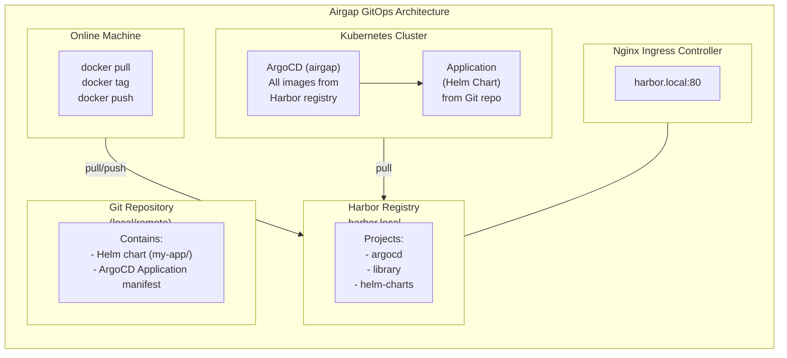

# Kubernetes Harbor + ArgoCD Airgap Tasks

- Hands-on Kubernetes exercises covering Harbor registry installation, Nginx Ingress setup, fully offline/airgap ArgoCD deployment, Helm chart creation, and GitOps application delivery.
- Each task includes a description, scenario, explanation, and a detailed solution with step-by-step instructions and scripts.
- Practice these tasks to master end-to-end airgapped GitOps workflows using Harbor as a private container registry and ArgoCD as the deployment engine.

#### Table of Contents

- [01. Install Nginx Ingress Controller + Harbor Registry](#01-install-nginx-ingress-controller--harbor-registry)
- [02. Configure Harbor with Ingress (harbor.local)](#02-configure-harbor-with-ingress-harborlocal)
- [03. Prepare ArgoCD for Full Offline/Airgap Install](#03-prepare-argocd-for-full-offlineairgap-install)
- [04. Create a Git Repository with a Helm Chart](#04-create-a-git-repository-with-a-helm-chart)
- [05. Deploy ArgoCD (Offline Install Using Harbor)](#05-deploy-argocd-offline-install-using-harbor)
- [06. Create an ArgoCD Application to Deploy the Helm Chart](#06-create-an-argocd-application-to-deploy-the-helm-chart)
- [Full Install Script (All Steps)](#full-install-script-all-steps)

---

### Architecture Overview



---

#### 01. Install Nginx Ingress Controller + Harbor Registry

Install the Nginx Ingress Controller and Harbor container registry on a Kubernetes cluster from the internet.

#### Scenario:

  - You are setting up a private container registry environment.
  - Harbor will serve as the local OCI registry for all container images and Helm charts.
  - The Nginx Ingress Controller is required to expose Harbor (and later ArgoCD) via hostnames.

#### Explanation:

  - **Nginx Ingress Controller** acts as a reverse proxy that routes HTTP/HTTPS traffic to services inside the cluster based on hostname and path rules.
  - **Harbor** is an open-source container registry that supports image management, vulnerability scanning, RBAC, and Helm chart hosting. It is the backbone of an airgap deployment - all images are pre-loaded here.
  - We install both from the internet first, then use Harbor to serve all images for the offline ArgoCD install.

**Prerequisites:** A running Kubernetes cluster (Kind, Minikube, or cloud-based), `helm`, `kubectl`, `docker` installed.

**Hint:** `helm repo add`, `helm upgrade --install`, `kubectl get pods`

??? example "Solution"

    ```bash
    #!/bin/bash
    # =============================================================================
    # Step 01 - Install Nginx Ingress Controller + Harbor Registry
    # =============================================================================
    set -e

    # ── Color definitions ──
    RED='\033[0;31m'
    GREEN='\033[0;32m'
    YELLOW='\033[1;33m'
    BLUE='\033[0;34m'
    CYAN='\033[0;36m'
    NC='\033[0m'

    info()    { echo -e "${BLUE}[INFO]${NC}    $*"; }
    success() { echo -e "${GREEN}[OK]${NC}      $*"; }
    warn()    { echo -e "${YELLOW}[WARN]${NC}    $*"; }
    error()   { echo -e "${RED}[ERROR]${NC}   $*" >&2; exit 1; }
    header()  { echo -e "\n${CYAN}=== $* ===${NC}"; }

    # ── 1. Add Helm repositories ──
    header "Adding Helm Repositories"

    helm repo add ingress-nginx https://kubernetes.github.io/ingress-nginx
    helm repo add harbor https://helm.goharbor.io
    helm repo update
    success "Helm repositories added and updated"

    # ── 2. Install Nginx Ingress Controller ──
    header "Installing Nginx Ingress Controller"

    helm upgrade --install ingress-nginx ingress-nginx/ingress-nginx \
        --namespace ingress-nginx \
        --create-namespace \
        --set controller.service.type=NodePort \
        --set controller.service.nodePorts.http=30080 \
        --set controller.service.nodePorts.https=30443 \
        --set controller.admissionWebhooks.enabled=false \
        --wait --timeout 5m

    # Verify Ingress Controller pods
    kubectl get pods -n ingress-nginx
    success "Nginx Ingress Controller installed"

    # ── 3. Get the Ingress IP/Node IP ──
    header "Detecting Cluster Node IP"

    NODE_IP=$(kubectl get nodes -o jsonpath='{.items[0].status.addresses[?(@.type=="InternalIP")].address}')
    info "Node IP: ${NODE_IP}"

    # ── 4. Install Harbor ──
    header "Installing Harbor Registry"

    helm upgrade --install harbor harbor/harbor \
        --namespace harbor \
        --create-namespace \
        --set expose.type=ingress \
        --set expose.ingress.className=nginx \
        --set expose.ingress.hosts.core=harbor.local \
        --set expose.tls.enabled=false \
        --set externalURL=http://harbor.local \
        --set harborAdminPassword=Harbor12345 \
        --set persistence.enabled=false \
        --wait --timeout 10m

    # Verify Harbor pods
    kubectl get pods -n harbor
    success "Harbor registry installed"

    # ── 5. Add harbor.local to /etc/hosts ──
    header "Configuring /etc/hosts"

    if ! grep -q "harbor.local" /etc/hosts; then
        echo "${NODE_IP}  harbor.local" | sudo tee -a /etc/hosts
        success "Added harbor.local to /etc/hosts"
    else
        warn "harbor.local already exists in /etc/hosts"
    fi

    # ── 6. Verify Harbor is accessible ──
    header "Verifying Harbor Access"

    # Wait for Ingress to be ready
    sleep 10

    HTTP_CODE=$(curl -s -o /dev/null -w "%{http_code}" http://harbor.local/api/v2.0/health 2>/dev/null || echo "000")
    if [ "${HTTP_CODE}" = "200" ]; then
        success "Harbor is healthy (HTTP ${HTTP_CODE})"
    else
        warn "Harbor returned HTTP ${HTTP_CODE} - it may still be starting up"
        info "Try: curl http://harbor.local/api/v2.0/health"
    fi

    echo ""
    info "Harbor UI:       http://harbor.local"
    info "Harbor Admin:    admin / Harbor12345"
    info "Ingress Node IP: ${NODE_IP}"
    success "Step 01 complete!"
    ```

    #### Key Concepts:

    | Component                 | Purpose                                                       |
    |---------------------------|---------------------------------------------------------------|
    | Nginx Ingress Controller  | Routes HTTP traffic to services based on hostname/path rules  |
    | Harbor                    | Private container registry + Helm chart repository            |
    | NodePort                  | Exposes Ingress on fixed ports (30080/30443) on each node     |
    | `expose.type=ingress`     | Tells Harbor to create Ingress resources for external access  |
    | `persistence.enabled=false` | Uses emptyDir for lab purposes (data lost on pod restart)   |

---

#### 02. Configure Harbor with Ingress (harbor.local)

Verify Harbor is accessible via `harbor.local`, create projects, and configure Docker to trust the insecure registry.

#### Scenario:

  - Harbor is installed but you need to verify the Ingress route works correctly.
  - You need to create Harbor projects to organize images for the airgap deployment.
  - Docker must be configured to allow pushing/pulling from the insecure (HTTP) registry.

#### Explanation:

  - **Harbor Projects** are logical groupings for container images (similar to Docker Hub organizations).
  - We create an `argocd` project to hold all ArgoCD-related images and a `library` project for general images.
  - Since we use HTTP (not HTTPS), Docker needs `harbor.local` added to its insecure registries list.

**Hint:** `curl`, Harbor API, Docker `daemon.json`, `docker login`

??? example "Solution"

    ```bash
    #!/bin/bash
    # =============================================================================
    # Step 02 - Configure Harbor with Ingress (harbor.local)
    # =============================================================================
    set -e

    RED='\033[0;31m'; GREEN='\033[0;32m'; YELLOW='\033[1;33m'
    BLUE='\033[0;34m'; CYAN='\033[0;36m'; NC='\033[0m'
    info()    { echo -e "${BLUE}[INFO]${NC}    $*"; }
    success() { echo -e "${GREEN}[OK]${NC}      $*"; }
    warn()    { echo -e "${YELLOW}[WARN]${NC}    $*"; }
    error()   { echo -e "${RED}[ERROR]${NC}   $*" >&2; exit 1; }
    header()  { echo -e "\n${CYAN}=== $* ===${NC}"; }

    HARBOR_URL="http://harbor.local"
    HARBOR_USER="admin"
    HARBOR_PASS="Harbor12345"

    # ── 1. Verify Harbor health ──
    header "Verifying Harbor Health"

    HTTP_CODE=$(curl -s -o /dev/null -w "%{http_code}" ${HARBOR_URL}/api/v2.0/health)
    if [ "${HTTP_CODE}" != "200" ]; then
        error "Harbor is not healthy (HTTP ${HTTP_CODE}). Check pods: kubectl get pods -n harbor"
    fi
    success "Harbor is healthy"

    # ── 2. Verify Ingress routing ──
    header "Verifying Ingress Configuration"

    kubectl get ingress -n harbor
    info "Harbor Ingress rules:"
    kubectl describe ingress -n harbor | grep -E "Host|Path|Backend"

    # ── 3. Create Harbor projects via API ──
    header "Creating Harbor Projects"

    create_project() {
        local project_name=$1
        local response
        response=$(curl -s -o /dev/null -w "%{http_code}" \
            -X POST "${HARBOR_URL}/api/v2.0/projects" \
            -H "Content-Type: application/json" \
            -u "${HARBOR_USER}:${HARBOR_PASS}" \
            -d "{\"project_name\": \"${project_name}\", \"public\": true}")

        if [ "${response}" = "201" ]; then
            success "Created project: ${project_name}"
        elif [ "${response}" = "409" ]; then
            warn "Project already exists: ${project_name}"
        else
            error "Failed to create project ${project_name} (HTTP ${response})"
        fi
    }

    create_project "argocd"
    create_project "library"

    # ── 4. Verify projects ──
    header "Listing Harbor Projects"

    curl -s -u "${HARBOR_USER}:${HARBOR_PASS}" \
        "${HARBOR_URL}/api/v2.0/projects" | \
        python3 -m json.tool 2>/dev/null | grep -E '"name"|"project_id"' || \
    curl -s -u "${HARBOR_USER}:${HARBOR_PASS}" \
        "${HARBOR_URL}/api/v2.0/projects" | grep -o '"name":"[^"]*"'

    # ── 5. Configure Docker for insecure registry ──
    header "Configuring Docker for Insecure Registry"

    DOCKER_DAEMON="/etc/docker/daemon.json"

    info "Docker must trust harbor.local as an insecure registry (HTTP)."
    info ""
    info "Add the following to ${DOCKER_DAEMON}:"
    echo ""
    echo '  {
      "insecure-registries": ["harbor.local"]
    }'
    echo ""

    # Attempt to configure automatically (requires sudo)
    if [ -f "${DOCKER_DAEMON}" ]; then
        if grep -q "harbor.local" "${DOCKER_DAEMON}"; then
            success "harbor.local already in insecure-registries"
        else
            warn "Please add harbor.local to insecure-registries manually"
            info "Then restart Docker: sudo systemctl restart docker"
        fi
    else
        info "Creating ${DOCKER_DAEMON} with insecure registry config"
        sudo mkdir -p /etc/docker
        echo '{"insecure-registries": ["harbor.local"]}' | sudo tee "${DOCKER_DAEMON}"
        sudo systemctl restart docker 2>/dev/null || warn "Restart Docker manually"
        success "Docker configured"
    fi

    # ── 6. Docker login to Harbor ──
    header "Logging in to Harbor"

    docker login harbor.local \
        -u "${HARBOR_USER}" \
        -p "${HARBOR_PASS}" && \
        success "Docker login successful" || \
        warn "Docker login failed - ensure Docker is configured for insecure registries"

    # ── 7. Test push/pull ──
    header "Testing Push/Pull"

    docker pull busybox:latest
    docker tag busybox:latest harbor.local/library/busybox:latest
    docker push harbor.local/library/busybox:latest && \
        success "Test push successful!" || \
        warn "Test push failed - check Docker insecure registry config"

    echo ""
    info "Harbor URL:      ${HARBOR_URL}"
    info "Projects:        argocd, library"
    info "Credentials:     ${HARBOR_USER} / ${HARBOR_PASS}"
    success "Step 02 complete!"
    ```

    #### Ingress Verification:

    ```bash
    # Check the Ingress resource created by Harbor
    kubectl get ingress -n harbor -o wide

    # Expected output:
    # NAME                    CLASS   HOSTS          ADDRESS        PORTS   AGE
    # harbor-ingress          nginx   harbor.local   10.x.x.x      80      5m

    # Test with curl
    curl http://harbor.local/api/v2.0/systeminfo
    # Returns Harbor version and system information
    ```

---

#### 03. Prepare ArgoCD for Full Offline/Airgap Install

Identify, pull, tag, and push all required ArgoCD container images to the Harbor registry for a fully airgapped installation.

#### Scenario:

  - Your production cluster has no internet access (airgap environment).
  - All container images must be pre-loaded into the private Harbor registry before deploying ArgoCD.
  - You need to identify every image the ArgoCD Helm chart will use and mirror them to Harbor.

#### Explanation:

  - An **airgap installation** means no external network access - every container image must already exist in a local registry.
  - The ArgoCD Helm chart deploys multiple components (server, controller, repo-server, redis, dex, notifications), each with its own container image.
  - We use `helm template` to render all manifests and extract image references, then mirror them to Harbor.
  - The ArgoCD Helm chart version and image tags are tightly coupled - always use matching versions.

**Hint:** `helm template`, `grep image:`, `docker pull/tag/push`, Harbor API

??? example "Solution"

    #### Complete List of ArgoCD Images (v2.13)

    The following images are required for a full ArgoCD offline installation:

    | Component                    | Image                                                             |
    |------------------------------|-------------------------------------------------------------------|
    | ArgoCD Server                | `quay.io/argoproj/argocd:v2.13.3`                                |
    | ArgoCD Application Controller| `quay.io/argoproj/argocd:v2.13.3`                                |
    | ArgoCD Repo Server           | `quay.io/argoproj/argocd:v2.13.3`                                |
    | ArgoCD Notifications         | `quay.io/argoproj/argocd:v2.13.3`                                |
    | ArgoCD ApplicationSet        | `quay.io/argoproj/argocd:v2.13.3`                                |
    | Redis (HA Cache)             | `redis:7.4.2-alpine`                                             |
    | Dex (OIDC Provider)          | `ghcr.io/dexidp/dex:v2.41.1`                                    |

    > **Note:** ArgoCD uses a single image (`quay.io/argoproj/argocd`) for multiple components - the entrypoint command differs per component. The exact image tags may vary based on the Helm chart version. Always verify with `helm template`.

    ```bash
    #!/bin/bash
    # =============================================================================
    # Step 03 - Prepare ArgoCD for Full Offline/Airgap Install
    # =============================================================================
    set -e

    RED='\033[0;31m'; GREEN='\033[0;32m'; YELLOW='\033[1;33m'
    BLUE='\033[0;34m'; CYAN='\033[0;36m'; NC='\033[0m'
    info()    { echo -e "${BLUE}[INFO]${NC}    $*"; }
    success() { echo -e "${GREEN}[OK]${NC}      $*"; }
    warn()    { echo -e "${YELLOW}[WARN]${NC}    $*"; }
    error()   { echo -e "${RED}[ERROR]${NC}   $*" >&2; exit 1; }
    header()  { echo -e "\n${CYAN}=== $* ===${NC}"; }

    HARBOR_URL="harbor.local"
    HARBOR_USER="admin"
    HARBOR_PASS="Harbor12345"
    ARGOCD_CHART_VERSION="7.7.12"

    # ── 1. Add ArgoCD Helm repository ──
    header "Adding ArgoCD Helm Repository"

    helm repo add argo https://argoproj.github.io/argo-helm
    helm repo update argo
    success "ArgoCD Helm repo added"

    # ── 2. Discover all required images using helm template ──
    header "Discovering Required Images"

    info "Rendering ArgoCD Helm chart to extract image references..."

    IMAGES=$(helm template argocd argo/argo-cd \
        --version "${ARGOCD_CHART_VERSION}" \
        --namespace argocd 2>/dev/null | \
        grep -E "image:" | \
        sed 's/.*image: *"\?\([^"]*\)"\?.*/\1/' | \
        sort -u)

    echo ""
    info "Required images for ArgoCD ${ARGOCD_CHART_VERSION}:"
    echo "─────────────────────────────────────────────────"
    echo "${IMAGES}" | while read -r img; do
        echo "  ${img}"
    done
    echo "─────────────────────────────────────────────────"

    # ── 3. Define the image mapping (source → Harbor target) ──
    header "Building Image Mirror Map"

    # ArgoCD images - all use the same base image with different entrypoints
    declare -A IMAGE_MAP

    while IFS= read -r img; do
        # Extract the image name and tag
        # Convert quay.io/argoproj/argocd:v2.13.3 → harbor.local/argocd/argocd:v2.13.3
        # Convert redis:7.4.2-alpine → harbor.local/argocd/redis:7.4.2-alpine
        # Convert ghcr.io/dexidp/dex:v2.41.1 → harbor.local/argocd/dex:v2.41.1

        local_name=$(echo "${img}" | rev | cut -d'/' -f1 | rev)  # e.g. argocd:v2.13.3
        IMAGE_MAP["${img}"]="${HARBOR_URL}/argocd/${local_name}"
    done <<< "${IMAGES}"

    info "Image mirror mapping:"
    for src in "${!IMAGE_MAP[@]}"; do
        echo "  ${src}"
        echo "    → ${IMAGE_MAP[$src]}"
    done

    # ── 4. Pull all images from the internet ──
    header "Pulling Images from Internet"

    for src in "${!IMAGE_MAP[@]}"; do
        info "Pulling: ${src}"
        docker pull "${src}" || error "Failed to pull ${src}"
        success "Pulled: ${src}"
    done

    # ── 5. Tag images for Harbor ──
    header "Tagging Images for Harbor"

    for src in "${!IMAGE_MAP[@]}"; do
        dst="${IMAGE_MAP[$src]}"
        info "Tagging: ${src} → ${dst}"
        docker tag "${src}" "${dst}"
        success "Tagged: ${dst}"
    done

    # ── 6. Push images to Harbor ──
    header "Pushing Images to Harbor"

    docker login "${HARBOR_URL}" -u "${HARBOR_USER}" -p "${HARBOR_PASS}" || \
        error "Docker login to Harbor failed"

    for src in "${!IMAGE_MAP[@]}"; do
        dst="${IMAGE_MAP[$src]}"
        info "Pushing: ${dst}"
        docker push "${dst}" || error "Failed to push ${dst}"
        success "Pushed: ${dst}"
    done

    # ── 7. Verify images in Harbor ──
    header "Verifying Images in Harbor"

    info "Images in 'argocd' project:"
    curl -s -u "${HARBOR_USER}:${HARBOR_PASS}" \
        "http://${HARBOR_URL}/api/v2.0/projects/argocd/repositories" | \
        python3 -m json.tool 2>/dev/null || \
    curl -s -u "${HARBOR_USER}:${HARBOR_PASS}" \
        "http://${HARBOR_URL}/api/v2.0/projects/argocd/repositories"

    # ── 8. Save the ArgoCD Helm chart locally for offline use ──
    header "Saving ArgoCD Helm Chart for Offline Use"

    mkdir -p /tmp/argocd-airgap
    helm pull argo/argo-cd \
        --version "${ARGOCD_CHART_VERSION}" \
        --destination /tmp/argocd-airgap/

    ls -la /tmp/argocd-airgap/
    success "Helm chart saved to /tmp/argocd-airgap/"

    # ── 9. Push Helm chart to Harbor OCI registry (optional) ──
    header "Pushing Helm Chart to Harbor OCI Registry"

    helm push /tmp/argocd-airgap/argo-cd-${ARGOCD_CHART_VERSION}.tgz \
        oci://${HARBOR_URL}/argocd 2>/dev/null && \
        success "Helm chart pushed to Harbor OCI" || \
        warn "OCI push skipped (Harbor may need OCI enabled or use chartmuseum)"

    echo ""
    echo "─────────────────────────────────────────────────"
    info "Summary of mirrored images:"
    echo "─────────────────────────────────────────────────"
    for src in "${!IMAGE_MAP[@]}"; do
        echo "  ${IMAGE_MAP[$src]}"
    done
    echo "─────────────────────────────────────────────────"
    echo ""
    success "Step 03 complete! All ArgoCD images are in Harbor."
    ```

    #### Quick Reference: Image Discovery Commands

    ```bash
    # Method 1: helm template (recommended - shows exact images)
    helm template argocd argo/argo-cd --version 7.7.12 | grep "image:" | sort -u

    # Method 2: helm show values (shows configurable image fields)
    helm show values argo/argo-cd --version 7.7.12 | grep -A2 "repository:"

    # Method 3: After install - check running pods
    kubectl get pods -n argocd -o jsonpath='{range .items[*]}{range .spec.containers[*]}{.image}{"\n"}{end}{end}' | sort -u

    # Verify images in Harbor via API
    curl -s -u admin:Harbor12345 http://harbor.local/api/v2.0/projects/argocd/repositories | python3 -m json.tool
    ```

---

#### 04. Create a Git Repository with a Helm Chart

Create a local Git repository containing a sample Helm chart that ArgoCD will deploy.

#### Scenario:

  - ArgoCD follows the GitOps model - the Git repository is the single source of truth.
  - You need a Helm chart in a Git repository that ArgoCD can monitor and deploy.
  - The chart deploys a simple nginx-based web application with configurable replicas and a custom welcome page.

#### Explanation:

  - **GitOps** means the desired state of the cluster is declared in Git. ArgoCD watches the repo and syncs changes automatically.
  - The Helm chart contains templates for a Deployment, Service, and ConfigMap.
  - We use a **local bare Git repository** for the lab (simulating a remote Git server). In production, this would be GitHub, GitLab, or Gitea.
  - ArgoCD can detect Helm charts automatically by the presence of `Chart.yaml`.

**Hint:** `git init --bare`, `helm create`, `git push`

??? example "Solution"

    ```bash
    #!/bin/bash
    # =============================================================================
    # Step 04 - Create a Git Repository with a Helm Chart
    # =============================================================================
    set -e

    RED='\033[0;31m'; GREEN='\033[0;32m'; YELLOW='\033[1;33m'
    BLUE='\033[0;34m'; CYAN='\033[0;36m'; NC='\033[0m'
    info()    { echo -e "${BLUE}[INFO]${NC}    $*"; }
    success() { echo -e "${GREEN}[OK]${NC}      $*"; }
    warn()    { echo -e "${YELLOW}[WARN]${NC}    $*"; }
    error()   { echo -e "${RED}[ERROR]${NC}   $*" >&2; exit 1; }
    header()  { echo -e "\n${CYAN}=== $* ===${NC}"; }

    REPO_BASE="/tmp/gitops-lab"
    BARE_REPO="${REPO_BASE}/helm-apps.git"
    WORK_DIR="${REPO_BASE}/helm-apps-workspace"
    CHART_NAME="my-web-app"

    # ── 1. Create a bare Git repository (simulates remote server) ──
    header "Creating Bare Git Repository"

    rm -rf "${REPO_BASE}"
    mkdir -p "${REPO_BASE}"

    git init --bare "${BARE_REPO}"
    success "Bare repo created at ${BARE_REPO}"

    # ── 2. Clone the bare repo into a working directory ──
    header "Cloning Working Directory"

    git clone "${BARE_REPO}" "${WORK_DIR}"
    cd "${WORK_DIR}"
    success "Working directory: ${WORK_DIR}"

    # ── 3. Scaffold the Helm chart ──
    header "Creating Helm Chart: ${CHART_NAME}"

    helm create "${CHART_NAME}"

    # ── 4. Customize Chart.yaml ──
    cat > "${CHART_NAME}/Chart.yaml" << 'EOF'
    apiVersion: v2
    name: my-web-app
    description: A simple web application deployed via ArgoCD GitOps
    type: application
    version: 0.1.0
    appVersion: "1.25.0"
    maintainers:
      - name: platform-team
        email: platform@example.com
    EOF
    success "Chart.yaml customized"

    # ── 5. Customize values.yaml ──
    cat > "${CHART_NAME}/values.yaml" << 'EOF'
    replicaCount: 2

    image:
      repository: nginx
      pullPolicy: IfNotPresent
      tag: "1.25-alpine"

    imagePullSecrets: []
    nameOverride: ""
    fullnameOverride: ""

    serviceAccount:
      create: true
      automount: true
      annotations: {}
      name: ""

    podAnnotations: {}
    podLabels: {}
    podSecurityContext: {}
    securityContext: {}

    service:
      type: ClusterIP
      port: 80

    ingress:
      enabled: false

    resources:
      limits:
        cpu: 100m
        memory: 128Mi
      requests:
        cpu: 50m
        memory: 64Mi

    autoscaling:
      enabled: false

    volumes: []
    volumeMounts: []
    nodeSelector: {}
    tolerations: []
    affinity: {}

    # Custom welcome page
    welcomePage:
      title: "GitOps Demo App"
      message: "Deployed by ArgoCD from Harbor airgap registry!"
      backgroundColor: "#1a1a2e"
      textColor: "#e94560"
    EOF
    success "values.yaml customized"

    # ── 6. Create a custom ConfigMap template for the welcome page ──
    cat > "${CHART_NAME}/templates/configmap.yaml" << 'TEMPLATE'
    apiVersion: v1
    kind: ConfigMap
    metadata:
      name: {{ include "my-web-app.fullname" . }}-html
      labels:
        {{- include "my-web-app.labels" . | nindent 4 }}
    data:
      index.html: |
        <!DOCTYPE html>
        <html>
        <head>
          <title>{{ .Values.welcomePage.title }}</title>
          <style>
            body {
              font-family: 'Segoe UI', Arial, sans-serif;
              display: flex;
              justify-content: center;
              align-items: center;
              min-height: 100vh;
              margin: 0;
              background: {{ .Values.welcomePage.backgroundColor }};
              color: {{ .Values.welcomePage.textColor }};
            }
            .container { text-align: center; }
            h1 { font-size: 2.5em; margin-bottom: 0.5em; }
            .info { font-size: 1.2em; margin: 8px 0; color: #eee; }
            .badge {
              display: inline-block;
              background: {{ .Values.welcomePage.textColor }};
              color: white;
              padding: 5px 15px;
              border-radius: 20px;
              margin: 5px;
              font-size: 0.9em;
            }
          </style>
        </head>
        <body>
          <div class="container">
            <h1>{{ .Values.welcomePage.title }}</h1>
            <p class="info">{{ .Values.welcomePage.message }}</p>
            <p class="info">
              <span class="badge">Release: {{ .Release.Name }}</span>
              <span class="badge">Namespace: {{ .Release.Namespace }}</span>
            </p>
            <p class="info">
              <span class="badge">Chart: {{ .Chart.Name }}-{{ .Chart.Version }}</span>
              <span class="badge">App: {{ .Chart.AppVersion }}</span>
            </p>
          </div>
        </body>
        </html>
    TEMPLATE
    success "ConfigMap template created"

    # ── 7. Update the Deployment to mount the ConfigMap ──
    cat > "${CHART_NAME}/templates/deployment.yaml" << 'TEMPLATE'
    apiVersion: apps/v1
    kind: Deployment
    metadata:
      name: {{ include "my-web-app.fullname" . }}
      labels:
        {{- include "my-web-app.labels" . | nindent 4 }}
    spec:
      {{- if not .Values.autoscaling.enabled }}
      replicas: {{ .Values.replicaCount }}
      {{- end }}
      selector:
        matchLabels:
          {{- include "my-web-app.selectorLabels" . | nindent 6 }}
      template:
        metadata:
          annotations:
            checksum/config: {{ include (print $.Template.BasePath "/configmap.yaml") . | sha256sum }}
          {{- with .Values.podAnnotations }}
            {{- toYaml . | nindent 8 }}
          {{- end }}
          labels:
            {{- include "my-web-app.labels" . | nindent 8 }}
            {{- with .Values.podLabels }}
            {{- toYaml . | nindent 8 }}
            {{- end }}
        spec:
          {{- with .Values.imagePullSecrets }}
          imagePullSecrets:
            {{- toYaml . | nindent 8 }}
          {{- end }}
          serviceAccountName: {{ include "my-web-app.serviceAccountName" . }}
          {{- with .Values.podSecurityContext }}
          securityContext:
            {{- toYaml . | nindent 8 }}
          {{- end }}
          containers:
            - name: {{ .Chart.Name }}
              {{- with .Values.securityContext }}
              securityContext:
                {{- toYaml . | nindent 12 }}
              {{- end }}
              image: "{{ .Values.image.repository }}:{{ .Values.image.tag | default .Chart.AppVersion }}"
              imagePullPolicy: {{ .Values.image.pullPolicy }}
              ports:
                - name: http
                  containerPort: 80
                  protocol: TCP
              livenessProbe:
                httpGet:
                  path: /
                  port: http
              readinessProbe:
                httpGet:
                  path: /
                  port: http
              {{- with .Values.resources }}
              resources:
                {{- toYaml . | nindent 12 }}
              {{- end }}
              volumeMounts:
                - name: html
                  mountPath: /usr/share/nginx/html
                  readOnly: true
                {{- with .Values.volumeMounts }}
                {{- toYaml . | nindent 12 }}
                {{- end }}
          volumes:
            - name: html
              configMap:
                name: {{ include "my-web-app.fullname" . }}-html
            {{- with .Values.volumes }}
            {{- toYaml . | nindent 8 }}
            {{- end }}
          {{- with .Values.nodeSelector }}
          nodeSelector:
            {{- toYaml . | nindent 8 }}
          {{- end }}
          {{- with .Values.affinity }}
          affinity:
            {{- toYaml . | nindent 8 }}
          {{- end }}
          {{- with .Values.tolerations }}
          tolerations:
            {{- toYaml . | nindent 8 }}
          {{- end }}
    TEMPLATE
    success "Deployment template updated with ConfigMap volume mount"

    # ── 8. Validate the chart ──
    header "Validating Helm Chart"

    helm lint "${CHART_NAME}/"
    helm template test-release "${CHART_NAME}/" > /dev/null
    success "Chart passes lint and template rendering"

    # ── 9. Commit and push to the bare repository ──
    header "Committing to Git Repository"

    git add .
    git commit -m "Add ${CHART_NAME} Helm chart for GitOps deployment"
    git push origin master 2>/dev/null || git push origin main

    success "Chart pushed to Git repository"

    # ── 10. Verify the repository contents ──
    header "Repository Contents"

    echo ""
    find "${CHART_NAME}" -type f | sort | while read -r f; do
        echo "  ${f}"
    done
    echo ""

    info "Bare repo:     ${BARE_REPO}"
    info "Working dir:   ${WORK_DIR}"
    info "Chart path:    ${CHART_NAME}/"
    success "Step 04 complete!"
    ```

    #### Repository Structure:

    ```
    helm-apps/
    └── my-web-app/
        ├── Chart.yaml              # Chart metadata
        ├── values.yaml             # Default values
        ├── charts/                 # Dependencies (empty)
        ├── templates/
        │   ├── _helpers.tpl        # Named templates
        │   ├── configmap.yaml      # Custom HTML welcome page
        │   ├── deployment.yaml     # Deployment with ConfigMap mount
        │   ├── service.yaml        # ClusterIP service
        │   ├── serviceaccount.yaml # Service account
        │   ├── hpa.yaml            # HPA (disabled by default)
        │   ├── NOTES.txt           # Post-install notes
        │   └── tests/
        │       └── test-connection.yaml
        └── .helmignore
    ```

---

#### 05. Deploy ArgoCD (Offline Install Using Harbor)

Deploy ArgoCD using only images from the Harbor registry - a fully airgapped installation.

#### Scenario:

  - The cluster has no internet access (simulated by overriding all image references).
  - All ArgoCD images are served from `harbor.local/argocd/`.
  - The Helm chart is installed from the locally saved `.tgz` file (not fetched from the internet).
  - ArgoCD is exposed via Ingress on `argocd.local`.

#### Explanation:

  - The Helm `--set` flags override every image reference to point at Harbor instead of the public registries (quay.io, ghcr.io, docker.io).
  - `global.image.repository` overrides the main ArgoCD image for all components.
  - Individual overrides are needed for Redis and Dex since they use different base images.
  - The `--set server.insecure=true` flag disables TLS on the ArgoCD server (TLS is terminated at the Ingress level).

**Hint:** `helm install`, `--set global.image.repository`, `--set redis.image.repository`

??? example "Solution"

    ```bash
    #!/bin/bash
    # =============================================================================
    # Step 05 - Deploy ArgoCD (Offline Install Using Harbor)
    # =============================================================================
    set -e

    RED='\033[0;31m'; GREEN='\033[0;32m'; YELLOW='\033[1;33m'
    BLUE='\033[0;34m'; CYAN='\033[0;36m'; NC='\033[0m'
    info()    { echo -e "${BLUE}[INFO]${NC}    $*"; }
    success() { echo -e "${GREEN}[OK]${NC}      $*"; }
    warn()    { echo -e "${YELLOW}[WARN]${NC}    $*"; }
    error()   { echo -e "${RED}[ERROR]${NC}   $*" >&2; exit 1; }
    header()  { echo -e "\n${CYAN}=== $* ===${NC}"; }

    HARBOR_URL="harbor.local"
    ARGOCD_CHART="/tmp/argocd-airgap/argo-cd-7.7.12.tgz"
    NODE_IP=$(kubectl get nodes -o jsonpath='{.items[0].status.addresses[?(@.type=="InternalIP")].address}')

    # ── 1. Verify the local Helm chart exists ──
    header "Verifying Local ArgoCD Helm Chart"

    if [ ! -f "${ARGOCD_CHART}" ]; then
        warn "Local chart not found at ${ARGOCD_CHART}"
        info "Falling back to Helm repository (ensure argo repo is added)"
        ARGOCD_CHART="argo/argo-cd"
        CHART_VERSION_FLAG="--version 7.7.12"
    else
        CHART_VERSION_FLAG=""
        success "Found local chart: ${ARGOCD_CHART}"
    fi

    # ── 2. Create ArgoCD values file for offline install ──
    header "Creating Airgap Values File"

    cat > /tmp/argocd-airgap-values.yaml << EOF
    # =============================================================================
    # ArgoCD Airgap Values - All images from Harbor (${HARBOR_URL})
    # =============================================================================

    global:
      image:
        repository: ${HARBOR_URL}/argocd/argocd
        tag: "v2.13.3"

    server:
      insecure: true
      ingress:
        enabled: true
        ingressClassName: nginx
        hostname: argocd.local
        annotations:
          nginx.ingress.kubernetes.io/backend-protocol: "HTTP"

    redis:
      image:
        repository: ${HARBOR_URL}/argocd/redis
        tag: "7.4.2-alpine"

    dex:
      image:
        repository: ${HARBOR_URL}/argocd/dex
        tag: "v2.41.1"
    EOF

    info "Values file created at /tmp/argocd-airgap-values.yaml"
    echo ""
    cat /tmp/argocd-airgap-values.yaml
    echo ""

    # ── 3. Install ArgoCD with airgap values ──
    header "Installing ArgoCD (Offline / Airgap Mode)"

    helm upgrade --install argocd ${ARGOCD_CHART} \
        ${CHART_VERSION_FLAG} \
        --namespace argocd \
        --create-namespace \
        -f /tmp/argocd-airgap-values.yaml \
        --wait --timeout 10m

    success "ArgoCD installed in airgap mode"

    # ── 4. Verify all pods are running and using Harbor images ──
    header "Verifying ArgoCD Pods"

    kubectl get pods -n argocd

    echo ""
    info "Container images in use:"
    kubectl get pods -n argocd -o jsonpath='{range .items[*]}{range .spec.containers[*]}{.image}{"\n"}{end}{end}' | sort -u

    # Verify all images come from Harbor
    NON_HARBOR=$(kubectl get pods -n argocd \
        -o jsonpath='{range .items[*]}{range .spec.containers[*]}{.image}{"\n"}{end}{end}' | \
        grep -v "${HARBOR_URL}" || true)

    if [ -z "${NON_HARBOR}" ]; then
        success "All images are served from Harbor (${HARBOR_URL})"
    else
        warn "Some images are NOT from Harbor:"
        echo "${NON_HARBOR}"
    fi

    # ── 5. Configure argocd.local in /etc/hosts ──
    header "Configuring argocd.local"

    if ! grep -q "argocd.local" /etc/hosts; then
        echo "${NODE_IP}  argocd.local" | sudo tee -a /etc/hosts
        success "Added argocd.local to /etc/hosts"
    else
        warn "argocd.local already in /etc/hosts"
    fi

    # ── 6. Verify Ingress ──
    header "Verifying ArgoCD Ingress"

    kubectl get ingress -n argocd

    sleep 5
    HTTP_CODE=$(curl -s -o /dev/null -w "%{http_code}" http://argocd.local 2>/dev/null || echo "000")
    info "ArgoCD UI HTTP response: ${HTTP_CODE}"

    # ── 7. Retrieve admin password ──
    header "ArgoCD Admin Credentials"

    ARGOCD_PASSWORD=$(kubectl -n argocd get secret argocd-initial-admin-secret \
        -o jsonpath="{.data.password}" | base64 -d)

    echo ""
    info "ArgoCD URL:      http://argocd.local"
    info "Username:        admin"
    info "Password:        ${ARGOCD_PASSWORD}"

    # ── 8. Login with ArgoCD CLI (if installed) ──
    header "ArgoCD CLI Login"

    if command -v argocd &> /dev/null; then
        argocd login argocd.local \
            --username admin \
            --password "${ARGOCD_PASSWORD}" \
            --insecure && \
            success "ArgoCD CLI login successful" || \
            warn "CLI login failed - try: argocd login argocd.local --insecure"
    else
        info "ArgoCD CLI not installed. Install with:"
        info "  brew install argocd (macOS)"
        info "  curl -sSL -o /usr/local/bin/argocd https://github.com/argoproj/argo-cd/releases/latest/download/argocd-linux-amd64"
    fi

    echo ""
    success "Step 05 complete! ArgoCD is running in full airgap mode."
    ```

    #### Verification Commands:

    ```bash
    # Check all pods are Running
    kubectl get pods -n argocd -o wide

    # Confirm images come from Harbor
    kubectl get pods -n argocd -o jsonpath='{range .items[*]}{.metadata.name}{"\t"}{range .spec.containers[*]}{.image}{"\n"}{end}{end}'

    # Expected output (all images from harbor.local):
    # argocd-application-controller-0       harbor.local/argocd/argocd:v2.13.3
    # argocd-dex-server-xxxx                harbor.local/argocd/dex:v2.41.1
    # argocd-redis-xxxx                     harbor.local/argocd/redis:7.4.2-alpine
    # argocd-repo-server-xxxx               harbor.local/argocd/argocd:v2.13.3
    # argocd-server-xxxx                    harbor.local/argocd/argocd:v2.13.3

    # Test the UI
    curl -s -o /dev/null -w "%{http_code}" http://argocd.local
    # Expected: 200
    ```

---

#### 06. Create an ArgoCD Application to Deploy the Helm Chart

Create an ArgoCD Application manifest that points to the Git repository and deploys the Helm chart with automated sync.

#### Scenario:

  - The Git repository (from Step 04) contains a Helm chart.
  - ArgoCD should watch this repository, render the Helm chart, and deploy it to the cluster.
  - Auto-sync with self-heal ensures the cluster always matches the Git state.
  - Any change pushed to Git is automatically deployed.

#### Explanation:

  - An **ArgoCD Application** is a Custom Resource (CR) that defines: which Git repo to watch, which path contains the manifests, and where to deploy them.
  - Setting `syncPolicy.automated` enables auto-sync - ArgoCD polls Git and applies changes without manual intervention.
  - `selfHeal: true` reverts any manual cluster changes back to the Git-defined state.
  - `prune: true` deletes resources removed from Git.
  - For Helm charts, ArgoCD auto-detects `Chart.yaml` and uses `helm template` to render manifests.

**Hint:** `argocd app create`, `kubectl apply -f application.yaml`, `argocd app sync`

??? example "Solution"

    ```bash
    #!/bin/bash
    # =============================================================================
    # Step 06 - Create an ArgoCD Application to Deploy the Helm Chart
    # =============================================================================
    set -e

    RED='\033[0;31m'; GREEN='\033[0;32m'; YELLOW='\033[1;33m'
    BLUE='\033[0;34m'; CYAN='\033[0;36m'; NC='\033[0m'
    info()    { echo -e "${BLUE}[INFO]${NC}    $*"; }
    success() { echo -e "${GREEN}[OK]${NC}      $*"; }
    warn()    { echo -e "${YELLOW}[WARN]${NC}    $*"; }
    error()   { echo -e "${RED}[ERROR]${NC}   $*" >&2; exit 1; }
    header()  { echo -e "\n${CYAN}=== $* ===${NC}"; }

    BARE_REPO="/tmp/gitops-lab/helm-apps.git"
    APP_NAME="my-web-app"
    APP_NAMESPACE="my-web-app"

    # ── 1. Register the Git repository with ArgoCD ──
    header "Registering Git Repository with ArgoCD"

    # For a local bare repo, ArgoCD needs the path to be accessible from inside the cluster.
    # Option A: Use a Git server (Gitea, GitLab)
    # Option B: Mount the bare repo as a volume (for local testing)
    # Option C: Use argocd-repo-server to serve local repos

    # For this lab, we'll use the repo-server to access local repos
    # by copying the bare repo to a PVC or using a ConfigMap.
    # Simplest approach: patch the repo-server to mount the host path.

    info "For production: use a Git server (GitHub, GitLab, Gitea)."
    info "For this lab: we configure ArgoCD to use a local repo path."

    # Create the Application manifest
    header "Creating ArgoCD Application Manifest"

    cat > /tmp/argocd-app-my-web-app.yaml << 'EOF'
    apiVersion: argoproj.io/v1alpha1
    kind: Application
    metadata:
      name: my-web-app
      namespace: argocd
      finalizers:
        - resources-finalizer.argocd.argoproj.io
    spec:
      project: default

      source:
        # ── Replace with your actual Git repository URL ──
        # For GitHub/GitLab:
        #   repoURL: https://github.com/<your-org>/helm-apps.git
        # For local Gitea:
        #   repoURL: http://gitea.local:3000/<user>/helm-apps.git
        repoURL: https://github.com/<your-org>/helm-apps.git
        targetRevision: HEAD
        path: my-web-app

        # Helm-specific configuration
        helm:
          # Override values for this specific deployment
          valuesObject:
            replicaCount: 3
            welcomePage:
              title: "Airgap GitOps App"
              message: "Deployed by ArgoCD from Harbor registry!"
              backgroundColor: "#0f3460"
              textColor: "#e94560"

      destination:
        server: https://kubernetes.default.svc
        namespace: my-web-app

      syncPolicy:
        automated:
          prune: true       # Delete resources removed from Git
          selfHeal: true    # Revert manual cluster changes
        syncOptions:
          - CreateNamespace=true
          - ApplyOutOfSyncOnly=true
        retry:
          limit: 5
          backoff:
            duration: 5s
            factor: 2
            maxDuration: 3m
    EOF

    success "Application manifest created"
    echo ""
    cat /tmp/argocd-app-my-web-app.yaml
    echo ""

    # ── 2. Apply the Application manifest ──
    header "Deploying ArgoCD Application"

    kubectl apply -f /tmp/argocd-app-my-web-app.yaml
    success "Application created in ArgoCD"

    # ── 3. Wait for the application to sync ──
    header "Waiting for Application Sync"

    info "Waiting for ArgoCD to sync the application..."

    if command -v argocd &> /dev/null; then
        argocd app wait "${APP_NAME}" --health --sync --timeout 120 && \
            success "Application is Synced and Healthy" || \
            warn "Sync is still in progress - check the ArgoCD UI"
    else
        # Wait using kubectl
        for i in $(seq 1 30); do
            HEALTH=$(kubectl get application "${APP_NAME}" -n argocd \
                -o jsonpath='{.status.health.status}' 2>/dev/null || echo "Unknown")
            SYNC=$(kubectl get application "${APP_NAME}" -n argocd \
                -o jsonpath='{.status.sync.status}' 2>/dev/null || echo "Unknown")

            info "Attempt ${i}/30 - Health: ${HEALTH}, Sync: ${SYNC}"

            if [ "${HEALTH}" = "Healthy" ] && [ "${SYNC}" = "Synced" ]; then
                success "Application is Synced and Healthy!"
                break
            fi
            sleep 5
        done
    fi

    # ── 4. Verify the deployed resources ──
    header "Verifying Deployed Resources"

    kubectl get all -n "${APP_NAMESPACE}"

    echo ""
    info "Pods:"
    kubectl get pods -n "${APP_NAMESPACE}" -o wide

    echo ""
    info "Services:"
    kubectl get svc -n "${APP_NAMESPACE}"

    # ── 5. Verify via ArgoCD ──
    header "ArgoCD Application Status"

    if command -v argocd &> /dev/null; then
        argocd app get "${APP_NAME}"
    else
        kubectl get application "${APP_NAME}" -n argocd \
            -o jsonpath='{.status.sync.status}' && echo ""
        kubectl get application "${APP_NAME}" -n argocd \
            -o jsonpath='{.status.health.status}' && echo ""
    fi

    # ── 6. Access the application ──
    header "Accessing the Application"

    info "Port-forward to access the app:"
    info "  kubectl port-forward svc/${APP_NAME} -n ${APP_NAMESPACE} 8081:80"
    info "  open http://localhost:8081"
    echo ""
    info "Or create an Ingress for http://my-web-app.local"

    # ── 7. Test GitOps - push a change and watch auto-sync ──
    header "Testing GitOps Workflow"

    info "To test auto-sync, modify the Helm chart in Git:"
    info ""
    info "  cd /tmp/gitops-lab/helm-apps-workspace"
    info "  # Edit my-web-app/values.yaml (change replicaCount to 5)"
    info "  git add . && git commit -m 'Scale to 5 replicas' && git push"
    info ""
    info "ArgoCD will detect the change and automatically sync within ~3 minutes."
    info "Or trigger manually: argocd app sync ${APP_NAME}"

    echo ""
    success "Step 06 complete! GitOps pipeline is fully operational."
    ```

    #### Alternative: Create the Application via CLI

    ```bash
    # Using the ArgoCD CLI instead of a manifest file
    argocd app create my-web-app \
        --repo https://github.com/<your-org>/helm-apps.git \
        --path my-web-app \
        --dest-server https://kubernetes.default.svc \
        --dest-namespace my-web-app \
        --sync-policy automated \
        --auto-prune \
        --self-heal \
        --sync-option CreateNamespace=true \
        --helm-set replicaCount=3 \
        --helm-set welcomePage.title="Airgap GitOps App"

    # Sync and wait
    argocd app sync my-web-app
    argocd app wait my-web-app --health --timeout 120

    # Verify
    argocd app get my-web-app
    kubectl get all -n my-web-app
    ```

    #### Application Lifecycle Diagram:

    ```mermaid
    graph LR
        subgraph Developer
            DEV[git push]
        end
        subgraph Git_Repo [Git Repo]
            REPO[helm-apps/\nmy-web-app/]
        end
        subgraph ArgoCD [ArgoCD airgap mode]
            ARGO[Detects change\nRenders Helm\nApplies to K8s]
        end
        subgraph Kubernetes
            K8S[Namespace: my-web-app\nDeployment (3)\nService (CIP)\nConfigMap (HTML)\nServiceAccount]
        end

        DEV --> REPO
        ARGO -- poll ~3min --> REPO
        ARGO --> K8S
    ```

---

### Full Install Script (All Steps)

A single script that runs all six steps end-to-end. Each step is modular and can be run independently or as part of this combined installer.

??? example "Solution"

    ```bash
    #!/bin/bash
    # =============================================================================
    #  Harbor + ArgoCD Airgap Full Installer
    #  Runs all 6 steps: Ingress, Harbor, Image Mirror, Git Repo, ArgoCD, App
    # =============================================================================
    set -e

    # ── Configuration ──
    HARBOR_URL="harbor.local"
    HARBOR_USER="admin"
    HARBOR_PASS="Harbor12345"
    ARGOCD_CHART_VERSION="7.7.12"
    REPO_BASE="/tmp/gitops-lab"
    BARE_REPO="${REPO_BASE}/helm-apps.git"
    WORK_DIR="${REPO_BASE}/helm-apps-workspace"
    CHART_NAME="my-web-app"

    # ── Color definitions ──
    RED='\033[0;31m'; GREEN='\033[0;32m'; YELLOW='\033[1;33m'
    BLUE='\033[0;34m'; CYAN='\033[0;36m'; BOLD='\033[1m'; NC='\033[0m'

    info()    { echo -e "${BLUE}[INFO]${NC}    $*"; }
    success() { echo -e "${GREEN}[OK]${NC}      $*"; }
    warn()    { echo -e "${YELLOW}[WARN]${NC}    $*"; }
    error()   { echo -e "${RED}[ERROR]${NC}   $*" >&2; exit 1; }
    header()  { echo -e "\n${CYAN}=== $* ===${NC}"; }
    banner()  { echo -e "\n${BOLD}${CYAN}╔══════════════════════════════════════════════════╗${NC}"; \
                echo -e "${BOLD}${CYAN}║  $*${NC}"; \
                echo -e "${BOLD}${CYAN}╚══════════════════════════════════════════════════╝${NC}"; }

    wait_for_pods() {
        local namespace=$1
        local timeout=${2:-300}
        local start=$(date +%s)

        info "Waiting for all pods in ${namespace} to be Ready (timeout: ${timeout}s)..."
        while true; do
            local not_ready=$(kubectl get pods -n "${namespace}" --no-headers 2>/dev/null | \
                grep -v "Running\|Completed" | wc -l | tr -d ' ')

            if [ "${not_ready}" = "0" ] && [ "$(kubectl get pods -n ${namespace} --no-headers 2>/dev/null | wc -l | tr -d ' ')" -gt 0 ]; then
                success "All pods in ${namespace} are Ready"
                return 0
            fi

            local elapsed=$(( $(date +%s) - start ))
            if [ ${elapsed} -ge ${timeout} ]; then
                warn "Timeout waiting for pods in ${namespace}"
                kubectl get pods -n "${namespace}"
                return 1
            fi

            sleep 5
        done
    }

    # ═══════════════════════════════════════════════════════════════
    banner "STEP 1/6: Install Nginx Ingress Controller + Harbor"
    # ═══════════════════════════════════════════════════════════════

    header "Adding Helm Repositories"
    helm repo add ingress-nginx https://kubernetes.github.io/ingress-nginx 2>/dev/null || true
    helm repo add harbor https://helm.goharbor.io 2>/dev/null || true
    helm repo add argo https://argoproj.github.io/argo-helm 2>/dev/null || true
    helm repo update

    header "Installing Nginx Ingress Controller"
    helm upgrade --install ingress-nginx ingress-nginx/ingress-nginx \
        --namespace ingress-nginx \
        --create-namespace \
        --set controller.service.type=NodePort \
        --set controller.service.nodePorts.http=30080 \
        --set controller.service.nodePorts.https=30443 \
        --set controller.admissionWebhooks.enabled=false \
        --wait --timeout 5m
    success "Nginx Ingress Controller installed"

    NODE_IP=$(kubectl get nodes -o jsonpath='{.items[0].status.addresses[?(@.type=="InternalIP")].address}')
    info "Node IP: ${NODE_IP}"

    # ═══════════════════════════════════════════════════════════════
    banner "STEP 2/6: Install and Configure Harbor (harbor.local)"
    # ═══════════════════════════════════════════════════════════════

    header "Installing Harbor"
    helm upgrade --install harbor harbor/harbor \
        --namespace harbor \
        --create-namespace \
        --set expose.type=ingress \
        --set expose.ingress.className=nginx \
        --set expose.ingress.hosts.core=harbor.local \
        --set expose.tls.enabled=false \
        --set externalURL=http://harbor.local \
        --set harborAdminPassword="${HARBOR_PASS}" \
        --set persistence.enabled=false \
        --wait --timeout 10m
    success "Harbor installed"

    # Configure /etc/hosts
    if ! grep -q "harbor.local" /etc/hosts; then
        echo "${NODE_IP}  harbor.local" | sudo tee -a /etc/hosts
    fi
    if ! grep -q "argocd.local" /etc/hosts; then
        echo "${NODE_IP}  argocd.local" | sudo tee -a /etc/hosts
    fi

    # Wait for Harbor to be healthy
    header "Waiting for Harbor Health"
    for i in $(seq 1 30); do
        HTTP_CODE=$(curl -s -o /dev/null -w "%{http_code}" http://harbor.local/api/v2.0/health 2>/dev/null || echo "000")
        if [ "${HTTP_CODE}" = "200" ]; then
            success "Harbor is healthy"
            break
        fi
        info "Attempt ${i}/30 - HTTP ${HTTP_CODE}"
        sleep 10
    done

    # Create Harbor projects
    header "Creating Harbor Projects"
    for project in argocd library; do
        response=$(curl -s -o /dev/null -w "%{http_code}" \
            -X POST "http://harbor.local/api/v2.0/projects" \
            -H "Content-Type: application/json" \
            -u "${HARBOR_USER}:${HARBOR_PASS}" \
            -d "{\"project_name\": \"${project}\", \"public\": true}")
        if [ "${response}" = "201" ] || [ "${response}" = "409" ]; then
            success "Project ${project} ready"
        else
            warn "Project ${project} returned HTTP ${response}"
        fi
    done

    # ═══════════════════════════════════════════════════════════════
    banner "STEP 3/6: Mirror ArgoCD Images to Harbor"
    # ═══════════════════════════════════════════════════════════════

    header "Discovering Required Images"
    IMAGES=$(helm template argocd argo/argo-cd \
        --version "${ARGOCD_CHART_VERSION}" \
        --namespace argocd 2>/dev/null | \
        grep -E "image:" | \
        sed 's/.*image: *"\?\([^"]*\)"\?.*/\1/' | \
        sort -u)

    info "Images to mirror:"
    echo "${IMAGES}"

    header "Pulling, Tagging, and Pushing Images"
    docker login "${HARBOR_URL}" -u "${HARBOR_USER}" -p "${HARBOR_PASS}" 2>/dev/null || \
        warn "Docker login failed - configure insecure registries first"

    while IFS= read -r img; do
        [ -z "${img}" ] && continue
        local_name=$(echo "${img}" | rev | cut -d'/' -f1 | rev)
        target="${HARBOR_URL}/argocd/${local_name}"

        info "Mirroring: ${img} → ${target}"
        docker pull "${img}" 2>/dev/null && \
        docker tag "${img}" "${target}" && \
        docker push "${target}" 2>/dev/null && \
        success "Mirrored: ${target}" || \
        warn "Failed to mirror: ${img}"
    done <<< "${IMAGES}"

    # Save Helm chart locally
    header "Saving ArgoCD Helm Chart Locally"
    mkdir -p /tmp/argocd-airgap
    helm pull argo/argo-cd --version "${ARGOCD_CHART_VERSION}" --destination /tmp/argocd-airgap/ 2>/dev/null || true
    success "Chart saved"

    # ═══════════════════════════════════════════════════════════════
    banner "STEP 4/6: Create Git Repository with Helm Chart"
    # ═══════════════════════════════════════════════════════════════

    header "Setting Up Git Repository"
    rm -rf "${REPO_BASE}"
    mkdir -p "${REPO_BASE}"

    git init --bare "${BARE_REPO}"
    git clone "${BARE_REPO}" "${WORK_DIR}"

    cd "${WORK_DIR}"
    helm create "${CHART_NAME}"

    # Customize Chart.yaml
    cat > "${CHART_NAME}/Chart.yaml" << 'EOF'
    apiVersion: v2
    name: my-web-app
    description: A simple web application deployed via ArgoCD GitOps
    type: application
    version: 0.1.0
    appVersion: "1.25.0"
    EOF

    # Customize values.yaml
    cat > "${CHART_NAME}/values.yaml" << 'EOF'
    replicaCount: 2
    image:
      repository: nginx
      pullPolicy: IfNotPresent
      tag: "1.25-alpine"
    imagePullSecrets: []
    nameOverride: ""
    fullnameOverride: ""
    serviceAccount:
      create: true
      automount: true
      annotations: {}
      name: ""
    podAnnotations: {}
    podLabels: {}
    podSecurityContext: {}
    securityContext: {}
    service:
      type: ClusterIP
      port: 80
    ingress:
      enabled: false
    resources:
      limits:
        cpu: 100m
        memory: 128Mi
      requests:
        cpu: 50m
        memory: 64Mi
    autoscaling:
      enabled: false
    volumes: []
    volumeMounts: []
    nodeSelector: {}
    tolerations: []
    affinity: {}
    welcomePage:
      title: "GitOps Demo App"
      message: "Deployed by ArgoCD from Harbor airgap registry!"
      backgroundColor: "#1a1a2e"
      textColor: "#e94560"
    EOF

    # Create ConfigMap template
    cat > "${CHART_NAME}/templates/configmap.yaml" << 'TEMPLATE'
    apiVersion: v1
    kind: ConfigMap
    metadata:
      name: {{ include "my-web-app.fullname" . }}-html
      labels:
        {{- include "my-web-app.labels" . | nindent 4 }}
    data:
      index.html: |
        <!DOCTYPE html>
        <html>
        <head><title>{{ .Values.welcomePage.title }}</title>
        <style>
          body { font-family: Arial, sans-serif; display: flex; justify-content: center;
                 align-items: center; min-height: 100vh; margin: 0;
                 background: {{ .Values.welcomePage.backgroundColor }};
                 color: {{ .Values.welcomePage.textColor }}; }
          .container { text-align: center; }
          h1 { font-size: 2.5em; }
          .info { font-size: 1.2em; margin: 8px 0; color: #eee; }
          .badge { display: inline-block; background: {{ .Values.welcomePage.textColor }};
                   color: white; padding: 5px 15px; border-radius: 20px; margin: 5px; }
        </style></head>
        <body><div class="container">
          <h1>{{ .Values.welcomePage.title }}</h1>
          <p class="info">{{ .Values.welcomePage.message }}</p>
          <p class="info">
            <span class="badge">Release: {{ .Release.Name }}</span>
            <span class="badge">Namespace: {{ .Release.Namespace }}</span>
            <span class="badge">Chart: {{ .Chart.Name }}-{{ .Chart.Version }}</span>
          </p>
        </div></body></html>
    TEMPLATE

    # Update Deployment to mount ConfigMap
    cat > "${CHART_NAME}/templates/deployment.yaml" << 'TEMPLATE'
    apiVersion: apps/v1
    kind: Deployment
    metadata:
      name: {{ include "my-web-app.fullname" . }}
      labels:
        {{- include "my-web-app.labels" . | nindent 4 }}
    spec:
      {{- if not .Values.autoscaling.enabled }}
      replicas: {{ .Values.replicaCount }}
      {{- end }}
      selector:
        matchLabels:
          {{- include "my-web-app.selectorLabels" . | nindent 6 }}
      template:
        metadata:
          annotations:
            checksum/config: {{ include (print $.Template.BasePath "/configmap.yaml") . | sha256sum }}
          {{- with .Values.podAnnotations }}
            {{- toYaml . | nindent 8 }}
          {{- end }}
          labels:
            {{- include "my-web-app.labels" . | nindent 8 }}
            {{- with .Values.podLabels }}
            {{- toYaml . | nindent 8 }}
            {{- end }}
        spec:
          {{- with .Values.imagePullSecrets }}
          imagePullSecrets:
            {{- toYaml . | nindent 8 }}
          {{- end }}
          serviceAccountName: {{ include "my-web-app.serviceAccountName" . }}
          containers:
            - name: {{ .Chart.Name }}
              image: "{{ .Values.image.repository }}:{{ .Values.image.tag | default .Chart.AppVersion }}"
              imagePullPolicy: {{ .Values.image.pullPolicy }}
              ports:
                - name: http
                  containerPort: 80
                  protocol: TCP
              livenessProbe:
                httpGet:
                  path: /
                  port: http
              readinessProbe:
                httpGet:
                  path: /
                  port: http
              {{- with .Values.resources }}
              resources:
                {{- toYaml . | nindent 12 }}
              {{- end }}
              volumeMounts:
                - name: html
                  mountPath: /usr/share/nginx/html
                  readOnly: true
          volumes:
            - name: html
              configMap:
                name: {{ include "my-web-app.fullname" . }}-html
          {{- with .Values.nodeSelector }}
          nodeSelector:
            {{- toYaml . | nindent 8 }}
          {{- end }}
          {{- with .Values.tolerations }}
          tolerations:
            {{- toYaml . | nindent 8 }}
          {{- end }}
    TEMPLATE

    # Validate and push
    helm lint "${CHART_NAME}/"
    git add .
    git commit -m "Add my-web-app Helm chart"
    git push origin master 2>/dev/null || git push origin main
    success "Git repository ready"

    # ═══════════════════════════════════════════════════════════════
    banner "STEP 5/6: Deploy ArgoCD (Offline/Airgap Mode)"
    # ═══════════════════════════════════════════════════════════════

    header "Installing ArgoCD from Harbor"

    ARGOCD_CHART_FILE="/tmp/argocd-airgap/argo-cd-${ARGOCD_CHART_VERSION}.tgz"
    if [ -f "${ARGOCD_CHART_FILE}" ]; then
        CHART_SRC="${ARGOCD_CHART_FILE}"
    else
        CHART_SRC="argo/argo-cd"
    fi

    cat > /tmp/argocd-airgap-values.yaml << EOF
    global:
      image:
        repository: ${HARBOR_URL}/argocd/argocd
        tag: "v2.13.3"
    server:
      insecure: true
      ingress:
        enabled: true
        ingressClassName: nginx
        hostname: argocd.local
        annotations:
          nginx.ingress.kubernetes.io/backend-protocol: "HTTP"
    redis:
      image:
        repository: ${HARBOR_URL}/argocd/redis
        tag: "7.4.2-alpine"
    dex:
      image:
        repository: ${HARBOR_URL}/argocd/dex
        tag: "v2.41.1"
    EOF

    helm upgrade --install argocd ${CHART_SRC} \
        --version "${ARGOCD_CHART_VERSION}" \
        --namespace argocd \
        --create-namespace \
        -f /tmp/argocd-airgap-values.yaml \
        --wait --timeout 10m

    success "ArgoCD installed in airgap mode"

    # Verify images
    info "Container images in use:"
    kubectl get pods -n argocd -o jsonpath='{range .items[*]}{range .spec.containers[*]}{.image}{"\n"}{end}{end}' | sort -u

    ARGOCD_PASSWORD=$(kubectl -n argocd get secret argocd-initial-admin-secret \
        -o jsonpath="{.data.password}" | base64 -d)

    # ═══════════════════════════════════════════════════════════════
    banner "STEP 6/6: Create ArgoCD Application"
    # ═══════════════════════════════════════════════════════════════

    header "Creating ArgoCD Application for my-web-app"

    cat > /tmp/argocd-app-my-web-app.yaml << 'EOF'
    apiVersion: argoproj.io/v1alpha1
    kind: Application
    metadata:
      name: my-web-app
      namespace: argocd
      finalizers:
        - resources-finalizer.argocd.argoproj.io
    spec:
      project: default
      source:
        repoURL: https://github.com/<your-org>/helm-apps.git
        targetRevision: HEAD
        path: my-web-app
        helm:
          valuesObject:
            replicaCount: 3
            welcomePage:
              title: "Airgap GitOps App"
              message: "Deployed by ArgoCD from Harbor registry!"
      destination:
        server: https://kubernetes.default.svc
        namespace: my-web-app
      syncPolicy:
        automated:
          prune: true
          selfHeal: true
        syncOptions:
          - CreateNamespace=true
    EOF

    kubectl apply -f /tmp/argocd-app-my-web-app.yaml
    success "ArgoCD Application created"

    # Wait for sync
    header "Waiting for Application to Sync"
    for i in $(seq 1 30); do
        HEALTH=$(kubectl get application my-web-app -n argocd \
            -o jsonpath='{.status.health.status}' 2>/dev/null || echo "Unknown")
        SYNC=$(kubectl get application my-web-app -n argocd \
            -o jsonpath='{.status.sync.status}' 2>/dev/null || echo "Unknown")

        if [ "${HEALTH}" = "Healthy" ] && [ "${SYNC}" = "Synced" ]; then
            success "Application is Synced and Healthy!"
            break
        fi
        info "Attempt ${i}/30 - Health: ${HEALTH}, Sync: ${SYNC}"
        sleep 5
    done

    # ═══════════════════════════════════════════════════════════════
    banner "INSTALLATION COMPLETE"
    # ═══════════════════════════════════════════════════════════════

    echo ""
    echo "─────────────────────────────────────────────────────────────"
    echo ""
    info "Harbor Registry:"
    info "  URL:        http://harbor.local"
    info "  Username:   ${HARBOR_USER}"
    info "  Password:   ${HARBOR_PASS}"
    echo ""
    info "ArgoCD:"
    info "  URL:        http://argocd.local"
    info "  Username:   admin"
    info "  Password:   ${ARGOCD_PASSWORD}"
    echo ""
    info "Git Repository:"
    info "  Bare:       ${BARE_REPO}"
    info "  Workspace:  ${WORK_DIR}"
    echo ""
    info "Application:"
    info "  Name:       my-web-app"
    info "  Namespace:  my-web-app"
    info "  Access:     kubectl port-forward svc/my-web-app -n my-web-app 8081:80"
    echo ""
    echo "─────────────────────────────────────────────────────────────"
    success "All 6 steps completed successfully!"
    ```

---

### Quick Reference: Key Commands

| Task                           | Command                                                                 |
|--------------------------------|-------------------------------------------------------------------------|
| Check Harbor health            | `curl http://harbor.local/api/v2.0/health`                             |
| List Harbor projects           | `curl -u admin:Harbor12345 http://harbor.local/api/v2.0/projects`      |
| Docker login to Harbor         | `docker login harbor.local -u admin -p Harbor12345`                    |
| Mirror an image to Harbor      | `docker pull IMG && docker tag IMG harbor.local/proj/IMG && docker push` |
| Discover ArgoCD images         | `helm template argocd argo/argo-cd \| grep image: \| sort -u`          |
| ArgoCD admin password          | `kubectl -n argocd get secret argocd-initial-admin-secret -o jsonpath="{.data.password}" \| base64 -d` |
| ArgoCD CLI login               | `argocd login argocd.local --insecure --username admin --password PASS` |
| Create ArgoCD app              | `kubectl apply -f application.yaml`                                    |
| Sync ArgoCD app                | `argocd app sync my-web-app`                                          |
| Check app health               | `argocd app get my-web-app`                                           |
| Verify airgap images           | `kubectl get pods -n argocd -o jsonpath='{..image}' \| tr ' ' '\n' \| sort -u` |

---

### Cleanup

```bash
# Remove ArgoCD application
argocd app delete my-web-app --yes 2>/dev/null || \
    kubectl delete application my-web-app -n argocd

# Uninstall ArgoCD
helm uninstall argocd -n argocd
kubectl delete namespace argocd

# Uninstall Harbor
helm uninstall harbor -n harbor
kubectl delete namespace harbor

# Uninstall Ingress Controller
helm uninstall ingress-nginx -n ingress-nginx
kubectl delete namespace ingress-nginx

# Remove namespaces
kubectl delete namespace my-web-app 2>/dev/null || true

# Clean up local files
rm -rf /tmp/gitops-lab /tmp/argocd-airgap /tmp/argocd-airgap-values.yaml /tmp/argocd-app-my-web-app.yaml

# Remove /etc/hosts entries
sudo sed -i '' '/harbor.local/d' /etc/hosts
sudo sed -i '' '/argocd.local/d' /etc/hosts
```

---
