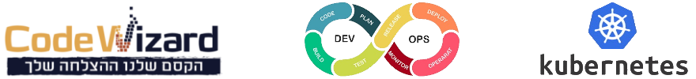

# Kubernetes Hands-on Repository

- A collection of Hands-on labs for Kubernetes (K8S).
- Each lab is a standalone lab and does not require to complete the previous labs.

### Pre-Requirements
- An existing cluster or any other local tool as described [here](https://kubernetes.io/docs/tasks/tools/)
- **kubectl** - The Kubernetes command-line tool, kubectl

---

### **<kbd>CTRL</kbd> + click to open in new window**   

---

- List of the labs in this repository:

## Labs
    
- [00-VerifyCluster](Labs/00-VerifyCluster),
- [01-Namespace](Labs/01-Namespace),
- [02-Deployments-Imperative](Labs/02-Deployments-Imperative),
- [03-Deployments-Declarative](Labs/03-Deployments-Declarative),
- [04-Rollout](Labs/04-Rollout),
- [05-Services](Labs/05-Services),
- [06-DataStore](Labs/06-DataStore),
- [07-nginx-Ingress](Labs/07-nginx-Ingress),
- [08-Kustomization](Labs/08-Kustomization),
- [09-StatefulSet](Labs/09-StatefulSet),
- [10-Istio](Labs/10-Istio),
- [11-CRD-Custom-Resource-Definition](Labs/11-CRD-Custom-Resource-Definition),
- [12-Wordpress-MySQL-PVC](Labs/12-Wordpress-MySQL-PVC),
- [13-HelmChart](Labs/13-HelmChart),
- [14-Logging](Labs/14-Logging),
- [15-Prometheus-grafana](Labs/15-Prometheus-grafana),
- [16-Affinity-Taint-Tolleration](Labs/16-Affinity-Taint-Tolleration),
- [17-PodDisruptionBudgets-PDB](Labs/17-PodDisruptionBudgets-PDB),
- [18-ArgoCD](Labs/18-ArgoCD)
---
    
